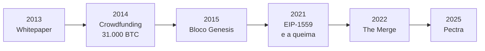
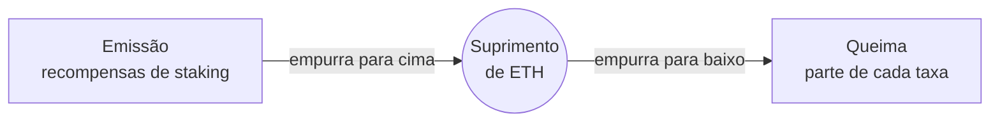

# Capítulo 1: Ethereum, por que ele existe

Bitcoin resolveu um problema específico: dinheiro sem banco no meio. Ethereum nasceu de uma pergunta maior, feita por um adolescente de 19 anos: e se, em vez de regras fixas para uma única aplicação (transferir moeda), a blockchain rodasse qualquer aplicação que alguém quisesse programar? Essa é a diferença que sustenta tudo o que vem depois neste caderno: Bitcoin é uma calculadora de um botão só, Ethereum é um computador.

**A origem.** Vitalik Buterin, nascido na Rússia em 1994 e criado no Canadá, conheceu o Bitcoin em 2011 e cofundou a Bitcoin Magazine em 2012. Da convivência com a comunidade Bitcoin, tirou duas conclusões: o potencial era real, mas a linguagem de script do Bitcoin era limitada demais para o que dava pra construir em cima de uma blockchain. Em 2013 desenhou o Ethereum, compartilhou o whitepaper em novembro daquele ano, anunciou publicamente na Conferência Bitcoin de Miami em janeiro de 2014, e entre julho e agosto de 2014 financiou o projeto via crowdfunding, levantando 31.000 BTC. A rede principal foi ao ar em 30 de julho de 2015, com o bloco Genesis. Sete outras pessoas estão na fundação junto com Vitalik, com destaque para Gavin Wood, que criou a linguagem Solidity usada até hoje para escrever contratos inteligentes, e Joseph Lubin, que fundou a ConsenSys, uma das maiores empresas do ecossistema.

Os seis marcos que explicam o Ethereum de hoje. Cada um deles vira, mais cedo ou mais tarde, um capítulo deste caderno.

**The Merge: a mudança mais importante da história do Ethereum.** Até 15 de setembro de 2022, o Ethereum era minerado, igual ao Bitcoin: computadores competindo para resolver cálculos e validar blocos, consumindo bastante energia elétrica no processo (proof-of-work). Desde dezembro de 2020, rodava em paralelo uma segunda rede, a Beacon Chain, já operando num modelo diferente, o proof-of-stake, onde a segurança vem de ETH travado como garantia, não de poder computacional. Em setembro de 2022 as duas redes se fundiram, a mineração parou de vez, e quem passou a validar transações e propor blocos foram os validadores, pessoas e instituições que travam ETH como garantia (stake). O efeito mais citado é a queda de aproximadamente 99,95% no consumo de energia da rede, mas o motivo real vai além disso: trocar poder computacional por capital travado como base de segurança também abriu caminho para as próximas atualizações de escalabilidade, que não eram viáveis sob mineração. Essa mudança é também a porta de entrada para o staking líquido (Lido e afins), tema de um capítulo futuro: sem The Merge, não existiria o que travar.

**Por que o ETH não tem oferta fixa como o Bitcoin.** O Bitcoin tem teto rígido de 21 milhões. O ETH não tem teto, mas isso não quer dizer emissão descontrolada: desde 2021 existem duas forças puxando em direções opostas. De um lado, a emissão, ETH novo criado como recompensa para quem faz staking e mantém a rede seguindo. Do outro, a queima do EIP-1559: uma parte da taxa paga em cada transação é destruída para sempre, sai de circulação. Quando a rede está muito movimentada, a queima pode superar a emissão, e o suprimento total de ETH encolhe, fica deflacionário. Quando a rede está mais parada, a emissão supera a queima, e o suprimento cresce. Não é uma regra fixa, é um equilíbrio dinâmico que reflete o uso real da rede, dado que dá pra acompanhar ao vivo em ferramentas como o Ultrasound Money.

Duas forças opostas, sem teto fixo no meio. Quando a rede está movimentada, a seta da direita pesa mais e o suprimento encolhe.

**Por que essa diferença importa na prática.** Comparações entre as duas redes, como a razão ETH/BTC que tanta gente acompanha em gráfico, ficam mais honestas quando se lembra que os dois projetos resolvem problemas diferentes por design. Uma delas tem escassez programática como proposta central; a outra tem uso da rede como motor do próprio suprimento. São teses distintas, e não dois competidores fazendo a mesma coisa.

**Glossário do capítulo.**

- **Whitepaper**: documento técnico que descreve como um projeto vai funcionar antes de ele sair do papel; foi assim que o Ethereum nasceu, em novembro de 2013.
- **Mainnet (rede principal)**: a rede que roda de verdade, com valor real em jogo, diferente das redes de teste usadas pra experimentar sem risco.
- **Contrato inteligente (smart contract)**: um programa que roda na blockchain, com regras que ninguém consegue alterar depois de publicado.
- **Proof-of-work (prova de trabalho)**: modelo de segurança em que computadores competem resolvendo cálculos pesados pra validar blocos; foi como o Ethereum funcionou até 2022 e como o Bitcoin funciona até hoje.
- **Proof-of-stake (prova de participação)**: modelo de segurança em que quem trava ETH como garantia valida a rede, no lugar de mineração.
- **Staking**: ato de travar ETH como garantia pra ajudar a validar a rede e, em troca, receber recompensa.
- **Validador**: pessoa ou instituição que trava ETH (faz staking) e roda o software que confirma transações e propõe blocos.
- **EIP-1559 e queima (burn)**: atualização de 2021 que passou a destruir parte da taxa de cada transação pra sempre, ligando o suprimento do ETH ao uso real da rede.

Fontes consultadas: [História do Ethereum](https://ethereum.org/ethereum-history-founder-and-ownership/), [The Merge](https://ethereum.org/roadmap/merge/), [Suprimento do ETH](https://ethereum.org/eth/supply/), todas da ethereum.org.
