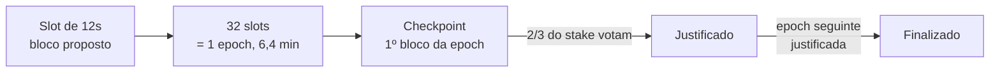

# Capítulo 2: Proof-of-Stake por dentro, como os validadores mantêm o Ethereum de pé

No Capítulo 1 vimos que, desde The Merge, a segurança do Ethereum vem de ETH travado e não de mineração. Agora a pergunta é: como isso funciona na prática, bloco a bloco? A resposta curta é que o Ethereum virou um relógio com votação embutida. A cada 12 segundos alguém propõe um bloco, um grupo sorteado vota se ele é válido, e quem tenta trapacear perde dinheiro de verdade.

**Quem pode ser validador.** Para ativar um validador próprio é preciso depositar 32 ETH no contrato de depósito e rodar três programas ao mesmo tempo: um cliente de execução (que processa as transações), um cliente de consenso (que acompanha a votação) e um cliente de validador (que assina os votos). Desde a atualização Pectra, ativada em 7 de maio de 2025, 32 ETH virou o piso e não mais o valor exato: com a EIP-7251, um único validador pode ter saldo efetivo de 32 até 2.048 ETH. Isso permite que grandes operadores juntem vários validadores em um só, e as recompensas acima de 32 ETH passam a render juntas, efeito que ganhou o apelido de validador composto (compounding).

**O relógio: slots e epochs.** O tempo no Ethereum é dividido em slots de 12 segundos. Cada 32 slots formam uma epoch, que dura 6,4 minutos. Em cada slot, um validador é sorteado para propor o bloco. O sorteio usa um mecanismo chamado RANDAO, que mistura contribuições aleatórias dos próprios validadores para que ninguém consiga prever ou manipular com facilidade quem será o próximo. Se o sorteado estiver offline, o slot simplesmente fica vazio e a rede segue para o próximo.

**Comitês e atestações.** Propor o bloco é metade do trabalho. A outra metade é votar. Todo validador ativo vota uma vez por epoch, não em todo slot, e para isso a rede divide os validadores em comitês sorteados, com até 64 comitês por slot e tamanho alvo de 128 validadores cada. Esse piso de 128 existe por segurança: comitês pequenos demais facilitariam que um atacante caísse, por sorte, com maioria dentro de um deles. O voto se chama atestação e diz três coisas: qual bloco o validador enxerga como a ponta da cadeia (head), qual é o checkpoint de origem (o último já justificado) e qual é o checkpoint alvo (o primeiro bloco da epoch atual). Como seriam milhares de assinaturas por slot, elas são agregadas numa só assinatura BLS, o que mantém a rede leve.

**Finalidade: quando uma transação vira definitiva.** O primeiro bloco de cada epoch é um checkpoint. Quando validadores que somam pelo menos dois terços de todo o ETH em stake votam num checkpoint, ele fica justificado. Quando o checkpoint seguinte também é justificado, o anterior fica finalizado. Em condições normais isso leva cerca de duas epochs, uns 13 minutos. Esse mecanismo se chama Casper FFG, e a consequência prática é forte: reverter um bloco finalizado exigiria que um terço do stake total aceitasse ser punido. Por isso, quando uma corretora como a Binance espera algumas confirmações antes de liberar um depósito em ETH, é exatamente essa ideia que está por trás.

Do bloco individual até o ponto em que voltar atrás custaria um terço de todo o ETH em stake.

**Slashing: a punição por trapaça.** Existem três atitudes que levam um validador a ser cortado (slashed): propor dois blocos diferentes para o mesmo slot, votar duas vezes em candidatos diferentes para o mesmo alvo (double vote) e fazer uma atestação que "envolve" outra anterior, o que na prática tenta reescrever a história (surround vote). A punição acontece em etapas. Primeiro uma pequena parte é queimada na hora, hoje 0,0078125 ETH para cada 32 ETH, valor que a Pectra reduziu a partir de 1 ETH justamente para não assustar quem consolida saldos grandes. Depois o validador é expulso num período de 36 dias em que o saldo vai sangrando. No dia 18 vem a penalidade de correlação, que cresce conforme o total de ETH cortado de outros validadores nos 36 dias anteriores. Esse detalhe é o mais inteligente do desenho: um erro isolado custa pouco, mas um ataque coordenado, ou muitos validadores de um mesmo operador falhando juntos, pode custar quase tudo.

| Momento | O que acontece |
| --- | --- |
| Imediato | queima de 0,0078125 ETH para cada 32 ETH de saldo |
| Dias 1 a 36 | saída forçada, com o saldo sendo drenado aos poucos |
| Dia 18 | penalidade de correlação, proporcional ao ETH cortado de outros validadores nos 36 dias anteriores |
| Dia 36 | validador removido do conjunto ativo |

A linha do dia 18 é a que separa um erro isolado de um ataque coordenado.

**Inatividade não é trapaça, mas também custa.** Ficar offline não gera slashing, só deixa de render e gera pequenas penalidades. O caso grave é quando a rede passa mais de quatro epochs sem finalizar, por exemplo se mais de um terço dos validadores sumir de uma vez. Aí entra o inactivity leak: o stake dos inativos vai sendo drenado até eles representarem menos de um terço do total, e os ativos voltam a ter os dois terços necessários para finalizar. É o jeito da rede se curar sozinha.

**Pra conectar com o resto do caderno.** A penalidade de correlação é a ponte para o próximo capítulo sobre liquid staking: quando muita gente delega ETH para os mesmos operadores, um erro deles vira um erro correlacionado, e isso muda o risco de quem segura stETH. Também vale lembrar do Capítulo 1: as recompensas de staking são a emissão que disputa com a queima do EIP-1559, então a quantidade de ETH em stake influencia diretamente se o suprimento cresce ou encolhe.

**Glossário do capítulo.**

- **Slot**: intervalo de 12 segundos em que um validador sorteado pode propor um bloco.
- **Epoch**: conjunto de 32 slots, cerca de 6,4 minutos; é a unidade usada para votação e finalidade.
- **RANDAO**: mecanismo de aleatoriedade que sorteia proponentes e comitês a partir de contribuições dos próprios validadores.
- **Comitê**: grupo de validadores sorteado para votar num slot, com tamanho alvo de 128.
- **Atestação**: o voto de um validador sobre qual é a ponta da cadeia e quais checkpoints ele apoia.
- **Checkpoint**: o primeiro bloco de cada epoch, usado como marco para justificar e finalizar a cadeia.
- **Finalidade (finality)**: estado em que um bloco não pode mais ser revertido sem que um terço do stake seja punido.
- **Slashing**: punição que queima parte do stake e expulsa o validador que tentou trapacear.
- **Inactivity leak**: drenagem gradual do stake de validadores offline quando a rede fica mais de quatro epochs sem finalizar.
- **Saldo efetivo (effective balance)**: o valor que conta para recompensas e votos; desde a Pectra vai de 32 a 2.048 ETH por validador.

Fontes consultadas: [Proof-of-stake](https://ethereum.org/developers/docs/consensus-mechanisms/pos/), [Recompensas e penalidades](https://ethereum.org/developers/docs/consensus-mechanisms/pos/rewards-and-penalties/), [Atestações](https://ethereum.org/developers/docs/consensus-mechanisms/pos/attestations/), [Pectra](https://ethereum.org/roadmap/pectra/) e [MaxEB](https://ethereum.org/roadmap/pectra/maxeb/), da ethereum.org; parâmetros de comitê em [Upgrading Ethereum, de Ben Edgington](https://eth2book.info/latest/part3/config/preset/).
