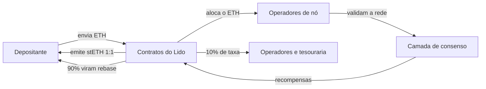
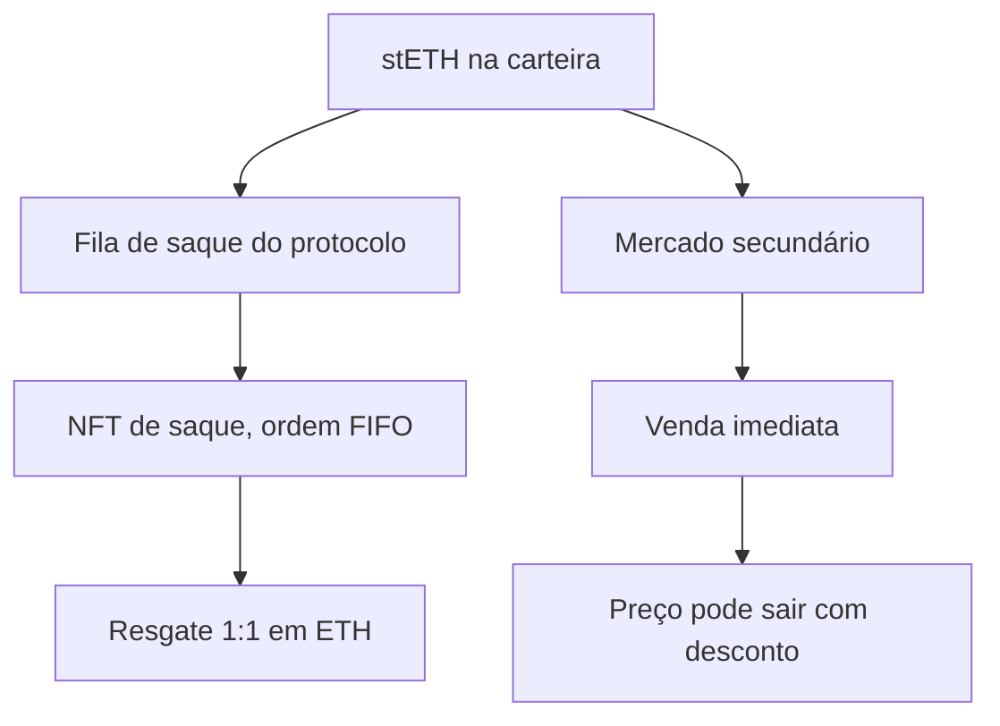

# Capítulo 3: Staking líquido e Lido, o atalho que criou um novo tipo de risco

O Capítulo 2 terminou com um problema em aberto. Para virar validador é preciso ter 32 ETH, rodar três programas sem parar e aceitar que esse dinheiro fica preso. Até abril de 2023, preso mesmo: a rede simplesmente não tinha função de saque. O staking líquido nasceu para resolver os dois incômodos de uma vez, e a solução que ele encontrou é elegante o bastante para merecer um capítulo inteiro, inclusive porque ela cria riscos que não existiam antes.

**A ideia em uma frase.** Um contrato inteligente junta o ETH de muita gente, contrata operadores profissionais para rodar os validadores e devolve ao depositante um token que representa aquele depósito mais as recompensas acumuladas. Esse token circula livremente, então o capital continua rendendo staking e ao mesmo tempo pode ser usado em outros protocolos ou vendido a qualquer momento. O maior desses protocolos no Ethereum é o Lido, e o token dele é o stETH.



O caminho de ida e volta do ETH depositado no Lido. Nada aqui é custódia de uma empresa: quem guarda o ETH são contratos, e quem opera as máquinas são terceiros contratados pela DAO.

**stETH por dentro: o token que muda de saldo sozinho.** O stETH é emitido na proporção de 1 para 1 no momento do depósito, mas ele não é um token comum. Internamente, o protocolo não guarda saldos, guarda cotas, no mesmo espírito de um fundo de investimento. A conversão segue esta relação:

```latex
shares_{conta} = saldo_{stETH} \times \frac{totalShares}{totalPooledEther}
```

O número de cotas de cada conta fica parado. O que muda é o total de ether sob gestão, que cresce com as recompensas dos validadores e encolhe quando há penalidades. Quando o oráculo do Lido reporta o estado da camada de consenso, aproximadamente uma vez por dia, todos os saldos são recalculados de uma vez. Esse recálculo se chama rebase, e é por isso que o saldo de stETH aumenta na carteira sem nenhuma transferência ter acontecido.

Rebase é bonito de ver e chato de programar. Muitos aplicativos de DeFi não sabem lidar com um token cujo saldo muda sozinho, e por isso existe o wstETH, a versão embrulhada. Nele o saldo fica congelado e quem varia é o preço: um wstETH vale cada vez mais stETH com o passar do tempo. A documentação do Lido recomenda usar stETH só onde o rebase é suportado de propósito, e wstETH no resto.

**A taxa.** O Lido cobra 10% das recompensas de staking, divididos meio a meio entre os operadores de nó e a tesouraria da DAO. Os outros 90% ficam com quem depositou. Vale reter esse número, porque ele é o preço da conveniência: quem faz staking sozinho fica com 100% das recompensas, e paga com trabalho, risco operacional e 32 ETH parados.

**As duas portas de saída.** Desde o Lido V2, lançado na rede principal em 15 de maio de 2023, existe saque dentro do protocolo. O pedido de saque trava o stETH e devolve um NFT que representa a posição numa fila FIFO, ou seja, a ordem de chegada manda. Quando entra ether suficiente para cobrir o pedido, ele é finalizado e o resgate acontece a 1 para 1. A outra porta sempre existiu: vender stETH no mercado secundário, o que é imediato, mas ao preço que o mercado estiver pagando naquele instante.



**Junho de 2022, quando o atalho travou.** Antes do Lido V2 só existia a porta da direita. O stETH costumava negociar com um desconto pequeno, de 2% a 3%, o que já dizia alguma coisa: o mercado cobrava um prêmio por converter algo travado em algo líquido. Em 13 de junho de 2022, no meio da crise da Celsius e da Three Arrows Capital, o desconto chegou ao recorde de 8%. A Celsius, que segurava cerca de 409 mil stETH, congelou os saques dos próprios clientes. A Three Arrows converteu stETH com desconto de quase 6% para levantar caixa. O episódio é a melhor aula disponível sobre um ponto que costuma passar batido: um token líquido não é a mesma coisa que o ativo que ele representa, e essa diferença aparece justamente quando todo mundo quer sair ao mesmo tempo.

**O que se ganha e o que se assume.** A ethereum.org é direta ao dizer que segurar um token de staking líquido não é a mesma coisa que fazer staking. A tabela abaixo resume onde ficam as diferenças.

| Aspecto | Staking solo | Staking líquido |
| --- | --- | --- |
| Mínimo | 32 ETH | qualquer quantia |
| Custódia | do próprio validador | contratos do protocolo |
| Liquidez | nenhuma até sacar | token negociável |
| Recompensa | 100% | 90% no caso do Lido |
| Confiança extra | só no Ethereum | contratos, governança e operadores |
| Risco de slashing | individual | socializado entre todos |

Os riscos específicos merecem nome próprio. Risco de contrato inteligente, porque o ETH fica guardado por código que pode ter falhas. Risco de governança, porque taxas, lista de operadores e até o funcionamento do token podem mudar por votação. Risco de mercado, porque em momentos de estresse a venda com desconto pode ser a única saída rápida. Risco de centralização, porque concentrar uma fatia grande do stake nos mesmos operadores cria ponto único de falha e abre espaço para censura. E o slashing socializado, que distribui entre todos os detentores uma punição causada por um operador específico.

**A concentração e o movimento de 2026.** Esse último ponto deixou de ser teórico faz tempo. Em 27 de julho de 2026 o Lido começou a migrar mais de 8 milhões de ETH, algo em torno de 16 bilhões de dólares e cerca de um quinto de todo o ETH em stake na rede, para a segunda versão do seu módulo curado. A migração usa exatamente o mecanismo visto no Capítulo 2, o saldo efetivo de até 2.048 ETH por validador liberado pela Pectra, e deve reduzir a contagem total de validadores do Ethereum em aproximadamente um terço. A fatia do stake em validadores do tipo 0x02 sai de cerca de 32% para cerca de 52%. A novidade mais interessante não é técnica, é econômica: no módulo novo, o operador precisa depositar ETH próprio como garantia, que pode ser tomada para cobrir perdas de slashing e falhas operacionais. É uma tentativa de fazer o operador ter pele em jogo, em vez de deixar a conta cair sempre no bolso de quem depositou.

**Glossário do capítulo.**

- **Staking líquido**: modelo em que o ETH depositado vira um token negociável que continua rendendo recompensas de staking.
- **stETH**: token do Lido emitido 1:1 no depósito, cujo saldo é recalculado diariamente.
- **Rebase**: recálculo automático dos saldos de um token, feito aqui quando o oráculo reporta as recompensas.
- **Cotas (shares)**: unidade interna que o protocolo guarda de fato; o saldo em stETH é a cota convertida pelo total sob gestão.
- **wstETH**: versão embrulhada do stETH, com saldo fixo e preço variável, feita para aplicativos que não suportam rebase.
- **Oráculo**: serviço que leva para dentro do contrato informações que estão fora dele, como o estado dos validadores.
- **Operador de nó**: empresa ou grupo contratado pelo protocolo para rodar os validadores com o ETH do pool.
- **Fila FIFO**: fila em que o primeiro a pedir é o primeiro a ser atendido, usada nos saques do Lido.
- **NFT de saque**: token ERC-721 que representa a posição na fila e o direito de resgatar o ETH.
- **Slashing socializado**: punição aplicada a um validador que acaba dividida entre todos os detentores do token.

Fontes consultadas: [Pools de staking](https://ethereum.org/staking/pools/) da ethereum.org; [guia de integração dos tokens](https://docs.lido.fi/guides/lido-tokens-integration-guide/) e [lançamento do Lido V2](https://blog.lido.fi/lido-v2-launch/), do próprio Lido; [reportagem da CoinDesk sobre o desconto do stETH em junho de 2022](https://www.coindesk.com/markets/2022/06/14/staked-ether-becomes-focus-of-crypto-stress-from-celsius-to-three-arrows); [reportagem do The Block sobre a consolidação de 2026](https://www.theblock.co/news/ecosystems/2026-07-27-lido-begins-consolidating-16-billion-worth-of-staked-eth-as-curated-module-v2-rolls-out-409780).
