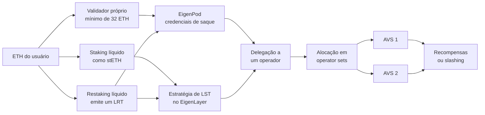
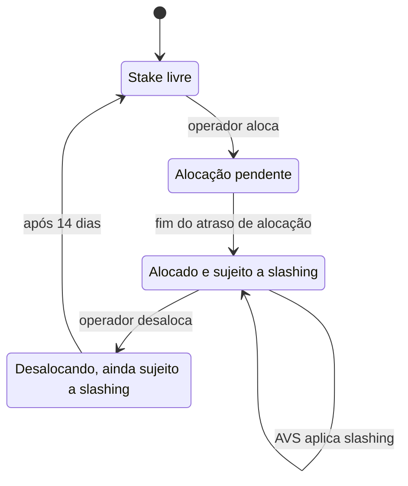
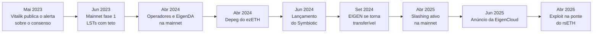

# Capítulo 4: Restaking e EigenLayer

<!-- Rascunho: este capítulo ainda não foi inserido no documento do Claude Docs. -->

Os dois últimos capítulos montaram uma escada. No Capítulo 2, o ETH depositado por um validador virou a garantia que sustenta o consenso do Ethereum: quem ataca a rede ou assina mensagens contraditórias perde parte desse depósito pelo slashing. No Capítulo 3, o staking líquido transformou essa posição travada em um token negociável, como o stETH da Lido. Este capítulo sobe mais um degrau e faz uma pergunta simples: se aquele ETH já está lá, servindo de garantia, será que ele pode garantir mais alguma coisa ao mesmo tempo? A resposta que o mercado deu a essa pergunta se chama restaking, e o protocolo que a popularizou se chama EigenLayer.

**A ideia em uma frase.** Restaking é aceitar, de forma voluntária, regras de slashing adicionais sobre um ETH que já está em staking, em troca de recompensas pagas por outros serviços que querem usar essa garantia como segurança. O ETH não sai do lugar nem é duplicado. O que se multiplica são os compromissos assumidos em cima dele e, junto com eles, as formas de perdê-lo.

**O problema que o restaking tenta resolver.** Muitos sistemas descentralizados precisam de um grupo de participantes que façam algum trabalho e possam ser punidos se trapacearem: pontes entre redes, oráculos de preço, camadas de disponibilidade de dados, sequenciadores de rollups. Antes do restaking, cada um desses projetos precisava criar o próprio token, convencer gente a colocá-lo em stake e torcer para que o valor desse stake fosse grande o bastante para desencorajar ataques. É um problema de partida a frio: um serviço novo, com um token ainda pouco valioso, fica barato de corromper justamente quando mais precisa de proteção. O whitepaper do EigenLayer, publicado em 2023 por uma equipe liderada por Sreeram Kannan, então professor da Universidade de Washington, propõe outra saída: alugar a segurança do Ethereum, permitindo que o ETH em staking seja reaproveitado como garantia por esses serviços.

**Custo de corromper contra lucro de corromper.** O whitepaper organiza a discussão em torno de duas grandezas. O custo de corrupção (CoC, na sigla em inglês) é quanto um atacante precisa perder para quebrar a segurança de um serviço. O lucro de corrupção (PfC) é quanto ele consegue extrair ao fazer isso. Um sistema é considerado criptoeconomicamente seguro quando o primeiro supera, com folga, o segundo.

```latex
\text{CoC} > \text{PfC}
```

A fórmula resume a condição que todo o desenho do EigenLayer tenta garantir: atacar precisa custar mais do que o ataque rende. O detalhe traiçoeiro aparece quando o mesmo stake protege vários serviços ao mesmo tempo. Num exemplo hipotético, e supondo para simplificar que um ataque custe todo o stake envolvido, US$ 10 milhões em ETH garantem quatro serviços, cada um guardando US$ 4 milhões que poderiam ser desviados. O lucro somado de um ataque coordenado chega a US$ 16 milhões, acima dos US$ 10 milhões que podem ser cortados. Cada serviço, olhado isoladamente, parece seguro; o conjunto não é. Boa parte da evolução do protocolo, como se verá adiante, foi uma resposta a esse risco.

**Quem é quem no EigenLayer.** O sistema tem três papéis. Os restakers são os donos do ETH, ou de tokens de staking líquido, que depositam no protocolo e aceitam o risco extra. Os operadores são entidades que rodam o software dos serviços, de forma parecida com o que um operador de validadores faz no Ethereum, e recebem o stake delegado pelos restakers. Os serviços que consomem essa segurança foram batizados de AVS, sigla que nasceu como Actively Validated Services, ou "serviços validados ativamente"; na documentação atual dos contratos, a mesma sigla aparece como Autonomous Verifiable Services. O primeiro AVS a entrar em produção foi o EigenDA, uma camada de disponibilidade de dados pensada para rollups, tema que volta no próximo capítulo.

**Dois caminhos de entrada.** Há duas formas de fazer restaking no EigenLayer. No restaking nativo, quem opera um validador aponta as credenciais de saque dele para um contrato chamado EigenPod. A partir daí, o principal e as recompensas de consenso desse validador passam a fluir pelo EigenPod, e o EigenLayer consegue impor as próprias regras sobre esse ETH. Para conhecer o saldo real do validador, o contrato verifica provas da beacon chain contra a raiz de bloco que o EIP-4788 expõe dentro da EVM, o que na prática exige provas recentes, de no máximo 8.192 blocos, ou cerca de 27 horas. No restaking via LST, o caminho é mais simples: o detentor de um token como o stETH deposita esse token em um contrato de "estratégia" do EigenLayer. Nos dois casos, o passo seguinte é delegar o stake a um operador, e a regra é clara: cada restaker delega para um único operador por vez.



O desenho mostra que todos os caminhos convergem para o mesmo ponto: não importa se o ETH entra por um validador próprio, por um LST ou por um protocolo intermediário, ele termina delegado a um operador, que decide quanto dele fica exposto a cada serviço.

**Operator sets e stake único.** A versão original do desenho previa que um operador escolhia um conjunto de AVSs e que todo o stake delegado a ele ficaria sujeito ao slashing de qualquer um deles. É exatamente o cenário do exemplo hipotético acima, em que a mesma garantia é prometida várias vezes. A atualização de slashing, formalizada na proposta ELIP-002, trocou esse modelo por dois conceitos. Os operator sets são agrupamentos criados por cada AVS para separar operadores por tarefa, hardware ou perfil de risco. O stake único (unique stake) é a regra contábil segundo a qual uma fatia específica do stake de um operador só pode estar alocada a um AVS de cada vez. Para dividir o stake, o protocolo usa "magnitudes", números cujo total máximo é 10^18, valor que funciona como 100%.

```latex
\begin{aligned}
S_{\text{alocado}} &= S_{\text{delegado}} \times \frac{m}{10^{18}}, \qquad \sum_{\text{sets}} m \le 10^{18} \\
S_{\text{cortado}} &= S_{\text{alocado}} \times \frac{w}{10^{18}}, \qquad 0 \le w \le 10^{18}
\end{aligned}
```

A primeira linha diz que cada operator set enxerga apenas a fração do stake que recebeu, e que a soma das frações não pode passar do todo. A segunda mostra que, ao aplicar um slashing, o AVS escolhe uma proporção w e corta apenas o que estava alocado a ele. Com isso, cada serviço sabe exatamente quanto pode punir, e a situação em que o mesmo ETH é prometido a vários serviços ao mesmo tempo deixa de existir.

**Os relógios do protocolo.** Assim como no próprio Ethereum, onde sair da validação leva tempo, o EigenLayer usa atrasos para impedir que alguém fuja de uma punição no último segundo. Uma nova alocação só fica sujeita a slashing depois de um atraso configurado pelo operador, e mudar essa configuração exige esperar 126.000 blocos. Uma desalocação só se completa após 100.800 blocos, e o mesmo prazo vale para os saques enfileirados no protocolo. Considerando um bloco a cada 12 segundos, que é a conta usada pela própria documentação, isso dá:

```latex
\begin{aligned}
100\,800 \times 12\ \text{s} &= 1\,209\,600\ \text{s} = 14\ \text{dias} \\
126\,000 \times 12\ \text{s} &= 1\,512\,000\ \text{s} = 17{,}5\ \text{dias}
\end{aligned}
```

O ponto mais importante é que, durante esses 14 dias, o stake continua podendo ser cortado. Um saque enfileirado ou uma desalocação em andamento não funcionam como porta de saída imediata.



O diagrama acompanha a vida de uma fatia de stake: ela só passa a correr risco depois de um período de espera e continua correndo risco por 14 dias depois que o operador decide retirá-la.

**Para onde vai o ETH cortado.** Na atualização de slashing, os fundos cortados se tornam, nas palavras da ELIP-002, permanentemente inacessíveis: tokens ERC-20 são enviados para um endereço de queima, e o ETH de restaking nativo fica travado para sempre no EigenPod. Uma proposta de 2025, a ELIP-006, já incorporada à mainnet segundo o repositório oficial de ELIPs, acrescentou o slashing redistribuível. Com ele, um AVS pode criar operator sets em que o valor cortado vai para um endereço de destino definido na criação do set e que não pode ser alterado depois. Isso abre casos de uso novos, como ressarcir usuários prejudicados, mas o próprio documento reconhece o outro lado: quando o dinheiro cortado vai para algum lugar, surge um incentivo maior para cortar. Se a governança de um AVS for comprometida, ou se um operador mal-intencionado criar o próprio AVS, os fundos delegados podem ser drenados. Por isso a proposta recomenda que os stakers avaliem com cuidado a reputação dos operadores, e os operadores que participam de sets com redistribuição ficam identificados como tais.

**Restaking líquido, a "Lido do restaking".** Assim como a Lido tirou do usuário a tarefa de rodar um validador, surgiram protocolos que tiram dele a tarefa de escolher operadores e AVSs. O usuário deposita ETH ou um LST e recebe um token de restaking líquido, o LRT, que representa a posição e pode circular pelo DeFi. Os nomes mais conhecidos são o eETH da ether.fi, o ezETH da Renzo, o rsETH da Kelp DAO e o pufETH da Puffer. Durante 2024, boa parte da procura por esses tokens foi movida por programas de pontos, que prometiam distribuições futuras de tokens, e não apenas pelas recompensas pagas pelos AVSs.

| Modalidade | O que entra | Quem escolhe operadores e serviços | Liquidez | Camadas de risco acrescentadas |
|---|---|---|---|---|
| Staking solo (Capítulo 2) | Mínimo de 32 ETH por validador | O próprio staker | ETH preso até a saída do validador | Penalidades e slashing do Ethereum |
| Staking líquido (Capítulo 3) | Qualquer quantia de ETH | O protocolo, como a Lido | LST negociável, como o stETH | Contratos do protocolo, operadores e preço do LST |
| Restaking nativo | Validador com credenciais apontadas para um EigenPod | O staker, ao delegar a um operador | Saque com espera de 14 dias no EigenLayer, além da fila de saída do Ethereum | Contratos do EigenLayer e regras de slashing de cada AVS |
| Restaking líquido | ETH ou LST depositado em um protocolo de LRT | O protocolo de LRT | LRT negociável, como eETH, ezETH ou rsETH | Tudo o que está acima, mais contratos do LRT, pontes e preço do LRT |

A tabela deixa visível o padrão da escada: cada degrau acrescenta conveniência ou rendimento potencial, mas também acrescenta uma camada de contratos, de intermediários e de preço de mercado que pode falhar.

**Quando o preço se descola: o ezETH em abril de 2024.** Um LRT só vale o ETH que representa enquanto houver liquidez para trocá-lo por ETH. Em 24 de abril de 2024, em meio à insatisfação com as regras de distribuição do token da Renzo e ao fim da sua primeira temporada de pontos, houve uma corrida de saída, e o ezETH chegou a ser negociado por volta de US$ 700 na Uniswap por um curto período, muito abaixo do preço do ETH. Quem usava ezETH como garantia em estratégias alavancadas, os chamados loops, foi liquidado; segundo a DL News, as liquidações somaram cerca de US$ 56 milhões. O ETH por trás do token não tinha sumido. O que faltou foi liquidez na hora errada, num mercado cheio de alavancagem.

**Quando a ponte falha: o rsETH em abril de 2026.** O episódio mais grave até aqui não envolveu o slashing do EigenLayer, e sim a infraestrutura em volta de um LRT. Em 18 de abril de 2026, um atacante conseguiu emitir 116.500 rsETH sem lastro, algo em torno de US$ 292 milhões, explorando a ponte entre redes que a Kelp DAO usava por meio da LayerZero. A configuração dependia de um único verificador para validar as mensagens entre redes, e esse ponto único foi enganado. Os tokens sem lastro foram usados como garantia na Aave para tomar WETH emprestado, o que levou a Aave e outros protocolos de empréstimo a congelar os mercados de rsETH. A LayerZero atribuiu o ataque, de forma preliminar, ao grupo Lazarus, ligado à Coreia do Norte, e Kelp e LayerZero discutiram publicamente quem respondia pela configuração escolhida. A lição para este capítulo é que o risco de um LRT não se limita às regras de slashing: ele herda o risco de cada peça usada para levar o token a outras redes. Pontes e seus riscos terão um capítulo próprio mais adiante.

**O alerta de Vitalik.** Antes mesmo de o EigenLayer chegar à mainnet, Vitalik Buterin publicou, em 21 de maio de 2023, o texto "Don't overload Ethereum's consensus", algo como "não sobrecarregue o consenso do Ethereum". A distinção que ele propõe continua útil. Reaproveitar validadores para outras tarefas, com punições definidas dentro do próprio serviço, é de risco relativamente baixo. O perigo está em criar serviços cujo fracasso leve a comunidade a pedir que o próprio Ethereum faça um fork para socorrer quem perdeu dinheiro. Nesse caso, o consenso social, que é a última instância do que o Ethereum é, passa a carregar riscos alheios. O desenho de slashing isolado por AVS, com perdas contidas dentro do EigenLayer, pode ser lido como uma tentativa de ficar do lado seguro dessa linha.

**O token EIGEN e as falhas intersubjetivas.** Nem toda trapaça pode ser provada por um contrato. Um serviço que deixa de publicar dados ou um oráculo que informa um preço claramente errado cometem falhas que qualquer observador razoável reconheceria, mas que são difíceis de demonstrar on-chain. O whitepaper do token EIGEN chama isso de falhas intersubjetivas e propõe que o próprio token possa passar por um fork, em que a versão reconhecida pela comunidade exclui quem agiu mal, sem exigir nenhum fork do Ethereum. O EIGEN foi distribuído em "stakedrops" a partir de 2024 e se tornou transferível em 30 de setembro de 2024. Naquele ano, o mecanismo de fork do token ainda era descrito pela imprensa especializada como um trabalho em construção.

**Concorrência e a virada para a EigenCloud.** O EigenLayer não ficou sozinho. Em junho de 2024, o Symbiotic foi lançado com uma rodada liderada pela Paradigm e pela cyber•Fund, propondo um modelo modular, baseado em cofres e aberto desde o início a diferentes tokens ERC-20 como garantia. Em 17 de junho de 2025, a Eigen Labs anunciou a EigenCloud, uma plataforma que reúne o EigenDA, computação verificável e resolução de disputas, e a a16z crypto comprou US$ 70 milhões em EIGEN para apoiar o movimento. A mudança de ênfase é clara: o restaking deixa de ser o produto em si e passa a ser a base de segurança de uma nuvem de serviços verificáveis.



A linha do tempo mostra que o restaking foi ligado em etapas: primeiro os depósitos, com teto inicial de 3.200 unidades para cada LST aceito, depois os operadores e os serviços, e só em 17 de abril de 2025 o slashing, a peça que dá dentes à promessa de segurança.

**Como acompanhar o tema com olhar crítico.** Algumas perguntas ajudam a avaliar qualquer produto de restaking, sem que isso seja recomendação de compra ou venda. Quais AVSs recebem o stake e quais regras de slashing eles usam? O operador participa de operator sets com redistribuição? O LRT depende de pontes para existir em outras redes e, se depende, com quantos verificadores? Quanta liquidez existe para trocar o LRT por ETH num dia ruim? Para quem acompanha gráficos, a razão entre o preço de um LRT e o preço do ETH é um termômetro simples desse último ponto, e o documento irmão com [scripts do TradingView](https://claude.ai/artifact/Qs2aSSquoXUkb9HDsSrzk4) é o lugar para ligar esse conceito a um indicador. Números de valor depositado mudam rápido e dependem da metodologia de cada painel; o DefiLlama, por exemplo, mostra a série histórica e permite comparar protocolos.

**Fechando o degrau.** O restaking pega o ETH que o Capítulo 2 transformou em garantia e que o Capítulo 3 transformou em token, e o oferece como segurança para outros serviços. A mecânica evoluiu de uma promessa ampla, em que todo o stake respondia por tudo, para um sistema de fatias isoladas, prazos de espera e regras explícitas sobre o destino dos fundos cortados. O rendimento extra existe porque o risco extra existe. O próximo capítulo sai da camada de segurança e entra na camada de escala: os rollups, que dependem de disponibilidade de dados, justamente o serviço que inaugurou o EigenLayer.

**Glossário do capítulo.**

- **Restaking**: aceitar regras de slashing adicionais sobre ETH, ou tokens derivados, que já está em staking, em troca de recompensas pagas por outros serviços.
- **AVS**: serviço que usa o stake reaproveitado no EigenLayer como garantia de segurança, como o EigenDA; a sigla nasceu como Actively Validated Services.
- **Operador**: entidade que roda o software dos AVSs e recebe, por delegação, o stake dos restakers.
- **Operator set**: agrupamento de operadores criado por um AVS, ao qual os operadores alocam parte do stake e dentro do qual podem ser punidos.
- **Stake único**: regra contábil que impede que a mesma fatia do stake de um operador esteja alocada a mais de um AVS ao mesmo tempo.
- **Magnitude**: número usado pelo EigenLayer para expressar a fração do stake alocada a cada operator set, em que 10^18 equivale a 100%.
- **EigenPod**: contrato para o qual um validador aponta suas credenciais de saque ao fazer restaking nativo.
- **LRT**: token de restaking líquido, que representa uma posição de restaking administrada por um protocolo e pode circular pelo DeFi.
- **Slashing redistribuível**: modalidade em que o valor cortado vai para um endereço definido pelo AVS, em vez de ser queimado.
- **Falha intersubjetiva**: comportamento incorreto que observadores razoáveis reconhecem, mas que não pode ser provado de forma objetiva on-chain.

**Fontes.**

- [EigenLayer: The Restaking Collective, whitepaper](https://docs.eigencloud.xyz/assets/files/EigenLayer_WhitePaper-88c47923ca0319870c611decd6e562ad.pdf)
- [Repositório dos contratos do EigenLayer (Layr-Labs)](https://github.com/Layr-Labs/eigenlayer-contracts)
- [Documentação do DelegationManager](https://github.com/Layr-Labs/eigenlayer-contracts/blob/main/docs/core/DelegationManager.md)
- [Documentação do AllocationManager](https://github.com/Layr-Labs/eigenlayer-contracts/blob/main/docs/core/AllocationManager.md)
- [Documentação do EigenPod](https://github.com/Layr-Labs/eigenlayer-contracts/blob/main/docs/core/EigenPod.md)
- [ELIP-002: Slashing via Unique Stake & Operator Sets](https://github.com/eigenfoundation/ELIPs/blob/main/ELIPs/ELIP-002.md)
- [ELIP-006: Redistributable Slashing](https://github.com/eigenfoundation/ELIPs/blob/main/ELIPs/ELIP-006.md)
- [Repositório e processo dos ELIPs](https://github.com/eigenfoundation/ELIPs)
- [EigenLayer Stage 1 Mainnet Launch, blog oficial](https://blog.eigencloud.xyz/eigenlayer-stage-1-mainnet-launch/)
- [Mainnet Launch Announcement: EigenLayer ∞ EigenDA, blog oficial](https://blog.eigencloud.xyz/mainnet-launch-eigenlayer-eigenda/)
- [EigenLayer and EigenDA Launch on Ethereum Mainnet, CoinDesk](https://www.coindesk.com/tech/2024/04/09/eigenlayer-and-eigenda-launch-on-ethereum-mainnet)
- [Introducing: Slashing, blog oficial](https://blog.eigencloud.xyz/introducing-slashing/)
- [EigenLayer Adds Key 'Slashing' Feature, CoinDesk](https://www.coindesk.com/tech/2025/04/17/eigenlayer-adds-key-slashing-feature-completing-original-vision)
- [EIGEN: The Universal Intersubjective Work Token, whitepaper](https://github.com/Layr-Labs/whitepaper)
- [EIGEN's purpose, unlock, transferability, Eigen Foundation](https://docs.eigenfoundation.org/eigen-token/token)
- [EigenLayer expects token transfer restrictions to end September 30, The Block](https://www.theblock.co/post/317798/eigenlayer-expects-token-transfer-restrictions-to-end-september-30)
- [The Protocol: EigenLayer's 'Intersubjective Forking' Is Objectively Not Done, CoinDesk](https://www.coindesk.com/tech/2024/05/01/the-protocol-eigenlayers-intersubjective-forking-is-objectively-not-done)
- [Don't overload Ethereum's consensus, Vitalik Buterin](https://vitalik.eth.limo/general/2023/05/21/dont_overload.html)
- [Renzo's ezETH falls as low as $700, leading to $56m in liquidations, DL News](https://www.dlnews.com/articles/defi/renzos-ezeth-loses-ether-peg-drops-79-in-under-one-hour/)
- [Renzo Restaked ETH Suffers a Brief Crash on Uniswap, CoinDesk](https://www.coindesk.com/markets/2024/04/24/renzo-restaked-eth-suffers-a-brief-crash-on-uniswap)
- [Kelp DAO exploited for $292 million, CoinDesk](https://www.coindesk.com/tech/2026/04/19/2026-s-biggest-crypto-exploit-kelp-dao-hit-for-usd292-million-with-wrapped-ether-stranded-across-20-chains)
- [LayerZero says North Korea's Lazarus likely behind Kelp DAO exploit, The Block](https://www.theblock.co/post/398028/layerzero-kelp-dao-lazarus)
- [Inside the KelpDAO Bridge Exploit, Chainalysis](https://www.chainalysis.com/blog/kelpdao-bridge-exploit-april-2026/)
- [Paradigm-backed Symbiotic unveils restaking protocol, The Block](https://www.theblock.co/post/299467/paradigm-backed-symbiotic-unveils-restaking-protocol)
- [a16z Bets Big on EigenLayer Again With $70M Token Buy to Back 'EigenCloud' Launch, CoinDesk](https://www.coindesk.com/business/2025/06/17/a16z-bets-big-on-eigenlayer-again-with-usd70m-token-buy-to-back-eigencloud-launch)
- [EigenCloud no DefiLlama](https://defillama.com/protocol/eigencloud)
