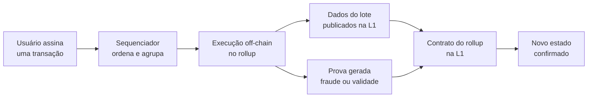
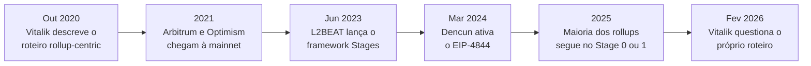

# Capítulo 5: Rollups e Layer 2, o conceito geral

<!-- Rascunho: este capítulo ainda não foi inserido no documento do Claude Docs. -->

O Capítulo 4 terminou com uma pista solta: o primeiro serviço a usar o restaking do EigenLayer em produção foi o EigenDA, uma camada de disponibilidade de dados pensada para rollups. Chegou a hora de puxar esse fio. Este capítulo sai da camada de segurança, que ocupou os Capítulos 2, 3 e 4, e entra na camada de escala: como o Ethereum processa mais transações sem abrir mão da garantia que só a rede principal oferece.

**O problema que gerou tudo isso.** Desde o Capítulo 1, este caderno trata o Ethereum como um computador público, não como uma calculadora de um botão só. Esse computador, porém, é lento de propósito. Cada nó da rede reexecuta cada transação para poder verificar o resultado, e a cada 12 segundos, como visto no Capítulo 2, só cabe um bloco com uma quantidade limitada de gás. É a mesma tensão de sempre em sistemas distribuídos: descentralização e segurança custam capacidade. Aumentar o limite de gás da camada 1 sem cuidado concentraria a rede em poucos computadores potentes, o que enfraqueceria justamente a garantia que dá valor ao Ethereum. A saída que a comunidade consolidou ao longo da década de 2020 foi processar a maior parte das transações fora da camada 1 e devolver a ela só o que é indispensável para manter a segurança.

**Rollup em uma frase.** Um rollup é uma rede separada que executa transações por conta própria, mas publica os dados dessas transações na L1 do Ethereum e submete provas de que o resultado está correto. O nome vem daí: o rollup "enrola" milhares de transações numa única publicação na L1. Como os dados ficam disponíveis na camada 1 e uma prova garante a validade do resultado, qualquer pessoa consegue reconstruir o estado do rollup a partir de informação pública, e é isso que permite dizer que um rollup herda a segurança do Ethereum, mesmo processando as transações em outro lugar.



O desenho mostra o ciclo completo: a transação nasce fora da L1, é ordenada e executada lá fora, mas dados e prova sempre voltam para um contrato na camada 1, que é o único lugar em que o novo estado do rollup vira definitivo.

**Por que o custo cai tanto.** A economia do rollup é simples de enunciar: o custo de publicar um lote na L1 é dividido entre todas as transações que cabem nele.

```latex
custo_{usuário} \approx \frac{custo_{L1}(\text{lote})}{N}
```

Quanto maior o número N de transações agrupadas num lote, menor a fatia que cada uma paga da conta final na L1. É o mesmo princípio de uma van fretada: o preço do combustível não muda porque foi dividido por mais passageiros.

**O sequenciador.** Quase todo rollup hoje depende de um sequenciador, um ator que recebe as transações dos usuários, decide a ordem entre elas e monta os lotes que vão para a L1. Na grande maioria das redes em produção, esse sequenciador é uma única entidade, normalmente a empresa que criou o rollup, rodando em servidores próprios. Isso cria três riscos concretos. O risco de liveness, porque se o sequenciador cair, ninguém mais ordena transações novas. O risco de censura, porque um sequenciador único pode simplesmente recusar transações de certos endereços. E o risco de MEV, porque quem ordena as transações pode se colocar à frente delas para lucrar, a mesma lógica de extração de valor que outros capítulos deste caderno voltarão a tratar. A resposta que a maioria dos rollups adotou não foi eliminar o sequenciador único da noite para o dia, e sim garantir uma porta de emergência: um mecanismo de inclusão forçada, que permite ao usuário enviar uma transação direto para o contrato na L1 quando o sequenciador some ou se recusa a agir. Passado um prazo, essa transação tem que ser processada de um jeito ou de outro, com ou sem a cooperação de quem opera o rollup.

**Dois jeitos de provar que o resultado está certo.** É aqui que rollups se dividem em duas famílias. Os rollups otimistas partem do princípio de que todo lote publicado está correto, e abrem uma janela de desafio, tipicamente de sete dias, durante a qual qualquer participante pode submeter uma prova de fraude e reverter um resultado errado. Os zk-rollups fazem o oposto: cada lote vem acompanhado de uma prova de validade, gerada por criptografia de conhecimento zero, que demonstra matematicamente que a execução está correta antes mesmo de o lote ser aceito na L1. Um capítulo mais adiante neste caderno vai comparar as duas famílias com mais profundidade técnica; por ora, a tabela resume a diferença que mais afeta quem usa a rede no dia a dia.

| Aspecto | Rollup otimista | zk-rollup |
|---|---|---|
| Pressuposto inicial | Lote é válido até prova em contrário | Lote só é aceito com prova de validade |
| Mecanismo de segurança | Prova de fraude, dentro de uma janela de desafio | Prova de validade, verificada matematicamente |
| Tempo até finalidade na L1 | Dias, por causa da janela de desafio | Minutos a horas, após a prova ser verificada |
| Custo computacional extra | Baixo na maior parte do tempo | Alto, para gerar a prova a cada lote |
| Exemplos citados neste caderno | Arbitrum, Optimism, Base | zkSync Era, Starknet |

**De onde vem a segurança de verdade: os dados.** A prova de fraude ou de validade só serve de alguma coisa se qualquer pessoa puder reconstruir o estado do rollup de forma independente, e isso exige que os dados de cada transação estejam publicamente disponíveis. Esse requisito, batizado de disponibilidade de dados, é o motivo pelo qual publicar dados na L1 sempre foi a parte mais cara de operar um rollup, mais cara até do que a computação. Durante anos, esses dados viajaram como calldata comum, um tipo de dado que os nós do Ethereum guardam indefinidamente, mesmo depois de o rollup já não precisar mais dele. A atualização Dencun, ativada em 13 de março de 2024, resolveu boa parte desse desperdício com o EIP-4844, também chamado de proto-danksharding. A mudança criou um novo tipo de transação, a blob-carrying transaction, que carrega um "blob" de dados de cerca de 128 KB, com um bloco aceitando até seis blobs e mirando uma média de três. Os blobs ficam disponíveis por cerca de 18 dias, tempo suficiente para qualquer verificação, e depois são descartados pelos clientes de consenso, em vez de guardados para sempre. O resultado observado na prática foi uma queda de cerca de 90% no custo de publicar dados, refletida quase imediatamente nas taxas cobradas pelos rollups aos usuários finais. O Capítulo 4 já citou o EigenDA como uma alternativa criada fora da L1 para o mesmo problema; a diferença central é que dados publicados como blob na L1 herdam a segurança do próprio Ethereum, enquanto uma camada de disponibilidade de dados externa depende das garantias criptoeconômicas de outro sistema, como o restaking visto naquele capítulo.

**Medindo se um rollup já é confiável: o framework Stages.** Ter um contrato na L1 não basta para saber quanto controle o operador de um rollup ainda guarda para si. Em 2023, a proposta de Vitalik Buterin virou, pelas mãos da L2BEAT, um framework de três estágios que hoje é referência do setor. No Stage 0, o chamado "rodas de apoio completas", o rollup roda essencialmente sob controle da equipe que o criou, e o software que permite a qualquer um reconstruir o estado a partir dos dados publicados é o único cheque disponível. No Stage 1, contratos inteligentes passam a mandar de verdade: existe um sistema de provas funcional, a submissão de provas de fraude deixa de depender de permissão, os usuários conseguem sair sem cooperação do operador, e um conselho de segurança de pelo menos oito membros, com maioria externa à equipe, atua como freio de emergência contra bugs graves. No Stage 2, as rodas de apoio saem de vez: o sistema de provas é permissionless por completo e qualquer mudança de contrato passa por um prazo longo o bastante para que o usuário insatisfeito saia antes de ela valer. O próprio framework é explícito sobre um ponto que vale grifar: ele mede descentralização de controle, não ausência de bugs.

**O panorama de hoje.** Passados mais de cinco anos desde os primeiros rollups em produção, o painel de Valor Total Garantido da L2BEAT soma dezenas de bilhões de dólares espalhados por dezenas de redes, com forte concentração nas maiores: rollups otimistas como Arbitrum One e Base seguem no topo do ranking, à frente de zk-rollups como zkSync Era e Starknet. E, apesar do tempo já passado, a maioria das redes com relevância prática ainda está presa nos estágios 0 ou 1, não no 2. Esse descompasso entre a promessa original e o ritmo real de descentralização é o pano de fundo da virada de rumo tratada a seguir.



A linha do tempo deixa visível que o intervalo entre o anúncio do roteiro centrado em rollups e a atualização que baratearia os dados dele foi de mais de três anos, e que o próprio autor do roteiro passou a questioná-lo pouco depois de a maioria das redes ainda não ter avançado de estágio.

**A guinada de fevereiro de 2026.** Em 3 de fevereiro de 2026, Vitalik Buterin publicou, pela conta que usa no X, uma reavaliação pública do roteiro que ele mesmo havia proposto em outubro de 2020. O argumento tem duas pernas. Primeiro, o progresso dos rollups rumo ao Stage 2, e à interoperabilidade entre eles, foi "muito mais lento e difícil do que se esperava originalmente": ele citou publicamente ao menos um caso de equipe que admite não querer ir além do Stage 1, não só por dificuldades técnicas de segurança do zkEVM, mas porque as próprias exigências regulatórias dos clientes dessa rede exigem controle final nas mãos de alguém identificável. Segundo, a própria camada 1 passou a escalar mais depressa do que se imaginava, com taxas baixas e um limite de gás em trajetória de crescimento relevante em 2026. Juntando as duas pernas, Buterin escreveu que "a visão original dos L2s e do papel deles no Ethereum já não faz sentido, e precisamos de um novo caminho". A proposta que se seguiu não é abandonar os rollups, e sim deixar de tratá-los como cópias intercambiáveis de uma mesma L1 em miniatura, migrando a conversa para conceitos como rollups nativos, verificação baseada em STARKs e a ideia de que cada rollup se especialize em alguma coisa, seja privacidade, identidade, finanças, redes sociais ou latência ultrabaixa, em vez de competir apenas em taxa de transferência bruta.

**O que isso muda para quem está lendo este caderno.** Pouco, no curto prazo: os rollups que já existem continuam funcionando como descrito aqui, com sequenciador, dados publicados na L1 e um sistema de provas. O que muda é o critério para avaliar se vale a pena confiar mais ou menos em cada um deles daqui para frente. Vale perguntar em que Stage da L2BEAT uma rede está, se ela tem um mecanismo de inclusão forçada que realmente funciona sem depender do sequenciador, e se os planos públicos da equipe falam em avançar para o Stage 2 ou em ficar onde está por motivos regulatórios. Nada disso é recomendação de compra ou venda; é o mesmo tipo de pergunta que o Capítulo 4 sugeriu para avaliar restaking, agora aplicada a rollups.

**Fechando o degrau.** Este capítulo ficou deliberadamente no nível do conceito: o que é um rollup, por que ele reduz custo, quem é o sequenciador, a diferença entre prova de fraude e prova de validade, e o framework que mede o quanto cada rede já se libertou do controle da própria equipe. Os próximos capítulos descem para o concreto, tratando de Arbitrum, do Superchain da Optimism, da Base e de uma comparação mais técnica entre rollups otimistas e zk-rollups, sempre com o ecossistema Ethereum como fio condutor.

**Glossário do capítulo.**

- **Rollup**: rede que executa transações fora da L1, mas publica dados e provas na camada 1, herdando a segurança dela.
- **Sequenciador**: ator que ordena as transações de um rollup e monta os lotes enviados à L1.
- **Inclusão forçada**: mecanismo que permite enviar uma transação direto ao contrato na L1 quando o sequenciador falha ou censura.
- **Prova de fraude**: demonstração, submetida dentro de uma janela de desafio, de que um lote de um rollup otimista está errado.
- **Prova de validade**: prova criptográfica de conhecimento zero que garante a correção de um lote antes de ele ser aceito na L1.
- **Disponibilidade de dados**: garantia de que os dados de um lote estão publicamente acessíveis para qualquer um reconstruir o estado do rollup.
- **Blob**: bloco de dados de cerca de 128 KB, criado pelo EIP-4844, usado por rollups para publicar dados na L1 a um custo menor que o do calldata.
- **Framework Stages**: escala de três estágios da L2BEAT que mede o quanto um rollup ainda depende de controle centralizado da equipe que o opera.
- **TVS**: Total Value Secured, valor total garantido, métrica da L2BEAT que soma os ativos protegidos por cada rede de escala.

Fontes consultadas:

- [What is layer 2?, ethereum.org](https://ethereum.org/layer-2/learn/)
- [Scaling, ethereum.org](https://ethereum.org/developers/docs/scaling/)
- [EIP-4844: Proto-Danksharding](https://www.eip4844.com/)
- [What is EIP-4844? Proto-Danksharding, Chainlink](https://chain.link/article/what-is-eip-4844)
- [What is the difference between Optimistic Rollups and ZK-Rollups?, Coinbase](https://www.coinbase.com/learn/tips-and-tutorials/what-is-the-difference-between-optimistic-rollups-and-zk-rollups)
- [ZK rollups vs. Optimistic rollups: How do they compare?, StarkWare](https://starkware.co/blog/zk-rollups-explained/zk-rollups-vs-optimistic-rollups/)
- ['Sequencers' Are Blockchain's Air Traffic Control, CoinDesk](https://www.coindesk.com/tech/2023/09/06/everybody-in-blockchains-talking-about-sequencers-heres-why-theyre-misunderstood)
- [Introducing Stages, a framework to evaluate rollups maturity, L2BEAT](https://medium.com/l2beat/introducing-stages-a-framework-to-evaluate-rollups-maturity-d290bb22befe)
- [Stages, L2BEAT](https://l2beat.com/stages)
- [Total Value Secured, L2BEAT](https://l2beat.com/layer2s/tvs)
- [Vitalik Buterin reevaluates Ethereum's rollup-centric roadmap, The Block](https://www.theblock.co/post/388285/vitalik-buterin-reevaluates-rollup-centric-roadmap-arguing-l2s-decentralized-far-slower-while-ethereum-base-layer-advanced)
- ['We Need a New Path': Vitalik Buterin Rips Up L2-Focused Roadmap, Decrypt](https://decrypt.co/356841/we-need-new-path-ethereum-founder-vitalik-buterin-rips-up-l2-focused-roadmap)
- [Post original de Vitalik Buterin no X, 3 de fevereiro de 2026](https://x.com/VitalikButerin/status/2018711006394843585)
