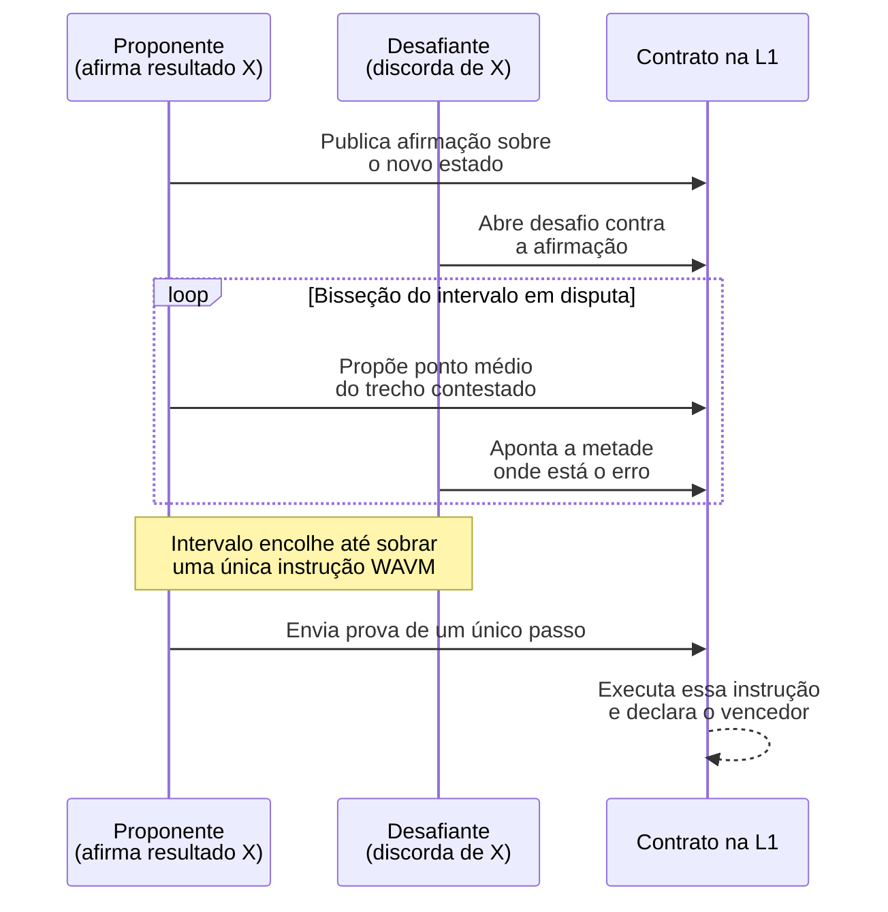
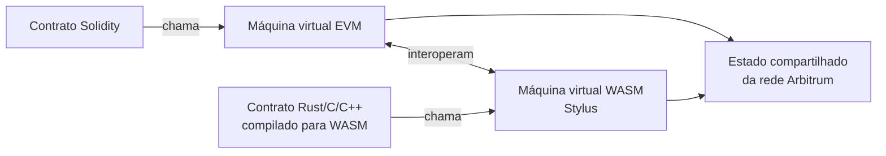
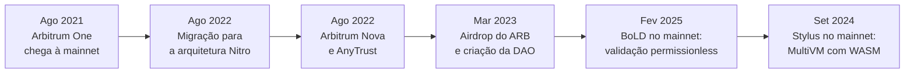

# Capítulo 6: Arbitrum em detalhe

<!-- Rascunho: este capítulo ainda não foi inserido no documento do Claude Docs. -->

O Capítulo 5 fechou com uma promessa: descer do conceito geral de rollup para redes concretas, começando por Arbitrum. Faz sentido começar por ela. Entre os rollups otimistas citados naquele capítulo, Arbitrum One é o que carrega mais valor garantido no ranking da L2BEAT, e a Arbitrum é também a pilha de tecnologia usada como base por outras redes, incluindo a Base, que este caderno ainda vai tratar em separado. Entender Arbitrum por dentro é entender boa parte do resto do mapa de Layer 2 do Ethereum.

**Quem construiu o quê.** Arbitrum é um produto da Offchain Labs, empresa fundada por pesquisadores da Universidade de Princeton, cuja rede principal, batizada Arbitrum One, chegou à mainnet em 31 de agosto de 2021. A tecnologia por trás da rede, porém, já teve mais de uma geração. A versão original rodava uma máquina virtual própria, a AVM. Em 31 de agosto de 2022, a rede migrou para uma reescrita completa chamada Nitro, que é a arquitetura em produção até hoje e o ponto de partida deste capítulo.

**Por dentro do Nitro: reaproveitar o Ethereum em vez de reinventá-lo.** A decisão de design mais importante do Nitro foi não construir uma máquina virtual do zero. Em vez disso, a Offchain Labs importou como biblioteca o núcleo de execução do geth, o cliente de execução mais usado do próprio Ethereum, garantindo que o comportamento do EVM dentro do Arbitrum seja praticamente idêntico ao da camada 1. Esse mesmo código é compilado duas vezes, para dois propósitos diferentes. Para operação normal, ele é compilado para execução nativa, o que mantém o processamento das transações do dia a dia rápido. Para o caso de haver uma disputa sobre o resultado de um lote, o mesmo código é compilado para WebAssembly, um formato portátil e independente de máquina, dando origem a um conjunto de instruções batizado WAVM, usado só quando algo precisa ser verificado na L1. É essa segunda trilha que permite ao Arbitrum ser, ao mesmo tempo, rápido no uso comum e verificável quando alguém desconfia de um resultado.

**O sequenciador e a confirmação instantânea.** Como todo rollup descrito no Capítulo 5, Arbitrum One depende de um sequenciador para ordenar as transações recebidas dos usuários e organizá-las em lotes antes de publicá-los na L1. O sequenciador da Arbitrum One roda hoje sob controle da Offchain Labs, e é ele que devolve ao usuário uma "confirmação suave" em questão de segundos, bem antes de o lote correspondente ser de fato publicado e finalizado na camada 1. Essa confirmação suave é uma conveniência, não uma garantia definitiva: se o sequenciador tentasse reordenar ou censurar uma transação depois de dar essa confirmação, o mecanismo de inclusão forçada, herdado do desenho geral de rollups visto no capítulo anterior, permite ao usuário forçar sua transação direto no contrato da L1.

**Como uma disputa se resolve: o jogo da bisseção.** A garantia de segurança de um rollup otimista, como visto no Capítulo 5, é a prova de fraude. No Arbitrum, essa prova não é um bloco de dados único, e sim um protocolo interativo entre duas partes que discordam sobre o resultado de um lote inteiro de transações.

O desenho mostra por que o processo é barato para a L1: em vez de reexecutar o lote inteiro on-chain, as duas partes vão dividindo ao meio o trecho em que discordam, rodada após rodada, até sobrar uma única instrução. Só essa instrução, isolada, precisa ser executada dentro de um contrato na camada 1 para decidir quem mentiu.

**BoLD: tirar a lista de convidados da validação.** Até fevereiro de 2025, só um grupo de validadores autorizados pela Offchain Labs podia de fato abrir e disputar essas afirmações, ainda que qualquer pessoa pudesse, em tese, rodar um nó completo. Isso mudou com o BoLD, sigla de Bounded Liquidity Delay, um protocolo de disputa desenhado para permitir que qualquer participante, sem permissão prévia, dispute uma afirmação incorreta. O nome descreve a proteção central do desenho: mesmo que vários atores adversariais tentem prolongar a disputa ao mesmo tempo, existe um limite matemático para o atraso total que conseguem impor, o que fecha uma brecha teórica em que um validador malicioso, sem esse limite, poderia arrastar indefinidamente uma disputa contra um único honesto. O BoLD foi anunciado em agosto de 2023, chegou a uma rede de testes em abril de 2024 e, depois de aprovado pela governança da Arbitrum DAO, entrou no mainnet de Arbitrum One e Arbitrum Nova em 12 de fevereiro de 2025, substituindo de vez a lista de validadores permissionados.

**Por que isso importa para o framework do capítulo anterior.** O Capítulo 5 descreveu o framework Stages da L2BEAT e citou que a maioria das redes ainda estava presa nos estágios 0 e 1. A ativação do BoLD é exatamente o tipo de mudança que empurra uma rede de um estágio para o outro: submissão de provas de fraude sem permissão prévia é um dos requisitos explícitos do Stage 1. Arbitrum One, Optimism e Base alcançaram essa classificação depois de implantarem sistemas de prova de fraude permissionless equivalentes, o que reduziu a lista de rollups relevantes ainda travados inteiramente no Stage 0.

**O paradoxo do fraud proof nunca usado.** Vale registrar uma curiosidade que aparece com frequência na cobertura sobre Arbitrum: nos primeiros anos da rede, mesmo antes do BoLD, o mecanismo de prova de fraude nunca precisou ser executado de verdade contra um resultado errado. Isso não é sinal de que o sistema seja dispensável, é o resultado esperado de um desenho de segurança que funciona por dissuasão: a mera possibilidade de qualquer participante abrir e vencer uma disputa é o que desestimula alguém a tentar publicar um lote fraudulento em primeiro lugar.

**Arbitrum Nova e o outro lado do trade-off: AnyTrust.** Nem toda aplicação precisa da garantia mais forte possível de disponibilidade de dados, e pagar por ela sai caro. A Offchain Labs lançou, em 2022, uma segunda rede sobre a mesma pilha Nitro, chamada Arbitrum Nova, que troca parte dessa garantia por custo mais baixo através de um protocolo batizado AnyTrust. Em vez de publicar todos os dados de cada lote na L1, como faz Arbitrum One, a Nova confia esse trabalho a um Comitê de Disponibilidade de Dados, um grupo fixo de participantes que assina um certificado, o DACert, atestando que os dados daquele lote estão disponíveis e podem ser entregues sob demanda. O modelo assume que pelo menos dois membros desse comitê são honestos; se essa suposição falhar e o comitê não conseguir produzir os dados quando solicitado, a rede tem um mecanismo de fallback que força a publicação desses dados diretamente na L1, do jeito mais caro e mais seguro. Nova foi desenhada para casos de uso como jogos e redes sociais on-chain, que geram um volume alto de transações de baixo valor individual, para as quais o custo do modelo rollup puro de Arbitrum One seria proibitivo.

| Aspecto | Arbitrum One | Arbitrum Nova |
|---|---|---|
| Modelo de disponibilidade de dados | Rollup: dados publicados na L1 (blobs, ver Capítulo 5) | AnyTrust: Comitê de Disponibilidade de Dados, com fallback para a L1 |
| Pressuposto de confiança extra | Nenhum além do herdado do rollup | Ao menos 2 membros do comitê são honestos |
| Custo típico por transação | Mais alto | Mais baixo |
| Caso de uso principal | DeFi, aplicações que exigem a garantia mais forte | Jogos, redes sociais, alto volume de transações leves |
| Lançamento | 31 de agosto de 2021 | Julho/agosto de 2022 |

**A ARB DAO e quem manda na rede.** Em março de 2023, a Offchain Labs deu um passo formal rumo à descentralização do controle sobre o protocolo, criando a Arbitrum Foundation, a Arbitrum DAO e o token ARB, distribuído por meio de um airdrop a usuários e a outras DAOs do ecossistema. Deter ARB dá poder de voto sobre mudanças de protocolo, incluindo o próprio orçamento da fundação. Como salvaguarda contra bugs graves ou ataques que a governança on-chain seria lenta demais para responder, a DAO mantém um Security Council de 12 membros, divididos em dois grupos de seis que se revezam em eleições semestrais. Esse conselho opera através de contratos multisig com dois limiares distintos: um conjunto de 9 entre 12 assinaturas pode agir como conselho de emergência, alterando contratos do sistema sem esperar prazo nenhum, enquanto o caminho normal de propostas, com um limiar mais baixo, ainda passa pelo rito de governança da DAO, que costuma levar cerca de 17 dias entre proposta e execução. É a mesma lógica de freio de emergência descrita no framework Stages do capítulo anterior, só que aplicada à governança de uma rede específica.

**Stylus: uma segunda máquina virtual ao lado da EVM.** A atualização mais recente da pilha Nitro chama-se Stylus, lançada no mainnet de Arbitrum One e Nova em 3 de setembro de 2024. Stylus não substitui a EVM, ela a complementa: cria uma segunda máquina virtual, baseada em WebAssembly, rodando lado a lado com a EVM tradicional dentro da mesma rede, um arranjo que a documentação da Offchain Labs chama de MultiVM. Na prática, isso permite escrever contratos em linguagens como Rust, C e C++, compiladas para WASM, que coexistem e podem chamar contratos Solidity já publicados, e vice-versa. A motivação é dupla: dar acesso a um universo maior de desenvolvedores que já programam nessas linguagens fora do mundo cripto, e aproveitar que código WASM bem otimizado costuma custar bem menos gás e rodar mais rápido do que o equivalente em Solidity para tarefas pesadas de computação.

O desenho mostra o que o MultiVM quer dizer na prática: duas máquinas virtuais diferentes, cada uma processando contratos escritos numa família de linguagens, compartilhando o mesmo estado final e capazes de se chamar mutuamente.

**Orbit: exportar a mesma pilha para outras redes.** Além de Arbitrum One e Nova, a Offchain Labs disponibiliza a pilha Nitro como um produto à parte, chamado Arbitrum Orbit, que permite a qualquer equipe lançar sua própria rede usando a mesma tecnologia, escolhendo se ela vai liquidar na L1 do Ethereum, em Arbitrum One, ou em outra camada 1. Isso descreve boa parte de como o ecossistema de Layer 2 cresceu depois de 2023: não são só Arbitrum One e Nova competindo por usuários, mas um número crescente de redes derivadas da mesma base de código, cada uma ajustando o equilíbrio entre custo, velocidade e onde apoia sua segurança.

Vale notar que a linha do tempo não é estritamente cronológica ponto a ponto: o Stylus, lançado em setembro de 2024, chegou ao mainnet antes do BoLD, ativado em fevereiro de 2025, embora este capítulo os apresente na ordem que melhor liga cada peça ao restante do texto.

**O que fica para os próximos capítulos.** Este capítulo tratou de uma rede específica com profundidade técnica; o próximo volta a subir um degrau de abstração para tratar da Optimism e do conceito de Superchain, antes de descer de novo para a Base, e só depois disso este caderno vai comparar rollups otimistas e zk-rollups com o rigor técnico que o Capítulo 5 deixou em aberto.

**Glossário do capítulo.**

- **Nitro**: arquitetura atual do Arbitrum, que reaproveita o núcleo de execução do geth, compilado tanto para execução nativa quanto para WebAssembly.
- **WAVM**: conjunto de instruções compatível com WebAssembly usado pelo Arbitrum para resolver disputas sobre o resultado de um lote.
- **Confirmação suave**: retorno rápido, em segundos, que o sequenciador dá ao usuário antes de o lote correspondente ser publicado e finalizado na L1.
- **BoLD (Bounded Liquidity Delay)**: protocolo de disputa do Arbitrum que tornou a submissão de provas de fraude permissionless, com um limite matemático para o atraso que um ator malicioso consegue impor.
- **AnyTrust**: protocolo usado pela Arbitrum Nova, que troca parte da disponibilidade de dados na L1 por um Comitê de Disponibilidade de Dados, mais barato e com um pressuposto de confiança adicional.
- **DACert**: certificado assinado pelo Comitê de Disponibilidade de Dados da Arbitrum Nova, atestando que os dados de um lote estão disponíveis.
- **Security Council**: conselho de 12 membros da Arbitrum DAO que pode agir como freio de emergência sobre os contratos do sistema.
- **Stylus**: atualização que adiciona uma máquina virtual baseada em WebAssembly ao lado da EVM, permitindo contratos em Rust, C e C++.
- **MultiVM**: arranjo em que duas máquinas virtuais diferentes, EVM e WASM, coexistem e interoperam dentro da mesma rede.
- **Arbitrum Orbit**: produto que permite a outras equipes lançar redes próprias usando a mesma pilha tecnológica do Arbitrum.

Fontes consultadas:

- [Arbitrum introduction, Arbitrum Docs](https://docs.arbitrum.io/get-started/arbitrum-introduction)
- [Inside Arbitrum Nitro, Arbitrum Docs](https://docs.arbitrum.io/how-arbitrum-works/inside-arbitrum-nitro)
- [Arbitrum Nitro: A Second-Generation Optimistic Rollup (whitepaper)](https://docs.arbitrum.io/nitro-whitepaper.pdf)
- [Arbitrum Nitro - An Overview, Chainstack](https://chainstack.com/arbitrum-nitro-an-overview/)
- [AnyTrust Protocol, Arbitrum Docs](https://docs.arbitrum.io/how-arbitrum-works/deep-dives/anytrust-protocol)
- [Introducing Nova: Arbitrum AnyTrust Mainnet is open for Developers, Offchain Labs](https://medium.com/offchainlabs/introducing-nova-arbitrum-anytrust-mainnet-is-open-for-developers-9a54692f345e)
- [Offchain Labs Launches Arbitrum BoLD Protocol for Permissionless Validation, The Defiant](https://thedefiant.io/news/blockchains/offchain-labs-launches-arbitrum-bold-protocol-permissionless-validation-on-12-2-39d8ed3a)
- [Offchain Labs releases Arbitrum BOLD on testnet, The Block](https://www.theblock.co/news/ecosystems/2024-04-15-offchain-labs-releases-arbitrum-bold-on-testnet-288471)
- [BOLD, Permissionless Validation for Arbitrum Chains, Offchain Labs](https://medium.com/offchainlabs/bold-permissionless-validation-for-arbitrum-chains-9934eb5328cc)
- [Arbitrum's fraud proofs haven't been used in the two years since it launched, Cointelegraph](https://cointelegraph.com/news/arbitrums-fraud-proofs-havent-been-used-since-it-launched)
- [Stage 1 Fraud Proofs Go Live: The Quiet Revolution That Makes Ethereum L2s Actually Trustless, BlockEden](https://blockeden.xyz/blog/2026/02/01/stage-1-fraud-proofs-arbitrum-optimism-base-l2-security/)
- [A gentle introduction to the Arbitrum DAO, Arbitrum DAO Governance Docs](https://docs.arbitrum.foundation/gentle-intro-dao-governance)
- [Security Council Members, Arbitrum DAO Governance Docs](https://docs.arbitrum.foundation/security-council-members)
- [$ARB airdrop eligibility and distribution specifications, Arbitrum DAO Governance Docs](https://docs.arbitrum.foundation/airdrop-eligibility-distribution)
- [A gentle introduction to Stylus, Arbitrum Docs](https://docs.arbitrum.io/stylus/gentle-introduction)
- [Arbitrum Stylus: Now Live on Mainnet, Offchain Labs](https://blog.arbitrum.io/arbitrum-stylus-mainnet/)
- [Arbitrum Stylus mainnet launch opens Web3 for traditional coders, Cointelegraph](https://cointelegraph.com/news/arbitrum-stylus-mainnet-launch-evm-developers)
- [Arbitrum's New Chain Arbitrum Nova Is Open to Developers, CoinDesk](https://www.coindesk.com/tech/2022/07/12/arbitrums-new-chain-arbitrum-nova-is-open-to-developers)
- [Arbitrum One, L2BEAT](https://l2beat.com/scaling/projects/arbitrum)
