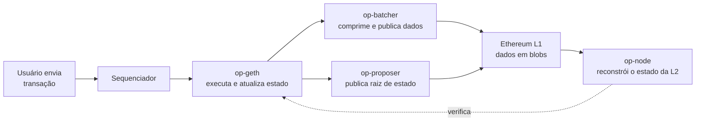
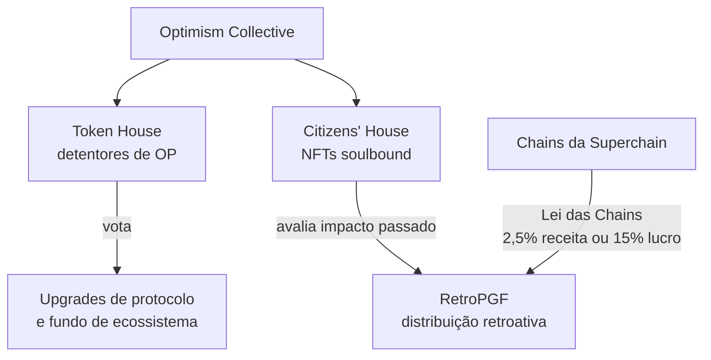
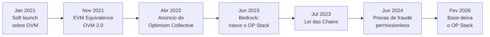

# Capítulo 7: Optimism e o Superchain

<!-- Rascunho: este capítulo ainda não foi inserido no documento do Claude Docs. -->

O Capítulo 6 desceu ao detalhe técnico da Arbitrum, a maior rede otimista por valor garantido segundo a L2BEAT. Este capítulo faz o mesmo movimento com a outra grande linhagem de rollups otimistas, a Optimism, mas a comparação direta entre as duas já revela uma diferença de estratégia. A Arbitrum concentrou esforço em aperfeiçoar uma pilha de tecnologia, a Nitro, e depois a exportou como produto, o Orbit, para quem quisesse construir em cima dela. A Optimism fez uma aposta parecida na superfície e bem diferente no fundo: construir um padrão aberto, o OP Stack, e organizar as redes que o adotam numa federação chamada Superchain, coordenada por regras econômicas e de governança compartilhadas. Este capítulo também chega num momento oportuno para testar essa aposta, porque em fevereiro de 2026 a maior rede da Superchain anunciou que estava saindo dela, e o episódio serve de estudo de caso sobre até onde esse tipo de coordenação aguenta pressão.

**Uma rede com duas gerações antes do Stack.** Optimism fez seu lançamento inicial, restrito a alguns projetos parceiros, em 16 de janeiro de 2021, rodando sobre uma máquina virtual própria batizada OVM. A abertura ao público em geral veio em 19 de agosto de 2021. Essa primeira versão exigia que os contratos fossem recompilados para rodar na OVM, o que criava atrito para desenvolvedores acostumados à EVM padrão. Em 12 de novembro de 2021, a rede resolveu esse atrito com uma atualização chamada EVM Equivalence, que trocou a abordagem de compatibilidade por equivalência de fato: o objetivo passou a ser reproduzir o comportamento da EVM com o menor número possível de desvios, para que ferramentas e contratos do Ethereum funcionassem sem adaptação. Essa filosofia, manter a superfície o mais parecida possível com a L1 e só divergir onde a natureza de uma L2 obriga, segue orientando o desenho do OP Stack até hoje.

**Bedrock: o upgrade que virou a rede do avesso.** A mudança mais importante da história da Optimism aconteceu em 6 de junho de 2023, às 16h UTC, com a ativação do upgrade Bedrock no OP Mainnet. Bedrock reescreveu a arquitetura da rede para reduzir drasticamente os custos de publicação de dados na L1, aproximar ainda mais o comportamento da rede do Ethereum e, principalmente, modularizar o código em componentes bem definidos e substituíveis. Foi esse último ponto que abriu caminho para o OP Stack como produto: em vez de uma rede monolítica chamada Optimism, passou a existir um conjunto de peças de software que qualquer equipe pode montar para rodar sua própria rede, com a Optimism (rebatizada internamente de OP Mainnet) sendo apenas a primeira instância dessa pilha.

**As peças do OP Stack.** Uma rede construída sobre o OP Stack combina algumas peças de software com papéis bem separados. O op-geth é uma versão adaptada do Geth, o cliente de execução mais usado do próprio Ethereum, responsável por processar as transações e atualizar o estado da L2, na mesma linha de reaproveitamento de código que o Capítulo 6 descreveu para o Nitro da Arbitrum. O op-node reconstrói o estado da L2 a partir dos dados publicados na L1, garantindo que qualquer pessoa consiga verificar a rede de forma independente processando depósitos e lotes de transação. O op-batcher pega as transações organizadas pelo sequenciador, comprime esses dados e os publica na L1, hoje majoritariamente como blobs, o formato de dado barato introduzido pelo EIP-4844 e detalhado no Capítulo 5. O op-proposer, por fim, publica na L1 as raízes de estado que resumem o resultado de cada lote, o gancho que permite a qualquer pessoa abrir uma disputa caso desconfie do resultado.



O desenho mostra a divisão de trabalho dentro de uma rede OP Stack: quem executa transações, quem publica dados, quem publica o resultado resumido, e quem reconstrói e verifica tudo a partir do que está gravado na L1.

**Cannon e o caminho até a prova de fraude sem permissão.** Assim como a Arbitrum tem o WAVM descrito no capítulo anterior, o OP Stack tem seu próprio sistema de prova de fraude interativa, chamado Cannon, desenvolvido em parceria com o pesquisador George Hotz. A lógica de fundo é semelhante à do jogo da bisseção da Arbitrum: em vez de reexecutar um lote inteiro on-chain, duas partes que discordam vão restringindo o trecho contestado até sobrar um único passo de execução, que aí sim é verificado dentro de um contrato na L1. A diferença histórica está no ritmo de entrega. A Optimism ligou provas de fraude permissionless no OP Mainnet em 10 de junho de 2024, permitindo que qualquer conta Ethereum contestasse um resultado incorreto e revertesse saques indevidos sem depender de terceiros de confiança. Pouco mais de dois meses depois, auditorias apontaram falhas de gravidade variada no sistema, e a OP Foundation reverteu a rede para um estado permissionado enquanto preparava o hard fork Granite para corrigir os problemas. O sistema voltou a rodar de forma permissionless depois disso, e junto com Arbitrum e Base alcançou o Stage 1 do framework da L2BEAT apresentado no Capítulo 5, o patamar que exige justamente prova de fraude sem lista de validadores autorizados.

| Aspecto | Arbitrum (Nitro) | Optimism (OP Stack) |
|---|---|---|
| Sistema de prova de fraude | WAVM, via jogo da bisseção | Cannon, via jogo da bisseção equivalente |
| Permissionless desde | 12 de fevereiro de 2025 (BoLD) | 10 de junho de 2024, com reversão temporária em agosto de 2024 |
| Estratégia de expansão | Orbit: pilha exportada como produto por equipe única | Superchain: rede de chains independentes sob padrão e governança compartilhados |
| Segunda VM para contratos | Stylus, WebAssembly ao lado da EVM | Não há equivalente direto no OP Stack |
| Token de governança | ARB | OP |

**O Superchain como projeto político, não só técnico.** A diferença mais importante entre as duas linhagens não está no código, está na proposta de organização das redes que nascem dela. Qualquer equipe pode pegar o OP Stack e rodar uma rede isolada, mas as que aderem ao conjunto de padrões técnicos e de governança conhecido como Superchain ganham em troca compatibilidade de segurança, atualizações coordenadas e, principalmente, acesso à liquidez e aos usuários de todas as outras redes do grupo através de pontes e mensageria compartilhadas. Em meados de 2026, a Superchain reunia mais de duas dezenas de redes, incluindo World Chain, a rede de verificação de identidade do projeto World, Zora, voltada a mídia e economia de criadores, Unichain, a rede da Uniswap otimizada para execução de DeFi, além do próprio OP Mainnet. Duas peças de infraestrutura sustentam a promessa de interoperabilidade entre elas: o CrossL2Inbox, um contrato predeployado que valida provas de inclusão de mensagens entre chains da Superchain, e o SuperchainTokenBridge, um padrão de ponte que permite transferir tokens nativamente entre essas redes sem recorrer a versões "wrapped".

**A Lei das Chains: como o padrão vira receita.** A adesão à Superchain não é só técnica, tem um componente econômico formalizado em julho de 2023 num acordo apelidado de Law of Chains. Toda rede que quer ser reconhecida como parte da Superchain se compromete a repassar ao Optimism Collective o maior valor entre 2,5% de sua receita líquida de sequenciador e 15% do seu lucro.

```latex
\text{Repasse} = \max\left(0{,}025 \times \text{Receita líquida do sequenciador},\ 0{,}15 \times \text{Lucro}\right)
```

Essa receita alimenta majoritariamente o RetroPGF, o programa de Retroactive Public Goods Funding do Optimism Collective, que este caderno volta a encontrar quando tratar de DAOs e governança em capítulo futuro. A lógica do RetroPGF é inversa à de um edital de fomento comum: em vez de financiar promessas, badgeholders eleitos pela comunidade avaliam periodicamente o que já foi entregue e distribuem tokens OP proporcionalmente ao impacto observado, sob o argumento de que é mais fácil concordar sobre o que já se mostrou útil do que prever o que vai ser. Desde o início do programa, mais de 100 milhões de dólares em tokens OP já foram distribuídos ao longo de várias rodadas para financiadores de infraestrutura aberta, ferramentas de desenvolvimento e pesquisa de governança.

**Como o Optimism Collective se governa.** A organização por trás da rede e do RetroPGF é bicameral. A Token House reúne detentores do token OP e seus delegados, com poder de voto sobre upgrades de protocolo e sobre o fundo de incentivos ao ecossistema. A Citizens' House existe para conduzir o processo de RetroPGF, e sua cidadania é conferida por NFTs soulbound, não transferíveis, num desenho que tenta separar poder sobre alocação de recursos passados de poder sobre mudanças de protocolo futuras. O token OP em si tem oferta inicial de 2 elevado a 32, pouco mais de 4,29 bilhões de unidades, com fatias reservadas para RetroPGF, para o fundo do ecossistema, para contribuidores centrais e para investidores, além das rodadas de airdrop, que começaram com a Airdrop #1 em maio de 2022, junto com o próprio anúncio da criação do Collective em 26 de abril daquele ano.



O desenho resume o ciclo: as chains da Superchain alimentam o RetroPGF com parte de sua receita, e a Citizens' House decide como esse valor recompensa quem já contribuiu, enquanto a Token House decide os rumos técnicos do protocolo.

**Fevereiro de 2026: quando a maior chain da Superchain saiu dela.** É esse desenho que fez da saída da Base um evento importante para todo o ecossistema Ethereum, não só para a Optimism. A Base, incubada pela Coinbase, era de longe a maior fonte de receita da Superchain, respondendo por algo perto de 96,5% das taxas de gás que alimentavam o repasse da Lei das Chains ao Optimism Collective. Em 18 de fevereiro de 2026, a Coinbase anunciou que a Base migraria para uma pilha de tecnologia própria e unificada, deixando de operar sobre o OP Stack compartilhado. A justificativa pública foi de ritmo: a equipe da Base queria entregar cerca de seis grandes atualizações por ano, o dobro do ritmo então possível dentro do processo de coordenação da Superchain, e concluiu que só conseguiria isso controlando a pilha inteira de ponta a ponta. A saída também encerrou, na prática, o repasse de receita da Base ao Optimism Collective via Lei das Chains, o que fez o token OP cair cerca de 28% em 48 horas após o anúncio, com o volume de venda disparando. O episódio expõe a tensão central deste modelo: um padrão compartilhado só entrega suas vantagens, atualizações coordenadas, segurança e liquidez em comum, enquanto os participantes concordarem que a coordenação vale mais do que a velocidade de controlar tudo sozinho. Quando a maior peça do arranjo decide que não vale mais a pena, o resto da estrutura sente o baque, inclusive no preço do token que financia o bem público compartilhado.



**O que isso não muda e o que fica em aberto.** Vale separar o que o episódio da Base abala do que ele deixa de pé. A arquitetura técnica do OP Stack, Cannon incluído, não foi afetada, e o restante das mais de duas dezenas de redes que ainda compartilham o padrão segue se beneficiando dele. O que ficou mais frágil foi o argumento econômico de que a Superchain seria um jogo de soma positiva óbvio para qualquer chain grande o suficiente para bancar sua própria infraestrutura. Esse é exatamente o tipo de tensão entre padronização coletiva e controle individual que reaparece, com outra roupagem, quando este caderno tratar de governança de DAOs mais adiante, e também é o pano de fundo necessário para o próximo capítulo, que trata da própria Base como rede, agora sabendo que ela caminha para fora da órbita que este capítulo descreveu.

**Glossário do capítulo.**

- **OVM**: máquina virtual própria usada pela primeira versão da Optimism, substituída pela equivalência total com a EVM em novembro de 2021.
- **OP Stack**: conjunto modular de componentes de software, nascido do upgrade Bedrock, que qualquer equipe pode usar para rodar sua própria rede compatível com a Optimism.
- **op-batcher**: componente do OP Stack que comprime as transações do sequenciador e publica esses dados na L1.
- **op-proposer**: componente do OP Stack que publica na L1 as raízes de estado resultantes de cada lote de transações.
- **Cannon**: sistema de prova de fraude interativa do OP Stack, equivalente em função ao WAVM da Arbitrum.
- **Superchain**: conjunto de redes construídas sobre o OP Stack que adotam padrões técnicos e de governança compartilhados, com segurança e liquidez interligadas.
- **Lei das Chains (Law of Chains)**: acordo de julho de 2023 que obriga chains da Superchain a repassar ao Optimism Collective o maior valor entre 2,5% da receita líquida de sequenciador e 15% do lucro.
- **RetroPGF**: programa de financiamento retroativo de bens públicos do Optimism Collective, que recompensa impacto já entregue em vez de promessas futuras.
- **Token House e Citizens' House**: as duas câmaras do Optimism Collective, respectivamente responsáveis por decisões de protocolo e pela condução do RetroPGF.
- **CrossL2Inbox e SuperchainTokenBridge**: contratos padronizados que permitem verificar mensagens e transferir tokens nativamente entre chains da Superchain.

Fontes consultadas:

- [Superchain explainer, Optimism Docs](https://docs.optimism.io/superchain/superchain-explainer)
- [OP Stack fact sheet, Optimism Docs](https://docs.optimism.io/stack/fact-sheet)
- [OP Stack architecture, Optimism Docs](https://docs.optimism.io/op-stack/architecture)
- [Fault proofs explainer, Optimism Docs](https://docs.optimism.io/op-stack/fault-proofs/explainer)
- [Introducing Bedrock, Optimism](https://optimism.io/blog/introducing-bedrock)
- [Optimism's major 'Bedrock' upgrade set for June 6, Cointelegraph](https://cointelegraph.com/news/optimism-mainnet-bedrock-upgrade-june-6)
- [Permissionless Fault Proofs and Stage 1 Arrive to the OP Stack, Optimism](https://www.optimism.io/blog/permissionless-fault-proofs-and-stage-1-arrive-to-the-op-stack)
- [Optimism Foundation disables permissionless fraud proofs, plans hard fork following security audits, The Block](https://www.theblock.co/post/311702/optimism-foundation-disables-permissionless-fraud-proofs-plans-hard-fork-following-security-audits)
- [Optimism Finally Starts Testing 'Fault Proofs' at Heart of Design – and of Criticism, CoinDesk](https://www.coindesk.com/tech/2024/03/19/optimism-finally-starts-testing-fault-proofs-at-heart-of-design-and-of-criticism)
- [Introducing the Optimism Collective, Optimism](https://optimism.io/blog/introducing-the-optimism-collective)
- [Ethereum Rollup Optimism Launches DAO, Announces Long-Awaited Airdrop, CoinDesk](https://www.coindesk.com/business/2022/04/27/ethereum-rollup-optimism-launches-dao-announces-long-awaited-airdrop)
- [How (and why) the Superchain drives fees to the Optimism Collective, Optimism](https://www.optimism.io/blog/how-(and-why)-the-superchain-drives-fees-to-the-optimism-collective)
- [Announcing the Results of RetroPGF 2, Optimism](https://www.optimism.io/blog/announcing-the-results-of-retropgf-2)
- [Base set to receive OP tokens over six years in agreement, The Block](https://www.theblock.co/post/247532/base-optimism-revenue)
- [Optimism's OP token falls after Base moves away from the network's 'OP stack' in major tech shift, CoinDesk](https://www.coindesk.com/business/2026/02/18/coinbase-s-base-moves-away-from-optimism-s-op-stack-in-major-tech-shift)
- [Base Moves to Independent Stack, Scaling Back Reliance on Optimism, Unchained](https://unchainedcrypto.com/coinbases-base-shifts-away-from-op-stack-in-major-layer-2-strategy-pivot/)
- [Base Leaves Superchain, OP Token Plummets as Optimism Faces Revenue Loss, KuCoin](https://www.kucoin.com/news/flash/base-leaves-superchain-op-token-plummets-as-optimism-faces-revenue-loss)
- [Interoperable Superchain assets are here, with USDT0 leading the way, Optimism](https://www.optimism.io/blog/interoperable-superchain-assets-are-here-with-usdt0-leading-the-way)
- [Stage 1 Fraud Proofs Go Live: The Quiet Revolution That Makes Ethereum L2s Actually Trustless, BlockEden](https://blockeden.xyz/blog/2026/02/01/stage-1-fraud-proofs-arbitrum-optimism-base-l2-security/)
