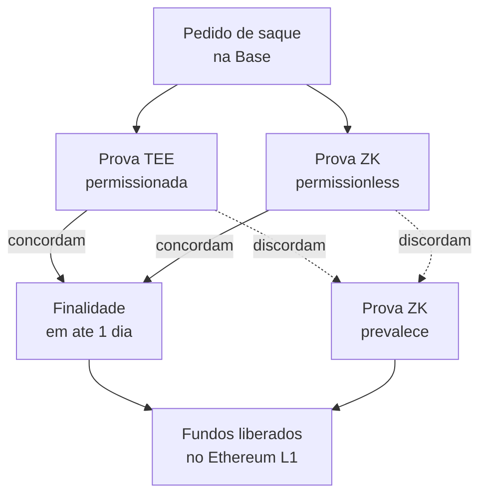
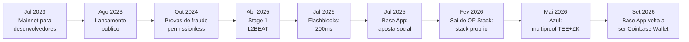

# Capítulo 8: Base em detalhe

O Capítulo 7 fechou apontando para este capítulo: contou como a Base, incubada pela Coinbase, era a maior fonte de receita da Superchain e como sua saída do OP Stack compartilhado, anunciada em fevereiro de 2026, expôs a tensão entre um padrão técnico coletivo e o controle que uma equipe única pode exercer sobre sua própria infraestrutura. Este capítulo olha para a Base como rede em si, sua origem, sua arquitetura técnica, o caminho que já percorreu rumo à descentralização e um episódio bem mais recente, de setembro de 2026, que mostra a mesma tensão se repetindo numa camada diferente, a do produto voltado ao usuário final.

**Uma L2 incubada por uma corretora aberta em bolsa.** A Base nasceu dentro da Coinbase, proposta em 2021 por Jesse Pollak, então um dos líderes de engenharia da empresa, hoje à frente da área de protocolos. A rede rodou em testnet no início de 2023, abriu um mainnet restrito a desenvolvedores em 13 de julho daquele ano e chegou ao público em geral em 9 de agosto de 2023, com um mês de lançamento batizado Onchain Summer, dedicado a arte, música e jogos onchain. O evento é lembrado como o primeiro caso de uma blockchain lançada por uma empresa de capital aberto. O crescimento inicial foi rápido: em poucos meses a rede já superava 4 milhões de endereços ativos e processava, em dias de pico, mais transações por dia do que o próprio Ethereum L1.

**A herança técnica do OP Stack.** Tecnicamente, a Base nasceu como uma instância do OP Stack descrito no Capítulo 7, herdando a mesma divisão de papéis entre op-geth, op-node, op-batcher e op-proposer, a mesma equivalência com a EVM e o mesmo modelo de segurança de rollup otimista, no qual a validade dos lotes de transação pode ser contestada por qualquer participante dentro de uma janela de disputa, com o resultado final assegurado pelo Ethereum L1. Essa herança é o que permitiu à Base, nos primeiros anos, focar menos em reinventar a base técnica e mais em um problema diferente: como levar cripto para gente que nunca usou uma carteira.

**A aposta da Coinbase: esconder a complexidade do usuário.** A distribuição da Base sempre se apoiou na base de mais de 110 milhões de usuários verificados da Coinbase, e a rede foi desenhada para tornar essa base invisível ao usuário final. O Coinbase Smart Wallet usa abstração de conta no padrão ERC-4337, permitindo criar uma carteira autocustodiada por meio de passkeys, a mesma tecnologia biométrica de Apple e Google usada para logar em aplicativos, sem exigir a memorização de uma seed phrase de doze palavras logo no primeiro uso. Sobre essa base, a infraestrutura de Paymaster permite que aplicativos patrocinem as taxas de gás de seus usuários, de forma que interagir com um contrato na Base possa parecer, para quem está do outro lado da tela, tão simples quanto usar um aplicativo comum. Essa combinação de abstração de conta e patrocínio de taxas é a peça central da tese de produto da Base, e vai aparecer de novo mais adiante neste capítulo, quando a mesma tese for testada num produto de consumo mais ambicioso.

**O caminho até a descentralização do sistema de provas.** Base seguiu o cronograma de maturidade do OP Stack descrito no capítulo anterior. As provas de fraude do sistema Cannon entraram em operação sem permissão no mainnet da Base em 30 de outubro de 2024, permitindo que qualquer conta Ethereum contestasse um resultado incorreto sem depender de terceiros de confiança. Em 29 de abril de 2025, a rede formalizou um Security Council descentralizado para aprovar atualizações do protocolo e, com isso, alcançou o Stage 1 do framework de descentralização de L2 apresentado no Capítulo 5, tornando-se a décima rede, entre as mais de sessenta acompanhadas pela L2BEAT, a cruzar esse patamar.

**Flashblocks: pré-confirmações de 200 milissegundos.** Em julho de 2025 a Base lançou o Flashblocks, uma camada que reduz o tempo de confirmação percebido pelo usuário de cerca de 2 segundos para 200 milissegundos. A peça central é o Rollup-Boost, um sidecar de construção de blocos desenhado pela Flashbots para chains do OP Stack, que roda ao lado do sequenciador da Base. Em vez de esperar um bloco inteiro, o construtor de blocos emite sub-blocos, os flashblocks, a cada 200 milissegundos, cada um carregando cerca de 10% do gás de um bloco completo e sua própria raiz de estado, o que preserva as garantias criptográficas de um bloco normal em cada fração. Depois que um flashblock é montado e transmitido, a ordem das transações dentro dele fica travada, mesmo que uma transação com taxa de prioridade maior chegue um instante depois. Um usuário que envia uma transação recebe assim uma confirmação inicial quase instantânea, bem antes do bloco completo fechar.

| Aspecto | Arbitrum (Nitro) | Optimism (OP Stack) | Base |
|---|---|---|---|
| Sistema de provas | WAVM, via jogo da bisseção | Cannon, via jogo da bisseção | Cannon herdado, mais multiproof TEE + ZK desde o upgrade Azul |
| Permissionless desde | 12 de fevereiro de 2025 (BoLD) | 10 de junho de 2024, com reversão temporária | 30 de outubro de 2024 (provas de fraude); Stage 1 em 29 de abril de 2025 |
| Pilha de software | Nitro, exportada como Orbit | OP Stack compartilhado, padrão da Superchain | Nasceu no OP Stack; saiu em fevereiro de 2026 para stack próprio (base/base, sobre Reth) |
| Controle do sequenciador | Equipe única (Offchain Labs) | Cada chain opera o seu | Coinbase opera o único sequenciador; descentralização ainda em andamento |
| Token nativo | ARB | OP | Nenhum até setembro de 2026; exploração de token anunciada em setembro de 2025 |

**Fevereiro de 2026: a saída da Superchain e o nascimento do stack próprio.** O Capítulo 7 já contou o lado do Optimism Collective nesse episódio; vale agora contar o raciocínio do lado da Base. Em 18 de fevereiro de 2026 a equipe anunciou que deixaria de depender do OP Stack mantido em conjunto com outras equipes e passaria a rodar sobre uma pilha própria, batizada internamente de base/base e construída sobre o Reth, o cliente de execução em Rust mantido pela Paradigm que a Base já vinha adotando progressivamente desde o fim de 2024, primeiro em nós de arquivo e depois na própria infraestrutura do sequenciador. A justificativa técnica publicada foi de ritmo de desenvolvimento: sob o modelo anterior, com componentes mantidos por equipes diferentes espalhadas por vários repositórios, a Base conseguia sustentar cerca de três hard forks por ano; a nova arquitetura, mais enxuta e otimizada especificamente para o caso de uso da Base, mira em até seis. A equipe também afirmou que o protocolo continua público e especificado abertamente, com implementações alternativas bem-vindas, ainda que a saída tenha rompido, na prática, o repasse de receita à Optimism Collective previsto na Lei das Chains descrita no capítulo anterior.

**Azul: provas combinadas e o próximo patamar de descentralização.** O primeiro upgrade da Base já fora da órbita direta da Optimism chegou ao mainnet em 28 de maio de 2026, às 18h UTC, batizado Azul, depois de duas semanas de atraso em relação à meta original de 13 de maio, usadas para reforçar o desempenho dos nós de prova. Azul introduziu um sistema de multiproof que combina dois tipos de prova bem diferentes: provas em Trusted Execution Environment, hardware especializado que executa e atesta cálculos de forma isolada, e provas de conhecimento zero, mais lentas de gerar mas verificáveis sem qualquer participante de confiança. Qualquer uma das duas pode, sozinha, finalizar uma retirada de fundos, e quando as duas concordam a finalidade pode acontecer em apenas um dia. O desenho de segurança é assimétrico de propósito: a prova ZK, que não depende de permissão de ninguém, prevalece sobre a prova TEE, que é operada de forma permissionada, em caso de conflito entre as duas.

O desenho mostra por que o desenho é assimétrico: as duas provas podem finalizar uma retirada sozinhas, mas em caso de desacordo é sempre a prova sem permissão que vence, o que é o ponto central do argumento de descentralização do upgrade. Ainda assim, a própria equipe da Base reconhece que o Stage 2 completo do framework da L2BEAT, que exige que o tratamento de falhas do sistema de provas funcione de forma confiável mesmo sob ataque simultâneo aos dois tipos de prova, não foi publicamente testado sob estresse no mainnet, e nenhuma data para alcançar esse patamar foi anunciada.

**Um token que a Base sempre disse não ter, e que agora diz estar explorando.** Diferentemente de Arbitrum e Optimism, a Base nunca emitiu um token de governança, e por anos a Coinbase repetiu publicamente que não tinha planos de fazê-lo. Essa posição mudou de tom, sem virar anúncio de lançamento, no evento Base Camp de 15 de setembro de 2025, quando Jesse Pollak declarou que a rede começava a explorar um token nativo, ligando a ideia a três objetivos declarados: avançar a descentralização, alinhar incentivos econômicos de desenvolvedores e criadores, e abrir espaço para novos desenhos de produto. Um ano depois, em setembro de 2026, nenhuma data de lançamento havia sido fixada, e a exploração seguia em estágio inicial segundo a própria equipe.

**Setembro de 2026: quando o "super app" deu meia-volta.** A mesma tese de esconder a complexidade cripto do usuário comum, que já orientava o Smart Wallet desde o lançamento, ganhou uma versão mais ambiciosa em julho de 2025, quando a Coinbase rebatizou sua carteira autocustodiada de Base App, em um evento chamado "A New Day One". A proposta era um "super app" onchain: feed social, mensagens, mini-aplicativos, pagamentos, ferramentas para criadores e negociação, tudo dentro de um único aplicativo construído em torno da Base. O experimento não vingou como esperado. Em 10 de setembro de 2026, a Coinbase confirmou que estava desfazendo o rebranding, devolvendo ao aplicativo o nome Coinbase Wallet e abandonando a aposta social-first. O CEO Brian Armstrong resumiu o resultado dizendo que a parte social "não funcionou muito bem", e Jesse Pollak reconheceu publicamente que moedas de criador e um feed social não seguraram a atenção dos usuários como se esperava. O aplicativo reposicionado volta a priorizar negociação rápida e multichain, cobrindo Base, Ethereum, Bitcoin, Solana, BNB Chain, Optimism, Arbitrum, Polygon, Avalanche e outras redes mais recentes, com produtos que vão de memecoins a ações tokenizadas e mercados de previsão.

A linha do tempo junta os dois fios deste capítulo: de um lado, o avanço técnico constante rumo a mais descentralização e mais velocidade; de outro, uma aposta de produto ambiciosa que precisou recuar poucos meses depois de lançada.

**O que o ano de Base ensina sobre infraestrutura versus produto.** Os dois grandes eventos de 2026 tratados aqui, a saída do OP Stack em fevereiro e o recuo do Base App em setembro, parecem episódios distintos, mas compartilham uma lógica. Em ambos os casos, a Base testou até onde ia sua vantagem de controlar sua própria pilha, seja a pilha técnica compartilhada com a Superchain, seja um produto de consumo construído sobre suas próprias premissas de UX. No caso técnico, o controle total permitiu, segundo a própria equipe, dobrar o ritmo de atualizações, um ganho que o capítulo anterior mostrou ter custado caro para o token OP e para o argumento de que a Superchain seria vantajosa para qualquer chain grande o bastante para bancar sua própria infraestrutura. No caso do produto, a aposta de reunir tudo, rede social, criador de conteúdo e negociação, sob a marca Base não encontrou o mesmo público que valida a tese de UX invisível do Smart Wallet e do Paymaster, e a Coinbase preferiu recuar rápido a insistir. Os dois episódios, lidos juntos, sugerem uma Base que aceita reverter decisões de produto com rapidez, mas que segue investindo com constância no lado da infraestrutura, provas de fraude, Security Council, multiproof, ainda que sem token e sem um sequenciador plenamente descentralizado até aqui. É esse tipo de tensão entre padronização coletiva, velocidade de controle individual e experimentação de produto que volta a aparecer quando este caderno tratar de tokenomics avançada e de governança de DAOs em capítulos futuros, agora com a Base como um caso concreto de referência.

**Glossário do capítulo.**

- **Onchain Summer**: mês de lançamento público da Base em agosto de 2023, dedicado a arte, música e jogos onchain.
- **Smart Wallet**: carteira autocustodiada da Coinbase baseada em abstração de conta (ERC-4337), que dispensa seed phrase usando passkeys.
- **Paymaster**: infraestrutura que permite a um aplicativo patrocinar as taxas de gás pagas por seus usuários.
- **Security Council**: comitê descentralizado responsável por aprovar atualizações de protocolo, cujo estabelecimento na Base em abril de 2025 marcou seu Stage 1 de descentralização.
- **Flashblocks**: sub-blocos emitidos a cada 200 milissegundos pelo Rollup-Boost, que aceleram a confirmação percebida de transações na Base.
- **Rollup-Boost**: sidecar de construção de blocos criado pela Flashbots para chains do OP Stack, peça central do Flashblocks.
- **Reth**: cliente de execução Ethereum escrito em Rust, mantido pela Paradigm, base da nova pilha própria da Base.
- **Multiproof**: sistema introduzido no upgrade Azul que combina provas TEE (permissionadas) e provas ZK (permissionless) para finalizar retiradas de fundos.
- **Trusted Execution Environment (TEE)**: hardware isolado que executa e atesta cálculos de forma confiável, usado como um dos dois tipos de prova no multiproof da Base.
- **base/base**: nome interno da pilha de software própria que a Base passou a desenvolver depois de sair do OP Stack em fevereiro de 2026.

Fontes consultadas:

- [Base is open for everyone, Base](https://blog.base.org/base-is-open-for-everyone)
- [Coinbase's blockchain Base to launch to the public next week, TechCrunch](https://techcrunch.com/2023/08/03/coinbases-blockchain-base-to-launch-to-the-public-next-week/)
- [Coinbase to widen mainnet access to Base on August 9, releases Ethereum bridge, The Block](https://www.theblock.co/post/242961/base-network-bridge)
- [Fault proofs are now live on Base Mainnet, Base](https://blog.base.org/fault-proofs-are-now-live-on-base-mainnet)
- [Base has reached Stage 1 Decentralization, Base](https://blog.base.org/base-has-reached-stage-1-decentralization)
- [Base becomes 10th L2 network to reach at least Stage 1 decentralization, Bitget News](https://www.bitget.com/news/detail/12560604730215)
- [We're making Base 10x faster with Flashblocks, Base Engineering Blog](https://blog.base.dev/accelerating-base-with-flashblocks)
- [Flashblocks Deep Dive: How we made Base 10x faster, Base Engineering Blog](https://blog.base.dev/flashblocks-deep-dive)
- [A new, unified stack for Base Chain, Base Engineering Blog](https://blog.base.dev/next-chapter-for-base-chain-1)
- [Coinbase-incubated Base network to ditch Optimism for 'unified solution', The Block](https://www.theblock.co/post/390380/coinbase-incubated-base-network-to-ditch-optimism-for-unified-solution)
- [Optimism's OP token falls after Base moves away from the network's 'OP stack' in major tech shift, CoinDesk](https://www.coindesk.com/business/2026/02/18/coinbase-s-base-moves-away-from-optimism-s-op-stack-in-major-tech-shift)
- [Base's first independent network upgrade and what it means for Base, KuCoin](https://www.kucoin.com/blog/base-s-first-independent-network-upgrade-and-what-it-means-for-base)
- [Base Launches Azul Upgrade, Takes Step Toward Stage 2 Decentralization, The Defiant](https://thedefiant.io/news/blockchains/base-launches-azul-upgrade-takes-step-toward-stage-2-decentralization)
- [Base explores issuing native token, says creator Jesse Pollak, CoinDesk](https://www.coindesk.com/business/2025/09/15/base-explores-issuing-native-token-says-creator-jesse-pollak)
- [Coinbase Races into Super App Space with Base App and Speedy Transactions, The Defiant](https://thedefiant.io/news/cefi/coinbase-rebrands-base-to-super-app-adds-flashblocks)
- [Coinbase unveils Base App, rebrands wallet as all-in-one social and trading platform, The Block](https://www.theblock.co/post/362713/coinbase-unveils-base-app-rebrands-wallet-as-all-in-one-social-and-trading-platform)
- [Coinbase rebrands Base App back to Coinbase Wallet after just over a year as social experiment falls short, The Block](https://www.theblock.co/news/defi/2026-09-10-coinbase-rebrands-base-app-back-to-coinbase-wallet-after-just-over-a-year-as-social-experiment-falls-short-414115)
- [Coinbase Wallet Returns As Base App Social Experiment Ends, Crowdfund Insider](https://www.crowdfundinsider.com/2026/09/309263-coinbase-wallet-returns-as-base-app-social-experiment-ends/)
- [Base L2 Ecosystem Guide: $13B TVL in 2026, Altrady](https://www.altrady.com/blog/cryptocurrency/base-l2-coinbase-ecosystem-guide-2026)
