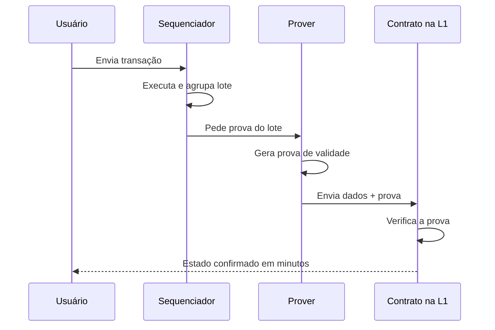
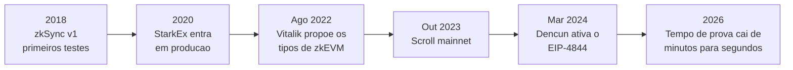

# Capítulo 9: zk-Rollups vs. Rollups Otimistas, Dois Caminhos Para Escalar a Ethereum

O Capítulo 5 deixou uma promessa pendente: depois de explicar o conceito geral de rollup e de mostrar, numa tabela rápida, que existem duas famílias com pressupostos de segurança opostos, prometeu voltar ao tema "com mais profundidade técnica" mais adiante no caderno. Os Capítulos 6, 7 e 8 preencheram o lado otimista dessa promessa, com Arbitrum, o Superchain da Optimism e a Base, três redes que compartilham o mesmo pressuposto de que um lote é válido até prova em contrário. Este capítulo fecha o outro lado, o dos zk-rollups, e finalmente coloca as duas famílias lado a lado com o detalhe técnico que a tabela de três linhas do Capítulo 5 não coube.

**O pressuposto que muda tudo.** Vale reler a diferença central antes de aprofundar. Um rollup otimista publica um lote de transações na L1 e assume que ele está correto, abrindo uma janela de desafio, normalmente de sete dias, durante a qual qualquer participante pode submeter uma prova de fraude e reverter um resultado errado. Um zk-rollup inverte a lógica: nenhum lote é aceito pelo contrato na L1 sem vir acompanhado de uma prova de validade, gerada por criptografia de conhecimento zero, que demonstra matematicamente que a execução está correta antes mesmo de o lote entrar no livro-razão. A primeira família confia numa rede de vigilantes que pode, em teoria, ficar todos desatentos ao mesmo tempo. A segunda dispensa vigilantes e aposta tudo na matemática por trás da prova.

**O que uma prova de conhecimento zero realmente prova.** O nome confunde mais do que ajuda. Uma prova de conhecimento zero não esconde o resultado da computação, ela esconde os detalhes de como se chegou até ele, e ainda assim convence um verificador de que o caminho percorrido estava correto. No caso de um zk-rollup, o "segredo" que a prova mantém compacto não é sigilo de dados dos usuários, é a computação inteira que produziu a transição de um estado do rollup para o próximo. Em vez de um nó da L1 reexecutar milhares de transações para checar se o novo estado está certo, ele verifica uma prova matemática muito menor e muito mais rápida de conferir do que a computação original. É essa assimetria, gerar a prova é caro, verificar a prova é barato, que permite ao contrato do rollup na L1 aceitar um lote inteiro com uma checagem que cabe numa fração de segundo.

O diagrama mostra o ciclo próprio dos zk-rollups: diferente do rollup otimista, aqui existe um ator extra, o prover, e o contrato da L1 só atualiza o estado depois de validar matematicamente a prova, sem precisar esperar por uma janela de desafio.

**SNARK ou STARK, a escolha por trás da prova.** Existe mais de uma família de prova de conhecimento zero, e a escolha entre elas molda decisões de arquitetura de cada zk-rollup. zk-SNARK é a mais antiga e mais adotada, produz provas pequenas e rápidas de verificar, mas historicamente depende de uma cerimônia de configuração confiável, o chamado trusted setup, cujos parâmetros iniciais precisam ser destruídos com segurança para que o sistema continue confiável, e sua segurança criptográfica se apoia em curvas elípticas, o que a deixa vulnerável a um computador quântico suficientemente potente. zk-STARK é mais recente, dispensa o trusted setup, apoia sua segurança em funções de hash em vez de curvas elípticas, o que a torna resistente a ataques quânticos, e escala melhor para computações grandes, ao custo de provas maiores e verificação mais lenta em computações pequenas. A tabela resume o trade-off.

| Aspecto | zk-SNARK | zk-STARK |
|---|---|---|
| Configuração inicial | Exige trusted setup na maioria das implementações | Dispensa trusted setup |
| Base criptográfica | Curvas elípticas | Funções de hash |
| Resistência a computação quântica | Baixa | Alta |
| Tamanho da prova | Pequeno | Maior |
| Escala para computações grandes | Moderada | Melhor |
| Exemplo de uso citado neste caderno | zkSync Era, Scroll, Polygon zkEVM | Starknet |

**O gargalo real dos zk-rollups: fazer o EVM caber num circuito.** Gerar uma prova de conhecimento zero significa traduzir cada passo da execução da EVM, a máquina virtual descrita ainda de forma superficial nos capítulos anteriores deste caderno e que ganhará capítulo próprio adiante, para um circuito aritmético que um sistema de prova consiga processar. O problema é que a EVM nunca foi desenhada pensando nisso: ela usa operações, como certas funções de hash e checagens de assinatura, que são baratas para um computador comum rodar, mas caras de representar dentro de um circuito. Foi para organizar essa dificuldade que Vitalik Buterin propôs, em 2022, uma classificação em quatro tipos de zkEVM, hoje referência do setor. Tipo 1 busca equivalência total com a Ethereum, sem alterar hashes, árvores de estado ou qualquer lógica de consenso, o que maximiza a compatibilidade mas deixa a geração da prova mais lenta e cara. Tipo 2 remove partes pouco amigáveis à prova de conhecimento zero, mantendo compatibilidade prática com contratos existentes e acelerando a prova. Tipo 3 aceita reduzir ainda mais a compatibilidade, deixando de fora uma fração pequena de contratos que dependem de comportamentos muito específicos da EVM, em troca de mais desempenho. Tipo 4 abandona a equivalência ao bytecode da EVM e compila o código-fonte, em Solidity ou Vyper, direto para uma máquina virtual própria, otimizada para prova rápida, ao custo de deixar de ser bytecode-compatível com o restante do ecossistema.

| Tipo de zkEVM | Compatibilidade | Velocidade de prova | Efeito prático |
|---|---|---|---|
| Tipo 1 | Equivalência total com a Ethereum | Mais lenta | Nenhuma mudança percebida por desenvolvedores |
| Tipo 2 | Equivalente à EVM, com ajustes internos | Moderada | Contratos existentes rodam sem alteração |
| Tipo 3 | Quase compatível | Mais rápida | Uma fração pequena de contratos pode precisar de ajuste |
| Tipo 4 | Compatível em nível de linguagem, não de bytecode | A mais rápida | Recompilação do código-fonte é necessária |

**O panorama de 2026.** As maiores redes zk em produção hoje seguem caminhos distintos dentro desse espectro. zkSync Era, Linea e Scroll são, segundo o painel da L2BEAT, os três maiores zk-rollups por valor total garantido, somando publicamente bilhões de dólares em conjunto em meados de 2026, com a zkSync Era priorizando desempenho do prover mesmo à custa de alguma divergência do bytecode da EVM, enquanto a Scroll prioriza fidelidade ao bytecode e aceita, em troca, um prover mais lento. A Polygon zkEVM soma outra fatia relevante do mercado. A Starknet segue um caminho à parte: não usa a EVM, e sim uma máquina virtual própria chamada Cairo, desenhada desde o início para gerar provas STARK com eficiência, e é hoje, segundo a própria L2BEAT, a única rede zk de propósito geral a alcançar o Stage 1 do framework de descentralização apresentado no Capítulo 5, enquanto os zkEVMs gerais mais próximos da EVM tradicional seguem presos ao Stage 0, ainda dependentes de um operador com poderes de intervenção sobre o sistema de provas.

**A prova ficando mais rápida, ano após ano.** Se em 2023 uma prova de validade para um lote de transações podia levar minutos para ser gerada, relatos do setor ao longo de 2026 descrevem tempos de geração que caíram de algo como dezesseis minutos para próximo de dezesseis segundos em benchmarks de referência, junto de uma queda relatada de dezenas de vezes no custo de gerar cada prova, o suficiente para times de pesquisa demonstrarem geração de prova em tempo real, mais rápida até do que o intervalo de doze segundos entre blocos do próprio Ethereum descrito no Capítulo 2. Esse é o eixo em que os zk-rollups historicamente perdiam para os rollups otimistas: tempo até a finalidade. Enquanto um saque de um rollup otimista para a L1 precisa esperar a janela de desafio inteira, tipicamente sete dias, um zk-rollup pode liberar fundos assim que a prova é verificada, o que, com provas cada vez mais rápidas de gerar, aproxima a experiência de sacar fundos de um zk-rollup de minutos, não de dias.

A linha do tempo mostra que o amadurecimento dos zk-rollups não veio de um único avanço, e sim do acúmulo de melhorias em paralelo, desde a proposta de classificação de Vitalik até a queda recente e acentuada no tempo de geração de provas, passando pela redução do custo de disponibilidade de dados que o Capítulo 5 já atribuiu ao EIP-4844, e que beneficia as duas famílias de rollup igualmente, já que ambas publicam dados na L1 do mesmo jeito.

**O que ainda pesa contra os zk-rollups, e o que pesa a favor.** Nenhuma das duas famílias venceu a disputa de vez. A favor dos zk-rollups está a segurança matemática, que dispensa qualquer vigilante humano e não depende de ninguém estar de olho na rede durante uma janela de dias, além da finalidade rápida que interessa em especial a quem movimenta fundos com frequência entre camadas. A favor dos rollups otimistas está o custo operacional mais baixo no dia a dia, já que gerar uma prova de fraude só é necessário quando alguém de fato contesta um resultado, enquanto um zk-rollup paga o custo computacional de gerar uma prova a cada lote, e uma maturidade de ferramentas de desenvolvimento construída ao longo de mais anos em cima de uma EVM sem modificação nenhuma, a vantagem que permitiu a Arbitrum, Optimism e Base crescerem tão rápido, como visto nos capítulos anteriores. A tendência de longo prazo, à medida que a geração de provas fica mais barata e mais rápida, aponta para um ecossistema em que mais rollups adotam validade criptográfica como mecanismo de segurança, inclusive redes hoje otimistas, mas isso não é garantia de resultado, e nada aqui deve ser lido como indicação de qual token ou rede vai prevalecer.

**Fechando a comparação.** Este capítulo tentou dar às duas famílias de rollup o mesmo nível de detalhe: o que cada uma assume sobre a validade de um lote, como uma prova de conhecimento zero funciona por dentro, a diferença prática entre SNARK e STARK, o esforço de encaixar a EVM num circuito e o estado atual do mercado em 2026. A partir daqui, o caderno deixa a camada de escala de lado por um tempo e vira a chave para a camada de aplicação, começando pelos mecanismos que movem a maior parte do valor dentro de qualquer rollup ou da própria L1: as pools de liquidez e os market makers automatizados do DeFi.

**Glossário do capítulo.**

- **Prova de validade**: prova criptográfica de conhecimento zero que demonstra a correção de um lote de transações antes de ele ser aceito na L1.
- **Prover**: ator ou serviço responsável por gerar a prova de validade de um lote num zk-rollup.
- **zk-SNARK**: família de prova de conhecimento zero com provas pequenas e verificação rápida, geralmente dependente de um trusted setup.
- **zk-STARK**: família de prova de conhecimento zero sem trusted setup, baseada em funções de hash e resistente a ataques quânticos.
- **Trusted setup**: cerimônia de geração de parâmetros iniciais exigida por muitos sistemas SNARK, cuja segurança depende da destruição desses parâmetros depois de usados.
- **zkEVM**: implementação de uma máquina virtual compatível com a Ethereum capaz de ter sua execução provada por criptografia de conhecimento zero.
- **Circuito aritmético**: representação de uma computação em forma de operações matemáticas, usada como base para gerar uma prova de conhecimento zero.
- **Cairo**: máquina virtual própria usada pela Starknet, desenhada desde o início para gerar provas STARK com eficiência, em vez de reproduzir a EVM.
- **Finalidade**: momento em que uma transação ou lote passa a ser considerado definitivo e irreversível na L1.

Fontes consultadas:

- [ZK rollups vs. Optimistic rollups: How do they compare?, StarkWare](https://starkware.co/blog/zk-rollups-explained/zk-rollups-vs-optimistic-rollups/)
- [What is the difference between Optimistic Rollups and ZK-Rollups?, Coinbase](https://www.coinbase.com/learn/tips-and-tutorials/what-is-the-difference-between-optimistic-rollups-and-zk-rollups)
- [Zero-Knowledge Proofs: STARKs vs SNARKs, Consensys](https://consensys.io/blog/zero-knowledge-proofs-starks-vs-snarks)
- [zk-SNARKs vs. zk-STARKs: Comparing the Main ZKPs in Blockchain, Halborn](https://www.halborn.com/blog/post/zk-snarks-vs-zk-starks-comparing-the-main-zkps-in-blockchain)
- [The Evolution of zkEVMs: Balancing Compatibility and Performance in Ethereum Scaling, BlockEden](https://blockeden.xyz/blog/2026/01/16/zkevm-types-comparison-type-1-2-3-4-trade-offs-benchmarks/)
- [ZK-rollup projects: a complete 2026 guide, Alchemy](https://www.alchemy.com/overviews/zk-rollup-projects)
- [zkSync vs Linea vs Scroll: ZK-Rollups Compared, Eco](https://eco.com/support/en/articles/14798705-zksync-vs-linea-vs-scroll-zk-rollups-compared)
- [What Is Scroll? Native zkEVM L2 Explained, Eco](https://eco.com/support/en/articles/15183713-what-is-scroll-native-zkevm-l2-explained)
- [What Is a ZK Rollup? A 2026 Guide to Zero-Knowledge Scaling, Eco](https://eco.com/support/en/articles/10080409-what-is-a-zk-rollup-a-2026-guide-to-zero-knowledge-scaling)
