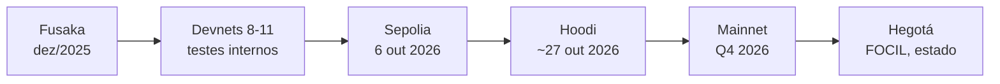

# Capítulo 10: Glamsterdam, o próximo grande salto do Ethereum

Os capítulos anteriores deste caderno seguiram basicamente uma ordem cronológica e temática: da origem do Ethereum e do Merge, passando pelo funcionamento interno do Proof-of-Stake, pelo staking líquido, pelo restaking e por uma volta completa pelo mundo dos rollups. Este capítulo interrompe essa progressão para tratar de algo que está acontecendo agora, enquanto este texto é escrito. O Ethereum está a poucos dias de testar em rede pública a próxima grande atualização do seu protocolo, batizada de Glamsterdam, e entender o que ela muda ajuda a enxergar para onde a rede está indo depois de Fusaka.

**Por que falar de Glamsterdam agora.** Toda atualização do Ethereum passa primeiro pelas redes de teste antes de ir para a mainnet, exatamente como qualquer software crítico deveria ser validado antes de entrar em produção. No caso do Glamsterdam, os desenvolvedores fixaram o dia 6 de outubro de 2026 às 13h53 UTC como a data de ativação na testnet Sepolia, com os clientes compatíveis exigidos até 29 de setembro, uma janela apertada de pouco mais de uma semana para revisão. A ativação na mainnet ainda não tem data fechada, mas está planejada para o quarto trimestre de 2026. Ou seja, o capítulo que seria sobre um tema "atemporal" da lista de progressão pode esperar mais uma semana; o que está acontecendo neste exato momento no desenvolvimento do Ethereum não pode.

**De onde vem o nome.** Desde a fusão entre as redes de execução e consenso, o Ethereum passou a nomear suas atualizações combinando o nome de uma cidade que sediou uma conferência Devcon ou Devconnect com o nome de um objeto celeste, uma tradição iniciada com Bellatrix e Paris no Merge. Glamsterdam é a junção de Gloas (nome do lado da camada de consenso) e Amsterdam (a cidade), continuando essa convenção. O upgrade dá sequência a Fusaka, que já está em produção desde 3 de dezembro de 2025 e trouxe o PeerDAS e a escala inicial de blobs tratada no Capítulo 5 deste caderno, quando falamos do EIP-4844 e da arquitetura dos rollups.

**As duas propostas de destaque.** Depois de um processo de seleção entre a comunidade de desenvolvedores, o Glamsterdam definiu dois EIPs como "headliners", as mudanças mais estruturais do pacote: o EIP-7732, que enshrina a separação entre proposer e builder (ePBS) na camada de consenso, e o EIP-7928, que introduz as Block-Level Access Lists (BALs). Um terceiro tema recorrente nas discussões, o FOCIL de inclusão forçada de transações, acabou sendo retirado do escopo deste fork para preservar o cronograma e deve aparecer só na atualização seguinte, apelidada de Hegotá.

**O que é PBS e por que ele precisa ser enshrined.** Desde os tempos do Capítulo 2, quando descrevemos como um proposer é sorteado a cada slot para propor um bloco, existe uma tensão de mercado: proposers querem maximizar o valor extraído do bloco (o MEV), mas normalmente não têm a infraestrutura para competir na construção de blocos otimizados contra operações especializadas. A solução usada até aqui é o MEV-Boost, um software externo ao protocolo que conecta proposers a builders através de relays, terceiros de confiança que garantem que o builder recebe o bloco e o proposer recebe o pagamento sem que um possa trapacear o outro. Esse arranjo funciona, mas depende inteiramente da lisura desses relays, que se tornaram um ponto de centralização e de confiança fora do protocolo.

**Como funciona o ePBS.** O EIP-7732 move essa separação para dentro das regras de consenso. Em vez de depender de um relay externo, o próprio protocolo passa a coordenar a troca: o builder envia um compromisso criptográfico sobre um bloco de execução específico ainda durante o slot, o proposer da camada de consenso escolhe o melhor compromisso recebido e propaga rapidamente o cabeçalho do bloco para cumprir os prazos de consenso, e só depois o builder revela o conteúdo completo do bloco de execução. Um novo grupo de validadores, o Payload Timeliness Committee (PTC), tem a função específica de atestar se o builder revelou o payload dentro do prazo; se não revelar, o protocolo tem mecanismos de fallback e penalização para não comprometer a liveness da rede. O efeito prático é que a garantia de troca justa entre proposer e builder, hoje terceirizada a relays, passa a ser nativa do protocolo, e a janela de propagação de dados do bloco se expande de cerca de 2 segundos para algo perto de 9 segundos, dando fôlego para lidar com blocos maiores e mais blobs.

**O que são as Block-Level Access Lists.** O segundo headliner ataca um problema diferente: a execução de transações no Ethereum hoje é essencialmente sequencial, porque um cliente só sabe quais endereços e slots de armazenamento uma transação vai tocar depois de começar a executá-la. Isso trava qualquer tentativa de paralelizar o processamento de um bloco. O EIP-2930, mais antigo, já havia introduzido listas de acesso opcionais por transação, mas como são opcionais e não obrigatórias, não resolvem o problema em escala. O EIP-7928 torna esse tipo de lista obrigatória e no nível do bloco inteiro: cada bloco passa a carregar explicitamente quais contas e posições de armazenamento foram acessadas e modificadas por cada transação, junto dos valores pós-execução. Com essa informação disponível de antemão, um cliente pode paralelizar a leitura em disco, a validação de transações e o cálculo da raiz de estado, e clientes stateless podem pré-buscar o estado necessário antes mesmo do bloco começar a ser executado. Estimativas citadas por desenvolvedores apontam que entre 60% e 80% das transações de um bloco típico acessam posições de armazenamento disjuntas entre si, o que já permite bastante paralelização direta.

**O caminho até 200 milhões de gas.** As duas mudanças acima existem, em grande medida, para viabilizar um salto que seria arriscado sem elas: o limite de gas por bloco, hoje em 60 milhões depois de um aumento aprovado por votação de validadores pouco antes da ativação de Fusaka, tem um piso operacional de 200 milhões de gas mirado para depois do Glamsterdam, o que representa mais que triplicar a capacidade computacional de cada bloco. É importante notar que o EIP-7732 e o EIP-7928 não forçam esse número por si só, quem decide o limite de gas efetivo continua sendo o conjunto de validadores, através do mecanismo de sinalização em que cada validador vota a cada bloco que propõe, sem necessidade de hard fork para mudar o valor. O que o Glamsterdam faz é remover os principais obstáculos técnicos que tornariam um bloco de 200 milhões de gas perigoso para a descentralização da rede, dando aos operadores de nós a capacidade real de processar blocos maiores sem que isso exija hardware fora do alcance de um validador doméstico.

*A linha do tempo mostra a progressão do Glamsterdam desde o fim de Fusaka até a mainnet, passando pelas redes de teste, com o FOCIL adiado para a atualização seguinte.*

**Nem tudo saiu redondo até aqui.** O processo de testes do Glamsterdam não tem sido tranquilo, o que é normal e até desejável para uma mudança deste tamanho: é exatamente para isso que servem as devnets. A Devnet-8 teve problemas de finalidade na ativação da parte Gloas do upgrade, a Devnet-9 também passou por não-finalidade inesperada, e só a partir da Devnet-11 os times de clientes conseguiram uma transição limpa, incluindo o salto do limite de gas de 60 para 200 milhões sem perda de finalidade. Às vésperas da ativação na Sepolia, desenvolvedores também alertaram para um vetor de ataque específico: como o ETH de teste é gratuito e sem valor real, um agente malicioso poderia criar identidades falsas de builder, vencer leilões de blocos sob o novo esquema de ePBS e simplesmente reter os payloads vencedores, potencialmente travando a testnet. Esse tipo de aviso público, feito abertamente pelos próprios desenvolvedores do protocolo, é parte do processo normal de engenharia aberta do Ethereum e não motivo de alarme, mas mostra como esses períodos de teste servem justamente para expor esse tipo de fragilidade antes que ela chegue à mainnet, onde o dinheiro é de verdade.

**Comparando os dois headliners.**

| Aspecto | ePBS (EIP-7732) | Block-Level Access Lists (EIP-7928) |
| --- | --- | --- |
| Problema que resolve | Dependência de relays externos no MEV-Boost | Execução sequencial de transações |
| Onde atua | Camada de consenso | Formato do bloco de execução |
| Novo componente | Payload Timeliness Committee (PTC) | Lista obrigatória de acessos por bloco |
| Benefício principal | Troca justa proposer-builder nativa do protocolo | Paralelização de execução e sincronização mais rápida |
| Relação com o limite de gas | Amplia a janela de propagação de dados | Reduz o custo de processar blocos maiores |

**Conectando com o resto do caderno.** O Glamsterdam fecha um pouco o círculo aberto nos capítulos sobre Layer 2. No Capítulo 5 explicamos que o EIP-4844 tratou do problema de disponibilidade de dados para os rollups via blobs; agora o ePBS e as BALs atacam o outro lado do gargalo, a capacidade da própria camada 1 de processar e propagar blocos maiores com segurança. Também há uma ligação direta com o Capítulo 2: o Payload Timeliness Committee é, na prática, mais um tipo de comitê de validadores com uma função de atestação especializada, seguindo a mesma lógica dos comitês de slot e epoch que já descrevemos ali. E para quem acompanha indicadores de rede usando os scripts do TradingView do documento irmão deste caderno, o aumento do limite de gas e a mudança na dinâmica de MEV são o tipo de evento que tende a se refletir em métricas on-chain de taxa de bloco e de queima via EIP-1559, tema que será aprofundado em um capítulo futuro.

**O que ainda falta.** O FOCIL, que forçaria a inclusão de transações válidas mesmo contra a vontade de um builder malicioso, ficou de fora deste pacote para não atrasar o cronograma e deve aparecer na atualização seguinte, a Hegotá, que segundo os planos atuais também deve mirar o problema do crescimento do estado da rede. Ou seja, o Glamsterdam resolve a arquitetura de troca de blocos e a capacidade de processamento, mas deixa para depois a garantia mais forte de resistência à censura no nível de protocolo. É um lembrete de que o desenvolvimento do Ethereum segue sendo incremental, com escopos deliberadamente limitados a cada fork para manter o processo de revisão gerenciável, mesmo quando isso significa adiar uma melhoria que já tem amplo apoio técnico.

**Glossário do capítulo.**
- **ePBS (Enshrined Proposer-Builder Separation)**: mecanismo que embute nas regras de consenso a separação entre quem propõe um bloco e quem o constrói, eliminando a dependência de relays externos.
- **MEV-Boost**: software usado hoje para conectar proposers a builders através de relays externos ao protocolo.
- **Relay**: intermediário de confiança que hoje garante a troca justa entre proposer e builder no esquema atual de PBS.
- **Payload Timeliness Committee (PTC)**: comitê de validadores criado pelo ePBS para atestar se um builder revelou o payload do bloco dentro do prazo.
- **Block-Level Access Lists (BALs)**: listas obrigatórias, anexadas a cada bloco, que declaram todas as contas e posições de armazenamento acessadas e modificadas pelas transações daquele bloco.
- **Paralelização de execução**: técnica que permite a um cliente processar várias transações ao mesmo tempo em vez de sequencialmente, viabilizada quando se sabe de antemão quais dados cada transação vai tocar.
- **Cliente stateless**: cliente que não guarda o estado completo da rede localmente e depende de provas e listas de acesso para validar blocos.
- **Limite de gas por bloco**: teto de capacidade computacional de cada bloco, hoje ajustado por sinalização direta dos validadores, sem necessidade de hard fork.
- **FOCIL**: mecanismo de listas de inclusão forçadas por fork-choice, adiado do Glamsterdam para a atualização seguinte, a Hegotá.
- **Devnet**: rede de desenvolvimento interna usada pelos times de clientes para testar um upgrade antes de expor a mudança em redes de teste públicas como Sepolia e Hoodi.

**Fontes.**
- [Glamsterdam — ethereum.org](https://ethereum.org/roadmap/glamsterdam/)
- [EIP-7732: Enshrined Proposer-Builder Separation](https://eips.ethereum.org/EIPS/eip-7732)
- [EIP-7928: Block-Level Access Lists](https://eips.ethereum.org/EIPS/eip-7928)
- [EIP-7805: Fork-choice enforced Inclusion Lists (FOCIL)](https://eips.ethereum.org/EIPS/eip-7805)
- [Ethereum's Glamsterdam Upgrade Enters Final Devnet Phase With 200M Gas-Limit Target — The Defiant](https://thedefiant.io/news/blockchains/ethereum-glamsterdam-final-devnet-200m-gas-limit-target)
- [Ethereum Alerts to Builder Abuse Risks in Glamsterdam Testnet — KuCoin](https://www.kucoin.com/news/flash/ethereum-warns-of-builder-abuse-risks-in-glamsterdam-testnet)
- [Ethereum raises block gas limit to 60M as ecosystem throughput hits new records ahead of Fusaka upgrade — The Block](https://www.theblock.co/post/380687/ethereum-block-gas-limit-fusaka)
- [What Is the Fusaka Upgrade: Ethereum's Next Hard Fork — CoinGecko Learn](https://www.coingecko.com/learn/what-is-ethereum-fusaka-upgrade)
