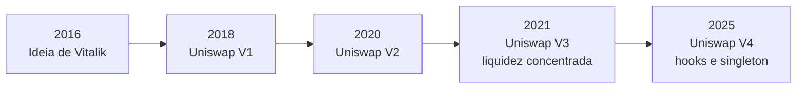

# Capítulo 11: DeFi, AMMs e Pools de Liquidez

Os últimos seis capítulos deste caderno trataram quase exclusivamente de infraestrutura: como a Ethereum chega a um consenso, como o staking líquido e o restaking reaproveitam o mesmo capital, como os rollups escalam a capacidade da rede e qual upgrade está a caminho para sustentar tudo isso. Chegou a hora de subir um andar e olhar para o que roda em cima dessa infraestrutura. Nenhuma categoria de aplicação define melhor o que "DeFi" significa na prática do que as exchanges descentralizadas, e nenhum mecanismo é mais central a elas do que o par formado pelo automated market maker (AMM) e pela pool de liquidez. Este capítulo explica como esse par resolveu um problema que parecia, a princípio, natural demais para precisar de solução: como negociar um ativo contra outro sem um livro de ofertas e sem um intermediário centralizado.

**O que é DeFi, em uma frase.** DeFi é a abreviação de "finanças descentralizadas", um guarda-chuva para aplicações que replicam funções financeiras tradicionais (trocar um ativo por outro, emprestar, tomar emprestado, especular com derivativos) usando contratos inteligentes abertos e auditáveis em vez de uma instituição que custodia o dinheiro e decide as regras por trás de portas fechadas. Isso não elimina risco, como este caderno vai deixar claro adiante, mas troca o risco de contraparte de uma empresa por outro tipo de risco, o de erro de código e de desenho econômico do próprio protocolo. As exchanges descentralizadas (DEXs) foram a primeira grande categoria de DeFi a encontrar um modelo que funcionasse em escala, e é por isso que este caderno começa por elas antes de chegar aos protocolos de empréstimo em um capítulo futuro.

**Por que um livro de ofertas não funciona bem on-chain.** Toda bolsa tradicional, e também as primeiras tentativas de exchange descentralizada, usa um livro de ofertas: compradores e vendedores publicam preços aos quais topam negociar, e um motor de casamento (matching engine) cruza ordens compatíveis. O problema é que manter e atualizar um livro de ofertas exige colocar e cancelar ordens com altíssima frequência, e cada uma dessas ações em uma rede como a Ethereum custa uma taxa de gas e leva o tempo de um bloco para confirmar. Um livro de ofertas on-chain acaba sendo lento, caro e raso, sem os participantes de alta frequência que dão profundidade aos livros de ofertas tradicionais. Foi tentando contornar esse problema que, em 2016, Vitalik Buterin sugeriu publicamente a ideia de um "market maker automatizado on-chain", um mecanismo que dispensa ordens casadas individualmente e define o preço por uma fórmula matemática simples, reagindo automaticamente a cada negociação.

**De uma ideia em fórum a um protocolo em produção.** Hayden Adams, um engenheiro mecânico recém-demitido da Siemens, pegou a sugestão de Buterin e, com apoio de Karl Floersch e do próprio Buterin, passou de outubro de 2017 a um protótipo funcional, reescrito em Vyper a pedido do fundador da Ethereum e financiado por uma bolsa de 100 mil dólares da Ethereum Foundation. O protocolo foi ao ar na mainnet em 2 de novembro de 2018 com o nome de Uniswap (Buterin também sugeriu o nome, descartando a ideia inicial de "UniPeg"). A V2, lançada em 2020, e a V3, lançada em 2021, consolidaram o desenho que praticamente toda DEX relevante da Ethereum usa hoje, com variações. Não é um exagero dizer que a dupla AMM e pool de liquidez é, depois do próprio Ether e do staking, a peça de infraestrutura econômica mais replicada de todo o ecossistema.


*A linha do tempo mostra como uma sugestão de fórum virou, em menos de dez anos, quatro gerações de um dos protocolos mais usados da Ethereum.*

**Como funciona uma pool de liquidez.** Em vez de casar comprador e vendedor, um AMM como o Uniswap V2 mantém uma pool com reservas de dois ativos, por exemplo ETH e USDC, financiada por qualquer pessoa que queira ser provedora de liquidez (liquidity provider, ou LP). Ao depositar os dois ativos na proporção de valor atual da pool, o LP recebe de volta um token que representa sua fatia daquele fundo comum e passa a ganhar uma fração de cada taxa cobrada nas negociações que passam por ali, tipicamente 0,3% do valor negociado no modelo popularizado pelo Uniswap V2. Quem quer trocar um ativo pelo outro não negocia com uma contraparte específica, negocia contra a pool inteira, e o preço da troca é decidido por uma fórmula, não por um lance.

**A fórmula do produto constante.** O invariante que rege o Uniswap V1 e V2, e que serve de base conceitual para praticamente todo AMM que veio depois, é simples de escrever e poderoso na prática.

```latex
x \cdot y = k
```

Aqui, x e y são as quantidades dos dois ativos guardadas na pool, e k é uma constante que a fórmula obriga a permanecer igual antes e depois de cada negociação (ignorando o efeito da taxa, que na prática adiciona uma pequena quantidade líquida à pool a cada troca). Quando alguém envia uma quantidade Δx de um ativo para a pool, o contrato calcula quanto do outro ativo, Δy, pode sair sem violar o invariante:

```latex
\Delta y = \frac{y \cdot \Delta x}{x + \Delta x}
```

Essa fórmula tem uma consequência intuitiva: quanto maior a fatia da reserva que alguém tenta comprar de uma vez, maior o impacto de preço (price impact) da negociação, porque o denominador cresce mais rápido que o numerador. É esse mesmo mecanismo que impõe o slippage, a diferença entre o preço esperado no início de uma transação e o preço efetivamente pago no fim dela, e que torna pools rasas particularmente arriscadas para negociações grandes.

**O preço da liquidez: perda impermanente.** Fornecer liquidez não é uma aposta neutra. Se o preço relativo dos dois ativos da pool se move depois do depósito, o rebalanceamento automático feito pela fórmula x·y=k faz o LP terminar com uma combinação de ativos que vale menos, em dólares, do que se tivesse simplesmente guardado os dois ativos originais na carteira sem depositar em lugar nenhum. Essa diferença é chamada de perda impermanente (impermanent loss), um nome que causa certa confusão porque a perda só existe no papel enquanto os fundos estão na pool: se o preço volta ao patamar original antes da retirada, a perda desaparece, e as taxas acumuladas ao longo do caminho podem compensar parte ou a totalidade da perda mesmo quando o preço não volta. Quanto mais os dois ativos de uma pool divergem em preço um do outro, maior a perda impermanente potencial, o que explica por que pools de dois ativos correlacionados, como duas stablecoins ou ETH e um derivativo de staking líquido, tendem a ser mais atraentes para LPs avessos a risco do que pools envolvendo um ativo volátil contra uma stablecoin.

**Liquidez concentrada: o salto do Uniswap V3.** O maior problema prático do modelo V2 é que a fórmula x·y=k distribui a liquidez de forma uniforme por toda a faixa de preços possível, de zero a infinito, mesmo sabendo que a esmagadora maioria das negociações reais acontece perto do preço de mercado corrente. Isso significa que a maior parte do capital depositado numa pool V2 nunca é de fato usada para executar uma troca. O Uniswap V3, lançado em 2021, resolveu isso permitindo que cada LP escolha uma faixa de preço específica (definida por marcadores discretos chamados ticks) dentro da qual seu capital fica ativo. Uma LP de um par de stablecoins, por exemplo, pode concentrar todo o depósito entre 0,99 e 1,01, multiplicando a profundidade de liquidez efetiva perto do preço de equilíbrio sem imobilizar capital em faixas de preço improváveis. A contrapartida é que, se o preço sair da faixa escolhida, aquela posição para de render taxas e passa a ficar composta inteiramente de um dos dois ativos, exigindo gestão ativa que o modelo V2 nunca exigiu.

**Uniswap V4 e a extensibilidade por hooks.** A geração mais recente, lançada em janeiro de 2025, ataca outro tipo de limitação: cada pool na V3 vive em seu próprio contrato, o que encarece a criação de novas pools e fragmenta a liquidez entre contratos diferentes. A V4 move todas as pools para um único contrato "singleton", cortando drasticamente o custo de gas de criar uma pool nova, e introduz hooks, pontos de extensão onde desenvolvedores podem plugar lógica personalizada antes ou depois de operações como swap, adição ou remoção de liquidez. Isso abre espaço para funcionalidades que antes exigiam construir uma DEX inteira do zero, como taxas dinâmicas que sobem em momentos de alta volatilidade ou proteções contra determinados tipos de MEV (o mesmo MEV discutido no Capítulo 10 a propósito do ePBS), sem tocar no núcleo do protocolo.

**Nem todo AMM usa a mesma fórmula.** O produto constante funciona bem para pares de ativos que podem variar livremente de preço um em relação ao outro, mas é ineficiente para pares que deveriam, na maior parte do tempo, valer praticamente o mesmo, como duas stablecoins atreladas ao dólar. A Curve Finance resolveu esse caso especial com o StableSwap, um invariante híbrido que se comporta como uma soma constante (x + y = k, trocas quase sem impacto de preço) quando a pool está equilibrada, e migra suavemente para um comportamento parecido com o produto constante à medida que a pool se desequilibra, preservando a proteção contra o esgotamento total de uma das reservas. A tabela abaixo resume as diferenças entre os principais desenhos em uso hoje.

| Modelo | Protocolo de referência | Distribuição da liquidez | Melhor uso |
| --- | --- | --- | --- |
| Produto constante (x·y=k) | Uniswap V2 | Uniforme entre 0 e infinito | Pares voláteis e de uso geral |
| Liquidez concentrada | Uniswap V3 / V4 | Definida pelo LP, por faixa de preço | Maior eficiência de capital em qualquer par |
| StableSwap (híbrido) | Curve Finance | Concentrada perto de 1:1 | Pares de ativos com preço correlacionado, como stablecoins |
| Singleton com hooks | Uniswap V4 | Herda o modelo V3, por pool | Extensibilidade e taxas customizadas |

**O tamanho do mercado hoje.** Segundo dados agregados pela DeFiLlama, o valor total travado em protocolos de DeFi girava na casa dos 70 a 90 bilhões de dólares ao longo de 2026, depois de uma queda relevante em relação aos picos do ciclo anterior, refletindo tanto a compressão de rendimentos quanto a volatilidade do próprio ETH e de outros ativos usados como colateral. Dentro desse universo, as DEXs seguem processando na casa de vários bilhões de dólares em volume diário, com o conjunto das versões do Uniswap respondendo pela maior fatia isolada desse volume. São números que oscilam mês a mês, mas a ordem de grandeza ajuda a situar o tamanho real de um setor que, há poucos anos, era discutido quase só como curiosidade técnica. Para quem acompanha esse tipo de métrica com mais regularidade, vale notar que TVL e volume de DEX aparecem entre os indicadores on-chain que complementam a leitura técnica de preço nos scripts do documento irmão deste caderno, o repositório de indicadores do TradingView.

**Os riscos que vêm junto.** Fornecer liquidez ou negociar num AMM não elimina risco, apenas o desloca. Além da perda impermanente já explicada, existe o risco de contrato inteligente (um bug ou uma falha de desenho pode drenar uma pool inteira, como já aconteceu em diversos protocolos menores ao longo dos anos), o risco de manipulação de preço via oráculo quando um protocolo externo usa o preço de uma pool rasa como referência, e o risco mais simples de todos, o de um token malicioso ou uma pool fraudulenta desenhada para atrair depósitos e depois drenar a liquidez, prática popularmente chamada de rug pull. Este caderno ainda vai dedicar capítulos específicos a oráculos, a incidentes de segurança marcantes e a golpes comuns, todos eles temas que se conectam diretamente ao que foi descrito aqui.

**Conectando com o resto do caderno.** As pools de liquidez também são, cada vez mais, o próximo destino do capital que já passou pelo restaking descrito no Capítulo 4: uma quantidade crescente de derivativos de staking líquido e de restaking líquido (LSTs e LRTs) circula justamente como um dos dois ativos de pools de AMM, o que cria uma cadeia de dependências entre o rendimento do staking na camada de consenso e a liquidez disponível na camada de aplicação. E a decisão de rodar um AMM numa L2 como Arbitrum, Optimism ou Base, discutidas nos Capítulos 6 a 8, em vez de diretamente na L1, já é hoje a norma para qualquer volume de negociação que não seja trivial, justamente porque o custo de gas de cada swap e de cada ajuste de posição de liquidez concentrada pesa muito mais numa L1 congestionada do que num rollup.

**Glossário do capítulo.**
- **AMM (Automated Market Maker)**: mecanismo que define o preço de uma troca por uma fórmula matemática aplicada às reservas de uma pool, em vez de casar ordens de compra e venda.
- **Pool de liquidez**: fundo comum de dois ou mais ativos, financiado por provedores de liquidez, contra o qual as negociações de um AMM são executadas.
- **Liquidity provider (LP)**: quem deposita ativos numa pool de liquidez e recebe em troca uma fração das taxas cobradas nas negociações.
- **Produto constante (x·y=k)**: invariante que mantém constante o produto das reservas de uma pool a cada negociação, usado pelo Uniswap V1 e V2.
- **Slippage**: diferença entre o preço esperado de uma negociação e o preço efetivamente executado, causada pelo impacto da própria negociação sobre as reservas da pool.
- **Perda impermanente (impermanent loss)**: perda de valor, em relação a simplesmente manter os ativos originais, que um LP sofre quando o preço relativo dos ativos de uma pool se move após o depósito.
- **Liquidez concentrada**: modelo introduzido pelo Uniswap V3 em que cada LP escolhe a faixa de preço na qual seu capital fica ativo, em vez de distribuí-lo por toda a curva de preços.
- **Tick**: marcador discreto de preço usado pelo Uniswap V3 e V4 para delimitar as faixas em que uma posição de liquidez concentrada pode ser criada.
- **StableSwap**: invariante híbrido da Curve Finance, entre soma constante e produto constante, otimizado para pares de ativos com preço correlacionado.
- **Rug pull**: golpe em que os responsáveis por um token ou uma pool fraudulenta drenam a liquidez depositada por outros participantes.

**Fontes.**
- [A Short History of Uniswap — Uniswap Blog](https://blog.uniswap.org/uniswap-history)
- [Uniswap v2 Core (whitepaper)](https://app.uniswap.org/whitepaper.pdf)
- [Uniswap v3 Core (whitepaper)](https://app.uniswap.org/whitepaper-v3.pdf)
- [Concentrated Liquidity — Uniswap Developers](https://docs.uniswap.org/concepts/protocol/concentrated-liquidity)
- [Our Vision for Uniswap v4 — Uniswap Blog](https://blog.uniswap.org/uniswap-v4)
- [Uniswap v4 Architecture — Uniswap Developers](https://developers.uniswap.org/docs/protocols/v4/concepts/architecture)
- [Curve StableSwap Exchange: Overview — Curve Knowledge Hub](https://docs.curve.finance/developer/amm/legacy/stableswap-overview)
- [StableSwap: efficient mechanism for stablecoin liquidity — Michael Egorov](https://berkeley-defi.github.io/assets/material/StableSwap.pdf)
- [Uniswap TVL, Fees, Revenue & Volume — DeFiLlama](https://defillama.com/protocol/uniswap)
- [DeFi Total Value Locked Plunges 39% In 2026 As Yields Cool Down — CryptoRank](https://cryptorank.io/news/feed/12f9b-defi-total-value-locked-plunges-39-in-2026-as-yields-cool-down)
