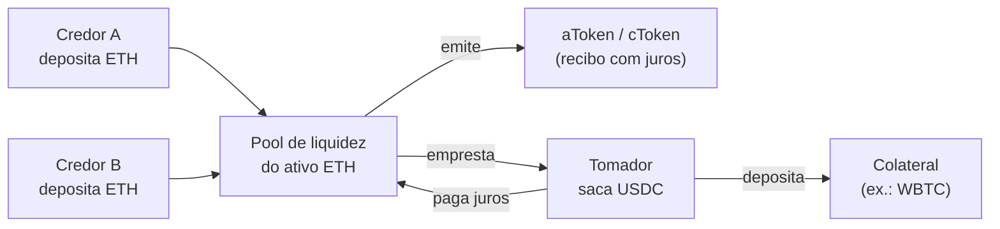
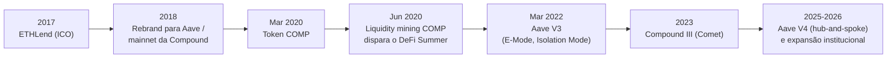

# Capítulo 12: DeFi, Protocolos de Empréstimo (Aave e Compound)

**Do swap ao empréstimo.** O capítulo anterior deste caderno explicou como os AMMs (market makers automatizados) resolveram o problema de trocar um token por outro sem depender de um livro de ofertas centralizado. Existe, porém, uma segunda necessidade financeira tão básica quanto trocar ativos: emprestar e tomar emprestado. Alguém que possui ETH parado gostaria de render juros sobre ele; alguém que precisa de liquidez em dólares digitais sem vender sua posição em ETH gostaria de tomar um empréstimo usando esse ETH como garantia. Os protocolos de empréstimo em DeFi, com destaque para Aave e Compound, resolvem esse encontro de interesses usando os mesmos ingredientes que já apareceram neste caderno: contratos inteligentes na EVM, pools compartilhados em vez de contrapartes individuais, e incentivos econômicos codificados em vez de contratos legais.

**A origem peer-to-peer que não escalou.** A história começa com a ETHLend, lançada em 2017 pelo finlandês Stani Kulechov, então estudante de direito na Universidade de Helsinki. A ideia original era simples: casar credores e tomadores de empréstimo diretamente, pessoa a pessoa, em um livro de ofertas on-chain. O modelo peer-to-peer, no entanto, esbarrava num problema de liquidez: encontrar uma contraparte disposta a exatamente aquele par de ativos, prazo e taxa era lento e pouco eficiente. Em 2018 a equipe reformulou o produto para um modelo de pool compartilhada, mais próximo do que hoje se reconhece como um mercado monetário algorítmico, e rebatizou o projeto como Aave (palavra finlandesa para "fantasma"). Nesse mesmo ano, em 27 de setembro de 2018, entrava no ar de forma independente a primeira versão da Compound, criada por Robert Leshner e Geoffrey Hayes com a mesma proposta central: um mercado monetário on-chain, sem intermediário humano, onde taxas de juros se ajustam algoritmicamente pela oferta e demanda de cada ativo.

**O modelo de pool compartilhada.** Em vez de casar um credor específico com um tomador específico, tanto Aave quanto Compound (na sua versão V2) reúnem os depósitos de todos os credores de um ativo em uma única pool. Quem deposita ETH nessa pool recebe de volta um token que representa sua participação e que acumula juros automaticamente: na Aave esse token se chama aToken (por exemplo, aETH), na Compound se chama cToken (cETH). Quem quer tomar emprestado deposita outro ativo como garantia (colateral) e saca liquidez da pool do ativo que deseja, pagando juros que fluem de volta aos credores. Como a pool nunca depende de encontrar uma contraparte exata, a liquidez fica disponível a qualquer momento, e a taxa de juros se ajusta continuamente conforme a utilização daquele mercado sobe ou desce.


*O diagrama mostra o fluxo básico de um mercado monetário em pool: credores alimentam uma pool comum e recebem um token que rende juros, enquanto tomadores bloqueiam colateral em excesso e sacam liquidez de outro ativo, pagando juros que retornam aos credores.*

**Por que sempre há garantia de sobra.** Diferente de um banco tradicional, que empresta com base em histórico de crédito e promessas legais, um protocolo DeFi não tem como processar ninguém judicialmente nem verificar identidade. A solução é a sobrecolateralização: o tomador precisa depositar um valor em garantia maior do que o valor que deseja emprestar. Se o valor da garantia cair (ou o valor da dívida subir) até um ponto de risco, qualquer participante da rede pode liquidar a posição, pagando parte da dívida em troca de parte do colateral com um desconto, o chamado bônus de liquidação. Esse mecanismo é o que protege a solvência da pool: mesmo sem confiar no tomador, o protocolo garante matematicamente que, na maioria das condições de mercado, sempre haverá colateral suficiente para cobrir os empréstimos.

**O fator de saúde.** Aave formaliza esse limite através do Health Factor (fator de saúde), um número que resume o quão perto uma posição está da liquidação. Ele é calculado como o valor do colateral elegível, ponderado pelo limite de liquidação de cada ativo, dividido pelo valor total da dívida:

```latex
\text{Health Factor} = \frac{\sum_i (\text{Colateral}_i \times \text{Liquidation Threshold}_i)}{\text{Valor total da dívida}}
```

Enquanto o fator de saúde estiver acima de 1, a posição está segura. Quando cai abaixo de 1, ela se torna elegível para liquidação parcial ou total: na Aave V3, se o fator de saúde estiver entre 0,95 e 1 e tanto o colateral quanto a dívida somarem pelo menos 2.000 dólares, até 50% da dívida pode ser liquidada de uma vez; abaixo de 0,95, ou quando colateral ou dívida ficam abaixo desse piso de 2.000 dólares, até 100% pode ser liquidado em uma única transação. Compound segue uma lógica equivalente, com seu próprio parâmetro de fator de colateralização por ativo definido pela governança.

**Juros que respondem à demanda em tempo real.** A taxa de juros cobrada dos tomadores e paga aos credores não é fixada manualmente: ela segue uma curva de utilização, definida por parâmetros que a governança de cada protocolo aprova para cada ativo. Abaixo de uma taxa de utilização "ótima" (a fração da liquidez depositada que está emprestada), os juros sobem devagar conforme mais gente toma emprestado; acima desse ponto ótimo, a inclinação da curva fica muito mais acentuada, para desincentivar rapidamente que a pool fique sem liquidez disponível para saques. Esse desenho fecha o ciclo de incentivos: quando um ativo está com utilização alta e liquidez escassa, os juros sobem, atraindo mais credores e desestimulando novos tomadores, até a pool encontrar um novo equilíbrio.

**Empréstimos relâmpago, um produto que só existe on-chain.** Um dos recursos mais originais que a Aave popularizou é o flash loan: um empréstimo sem qualquer colateral, mas que só pode existir dentro de uma única transação. Um contrato inteligente pede liquidez à pool, executa qualquer sequência de operações (por exemplo, arbitragem entre dois mercados ou reorganização de uma posição de dívida) e precisa devolver o valor emprestado mais uma taxa (0,05% na Aave, ajustável pela governança) antes do fim daquela mesma transação. Se a devolução não acontecer, a EVM reverte a transação inteira como se nada tivesse ocorrido, e o protocolo nunca fica exposto a risco de calote, porque, tecnicamente, a "dívida" e a "quitação" acontecem no mesmo bloco atômico. É um produto financeiro sem equivalente fora de um ambiente onde transações podem ser revertidas atomicamente, o que ilustra bem como a EVM (tema de um capítulo futuro deste caderno) habilita desenhos que não existiam antes dela.

**COMP e o estopim do verão DeFi.** Em março de 2020 a Compound lançou seu token de governança, o COMP, e em 15 de junho de 2020 começou a distribuí-lo automaticamente para quem emprestasse ou tomasse emprestado na plataforma, um mecanismo hoje conhecido como liquidity mining ou yield farming. O efeito foi imediato: em uma semana o valor total travado na Compound saltou de cerca de 100 milhões para mais de 1 bilhão de dólares, e o preço do COMP, que começou por volta de 30 dólares, ultrapassou 250 dólares em agosto daquele ano. Esse episódio é amplamente citado como o gatilho do "DeFi Summer", o período em que dezenas de protocolos passaram a distribuir tokens de governança como recompensa de uso, e estratégias de empréstimo recursivo (depositar, emprestar, depositar de novo) se popularizaram como forma de maximizar o rendimento anualizado.


*Linha do tempo dos marcos que levaram do empréstimo peer-to-peer original até o desenho atual de pools compartilhadas com governança on-chain.*

**Compound repensa o próprio modelo com o Comet.** A versão V2 da Compound seguia um modelo "todos para todos": qualquer ativo listado podia ser tanto depositado para render juros quanto usado como colateral quanto tomado emprestado, todos dentro do mesmo contrato. Isso criava uma superfície de risco ampla, já que uma falha de oráculo ou um ativo malicioso em qualquer canto da lista podia, em tese, ameaçar toda a pool. A versão III, apelidada de Comet, simplificou a arquitetura: cada mercado passou a ter um único ativo-base que pode ser depositado e emprestado (por exemplo, USDC, ETH ou USDT), enquanto uma lista separada de ativos serve apenas como colateral, sem render juros e sem poder ser tomado emprestado. Essa simplificação reduz a superfície de ataque de cada mercado individual, ao custo de exigir múltiplos deployments (um por ativo-base) em vez de um contrato único e mais flexível.

**Comparando as duas referências do setor.** A tabela a seguir resume as diferenças estruturais entre os desenhos atuais dos dois protocolos, sem que isso constitua qualquer recomendação de uso.

| Aspecto | Aave (V3 / V4) | Compound (III, "Comet") |
| --- | --- | --- |
| Modelo de mercado | Pool multiativo, qualquer ativo listado pode ser colateral ou ser emprestado | Um ativo-base por mercado; colateral separado, não rende juros |
| Flash loans | Sim, taxa inicial de 0,05% | Não é um recurso nativo do produto |
| Modo de eficiência | E-Mode para ativos correlacionados (ex.: stablecoins entre si) | Não existe um modo equivalente dedicado |
| Isolamento de risco | Isolation Mode limita exposição de ativos novos/voláteis | Isolamento é estrutural: cada deployment já nasce isolado por ativo-base |
| Governança | AAVE, votação on-chain via Aave DAO | COMP, votação on-chain via Compound Governance |
| Rede de origem | Ethereum, hoje multichain (inclui cadeias não EVM) | Ethereum, hoje multichain em L2s como Base e Arbitrum |
| Uso institucional | Horizon, crédito contra ativos do mundo real tokenizados | Integrações via terceiros (ex.: Morpho, Instadapp) |

**Riscos que não desaparecem só porque o código é aberto.** Sobrecolateralização e liquidação automática protegem a solvência do protocolo, mas não eliminam riscos. Um oráculo de preço manipulado ou atrasado pode fazer o protocolo avaliar mal um colateral, abrindo espaço para empréstimos mal garantidos ou liquidações injustas. Quedas bruscas e simultâneas no preço de vários ativos podem gerar uma onda de liquidações que, por si só, pressiona ainda mais o preço para baixo, um efeito em cascata. Bugs em contratos inteligentes, por mais auditados que sejam, continuam sendo o pior cenário, e a própria governança on-chain, ao decidir parâmetros como limites de liquidação e ativos aceitos, é um ponto de decisão que pode errar ou ser capturado. Nenhum desses riscos é exclusivo de Aave ou Compound: eles são inerentes a qualquer sistema de crédito que substitui confiança institucional por regras de código e incentivos econômicos. Quem acompanha esses mercados de perto costuma observar a taxa de utilização e a taxa de juros de cada pool como termômetro de estresse, um tipo de leitura que conversa com os indicadores on-chain reunidos no documento irmão deste caderno, com scripts para TradingView.

**Glossário do capítulo.**
- **aToken**: token que a Aave emite para quem deposita liquidez em uma pool, representando a posição e acumulando juros automaticamente.
- **cToken**: equivalente da Aave na Compound V2, um token de recibo que rende juros sobre o valor depositado.
- **Sobrecolateralização**: exigência de que o valor da garantia depositada supere o valor do empréstimo tomado, prática padrão nos protocolos de empréstimo em DeFi.
- **Health Factor (fator de saúde)**: métrica da Aave que mede a distância de uma posição até a liquidação; abaixo de 1, a posição pode ser liquidada.
- **Liquidation Threshold**: percentual do valor de um colateral até o qual ele pode sustentar dívida antes de a posição entrar em risco de liquidação.
- **Taxa de utilização**: fração da liquidez depositada em uma pool que está atualmente emprestada, variável central no cálculo dos juros.
- **Flash loan**: empréstimo sem colateral que precisa ser tomado e devolvido dentro de uma única transação, sob pena de a transação inteira ser revertida.
- **Comet**: nome da arquitetura da Compound III, baseada em um único ativo-base emprestável por mercado e colateral separado.
- **Liquidity mining**: distribuição de tokens de governança como recompensa por depositar ou tomar emprestado em um protocolo, prática popularizada pela Compound em 2020.
- **Isolation Mode**: recurso da Aave V3 que restringe o quanto um ativo mais novo ou volátil pode ser usado como colateral, limitando o risco que ele representa para o resto da pool.

**Fontes.**
- [Aave, Health Factor & Liquidations](https://aave.com/help/borrowing/liquidations)
- [Aave, Flash Loans, documentação oficial](https://aave.com/docs/aave-v3/guides/flash-loans)
- [Aave, Aave V3 Overview](https://aave.com/docs/aave-v3/overview)
- [Compound III, documentação oficial](https://docs.compound.finance/)
- [Compound III, Collateral and Borrowing](https://docs.compound.finance/collateral-and-borrowing/)
- [Trust Wallet, A Beginner's Guide to Compound and the COMP Token](https://trustwallet.com/blog/cryptocurrency/beginners-guide-to-compound-comp-token)
- [Cointelegraph, Aave deploys v3 on Ethereum after 10 months of testing on other networks](https://cointelegraph.com/news/aave-deploys-v3-on-ethereum-after-10-months-of-testing-on-other-networks)
- [Ethereum.org, Stani Kulechov, building Aave](https://ethereum.org/videos/stani-kulechov-building-aave)
