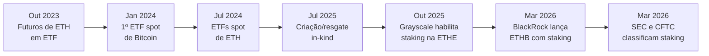
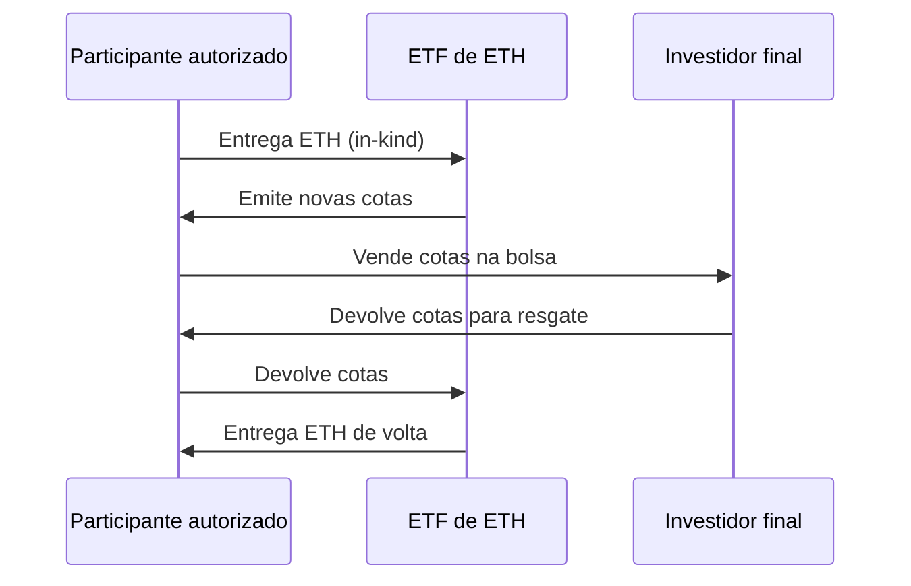

# Capítulo 13: ETFs de ETH e a entrada institucional

**De validador a linha de balanço.** Os capítulos anteriores deste caderno explicaram como uma pessoa comum pode participar diretamente do consenso da Ethereum, seja rodando um validador (Capítulo 2), seja delegando esse trabalho a um provedor de staking líquido como a Lido (Capítulo 3). Uma parte crescente e cada vez mais relevante da demanda por ETH, porém, não vem de gente disposta a lidar com chaves privadas, clientes de execução ou filas de ativação. Vem de fundos de pensão, gestoras de patrimônio, tesourarias corporativas e investidores de varejo que operam por corretoras tradicionais e que só compram o que existe dentro de uma conta de investimentos comum, com CNPJ ou CPF, sem nunca tocar uma carteira on-chain. Para esse público, o produto que abriu a porta chama-se ETF, e este capítulo conta como ele chegou à Ethereum, como funciona por dentro e o que muda quando staking (o mesmo staking do Capítulo 2) passa a acontecer dentro de um invólucro regulado por reguladores de valores mobiliários.

**O que é um ETF, em uma frase.** ETF é a sigla de exchange-traded fund, um fundo negociado em bolsa cujas cotas sobem e descem de preço ao longo do dia, como uma ação qualquer, mas cujo valor deriva de um ativo ou uma cesta de ativos que o fundo mantém por trás. Um ETF "spot" de ETH é o desenho mais direto possível: o fundo compra e guarda Ether de verdade, com um custodiante qualificado responsável pela guarda das chaves, e cada cota emitida corresponde a uma fração daquele ETH. Isso é diferente de um ETF baseado em contratos futuros, que não guarda o ativo em si, mas posições em derivativos que tentam acompanhar o preço à vista com menor fidelidade e um custo estrutural chamado de rolagem, cobrado toda vez que um contrato futuro perto do vencimento precisa ser trocado por outro mais distante.

**O caminho até o produto de verdade.** O primeiro contato do investidor americano com ETH via ETF não foi direto. Em 2 de outubro de 2023, nove fundos baseados em futuros de ETH estrearam nas bolsas dos Estados Unidos, lançados por gestoras como ProShares, VanEck e Bitwise, usando contratos futuros negociados na CME. Esse produto serviu de ensaio regulatório, mas o salto de verdade veio depois: em janeiro de 2024 a SEC aprovou os primeiros ETFs spot de Bitcoin, e essa aprovação abriu caminho para o mesmo debate em torno do ETH. Em maio de 2024 a SEC aprovou os formulários 19b-4 que autorizavam as bolsas a listar ETFs spot de ETH, e em 22 de julho de 2024 declarou efetivos os registros que faltavam para que nove desses fundos, de gestoras como BlackRock, Fidelity, Bitwise, VanEck, Franklin Templeton e Grayscale, começassem a negociar no dia seguinte, 23 de julho de 2024.

**O caso particular da Grayscale.** Entre os nove fundos que estrearam naquele julho, um já existia havia anos sob outra forma. A Grayscale Ethereum Trust foi lançada em 2019 como um fundo fechado, sem mecanismo de resgate, cujas cotas chegavam a negociar com ágio ou deságio relevante em relação ao valor do ETH que guardava, um problema estrutural de fundos fechados que só um mecanismo de criação e resgate contínuo resolve de verdade. Em outubro de 2023 a Grayscale entrou com o pedido formal de converter esse trust em um ETF de verdade, e a conversão se tornou efetiva junto com o restante do grupo, em julho de 2024, sob o ticker ETHE e uma taxa de administração de 2,5% ao ano, bem acima da média do setor. Para atender o público mais sensível a custo, a gestora também lançou, na mesma época, um "mini trust" com o ticker ETH, cobrando 0,15% ao ano, hoje uma das taxas mais baixas entre todos os concorrentes.

*A linha do tempo mostra como o produto evoluiu em menos de três anos: de um derivativo futuro para um fundo que guarda ETH de verdade, depois para um fundo que também faz staking desse ETH.*

**Como uma cota nasce e morre.** Um ETF spot não fabrica cotas do nada nem as destrói por decreto: quem faz esse trabalho são os chamados participantes autorizados (authorized participants, ou APs), instituições financeiras credenciadas que têm o direito exclusivo de negociar diretamente com o fundo, fora da bolsa. Quando a demanda por cotas do ETF supera a oferta disponível no mercado secundário, um AP entrega ETH ao fundo e recebe de volta um lote novo de cotas para vender aos investidores finais; quando acontece o oposto, o AP devolve cotas ao fundo e recebe ETH em troca, retirando aquelas cotas de circulação. Até meados de 2025, a SEC só permitia esse processo em dinheiro (o AP entregava ou recebia dólares, e era o próprio fundo que comprava ou vendia o ETH no mercado aberto), um desenho mais custoso e menos eficiente do que o usado pela imensa maioria dos ETFs de commodities tradicionais. Em 29 de julho de 2025 a SEC autorizou a criação e o resgate "in-kind" (em espécie) para os ETFs de Bitcoin e Ether, permitindo que o próprio ETH circule diretamente entre o AP e o fundo, sem passar por dinheiro no meio do caminho, o que reduz custos de transação, encolhe o risco de descolamento entre o preço da cota e o valor do ETH que ela representa, e alinha esses fundos ao mesmo mecanismo usado por ETFs de ouro havia décadas.

*O diagrama mostra o ciclo de criação e resgate em espécie: o participante autorizado é o único elo que troca ETH de verdade por cotas do fundo, e é essa troca constante que mantém o preço da cota colado ao valor do ETH que ela representa.*

**A virada do staking.** Guardar ETH parado num cofre custodiado é deixar dinheiro na mesa, porque a rede paga uma recompensa a quem coloca esse ETH para validar blocos, como o Capítulo 2 já detalhou. A pergunta óbvia, "por que não colocar o ETH do próprio ETF para fazer staking e repassar o rendimento ao cotista", esbarrava numa dúvida regulatória sobre se essa recompensa configuraria um retorno de investimento sujeito a regras mais rígidas de valor mobiliário. A Grayscale foi a primeira a testar essa fronteira, habilitando staking na ETHE em outubro de 2025 e realizando, em 5 de janeiro de 2026, a primeira distribuição de recompensas de staking a cotistas de um ETP de cripto nos Estados Unidos. A BlackRock seguiu em 12 de março de 2026, lançando a iShares Staked Ethereum Trust ETF (ticker ETHB) já nascendo com staking nativo. Poucos dias depois, em 17 de março de 2026, a SEC e a CFTC publicaram um comunicado interpretativo conjunto classificando recompensas de staking como não sendo, por si só, um valor mobiliário, formalizando por escrito o que os primeiros fundos já vinham fazendo na prática. Esse movimento abriu caminho para uma safa de pedidos parecidos de outras gestoras, com expectativa de aprovações ao longo do segundo trimestre de 2026.

**Como o staking acontece por dentro do fundo.** Um ETF com staking não abre uma conta de validador para cada cotista: ele concentra o ETH de todos num conjunto de validadores próprios, geridos por operadores especializados contratados pela gestora, tipicamente reunindo lotes de 32 ETH (o tamanho mínimo de um validador, explicado no Capítulo 2) em múltiplos de 2.048 ETH por operação, o suficiente para formar dezenas de validadores de uma vez. A ETHB, por exemplo, usa a Coinbase Custody Trust Company como custodiante do ETH e distribui a operação dos validadores entre mais de um operador, incluindo Coinbase Prime, Figment, Galaxy Digital e Attestant, uma diversificação deliberada: se um único operador cometer uma falha grave o suficiente para sofrer slashing (a penalidade descrita no Capítulo 2), o impacto fica restrito à fatia de ETH sob aquele operador específico, e não ao fundo inteiro. Ainda assim, um evento de slashing em qualquer parte da operação reduz o saldo efetivo daquele validador e, por consequência direta, o valor patrimonial líquido (NAV) do fundo, um risco que o cotista de um ETF carrega mesmo sem nunca ter escolhido pessoalmente qual operador usar.

**A fila que voltou a encher.** O mesmo mecanismo de fila de ativação de validadores explicado no Capítulo 2, que limita quanto novo ETH pode começar a participar do consenso por época, virou um gargalo real assim que os ETFs com staking passaram a competir por essa vaga junto com tesourarias corporativas e usuários comuns. Entre janeiro e maio de 2026, a fila de ativação saltou de perto de zero para mais de 3,5 milhões de ETH, um volume que, em períodos de pico, pode levar dias ou semanas para ser absorvido pelo protocolo. O detalhe importante para quem segura uma cota de um desses fundos é que, enquanto o ETH depositado num ETF espera nessa fila, ele ainda não está de fato validando blocos e, portanto, não rende nada: o fundo pode anunciar staking habilitado e mesmo assim entregar, num determinado mês, um rendimento efetivo abaixo do esperado, simplesmente porque uma fatia relevante do ETH sob custódia ainda estava na fila.

**Quanto isso rende, na prática.** As recompensas brutas de staking na rede Ethereum giravam, ao longo de 2026, numa faixa de aproximadamente 3,1% a 3,3% ao ano. Depois de descontadas as taxas de administração do fundo e os custos de operação dos validadores, o rendimento líquido que efetivamente chega ao cotista de um ETF com staking fica tipicamente entre 1,9% e 2,6% ao ano, uma diferença que varia de gestora para gestora conforme a taxa cobrada e a eficiência do operador de validadores escolhido.

**Comparando o custo dos principais fundos.** A tabela a seguir reúne, sem qualquer recomendação de compra, as taxas de administração anunciadas pelos principais ETFs spot de ETH disponíveis nos Estados Unidos, lembrando que promoções de taxa zero ou reduzida por tempo limitado ou até certo volume de ativos foram comuns nos primeiros meses de vários desses fundos.

| Gestora | Ticker | Taxa de administração | Staking nativo |
| --- | --- | --- | --- |
| BlackRock (iShares) | ETHA | 0,25% | Não |
| BlackRock (iShares) | ETHB | Staking habilitado | Sim |
| Fidelity | FETH | 0,25% | Não |
| Bitwise | ETHW | 0,20% | Não |
| VanEck | ETHV | 0,20% | Não |
| Franklin Templeton | EZET | 0,19% | Não |
| Grayscale | ETHE | 2,50% | Sim (desde out/2025) |
| Grayscale Mini Trust | ETH | 0,15% | Não |

**Uma segunda rota institucional, fora do ETF.** Nem toda empresa que quer exposição a ETH passa por um fundo regulado. Desde 2025, um punhado de companhias de capital aberto adotou o modelo de "tesouraria de ativo digital" (digital asset treasury, ou DAT), comprando ETH diretamente para o balanço da empresa e financiando essas compras com emissão de ações ou dívida, o mesmo caminho que a Strategy (antiga MicroStrategy) popularizou com Bitcoin anos antes. A BitMine Immersion Technologies se tornou a maior tesouraria corporativa de ETH do mundo, acumulando quase 6 milhões de ETH e anunciando a MAVAN (Made-in-America VAlidator Network), sua própria infraestrutura de staking dedicada. A SharpLink Gaming ocupa a segunda posição nesse ranking e, em 2026, passou a enfatizar disciplina e diversificação de estratégias de rendimento on-chain, inclusive por meio de uma parceria com a Galaxy Digital, em vez de simplesmente acumular ETH pelo volume. Para o investidor final, comprar ação da BitMine ou da SharpLink na bolsa é, na prática, uma terceira forma de ganhar exposição a ETH sem tocar numa carteira, com uma diferença importante em relação ao ETF: o preço da ação carrega também o risco de execução, de alavancagem e de governança da própria empresa, não só a variação do ETH.

| Rota de exposição | Quem guarda o ETH | Rende staking? | Exemplo |
| --- | --- | --- | --- |
| ETF de futuros | Nenhum ETH real, só contratos | Não | ProShares (2023) |
| ETF spot sem staking | Custodiante do fundo | Não | ETHA, FETH |
| ETF spot com staking | Custodiante + operadores de validador | Sim | ETHB, ETHE |
| Tesouraria corporativa (DAT) | A própria empresa, on-chain | Depende da estratégia | BitMine, SharpLink |
| Staking direto ou líquido | O próprio investidor ou um protocolo como a Lido | Sim | Capítulo 3 deste caderno |

**O que continua incerto.** A aprovação dos ETFs de ETH sempre dependeu de uma classificação regulatória específica, a de que o ETH negociado nesses fundos é tratado como uma commodity, não como um valor mobiliário, decisão que veio por meio de atos da SEC e não de uma lei aprovada pelo Congresso. O projeto de lei que tentava fixar essa divisão de forma permanente, o chamado CLARITY Act, avançou na Câmara dos Representantes em 2025 mas travou no Senado: em 15 de setembro de 2026 uma moção de encerramento de debate sobre o texto foi rejeitada por 49 votos a 50, deixando pendentes pontos como restrições a conflitos de interesse de autoridades do governo e uma disputa entre bancos e emissores de stablecoin sobre pagamento de juros. Enquanto esse arcabouço legal mais amplo não é resolvido, o mercado de ETFs de ETH segue operando sobre uma base regulatória construída por decisões administrativas, o que deixa margem, ainda que pequena na prática observada até aqui, para que uma futura composição da SEC revise entendimentos hoje consolidados.

**Os riscos que o invólucro não elimina.** Comprar uma cota de ETF resolve o problema de custódia pessoal, mas não elimina risco, apenas o transforma em outro tipo. O cotista depende inteiramente da idoneidade do custodiante e dos operadores de validador escolhidos pela gestora, sem controle sobre qual deles é usado. A cota pode negociar com um pequeno prêmio ou deságio em relação ao valor real do ETH por trás dela, especialmente em momentos de estresse de mercado, ainda que a criação e o resgate in-kind tenham reduzido bastante esse problema em relação ao desenho original de 2024. Um evento de slashing em algum dos validadores do fundo reduz o NAV de forma direta e mensurável. E, como qualquer produto cujo valor deriva do preço do ETH, o ETF carrega toda a volatilidade do ativo subjacente, sem qualquer proteção adicional contra queda de preço. Nada disso é peculiar à Ethereum: são os mesmos riscos estruturais discutidos a propósito do restaking no Capítulo 4 e dos protocolos de empréstimo no Capítulo 12, agora embrulhados num formato familiar ao investidor tradicional.

**Glossário do capítulo.**
- **ETF (Exchange-Traded Fund)**: fundo negociado em bolsa cujas cotas sobem e descem de preço ao longo do dia, referenciado a um ativo ou uma cesta de ativos.
- **ETF spot**: ETF que guarda o próprio ativo subjacente (neste caso, ETH de verdade), em vez de contratos futuros sobre ele.
- **Participante autorizado (AP)**: instituição financeira credenciada com o direito exclusivo de criar e resgatar cotas diretamente com um ETF, fora da bolsa.
- **Criação/resgate in-kind**: mecanismo em que o ativo real (ETH) circula diretamente entre o participante autorizado e o fundo, sem passar por dinheiro no meio do caminho.
- **Custodiante qualificado**: instituição responsável pela guarda segura das chaves e dos ativos de um ETF, sujeita a exigências regulatórias específicas.
- **NAV (valor patrimonial líquido)**: valor de mercado dos ativos de um fundo dividido pelo número de cotas em circulação, referência para saber se a cota negocia com prêmio ou deságio.
- **DAT (Digital Asset Treasury)**: empresa de capital aberto que adota um ativo digital como reserva principal de tesouraria, financiando compras via emissão de ações ou dívida.
- **Formulário 19b-4**: documento que uma bolsa dos Estados Unidos apresenta à SEC para pedir autorização de listar um novo produto financeiro.
- **Fila de ativação de validadores**: mecanismo do protocolo, descrito no Capítulo 2, que limita quanto ETH novo pode começar a validar por época, virou gargalo com a chegada dos ETFs com staking.

**Fontes.**
- [SEC Approves Spot Ether ETFs — Troutman Pepper Locke](https://www.troutman.com/insights/sec-approves-spot-ether-etfs/)
- [Ethereum ETFs Approved by SEC — CoinDesk](https://www.coindesk.com/business/2024/07/22/sec-approves-spot-ethereum-etfs)
- [Grayscale Moves to Convert Its Ethereum Trust to a Spot ETH ETF — CoinDesk](https://www.coindesk.com/business/2023/10/02/grayscale-moves-to-convert-its-ethereum-trust-to-a-spot-eth-etf)
- [Ether futures ETFs hit the market — CNBC](https://www.cnbc.com/2023/10/02/ether-futures-etfs-debut-as-sec-mulls-next-steps-on-bitcoin-fund.html)
- [SEC Approves In-Kind Creations and Redemptions for Crypto Asset ETPs — Dechert](https://www.dechert.com/knowledge/onpoint/2025/8/sec-approves-in-kind-creations-and-redemptions-for-crypto-asset-.html)
- [Staking goes mainstream: what 2026 could look like for ether (ETH) investors — CoinDesk](https://www.coindesk.com/markets/2026/01/07/staking-goes-mainstream-what-2026-could-look-like-for-ether-investors)
- [Ethereum Staking ETFs for Institutions: Full Guide 2026 — Everstake](https://everstake.com/resources/blog/ethereum-staking-etfs-for-institutions)
- [iShares Staked Ethereum Trust ETF | ETHB — BlackRock/iShares](https://www.ishares.com/us/products/348532/ishares-staked-ethereum-trust-etf)
- [Ethereum Slashing Explained: Validator Risk for Institutions — P2P.org](https://p2p.org/economy/ethereum-slashing-explained-what-custodians-funds-exchanges-must-know/)
- [Ethereum Staking in 2026: Yield Trends, Validator Queue Dynamics, and MEV Impact — KuCoin](https://www.kucoin.com/blog/ethereum-staking-in-2026-yield-trends-validator-queue-dynamics-and-mev-impact-exlained)
- [9 Spot Ethereum ETF Fees Announced — Bitget News](https://www.bitget.com/news/detail/12560604103379)
- [Ethereum ETFs 2026: Complete List, Fees & Staking Yield Compared — InvestSnips](https://investsnips.com/ethereum-etfs/)
- [BitMine, the largest ethereum treasury firm, will slow down pace of accumulation — Sherwood News](https://sherwood.news/crypto/largest-ethereum-treasury-firm-bitmine-slow-down-accumulation-pace/)
- [SharpLink aims to be the most focused, disciplined — Yahoo Finance](https://finance.yahoo.com/news/sharplink-aims-most-focused-disciplined-170103918.html)
- [Senate cloture vote on Clarity Act fails, dealing regulatory blow to crypto industry — CNBC](https://www.cnbc.com/2026/09/15/senate-cloture-vote-on-clarity-act-fails-dealing-regulatory-setback-to-crypto-industry.html)
- [The Facts: The CLARITY Act — US Senate Committee on Banking, Housing, and Urban Affairs](https://www.banking.senate.gov/newsroom/majority/the-facts-the-clarity-act)
