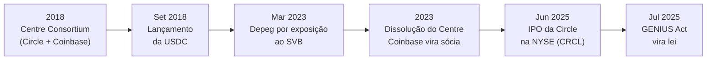
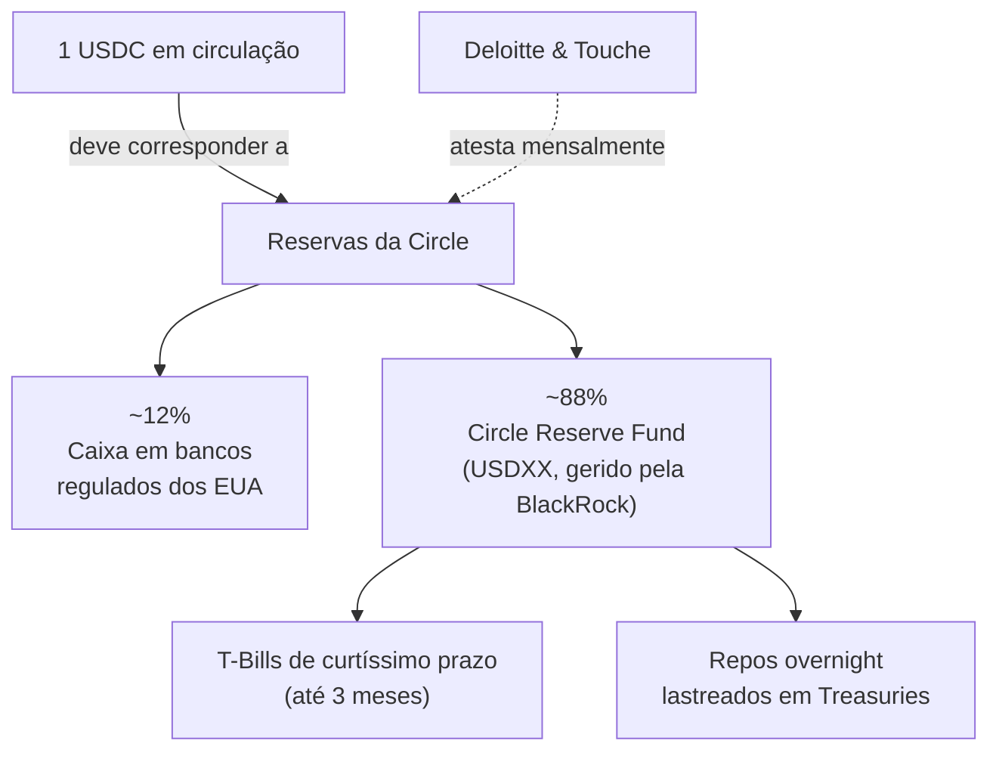

# Capítulo 14: Stablecoins, USDC e o Lastro em Dólar

**O problema que a stablecoin resolve.** Os capítulos anteriores deste caderno trataram o ETH como ativo de reserva, colateral e objeto de investimento institucional (Capítulo 13), mas quase todo o DeFi descrito nos Capítulos 11 e 12, das pools de liquidez aos protocolos de empréstimo, depende de um ingrediente que não é volátil: uma unidade de conta que vale, na prática, um dólar americano, todos os dias, independentemente do que aconteça com o preço do ETH ou do BTC. Sem esse ingrediente, alguém que quisesse apenas guardar valor sem se expor à variação de preço de um ativo cripto teria que sacar para uma conta bancária tradicional a cada operação, perdendo a velocidade e a composabilidade que tornam o Ethereum útil como infraestrutura financeira. As stablecoins lastreadas em dólar nasceram para preencher exatamente essa lacuna, e a USDC, emitida pela empresa americana Circle, é hoje a segunda maior do mundo nesse mercado, atrás apenas da USDT (Tether), com uma proposta de valor construída em torno de transparência regulatória mais do que em escala pura.

**Como nasceu a USDC.** Em 2018 a Circle e a Coinbase se uniram para fundar o Centre Consortium, uma organização criada especificamente para desenhar o padrão técnico e o modelo de governança de uma stablecoin lastreada em dólar emitida na Ethereum como um token ERC-20 comum (o mesmo padrão de token explicado em um capítulo futuro deste caderno). A USDC foi lançada em setembro de 2018 sob esse consórcio. Em 2023 a Circle e a Coinbase decidiram dissolver o Centre Consortium, transferindo toda a governança e a responsabilidade operacional da USDC exclusivamente para a Circle, ao mesmo tempo em que a Coinbase passou a deter uma participação acionária na Circle, um arranjo que aprofundou o alinhamento comercial entre as duas empresas em vez de encerrá-lo.

**O acordo de receita que poucos usuários conhecem.** Uma parte pouco visível do modelo de negócio da USDC é a divisão dos juros que o lastro em Treasuries gera. Desde agosto de 2023, a Circle repassa à Coinbase 100% da receita de reserva gerada pela USDC que fica depositada na própria Coinbase, mais 50% da receita residual gerada pela USDC que circula em qualquer outro lugar, depois de descontada a fatia da própria Circle e de outros parceiros de distribuição. Esse acordo foi renovado em agosto de 2026 nos mesmos termos originais, e ajuda a explicar por que a Coinbase tem um incentivo comercial direto em fazer a USDC crescer: em 2024, de 1,01 bilhão de dólares em custos de distribuição pagos pela Circle, 908 milhões foram parar exatamente na Coinbase.

**Circle vira empresa de capital aberto.** Em 5 de junho de 2025 a Circle Internet Group estreou na Bolsa de Nova York sob o ticker CRCL, precificando sua oferta pública inicial a 31 dólares por ação e levantando 1,1 bilhão de dólares com a venda de 34 milhões de ações. A ação abriu a 69 dólares e fechou o primeiro dia de negociação a 83,23 dólares, uma valorização de 168% sobre o preço de lançamento, um dos debuts mais fortes do ano em Wall Street e um sinal de apetite do mercado tradicional por um emissor de stablecoin regulado.


*A linha do tempo mostra como a USDC passou de projeto conjunto de duas empresas privadas para ativo de uma companhia de capital aberto operando sob uma lei federal específica para stablecoins.*

**O que garante que uma USDC vale um dólar.** A USDC não tem valor por decreto nem por um algoritmo que ajusta oferta e demanda: ela vale um dólar porque a Circle promete resgatar cada token por um dólar de verdade, e sustenta essa promessa mantendo reservas equivalentes ao total de USDC em circulação. Ao fim de 2025, cerca de 88% dessas reservas ficavam concentradas no Circle Reserve Fund (ticker USDXX), um fundo de mercado monetário do governo registrado na SEC, administrado pela BlackRock e disponível como veículo exclusivo da Circle, que aplica em títulos do Tesouro americano de curtíssimo prazo (até três meses de vencimento) e operações compromissadas overnight lastreadas nesses mesmos títulos. O restante das reservas fica em dinheiro depositado diretamente em bancos regulados dos Estados Unidos. Esse desenho é bem diferente de uma stablecoin sobrecolateralizada por cripto como a DAI, tema do próximo capítulo deste caderno: aqui o lastro é, na prática, uma cesta conservadora de ativos do sistema financeiro tradicional, não outro ativo digital volátil.


*O diagrama mostra a composição das reservas que sustentam o lastro da USDC e o papel da auditoria externa em verificar essa correspondência todo mês.*

**A verificação por fora.** Desde 2023 a Circle publica, todo mês, uma atestação assinada pela Deloitte & Touche LLP confirmando que o valor das reservas é igual ou maior do que o total de USDC em circulação naquela data. É importante entender o que esse documento é e o que não é: trata-se de um relatório de procedimentos previamente acordados (agreed-upon procedures), que verifica pontualmente o total e a composição das reservas em uma data específica, e não uma auditoria completa e contínua das operações da empresa, uma distinção técnica relevante para quem lê esses relatórios como garantia de solvência. Ainda assim, essa cadência mensal e a concentração das reservas quase inteiramente em caixa e títulos públicos de curtíssimo prazo colocam a USDC em um patamar de transparência que o mercado costuma considerar superior ao da sua principal concorrente, a USDT, cujas reservas incluem uma fatia de empréstimos garantidos e outros instrumentos, e cujas atestações vêm em cadência trimestral por uma firma diferente.

| Aspecto | USDC (Circle) | USDT (Tether) |
| --- | --- | --- |
| Emissor | Circle Internet Group (capital aberto, NYSE: CRCL) | Tether Limited (capital fechado) |
| Cadência de atestação | Mensal | Trimestral |
| Firma responsável pela atestação | Deloitte & Touche LLP | BDO Italia |
| Composição típica das reservas | Caixa + Circle Reserve Fund (T-Bills e repos) | Caixa, T-Bills, além de empréstimos garantidos e outros ativos |
| Fatia aproximada do mercado de stablecoins | Cerca de 27% | Cerca de 67% |
| Base regulatória principal | GENIUS Act (EUA), MiCA (União Europeia) | Predominantemente offshore |

**A fórmula por trás do lastro.** O compromisso central de qualquer stablecoin fiduciária pode ser resumido numa desigualdade simples que a atestação mensal existe para verificar:

```latex
\text{Valor de mercado das reservas} \geq \text{Total de USDC em circulação} \times 1\text{ USD}
```

Quando essa desigualdade deixa de valer, mesmo que temporariamente, o mercado tem motivo concreto para desconfiar de que um resgate não será honrado à taxa de um para um, e é exatamente esse tipo de dúvida que provoca uma quebra de paridade (depeg).

**Quando a paridade quebrou de verdade.** O teste mais severo já sofrido pela USDC aconteceu em 11 de março de 2023, quando a Circle revelou que 3,3 bilhões de dólares de suas reservas, de um total então em torno de 40 bilhões, estavam depositados no Silicon Valley Bank, instituição que havia acabado de ser fechada por reguladores americanos. A notícia gerou uma corrida de resgates e vendas no mercado secundário, derrubando o preço da USDC até 0,87 dólar durante a madrugada de 11 de março, um desvio severo para um ativo desenhado para nunca sair de um dólar. A paridade só foi restaurada depois que reguladores federais anunciaram, no domingo seguinte, que todos os depositantes do SVB seriam ressarcidos integralmente, e a Circle reafirmou publicamente que cobriria qualquer eventual diferença com capital próprio caso o resgate dos fundos não se completasse. O episódio se tornou o exemplo mais citado de como o risco de uma stablecoin fiduciária não é o risco do próprio token, mas o risco de contraparte dos bancos e instituições onde as reservas efetivamente ficam guardadas.

**O poder de congelar, e por que ele existe.** Diferente de ETH ou de um bitcoin, cujo protocolo não tem mecanismo nativo para impedir uma transação específica, o contrato inteligente da USDC inclui uma função de blacklist que a Circle pode acionar para congelar endereços específicos, impedindo que aquele endereço envie ou receba USDC. A Circle descreve essa capacidade como reservada a ordens judiciais, determinações de aplicação da lei ou situações de fraude e roubo comprovado, e não como uma ferramenta de uso discricionário cotidiano. Esse desenho gerou controvérsia concreta em 2026: em abril, depois de um roubo de 285 milhões de dólares no protocolo Drift, parte do público criticou a Circle por não congelar mais rapidamente os fundos roubados enquanto o atacante os transferia entre blockchains usando o Cross-Chain Transfer Protocol (CCTP), o próprio mecanismo da Circle para mover USDC nativamente entre redes sem passar por uma ponte de terceiros; em maio, a Circle bloqueou um contrato inteligente da Zama, projeto de computação confidencial, retendo 12,6 milhões de dólares em fundos de usuários e reacendendo o debate sobre até que ponto uma stablecoin emitida por uma empresa centralizada pode ser chamada de neutra ou resistente a censura. Esse tipo de tensão entre conveniência regulatória e credibilidade neutra é o mesmo pano de fundo que aparece, em outro contexto, na discussão sobre validadores e slashing do Capítulo 2.

**A lei que formalizou as regras do jogo.** Até 2025, o arcabouço regulatório para stablecoins nos Estados Unidos era construído por interpretações administrativas e por regras estaduais divergentes. Isso mudou em 18 de julho de 2025, quando o presidente Donald Trump sancionou o GENIUS Act (Guiding and Establishing National Innovation for U.S. Stablecoins Act), a primeira legislação federal americana dedicada especificamente a stablecoins de pagamento. A lei exige que todo emissor mantenha reservas líquidas de pelo menos um dólar para cada um dólar de token emitido, compostas por dinheiro ou títulos públicos de curtíssimo prazo, publique a composição dessas reservas mensalmente, e restringe quem pode emitir uma stablecoin de pagamento a subsidiárias de instituições depositárias seguradas ou a emissores qualificados em nível federal ou estadual. A lei também proíbe qualquer emissor de sugerir que seu token é garantido pelo governo americano ou tem seguro federal de depósito, e exige capacidade técnica de congelar, queimar ou apreender tokens mediante ordem legal, uma exigência que a USDC já cumpria na prática antes mesmo da lei existir. A data de vigência efetiva é a mais próxima entre 18 de janeiro de 2027 e 120 dias após a publicação das regras de implementação pelos reguladores bancários federais.

**Onde a USDC realmente circula.** Embora tenha nascido como um token ERC-20 na Ethereum, a USDC hoje é uma stablecoin nativamente multichain, emitida diretamente (não via ponte de terceiros) em mais de uma dezena de redes. Em setembro de 2026, com uma oferta em circulação em torno de 75 bilhões de dólares, a Ethereum concentrava a maior fatia, cerca de 36 bilhões, seguida por redes como Solana e pela Base (Capítulo 8), a L2 da Coinbase, o que ilustra como o mesmo dólar tokenizado passou a fluir livremente entre a camada base da Ethereum e suas L2s, um movimento que conversa diretamente com a proposta de escala em camadas discutida no Capítulo 5. Boa parte da liquidez entre USDC e outras stablecoins como a DAI é hoje intermediada por pools de baixa derrapagem como as da Curve, mencionadas no Capítulo 11, desenhadas especificamente para trocas entre ativos que deveriam valer o mesmo.

| Rede | USDC em circulação (aprox., set/2026) |
| --- | --- |
| Ethereum | ~36 bilhões de dólares |
| Solana | ~8,4 bilhões de dólares |
| Base | ~3,8 bilhões de dólares |
| Demais redes suportadas | Restante da oferta total de ~75 bilhões |

**Glossário do capítulo.**
- **Stablecoin fiduciária**: token cujo valor é atrelado a uma moeda tradicional (aqui, o dólar) através de reservas mantidas fora da blockchain, em contraste com uma stablecoin colateralizada por cripto.
- **Centre Consortium**: organização criada por Circle e Coinbase em 2018 para governar o padrão técnico da USDC, dissolvida em 2023.
- **Circle Reserve Fund (USDXX)**: fundo de mercado monetário do governo, registrado na SEC e administrado pela BlackRock, que concentra a maior parte das reservas da USDC em títulos do Tesouro de curtíssimo prazo.
- **Atestação de reservas**: relatório periódico de uma firma de auditoria externa (hoje a Deloitte, mensalmente) confirmando que o valor das reservas cobre o total de USDC em circulação.
- **Depeg**: episódio em que o preço de mercado de uma stablecoin se afasta do valor de referência que ela deveria manter, como o dólar no caso da USDC.
- **GENIUS Act**: lei federal americana de 2025 que estabelece exigências de reserva, transparência e elegibilidade para emissores de stablecoins de pagamento.
- **Blacklist (função de congelamento)**: mecanismo embutido no contrato inteligente da USDC que permite à Circle bloquear um endereço específico de enviar ou receber tokens.
- **CCTP (Cross-Chain Transfer Protocol)**: protocolo da própria Circle para queimar USDC em uma rede e emitir a mesma quantia nativamente em outra, sem depender de uma ponte de terceiros.
- **ERC-20**: padrão de token da Ethereum usado pela USDC, detalhado em um capítulo futuro deste caderno.

**Fontes.**
- [USDC | Powering global finance. Issued by Circle.](https://www.circle.com/usdc)
- [Circle & Coinbase Join Forces to Found the CENTRE Consortium — Circle](https://www.circle.com/blog/coinbase-and-circle-co-found-the-centre-consortium)
- [Coinbase Acquires Stake in Circle, Dissolving USDC Issuer Centre — Decrypt](https://decrypt.co/153229/coinbase-buys-stake-circle-dissolving-usdc-centre)
- [Circle Announces Pricing of Upsized Initial Public Offering — Circle Investor Relations](https://investor.circle.com/news/news-details/2025/Circle-Announces-Pricing-of-Upsized-Initial-Public-Offering/default.aspx)
- [Stablecoin issuer Circle prices IPO at $31 per share — CNBC](https://www.cnbc.com/2025/06/04/stablecoin-issuer-circle-prices-ipo-at-31-above-expected-range-ahead-of-nyse-debut.html)
- [Circle IPO News: Circle (CRCL) Debuts on NYSE — CoinDesk](https://www.coindesk.com/markets/2025/06/05/circle-shares-open-at-69-on-nyse-debut-signaling-strong-appetite-for-stablecoin-issuers)
- [Coinbase Takes 50% Share of Circle's Residual USDC Reserve Revenue — Decrypt](https://decrypt.co/312757/coinbase-circles-residual-usdc-reserve-revenue-filing)
- [Circle Renews USDC Revenue-Sharing Agreement with Coinbase Through 2029 — KuCoin](https://www.kucoin.com/blog/circle-renews-usdc-revenue-sharing-agreement-with-coinbase-through-2029)
- [How the USDC Reserve is Structured and Managed — Circle](https://www.circle.com/blog/how-the-usdc-reserve-is-structured-and-managed)
- [BlackRock Debuts Circle Reserve Fund, Treasury MF for USDC Stablecoin — Crane Data](https://cranedata.com/archives/all-articles/9546/)
- [New Levels of Detail in the Monthly USDC Attestation — Circle](https://www.circle.com/blog/new-levels-of-detail-in-the-monthly-usdc-attestation)
- [Stablecoin USDC breaks dollar peg after revealing $3.3 billion Silicon Valley Bank exposure — CNN Business](https://www.cnn.com/2023/03/11/business/stablecoin-circle-silicon-valley-bank)
- [USDC Stablecoin Regains Dollar Peg After Silicon Valley Bank-Induced Chaos — CoinDesk](https://www.coindesk.com/business/2023/03/13/usdc-stablecoin-regains-dollar-peg-after-silicon-valley-bank-induced-chaos)
- [Circle under fire after $285 million Drift hack over inaction to freeze stolen USDC — CoinDesk](https://www.coindesk.com/business/2026/04/03/circle-under-fire-after-usd285-million-drift-hack-over-inaction-to-freeze-stolen-usdc)
- [Circle Blocks Zama Confidential USDC Contract Freezing $12.6M in User Funds — Crypto Times](https://www.cryptotimes.io/2026/05/30/circle-blocks-zama-confidential-usdc-contract-freezing-12-6m/)
- [The GENIUS Act: A Framework for U.S. Stablecoin Issuance — Sidley Austin LLP](https://www.sidley.com/en/insights/newsupdates/2025/07/the-genius-act-a-framework-for-us-stablecoin-issuance)
- [Fact Sheet: President Donald J. Trump Signs GENIUS Act into Law — The White House](https://www.whitehouse.gov/fact-sheets/2025/07/fact-sheet-president-donald-j-trump-signs-genius-act-into-law/)
- [The GENIUS Act Becomes Law: Key Provisions — Covington & Burling LLP](https://www.cov.com/news-and-insights/insights/2025/07/the-genius-act-becomes-law-key-provisions-from-the-federal-stablecoin-regulatory-framework)
- [USDC stablecoin supply surpasses all-time high, topping $60 billion market cap — The Block](https://www.theblock.co/post/348161/usdc-stablecoin-supply-surpasses-all-time-high-topping-60-billion-market-cap)
- [Solana Stablecoin Supply Hits $17.3B All-Time High as USDC and USDT Issuance — Solana Compass](https://solanacompass.com/news/solana-stablecoin-supply-hits-new-all-time-high-of-173b)
- [USDT vs. USDC: Which Will Win the Stablecoin Race? — The Motley Fool](https://www.fool.com/investing/2026/03/27/usdt-vs-usdc-which-will-win-the-stablecoin-race/)
- [USDC vs USDT: Reserves, Chains, Fees, and When to Use Each — Eco](https://eco.com/support/en/articles/14856099-usdc-vs-usdt-reserves-chains-fees-and-when-to-use-each)
