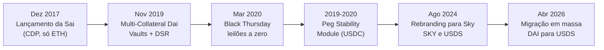
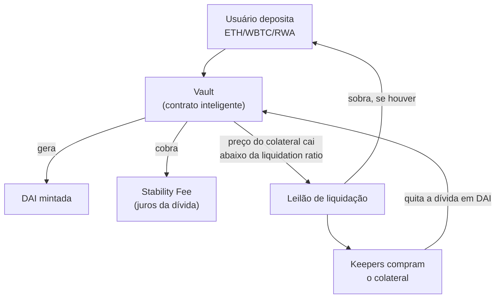
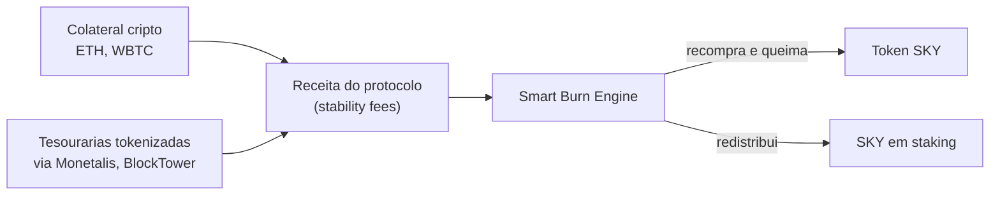

# Capítulo 15: Stablecoins, DAI e a Colateralização Cripto

**Um jeito diferente de valer um dólar.** O Capítulo 14 explicou como a USDC mantém sua paridade com o dólar: a Circle guarda, fora da blockchain, reservas em caixa e títulos do Tesouro americano equivalentes a cada token emitido, e resgata um por um mediante confiança em uma empresa regulada. A DAI resolve o mesmo problema, uma unidade de conta estável para operar dentro do Ethereum, por um caminho quase oposto. Em vez de depender de uma empresa e de um banco, ela nasce de contratos inteligentes públicos, nos quais qualquer pessoa deposita um ativo cripto como colateral e recebe DAI emprestada contra esse depósito, sempre valendo mais em colateral do que em DAI gerada. É a mesma lógica de uma nota promissória lastreada em um penhor, só que o penhor é ETH trancado num contrato, não um objeto físico numa loja de penhores, e a instituição que decide as regras é uma organização autônoma descentralizada (DAO) governada por um token, não uma diretoria corporativa.

**De onde veio a DAI.** A DAI original foi lançada na rede principal da Ethereum em 18 de dezembro de 2017 pela MakerDAO, aceitando apenas ETH como colateral através de posições chamadas CDPs (Collateralized Debt Positions). Essa versão inicial, batizada retroativamente de Sai (Single-Collateral Dai) depois que uma versão mais nova apareceu, foi substituída em 18 de novembro de 2019 pela Multi-Collateral Dai (MCD), que passou a aceitar outros ativos além do ETH, como o WBTC (Bitcoin encapsulado em um token ERC-20, padrão explicado em um capítulo futuro deste caderno), renomeou as posições de CDPs para Vaults e introduziu a Dai Savings Rate (DSR), uma taxa de juros paga a quem deposita DAI ociosa diretamente no protocolo. Essa migração de 2019 é o marco que a maioria dos históricos usa para separar a DAI "moderna" da sua versão original de 2017.


*A linha do tempo mostra a DAI passando de um sistema de colateral único em ETH para um protocolo multicolateral, sobrevivendo a uma crise severa de liquidação e, por fim, sendo reorganizada sob a marca Sky.*

**Como um Vault realmente funciona.** A mecânica central é sempre a mesma: alguém deposita um ativo aprovado pela governança dentro de um contrato inteligente (o Vault) e, contra esse depósito, gera uma quantidade de DAI que fica em dívida com o protocolo. Essa dívida carrega uma taxa de juros contínua chamada stability fee, e o valor do colateral precisa se manter sempre acima de um piso mínimo chamado liquidation ratio. Se o preço do colateral cair e a posição cruzar esse piso, um mecanismo de leilão entra em ação automaticamente: o colateral é vendido no mercado para keepers (bots ou pessoas que participam desses leilões em troca de lucro), a dívida em DAI é quitada, e o que sobra, se sobrar algo, volta para quem tinha aberto o Vault, descontada uma multa de liquidação.


*O diagrama mostra o ciclo de vida de um Vault, do depósito de colateral até a liquidação automática quando o valor daquele colateral cai demais.*

**A conta que sustenta a paridade.** Diferente da USDC, em que a garantia é a promessa de resgate de uma empresa, na DAI a garantia é matemática e pública: o valor de mercado do colateral trancado precisa superar o valor da dívida emitida por uma margem mínima definida pela governança para cada tipo de ativo, o que os documentos do protocolo chamam de razão de colateralização.

```latex
\text{Razão de Colateralização} = \frac{\text{Valor de mercado do colateral}}{\text{DAI gerada}} \times 100\%
```

Num Vault com liquidation ratio de 150%, cada 1,50 dólar de colateral sustenta, no limite, 1 dólar de DAI gerada; se o colateral valer 100 dólares de ETH, o máximo prudente a gerar seria em torno de 66,66 DAI. Na prática, quem usa esses Vaults costuma manter uma folga bem maior do que o mínimo, com razões de colateralização de 170% a 200% ou mais, justamente para não ser pego de surpresa por uma queda brusca de preço, o mesmo tipo de risco de liquidação forçada que aparece, num contexto diferente, na discussão sobre health factor dos protocolos de empréstimo do Capítulo 12.

**A quinta-feira em que o sistema quase quebrou.** Em 12 de março de 2020, o preço do ETH caiu até 43% em um único dia, no início do pânico de mercado provocado pela pandemia de covid-19. A queda coincidiu com um congestionamento severo da rede Ethereum e uma alta abrupta do preço do gas, o que atrasou a atualização dos oráculos de preço da MakerDAO e, principalmente, impediu que a maioria dos keepers conseguisse pagar taxas altas o suficiente para participar dos leilões de liquidação a tempo. Um único participante percebeu que podia dar lances de zero DAI nesses leilões sem concorrência, e venceu 1.461 leilões, levando 62.842,93 ETH, algo em torno de 8,32 milhões de dólares em colateral na época, sem pagar nada por ele. O episódio, batizado de Black Thursday, deixou o sistema com mais de 4 milhões de dólares em dívida não coberta (bad debt), e a MakerDAO precisou recorrer a um leilão de dívida, cunhando e vendendo novos tokens MKR, seu token de governança, em lotes de 50 mil DAI até arrecadar o suficiente para cobrir o buraco, um total de 86 leilões que levantaram mais de 4,3 milhões de DAI. A comunidade de governança votou depois por não compensar os donos de Vaults que perderam colateral na crise, um lembrete de que o protocolo garante recapitalizar a dívida do sistema como um todo, mas não o resultado individual de cada Vault liquidado.

**Um atalho que também é uma dependência.** Em parte como resposta ao aprendizado de episódios como o Black Thursday, e para tornar a paridade da DAI mais robusta em momentos de estresse, a MakerDAO passou a operar o Peg Stability Module (PSM): um mecanismo que permite trocar certas stablecoins, principalmente a USDC, por DAI a uma taxa fixa de 1 para 1, com taxas mínimas e sem passar pelo processo de abrir um Vault com colateral volátil. Isso cria um mecanismo de arbitragem quase instantâneo, que ajuda a segurar o preço da DAI perto de um dólar quando ela se desvia da paridade em qualquer direção. A ironia estrutural é que esse mecanismo, pensado para fortalecer a DAI, tornou boa parte do seu lastro dependente indiretamente da mesma USDC do Capítulo 14, com todos os riscos de contraparte e de blacklist que aquele capítulo descreveu, o que fez a proporção de colateral realmente descentralizado (ETH, staked ETH, WBTC) cair como fatia do total ao longo dos anos.

| Mecanismo | Vault com colateral cripto | Peg Stability Module (PSM) |
| --- | --- | --- |
| O que entra | ETH, WBTC, ativos tokenizados do mundo real | Stablecoins como USDC |
| Relação com a DAI gerada | Sobrecolateralizada (ex.: 150% ou mais) | Praticamente 1 para 1 |
| Risco predominante | Volatilidade de preço do colateral, liquidação | Risco de contraparte da stablecoin usada como lastro |
| Velocidade da operação | Sujeita a leilão em caso de estresse | Troca quase instantânea |
| Papel na paridade | Fonte original de emissão de DAI | Estabilizador de curto prazo em momentos de desvio |

**De MakerDAO a Sky.** Em agosto de 2024, depois de anos de um plano de reestruturação interno conhecido como Endgame, proposto pelo cofundador Rune Christensen, a comunidade de governança aprovou o rebranding do protocolo de MakerDAO para Sky. O token de governança MKR passou a poder ser convertido para um novo token, SKY, numa proporção de 1 MKR para 24.000 SKY, e a DAI ganhou uma irmã mais nova chamada USDS, pensada para uso institucional e com suporte a funcionalidades de KYC, mantendo a DAI original em paralelo e conversível 1 para 1 entre as duas. Em abril de 2026 essa migração ganhou tração real fora da governança: grandes corretoras, incluindo a Binance, passaram a converter automaticamente saldos de DAI de seus usuários para USDS, um movimento que a imprensa especializada chamou de a maior conversão de stablecoin já feita, tocando um passivo da ordem de vários bilhões de dólares em tokens. No início de 2026, a oferta de DAI girava perto de 4,6 bilhões de dólares, contra algo em torno de 8,7 bilhões de dólares em USDS, um sinal de que o mercado, aos poucos, está migrando a liquidez para o token mais novo.

**Para onde vai a receita do protocolo hoje.** O Sky também introduziu o Smart Burn Engine, um mecanismo que direciona parte do superávit gerado pelo protocolo, receita de stability fees e de ativos do mundo real, para recomprar SKY no mercado aberto e queimar ou redistribuir esses tokens a quem faz staking de SKY, criando uma pressão deflacionária equivalente, em espírito, ao EIP-1559 de queima de ETH explicado no Capítulo 1, embora aplicado a um token de governança, não à moeda nativa da rede. Em 2025, esse mecanismo movimentou mais de 100 milhões de dólares em recompras. Boa parte dessa receita hoje vem de ativos do mundo real (RWA): tesourarias tokenizadas intermediadas por gestoras como Monetalis e BlockTower respondem por uma fatia relevante da receita total do protocolo e chegam a cerca de 40% do colateral que sustenta a USDS, uma composição bem distante da imagem original da DAI como stablecoin "pura cripto", e que aproxima o Sky de um fundo de crédito tokenizado tanto quanto de um banco central algorítmico. O Spark, protocolo de empréstimo alinhado ao ecossistema Sky e construído sobre a mesma lógica de pools de Aave e Compound descrita no Capítulo 12, recicla parte dessa liquidez em USDS, fechando o ciclo entre emissão de stablecoin e mercado de crédito on-chain.


*O diagrama mostra como a receita gerada tanto por colateral cripto quanto por ativos do mundo real tokenizados alimenta a recompra e queima do token de governança SKY.*

**Glossário do capítulo.**
- **Vault**: contrato inteligente no qual um usuário deposita colateral e contra o qual gera DAI ou USDS emprestada; sucessor do antigo CDP.
- **CDP (Collateralized Debt Position)**: nome original, usado na versão de colateral único da DAI, para o que hoje se chama Vault.
- **Razão de colateralização**: proporção entre o valor de mercado do colateral depositado e o valor da dívida gerada num Vault.
- **Liquidation ratio**: piso mínimo de colateralização abaixo do qual um Vault é liquidado automaticamente.
- **Stability fee**: taxa de juros contínua cobrada sobre a dívida em DAI ou USDS gerada num Vault.
- **Dai Savings Rate (DSR) / Sky Savings Rate (SSR)**: juros pagos pelo protocolo a quem deposita DAI ou USDS ociosa diretamente no sistema.
- **Peg Stability Module (PSM)**: mecanismo que troca certas stablecoins, sobretudo USDC, por DAI a taxa fixa de 1 para 1.
- **Black Thursday**: episódio de 12 de março de 2020 em que leilões de liquidação com lances de zero DAI geraram dívida não coberta no sistema.
- **Smart Burn Engine**: mecanismo do Sky que usa parte da receita do protocolo para recomprar e queimar o token SKY.
- **RWA (Real-World Assets)**: ativos do mundo real, como títulos do Tesouro americano, tokenizados e usados como colateral no protocolo.

**Fontes.**
- [Multi-Collateral Dai Launches and Introduces the Dai Savings Rate — PR Newswire](https://www.prnewswire.com/news-releases/multi-collateral-dai-launches-and-introduces-the-dai-savings-rate-300960077.html)
- [Migration to Multi-Collateral Dai (and phasing out Single-Collateral Dai) — Kyber Network](https://medium.com/kybernetwork/migration-to-multi-collateral-dai-and-phasing-out-single-collateral-dai-b5ffc944b8d1)
- [Liquidation | MakerDAO Community Portal](https://community-development.makerdao.com/en/faqs/liquidation/)
- [Crypto-Collateralized Stablecoins: Why You Need $150 to Mint $100 — Coinpaprika](https://coinpaprika.com/education/crypto-collateralized-stablecoins/)
- [Black Thursday — MakerDAO's multi collateral DAI exploitation (and the plan to recover) — Linum Labs](https://medium.com/linum-labs/black-thursday-makerdaos-multi-collateral-dai-exploitation-and-the-plan-to-recover-c083c0b81875)
- [Black Thursday for MakerDAO: $8.32 million was liquidated for 0 DAI — Whiterabbit](https://medium.com/@whiterabbit_hq/black-thursday-for-makerdao-8-32-million-was-liquidated-for-0-dai-36b83cac56b6)
- [In a first, MakerDAO protocol to auction MKR tokens to cover $4M bad debt — The Block](https://www.theblock.co/post/58606/in-a-first-makerdao-protocol-to-auction-mkr-tokens-to-cover-4m-bad-debt)
- [MakerDAO debt auction achieves its goal, late bidders reap reward — Modern Consensus](https://modernconsensus.com/cryptocurrencies/makerdao-debt-auction-achieves-its-goal-late-bidders-reap-reward/)
- [Makerdao Vote to Not Compensate Black Thursday Victims Receives Harsh Criticism — Bitcoin News](https://news.bitcoin.com/makerdao-vote-to-not-compensate-black-thursday-victims-receives-harsh-criticism/)
- [What is MakerDAO's Peg Stabilization Module (PSM)? — Messari](https://messari.io/copilot/share/understanding-makerdao-s-peg-stabilization-module-b85f403a-8138-4d25-8e4a-d57c835af021)
- [DAI, USDS, and the MakerDAO Rebrand: How the OG DeFi Stablecoin Is Reinventing Itself — Coinpaprika](https://coinpaprika.com/education/dai-usds-makerdao-rebrand/)
- [MakerDAO's Sky Rebrand: MKR to SKY Migration, USDS, and Endgame Explained — LBank](https://www.lbank.com/explore/mkr-to-sky-migration)
- [DAI-to-USDS Migration Goes Live April 7: The Largest Stablecoin Conversion in Crypto History — BlockEden.xyz](https://blockeden.xyz/blog/2026/04/03/dai-usds-migration-makerdao-sky-protocol-stablecoin-rebrand/)
- [Sky Tokenomics: How the Smart Burn Engine Destroys $102M in SKY Per Year — Tokenomics.com](https://tokenomics.com/articles/sky-tokenomics-how-the-smart-burn-engine-destroys-102m-in-sky-per-year)
- [Understanding the SKY Token — Sky](https://sky.money/blog/understanding-the-sky-token)
- [Inside Sky: DAI and USDS Architecture — Eco](https://eco.com/support/en/articles/14796323-inside-sky-dai-and-usds-architecture)
- [Tokenized Treasury Bills: How T-Bills Became Crypto's Risk-Free Rate — Spark](https://www.spark.money/research/tokenized-treasuries-onchain-yield)
- [Dai (DAI) Market Cap, Supply & Peg Chart — DefiLlama](https://defillama.com/stablecoin/dai)
