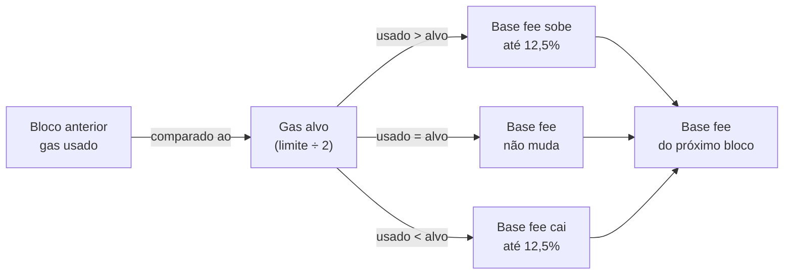
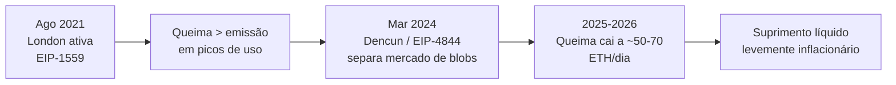

# Capítulo 16: EIP-1559 em Profundidade, Base Fee e Priority Fee

**Voltando a um mecanismo que só foi citado de passagem.** O Capítulo 1 já mencionou a EIP-1559 rapidamente, como a atualização de 2021 que passou a queimar parte de cada taxa paga na rede, ligando o suprimento do ETH ao uso real do Ethereum. Isso é verdade, mas é só a ponta visível de um mecanismo de mercado de taxas bem mais elaborado, desenhado para resolver um problema que incomodava quem usava a rede desde o início, o de nunca saber exatamente quanto pagar por uma transação. Este capítulo entra na mecânica por dentro, porque é ela que explica por que uma carteira hoje consegue estimar uma taxa com razoável confiança, por que parte do que se paga desaparece para sempre e por que essa mesma engenharia, décadas depois de desenhada no papel, ainda é estudada academicamente por brechas teóricas.

**O problema do leilão de primeiro preço.** Antes de agosto de 2021, pagar para usar o Ethereum funcionava como um leilão de primeiro preço, cego: cada pessoa escrevia um valor de gas price e cruzava os dedos, mineradores ordenavam as transações pendentes da maior oferta para a menor e enchiam o bloco até o limite fixo de gas. O resultado prático era ruim para todo mundo. As taxas oscilavam de forma abrupta e desproporcional à variação real de demanda, porque um pico momentâneo de interesse por um bloco cheio já bastava para inflar drasticamente o preço do próximo. As carteiras precisavam rodar algoritmos de estimativa de taxa que erravam com frequência, levando tanto a transações presas por oferta baixa demais quanto a pagamentos generosos demais por segurança. E, num nível mais estrutural, um sistema que depende inteiramente de taxas de transação para remunerar quem produz blocos cria incentivos de longo prazo desalinhados, abrindo espaço para estratégias desestabilizadoras por parte de quem minera. A proposta original da EIP-1559, de Vitalik Buterin, Eric Conner, Rick Dudley, Matthew Slipper e Ian Norden, atacou essas três frentes de uma vez.

**Bloco alvo e bloco máximo, a folga que dá elasticidade ao sistema.** A mudança central é que o Ethereum deixou de ter um único limite fixo de gas por bloco e passou a operar com dois números. Existe um alvo de gas por bloco, a quantidade que a rede considera confortável, e existe um limite máximo, o dobro do alvo, que os blocos podem alcançar em momentos de demanda alta sem que isso exija uma mudança de protocolo. Essa razão de dois para um é o chamado multiplicador de elasticidade, e ela dá ao sistema uma margem de manobra: em vez de rejeitar transações assim que o bloco anterior encheu, a rede permite blocos temporariamente maiores, sabendo que vai compensar isso ajustando o preço para o bloco seguinte. Hoje, depois do aumento de limite descrito no Capítulo 10 a caminho do Glamsterdam, o limite de gas por bloco está em 60 milhões, o que coloca o alvo em torno de 30 milhões.


*O diagrama mostra que a base fee de cada bloco novo é calculada só a partir do quanto o bloco anterior usou em relação ao seu alvo de gas, sem depender de lances ou de decisão humana.*

**A fórmula por trás do ajuste.** O protocolo compara o gas usado no bloco anterior ao seu alvo e move a base fee na direção correspondente, mas sempre dentro de um teto por bloco: uma constante chamada BASE_FEE_MAX_CHANGE_DENOMINATOR, fixada em 8, garante que a base fee nunca suba ou desça mais do que um oitavo do seu valor anterior, ou seja, 12,5%, de um bloco para o outro. Quando o Ethereum ativou esse mecanismo, no hard fork London, a base fee inicial foi fixada em 1 gwei.

```latex
\text{base\_fee}_{n+1} = \text{base\_fee}_n \times \left(1 + \frac{\text{gas\_usado} - \text{gas\_alvo}}{\text{gas\_alvo}} \times \frac{1}{8}\right)
```

Esse teto de 12,5% por bloco é o que torna a base fee previsível mesmo sendo inteiramente algorítmica: como os blocos do Ethereum saem a cada 12 segundos, uma sequência de blocos cheios consecutivos até consegue empurrar o preço para cima rapidamente em termos percentuais, mas nunca de forma súbita e arbitrária como acontecia nos lances do leilão de primeiro preço.

**O que sobrou da gorjeta ao minerador.** Numa transação no formato criado pela EIP-1559, quem envia define dois valores, não um: o max_priority_fee_per_gas, o quanto está dispondo a dar de gorjeta a quem propõe o bloco, e o max_fee_per_gas, o teto absoluto que aceita pagar por unidade de gas somando base fee e gorjeta. O valor efetivamente pago de gorjeta é sempre o menor entre a gorjeta desejada e a diferença entre o teto total e a base fee do momento, o que impede pagar mais caro que o necessário mesmo tendo configurado um teto generoso como margem de segurança. Esse resíduo de leilão que sobrevive dentro da EIP-1559, a gorjeta, é o único valor que vai integralmente para quem propõe o bloco. A base fee inteira, por outro lado, é destruída pelo protocolo, sem exceção.

| | Leilão de primeiro preço (pré-2021) | EIP-1559 |
| --- | --- | --- |
| Quem define o preço | Cada usuário, adivinhando | O protocolo, algoritmicamente, a cada bloco |
| Destino da taxa | 100% para o minerador | Base fee queimada, só a gorjeta vai ao validador |
| Previsibilidade | Baixa, oscila com picos de demanda | Alta, variação máxima de 12,5% por bloco |
| Tamanho do bloco | Fixo | Elástico, até 2x o alvo em picos |
| Risco estrutural | Incentivo à instabilidade de longo prazo | Base fee imune a manipulação direta de curto prazo |

**Por que queimar em vez de simplesmente pagar ao validador.** A escolha de destruir a base fee, em vez de mandá-la para quem propôs o bloco, não é só uma forma de criar pressão deflacionária, é também uma peça de desenho de incentivos. Se a base fee fosse paga ao validador, ele passaria a ter um motivo direto para inflar artificialmente o gas usado nos próprios blocos, empurrando a base fee para cima e lucrando com esse aumento no bloco seguinte, uma forma de autonegociação que corromperia o próprio sinal de preço que o mecanismo tenta manter honesto. Ao queimar essa parte, o protocolo garante que o único jeito de um validador ganhar mais dinheiro seja incluir mais transações de gorjeta alta de forma legítima, não manipular o preço de referência da rede.

**Nem tudo é perfeitamente à prova de manipulação.** Mesmo com esse desenho cuidadoso, a EIP-1559 não é imune a estratégias sofisticadas. Um estudo acadêmico de Sarah Azouvi, Guy Goren, Lioba Heimbach e Alexander Hicks mostrou que, sob certas condições, é racional para quem propõe blocos, mesmo controlando uma fração minoritária do poder de validação, produzir uma sequência de blocos artificialmente vazios ou subutilizados para empurrar a base fee para baixo, e depois lucrar cobrando gorjetas mais altas quando a demanda represada finalmente for atendida em blocos maiores. Os próprios autores propõem mitigações para o problema. Na prática, essa estratégia exige controlar a proposição de vários blocos consecutivos, algo caro e visível numa rede com milhares de validadores independentes, o que ajuda a explicar por que ela permanece mais um resultado teórico relevante do que um ataque observado em escala no dia a dia da rede. O tema conversa diretamente com a discussão mais ampla sobre como a rede tenta domar comportamentos oportunistas de quem produz blocos, o chamado MEV, que fica para um capítulo dedicado deste caderno.

**O que mudou de fato desde 5 de agosto de 2021.** A EIP-1559 entrou em vigor no hard fork London, no bloco 12.965.000, as 12h34 UTC daquele dia. O efeito mais visível para quem usa o Ethereum no dia a dia não foi tanto o valor final pago, que continua a variar com a demanda real da rede, mas a forma como esse valor passou a ser calculado e mostrado. Carteiras como MetaMask, Rabby e Coinbase Wallet deixaram de pedir para a pessoa escolher um gas price às cegas e passaram a estimar automaticamente o max_fee_per_gas e o max_priority_fee_per_gas nos bastidores, exibindo só uma estimativa em moeda local, porque a base fee de um bloco próximo já é, em boa medida, previsível a partir do bloco anterior.

**A conta que volta ao Capítulo 1: o que a queima realmente fez ao suprimento do ETH.** Desde a ativação da EIP-1559, cerca de 4,6 milhões de ETH já foram permanentemente destruídos pela queima da base fee, segundo dados públicos do Ultrasound Money. Só que essa queima não é constante, ela reflete o quanto de atividade acontece de fato na camada de execução da L1. A atualização Dencun, que trouxe o EIP-4844 descrito no Capítulo 5, moveu boa parte dos dados de rollups para um mercado de blobs com sua própria base fee, separado do mercado de gas de execução, o que tirou pressão de demanda justamente da parte que alimenta a queima tradicional. O resultado, no início de 2026, é que a queima diária, que já chegou a milhares de ETH por dia em picos de congestionamento, girava perto de 50 a 70 ETH por dia, enquanto a emissão paga a quem faz staking rodava perto de 3.000 ETH por dia com cerca de 43 milhões de ETH em stake. Isso deixou o Ethereum, no cômputo líquido, mais perto de uma inflação anual modesta, algo entre 0,2% e 0,8%, do que da narrativa de moeda estritamente deflacionária que circulou logo depois de 2021. Nada disso invalida o mecanismo da EIP-1559 em si, que continua fazendo exatamente o que foi desenhado para fazer, precificar e queimar o uso da camada de execução; o que mudou foi que boa parte do uso do Ethereum como um todo migrou para rollups e para o próprio mercado de blobs, com sua própria dinâmica de oferta e demanda.


*A linha do tempo mostra como a própria evolução do Ethereum, ao criar um mercado de taxas separado para dados de rollup, reduziu a pressão de queima que a EIP-1559 gerava só na camada de execução.*

**Glossário do capítulo.**
- **Base fee**: parte da taxa de transação calculada algoritmicamente pelo protocolo a cada bloco e destruída (queimada) pela rede.
- **Priority fee (gorjeta, tip)**: parte da taxa de transação paga diretamente a quem propõe o bloco, acima da base fee.
- **max_fee_per_gas**: teto total que quem envia uma transação aceita pagar por unidade de gas, somando base fee e gorjeta.
- **max_priority_fee_per_gas**: gorjeta máxima que quem envia uma transação está dispondo a oferecer.
- **Multiplicador de elasticidade**: razão de 2 para 1 entre o limite máximo de gas de um bloco e o seu alvo.
- **BASE_FEE_MAX_CHANGE_DENOMINATOR**: constante do protocolo, igual a 8, que limita a variação da base fee a 12,5% por bloco.
- **Leilão de primeiro preço**: modelo de precificação usado antes da EIP-1559, em que cada usuário oferecia um valor às cegas e o maior lance vencia.
- **London (hard fork)**: atualização ativada em 5 de agosto de 2021, no bloco 12.965.000, que introduziu a EIP-1559.
- **Ultrasound money**: narrativa que descreve o ETH como um ativo com pressão deflacionária vinda da queima de taxas, hoje mais matizada pela migração de uso para rollups e blobs.

**Fontes.**
- [EIP-1559: Fee market change for ETH 1.0 chain — ethereum/EIPs no GitHub](https://github.com/ethereum/EIPs/blob/master/EIPS/eip-1559.md)
- [Ethereum's Hotly Anticipated 'London' Hard Fork Is Now Live — CoinDesk](https://www.coindesk.com/tech/2021/08/05/ethereums-hotly-anticipated-london-hard-fork-is-now-live)
- [What is EIP-1559? — Trust Wallet](https://trustwallet.com/blog/blockchain/what-is-eip-1559)
- [Cyfrin EIP and ERC Glossary: EIP-1559](https://www.cyfrin.io/glossary/eip-1559)
- [Base Fee Manipulation In Ethereum's EIP-1559 Transaction Fee Mechanism — arXiv:2304.11478](https://arxiv.org/abs/2304.11478)
- [Ethereum Token Supply in 2026: The "Ultrasound Money" Story Got Complicated — MEXC News](https://www.mexc.com/news/1013167)
- [Did L2s break Ethereum's ultrasound money? — crypto.news](https://crypto.news/ethereum-ultrasound-money-l2-burn-broken/)
