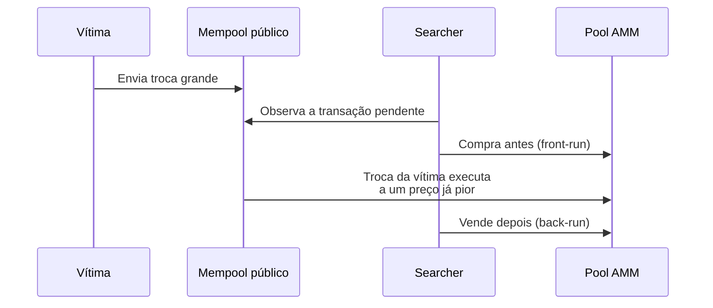
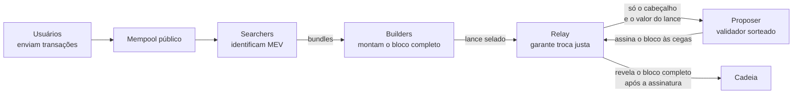
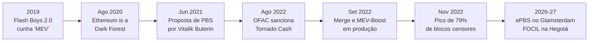

# Capítulo 17: MEV, o que é e como a rede tenta domar

**Uma promessa que o Capítulo 16 deixou em aberto.** Ao explicar a EIP-1559, o capítulo anterior deste caderno mencionou de passagem um estudo acadêmico segundo o qual seria racional, sob certas condições, um proposer produzir blocos artificialmente vazios para manipular a base fee, e prometeu que o assunto de fundo por trás disso, o comportamento oportunista de quem produz blocos, ficaria para um capítulo dedicado. Esse assunto tem nome técnico: MEV, sigla para maximal extractable value, o valor máximo que quem controla a ordem das transações dentro de um bloco consegue extrair além da recompensa normal de bloco e das taxas de gas. Entender MEV é entender uma tensão que existe desde o primeiro dia do Ethereum, tornada bem mais visível a partir de 2020, e que hoje molda literalmente a arquitetura do protocolo, incluindo boa parte do que o Capítulo 10 descreveu sobre o Glamsterdam.

**De onde vem o nome e por que ele mudou de letra.** O termo nasceu como miner extractable value, porque no Ethereum de prova de trabalho era o minerador quem decidia sozinho quais transações pendentes entravam em um bloco e em que ordem, um poder que ia muito além de simplesmente cobrar mais caro por espaço escasso. O trabalho acadêmico que cunhou e formalizou o conceito, "Flash Boys 2.0", publicado por Philip Daian, Steven Goldfeder, Tyler Kell e outros pesquisadores da Cornell Tech em 2019 e apresentado formalmente no IEEE Symposium on Security and Privacy de 2020, mostrou de forma empírica que esse poder já estava sendo explorado por bots automatizados em exchanges descentralizadas, e que a disputa entre eles chegava a ameaçar a própria estabilidade do consenso, ao criar incentivo para reorganizar blocos já minerados em busca de uma oportunidade mais lucrativa. Quando o Ethereum migrou para prova de participação no Merge, descrito no Capítulo 1, esse mesmo poder de incluir, excluir e reordenar transações passou para as mãos do validador sorteado como proposer a cada slot, tema do Capítulo 2, e o termo foi atualizado de miner para maximal, já que o comportamento e os incentivos continuaram praticamente os mesmos, só mudou quem senta na cadeira.

**A floresta escura.** Em agosto de 2020, os pesquisadores Dan Robinson e Georgios Konstantopoulos, da Paradigm, publicaram um ensaio que se tornou referência obrigatória no assunto, "Ethereum is a Dark Forest". O texto relata a tentativa real dos autores de resgatar fundos presos em um contrato vulnerável, e como a própria transação de resgate foi copiada e executada primeiro por um bot que vigiava o mempool público, o espaço onde transações pendentes ficam visíveis para qualquer um antes de entrar em um bloco. A metáfora pegou porque descreve bem o problema: o mempool público passou a funcionar como uma floresta onde qualquer transação lucrativa e visível é, na prática, presa fácil para robôs de frontrunning genérico, capazes de detectar automaticamente qualquer operação com potencial de lucro, copiar sua lógica e reenviá-la com uma taxa de gas mais alta para furar a frente da fila.


*O diagrama mostra um ataque sandwich, em que um bot vê a troca da vítima ainda pendente no mempool e a envolve com duas transações próprias, lucrando com a variação de preço que ele mesmo provoca.*

**As três formas mais comuns de MEV.** Nem toda extração de valor é um ataque a alguém. A arbitragem entre exchanges descentralizadas, aproveitando pequenas diferenças de preço do mesmo par entre uma pool da Uniswap e uma da Sushiswap, por exemplo, é atômica e sem vítima direta: ou a operação inteira é lucrativa e se paga sozinha dentro de uma única transação, incluindo a compra e a venda, ou a transação inteira reverte sem custo relevante, e o efeito líquido no mercado é reduzir ineficiências de preço entre pools como as descritas no Capítulo 11. As liquidações em protocolos de empréstimo como Aave e Compound, tema do Capítulo 12, também geram MEV: quando a posição de alguém cai abaixo do health factor mínimo, bots competem para ser os primeiros a liquidar aquela dívida e embolsar o desconto de liquidação, uma corrida que beneficia a saúde do protocolo mas custa caro a quem tomou o empréstimo. Já o ataque sandwich do diagrama acima é o caso mais claramente predatório: ele precisa enxergar a transação da vítima ainda pendente no mempool público para funcionar, e o prejuízo dela é direto, na forma de um preço de execução pior do que teria sem a interferência.

| Tipo de MEV | Precisa ver a transação da vítima no mempool? | Risco para quem extrai | Quem paga a conta |
| --- | --- | --- | --- |
| Arbitragem entre DEXs | Não necessariamente | Baixo, operação atômica reverte se não for lucrativa | Ninguém de forma direta |
| Liquidação em protocolo de empréstimo | Não, basta monitorar o preço do colateral | Baixo a médio, corrida contra outros bots | Quem tomou o empréstimo, via multa de liquidação |
| Ataque sandwich | Sim, é a base do ataque | Médio, depende de duas transações confirmarem na ordem certa | Quem fez a troca grande, via preço pior e mais slippage |

**Por que isso preocupa mais do que uma simples taxa extra.** O problema do MEV nunca foi apenas alguém ganhar dinheiro às custas de outra pessoa numa troca isolada. Antes de qualquer mitigação, a disputa entre bots por espaço no próximo bloco virou o que ficou conhecido como priority gas auction, um leilão silencioso em que cada bot ia elevando a taxa de gas oferecida na esperança de furar a fila dos concorrentes, inflando o custo de qualquer transação comum que estivesse tentando entrar no mesmo bloco. Num caso extremo dessa lógica, um searcher está disposto racionalmente a pagar de gas até praticamente 100% do valor bruto da oportunidade, sobrando pouco ou nada de lucro líquido para quem venceu o leilão, mas ainda assim inflando o preço de gas para todo mundo.

```latex
\text{Lucro líquido do searcher} = \text{MEV bruto} - \text{Gas pago no leilão} - \text{Custos de execução}
```

Há também um risco mais estrutural para o próprio consenso: se o valor de MEV disponível em um bloco já finalizado for grande o suficiente, um validador com poder de propor blocos futuros pode ser tentado a tentar reescrever a história recente da cadeia para capturar aquela oportunidade de novo, o chamado time-bandit attack, um cenário que ameaça a própria finalidade das transações, não só o bolso de quem foi vítima de um sandwich.

**A primeira mitigação: tirar o leilão do olho público.** A resposta inicial veio de um projeto batizado justamente de Flashbots, criado por pesquisadores próximos aos autores do Flash Boys 2.0, que passou a oferecer um canal alternativo para submeter transações e pacotes de transações (bundles) diretamente a quem produzia blocos, sem passar pelo mempool público. Isso tirou boa parte do leilão de gas do olho de todo mundo e reduziu a eficácia dos robôs de frontrunning genérico, porque uma transação que nunca aparece publicamente não pode ser copiada e furada por um bot concorrente. O efeito colateral, reconhecido pela própria comunidade, é que isso empurrou o Ethereum para um regime de fluxo de ordens cada vez mais privado, com menos visibilidade pública sobre o que está de fato competindo por espaço em cada bloco.

**A separação entre quem propõe e quem constrói.** A partir de 2021, Vitalik Buterin e outros pesquisadores formalizaram uma ideia mais ambiciosa em uma série de publicações no fórum ethresear.ch: separar formalmente o papel de construir um bloco, otimizando a ordem das transações para extrair o máximo de valor possível, do papel de simplesmente propor esse bloco à rede, a chamada proposer-builder separation (PBS). A implementação prática dessa ideia, batizada de MEV-Boost, entrou em produção poucos dias depois do Merge de setembro de 2022, e hoje roda em cerca de 90% dos validadores da rede. O funcionamento depende de três papéis distintos: searchers encontram as oportunidades de MEV e as empacotam em bundles; builders especializados competem entre si para montar o bloco inteiro mais lucrativo possível a partir desses bundles e das transações do mempool público; e relays, intermediários de confiança, recebem o bloco completo do builder vencedor, mas só entregam ao proposer um cabeçalho cego com o valor do lance, para que o proposer assine sem conseguir roubar o conteúdo do bloco antes de pagar por ele.


*O diagrama mostra o fluxo do MEV-Boost: o proposer nunca vê o conteúdo do bloco antes de assinar, só o valor do lance, o que impede tanto o builder de sonegar o pagamento quanto o proposer de roubar a estratégia do builder.*

**O efeito colateral que ninguém queria: censura embutida no protocolo de fato.** Em 8 de agosto de 2022, o Departamento do Tesouro americano, através do OFAC, sancionou o protocolo de privacidade Tornado Cash, proibindo pessoas e empresas americanas de interagir com seus endereços. Como parte dos relays que sustentam o MEV-Boost passou a filtrar transações relacionadas a endereços sancionados para se manter em conformidade regulatória, a fatia de blocos produzidos por relays desse tipo disparou logo após o Merge, chegando a um pico de 79% em 21 de novembro de 2022, segundo o rastreamento independente do MEV Watch. Isso significava, na prática, que quase quatro em cada cinco blocos da rede recusavam ativamente incluir certas transações válidas, um risco de censura extremamente concreto para uma rede que se propõe neutra, no mesmo espírito da discussão sobre o poder de congelar endereços da USDC no Capítulo 14, só que aqui o poder de excluir não está no contrato de um token, está espalhado pela própria infraestrutura de produção de blocos. A pressão da comunidade teve efeito: a fatia de blocos censores caiu para menos de 50% já em fevereiro de 2023, e uma medição da Rated Network em setembro de 2026 encontrou algo em torno de 70% dos blocos vindo de relays neutros, que não aplicam esse tipo de filtro, contra cerca de 30% ainda operando sob triagem regulatória.

**Uma nova centralização, desta vez entre os builders.** Resolver o problema de censura nos relays não eliminou uma preocupação parecida em outra camada da mesma pilha. Construir o bloco mais lucrativo possível a cada slot é uma tarefa que recompensa quem tem acesso a mais fluxo de ordens privado e infraestrutura mais sofisticada, e isso concentrou a atividade de block building em poucas mãos: levantamentos de mercado ao longo de 2026 mostram um pequeno grupo de builders, incluindo nomes como Titan, Beaverbuild (que depois migrou sua operação para o consórcio aberto BuilderNet) e o próprio Flashbots Builder, respondendo por bem mais da metade de todos os blocos da rede em determinados períodos, com estimativas de mercado variando mas apontando consistentemente para uma concentração alta demais para o gosto de quem projetou o Ethereum para não depender de poucos operadores centrais.

| Camada da pilha de MEV | Ponto de centralização | Tentativa de resposta |
| --- | --- | --- |
| Mempool público (pré-2020) | Qualquer bot com boa infraestrutura de rede | Fluxo de ordens privado via Flashbots |
| Relays do MEV-Boost | Poucos operadores de confiança, alguns aplicando censura regulatória | Pressão pública, crescimento de relays neutros, ePBS |
| Builders | Poucos builders concentrando a maior parte do fluxo lucrativo | Consórcios abertos como BuilderNet, pesquisa em curso |

**Para onde essa arquitetura está indo.** O Capítulo 10 já descreveu em detalhe o EIP-7732, o headliner do Glamsterdam que embute a separação entre proposer e builder diretamente nas regras de consenso (ePBS), eliminando a necessidade de confiar em um relay externo para garantir a troca justa entre as duas partes. É o mesmo problema deste capítulo, visto da perspectiva de protocolo: em vez de terceirizar a confiança a uma peça de software fora do Ethereum, o próprio consenso passa a arbitrar o compromisso criptográfico entre quem constrói e quem propõe. A outra peça que falta, o FOCIL (fork-choice enforced inclusion lists, também mencionado no Capítulo 10), ataca diretamente o problema da censura descrito acima: em vez de depender da boa vontade de builders e relays para incluir uma transação válida, um comitê de validadores sorteado a cada slot passaria a poder forçar a inclusão de transações específicas, mesmo contra a vontade de quem está montando o bloco. O FOCIL foi retirado do escopo do Glamsterdam para não atrasar seu cronograma e está previsto para a atualização seguinte, batizada de Hegotá.


*A linha do tempo mostra como o problema de MEV passou de uma observação acadêmica sobre mineradores a uma engenharia deliberada de separação de papéis, hoje a caminho de ser embutida nas próprias regras de consenso do Ethereum.*

**O que ainda não está resolvido.** Nenhuma dessas camadas de mitigação elimina o MEV, e essa nunca foi a proposta: enquanto existir valor em decidir a ordem de transações dentro de um bloco, sempre vai haver incentivo para tentar capturar esse valor. O que a arquitetura construída desde 2020, do Flashbots ao ePBS, tenta fazer é redistribuir onde e como essa captura acontece, tirando-a do mempool público e da mão de um único ator com poder de censura, e tornando o processo mais transparente e mais resistente a abuso, mesmo sabendo que isso desloca a centralização para outra camada da pilha, como aconteceu com os builders. É um processo contínuo de engenharia de incentivos, não uma solução definitiva, e por isso o tema deve voltar a aparecer neste caderno conforme o ePBS e o FOCIL saírem das testnets e chegarem à mainnet.

**Glossário do capítulo.**
- **MEV (maximal extractable value)**: valor máximo que quem controla a ordem das transações de um bloco consegue extrair além da recompensa padrão de bloco e das taxas de gas.
- **Searcher**: participante que identifica oportunidades de MEV e as empacota em transações ou bundles para submissão.
- **Builder**: participante especializado em montar o bloco completo mais lucrativo possível a partir de bundles de searchers e transações do mempool público.
- **Relay**: intermediário de confiança que recebe o bloco do builder e só revela um cabeçalho cego ao proposer, garantindo a troca justa entre as duas partes.
- **Ataque sandwich**: estratégia em que um bot compra antes e vende depois de uma troca grande de outra pessoa, lucrando com a variação de preço que ele mesmo provoca.
- **Time-bandit attack**: cenário teórico em que um validador tenta reescrever blocos recentes já produzidos para capturar uma oportunidade de MEV que só apareceu depois.
- **Priority gas auction (PGA)**: disputa em que bots competem elevando a taxa de gas oferecida para tentar ser incluídos antes de concorrentes, inflando o custo de gas para toda a rede.
- **PBS (proposer-builder separation)**: separação entre o papel de construir um bloco e o de propô-lo à rede, hoje feita por fora do protocolo via MEV-Boost e, a partir do Glamsterdam, embutida nas regras de consenso (ePBS).
- **FOCIL (fork-choice enforced inclusion lists)**: mecanismo, previsto para a atualização Hegotá, que permite a um comitê de validadores forçar a inclusão de transações válidas mesmo contra a vontade de quem constrói o bloco.

**Fontes.**
- [Maximal extractable value (MEV) — ethereum.org](https://ethereum.org/developers/docs/mev/)
- [Flash Boys 2.0: Frontrunning in Decentralized Exchanges, Miner Extractable Value, and Consensus Instability — arXiv:1904.05234](https://arxiv.org/abs/1904.05234)
- [Ethereum is a Dark Forest — Paradigm](https://www.paradigm.xyz/writing/ethereum-is-a-dark-forest)
- [MEV-Boost: Merge-ready Flashbots Architecture — Flashbots (via GitHub)](https://github.com/flashbots/mev-boost)
- [MEV-Boost Status Update — Flashbots](https://boost.flashbots.net/mev-boost-status-updates/mev-boost-status-update-sep-9-sept-22-2022)
- [Ethereum's MEV-Boost Censorship Issues Are Getting Better — Crypto Briefing](https://cryptobriefing.com/ethereum-mev-boost-relay-censorship-falls-back-under-50/)
- [51% of Ethereum Blocks Can Now Be Censored. It's Time for Flashbots to Shut Down — Crypto Briefing](https://cryptobriefing.com/51-of-ethereum-blocks-can-now-be-censored-its-time-for-flashbots-to-shut-down/)
- [Order Flow Exclusivity and Value Extraction Mechanisms: An Analysis of Ethereum Builder Centralization — arXiv:2605.04471](https://arxiv.org/html/2605.04471)
- [Proposer-builder separation — ethereum.org roadmap](https://ethereum.org/roadmap/pbs/)
- [EIP-7732: Enshrined Proposer-Builder Separation](https://eips.ethereum.org/EIPS/eip-7732)
- [EIP-7805: Fork-choice enforced Inclusion Lists (FOCIL)](https://eips.ethereum.org/EIPS/eip-7805)
