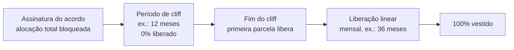
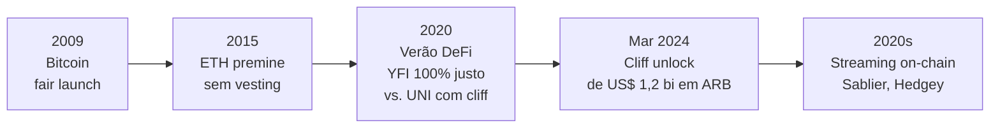

# Capítulo 18: Tokenomics Avançada, Emissão, Vesting e Distribuição

**Voltando à pergunta que o Capítulo 1 só respondeu em parte.** Quando este caderno explicou a origem do Ethereum, ficou registrado que o ETH nasceu de uma venda pública em 2014 e que parte do suprimento inicial foi reservada para os criadores do projeto. Isso é tokenomics no sentido mais básico da palavra, a engenharia econômica de como um token nasce, quem recebe o quê e em que ritmo. Só que a palavra esconde uma disciplina bem mais elaborada, que hoje decide se um token novo tem chance de sobreviver ao próprio lançamento. Este capítulo entra nessa engenharia por dentro: como a emissão de um token é dosada ao longo do tempo, por que quase todo projeto sério de 2020 em diante amarra fundadores e investidores a um contrato de vesting, e o que acontece, na prática, quando uma trava dessas se abre de uma vez.

**As três perguntas que toda tokenomics precisa responder.** Por trás de qualquer token, seja ele uma moeda nativa como o ETH ou um token de governança como os que apareceram nos protocolos DeFi descritos nos Capítulos 11 e 12, existem três decisões de desenho que determinam quase tudo o mais: quanto suprimento existe e em que ritmo ele cresce, a emissão; quem recebe as primeiras unidades e em que proporção, a distribuição; e o que impede que quem recebeu uma alocação grande a venda toda de uma vez no primeiro dia, o vesting. Errar qualquer uma dessas três decisões costuma custar caro, porque tokenomics é, no fundo, um problema de incentivos: todo participante racional vai agir de acordo com as regras do jogo, não com a boa vontade dos fundadores.

**Fair launch, o extremo sem alocação prévia.** No começo da história das criptomoedas, o padrão era não ter padrão nenhum de alocação privilegiada. O Bitcoin é o exemplo canônico de fair launch: Satoshi Nakamoto não reservou nenhuma fatia de suprimento para si nem para colaboradores, todo BTC em circulação saiu do mesmo mecanismo de mineração aberto a qualquer um desde o bloco gênese. Anos depois, no auge do verão DeFi de 2020 descrito de forma indireta nos Capítulos 11 e 12, o protocolo de empréstimos Yearn Finance repetiu essa lógica com seu token YFI: cem por cento do suprimento foi distribuído via mineração de liquidez, sem nenhuma reserva para o fundador Andre Cronje nem para investidores, um gesto deliberado numa época em que a maioria dos projetos já reservava alocações generosas para times e fundos de venture capital.

**Premine, quando parte do suprimento nasce alocado antes do público entrar.** A alternativa ao fair launch é o premine, a criação de uma fatia do suprimento antes de qualquer negociação pública, destinada a fundadores, contribuidores iniciais ou uma tesouraria de longo prazo. O próprio ETH nasceu assim, e vale reconstruir os números porque eles raramente aparecem juntos. O bloco gênese do Ethereum, em 30 de julho de 2015, criou um suprimento inicial de aproximadamente 72 milhões de ETH. Desse total, cerca de 60 milhões de ETH, uns 83%, foram para quem comprou éter na venda pública de 2014 em troca de bitcoin. O restante era premine puro: cerca de 5,9 milhões de ETH, o equivalente a 9,9% do valor levantado na venda, foi criado para os primeiros contribuidores do projeto, e uma quantia semelhante ficou reservada a uma fundação de longo prazo, ainda que relatos posteriores apontem que a Ethereum Foundation efetivamente recebeu bem menos do que essa reserva original previa. O ponto importante para este capítulo não é o valor exato, e sim o desenho: não havia vesting nenhum sobre essa fatia. O ETH pré-minado em 2015 já nascia líquido, sem cliff nem liberação gradual, uma prática que hoje seria vista como um risco grave de pressão de venda repentina, mas que na época ainda não tinha um padrão de mercado alternativo consolidado.

**O padrão que se consolidou depois: cliff mais liberação linear.** A partir da onda de tokens de governança de protocolos DeFi, o mercado convergiu para uma estrutura bem mais cautelosa, com dois componentes. O cliff é um período inicial, tipicamente de um ano, durante o qual nenhuma unidade da alocação é liberada, funcionando como um teste de comprometimento: quem sai do projeto antes do fim do cliff não recebe nada daquela fatia. Depois que o cliff termina, o restante da alocação passa a ser liberado de forma linear, mês a mês, ao longo de um período adicional, com frequência de três anos, totalizando os quatro anos que hoje funcionam como referência de mercado para times, conselheiros e investidores.


*O diagrama mostra a estrutura mais comum de vesting: nada é liberado durante o cliff, e depois dele o restante da alocação vai sendo desbloqueado aos poucos, em vez de tudo de uma vez.*

```latex
\text{Tokens liberados}(t) =
\begin{cases}
0, & t < t_{cliff} \\
\text{Total} \times \dfrac{t - t_{inicio}}{\text{duração total}}, & t_{cliff} \le t \le t_{fim} \\
\text{Total}, & t > t_{fim}
\end{cases}
```

**Um caso real de cada lado da mesma moeda.** O lançamento do token UNI da Uniswap, protocolo descrito no Capítulo 11, em setembro de 2020, é o exemplo mais citado desse novo padrão. De um suprimento total de 1 bilhão de UNI, 60% foi destinado à comunidade, incluindo um airdrop retroativo imediato a usuários e provedores de liquidez que já tinham usado o protocolo antes do token existir, enquanto 21,51% ficou com o time e futuros funcionários, 17,8% com investidores e 0,69% com conselheiros, todos esses três últimos grupos sujeitos a quatro anos de vesting. Já o token ARB da Arbitrum, cuja DAO de governança o Capítulo 6 já apresentou, mostrou o outro lado dessa mesma engenharia: em 16 de março de 2024, terminou o cliff de um ano do cronograma de quatro anos que havia começado em março de 2023, liberando de uma vez cerca de 1,11 bilhão de ARB destinados a time, conselheiros e investidores, na época o equivalente a mais de 1 bilhão de dólares e a cerca de 87% de todo o suprimento então em circulação do token. Esse tipo de evento é acompanhado de perto pelo mercado justamente porque concentra, num único dia, uma quantidade de tokens potencialmente à venda que a liquidez do mercado nem sempre consegue absorver sem impacto relevante no preço.

| Modelo de distribuição | Exemplo | Alocação a fundadores/investidores | Vesting |
| --- | --- | --- | --- |
| Fair launch | Bitcoin (2009), Yearn/YFI (2020) | Nenhuma | Não se aplica |
| Premine sem vesting | Ether, bloco gênese (2015) | Cerca de 17% do suprimento inicial, entre contribuidores e fundação | Nenhum, liberado desde o primeiro bloco |
| Premine com vesting padrão de mercado | UNI (2020), ARB (2023-2027) | Tipicamente 30% a 40% do suprimento total | Cliff de 1 ano + liberação linear por 3 anos |
| Mineração de liquidez pura | Compound (2020), Curve (parcialmente) | Variável, mas sem alocação direta a fundadores no lançamento | Ligada à participação contínua no protocolo, não ao tempo apenas |

**Por que uma trava que se abre de uma vez preocupa mais do que a mesma quantidade liberada aos poucos.** O problema de um cliff clássico não é o tamanho total da alocação, é a concentração no tempo. Um estudo de mercado citado com frequência por analistas do setor, da empresa The Tie, mostrou que desbloqueios cujo valor supera o volume médio diário de negociação do token tendem a pressionar o preço para baixo de forma mensurável, porque parte de quem recebe a liberação tem motivo racional para vender, seja para realizar lucro, seja para diversificar, seja simplesmente porque o prazo de quatro anos de comprometimento finalmente acabou. Isso não significa que todo desbloqueio grande derruba o preço, a demanda do mercado no momento também conta, mas explica por que datas de cliff unlock viraram um evento de calendário observado por qualquer pessoa que acompanha um token de perto, o mesmo tipo de atenção que este caderno já descreveu em outro contexto ao tratar da fila de validadores nos Capítulos 2 e 13.

**A resposta de engenharia: trocar o marco único por um fluxo contínuo.** Uma parte da indústria de infraestrutura cripto passou a oferecer uma alternativa ao modelo de cliff mais liberação mensal em lote: o streaming de tokens, em que a liberação acontece continuamente, segundo a segundo, em vez de em datas fixas. Plataformas como a Sablier, ativa desde 2019 em mais de vinte redes compatíveis com a EVM, e a Hedgey, implementam esse desenho por meio de contratos inteligentes que retêm o saldo total e liberam uma fração proporcional ao tempo decorrido a cada bloco, eliminando por completo a concentração de pressão de venda num único dia de calendário. Um efeito colateral interessante é que esses contratos costumam representar o direito ao fluxo futuro de tokens como um NFT, que por sua vez pode ser negociado ou usado como colateral em um protocolo de empréstimo como os do Capítulo 12, antes mesmo de o vesting terminar, mudando a natureza do próprio instrumento de uma trava passiva para um ativo financeiro líquido por si só.

**Emissão contínua, o outro lado da tokenomics.** Vesting resolve o problema de como distribuir um suprimento que já existe, mas boa parte dos tokens também precisa decidir se vai continuar criando novas unidades depois do lançamento, e com que finalidade. O próprio ETH ilustra essa segunda camada: depois da fusão para prova de participação descrita no Capítulo 2, a rede passa a emitir ETH novo como recompensa para quem faz staking, hoje algo perto de alguns milhares de ETH por dia com cerca de 43 milhões de ETH total em stake, enquanto o Capítulo 16 já detalhou como parte da taxa de cada transação é permanentemente destruída pela EIP-1559, um sistema de emissão e queima competindo entre si o tempo todo. Muitos protocolos de governança adotam uma lógica parecida em menor escala, emitindo tokens novos como incentivo de mineração de liquidez para atrair capital a um pool ou mercado recém-lançado, um gasto que dilui quem já tem o token mas que, bem calibrado, paga por si mesmo ao atrair liquidez que o protocolo de outra forma não teria.


*A linha do tempo mostra a evolução dos padrões de mercado, da ausência total de alocação privilegiada ao premine sem trava do Ethereum, passando pelo cliff mais liberação linear que virou norma, até a resposta de engenharia do streaming contínuo.*

**O que essa engenharia não resolve sozinha.** Nenhum desenho de vesting, por mais cuidadoso que seja, substitui a pergunta mais simples de todas: o token tem um uso real que sustente demanda além da expectativa de valorização de quem recebeu uma alocação? Vesting e emissão bem calibrados atrasam e suavizam a pressão de venda, mas não criam demanda do nada. Por isso, ao avaliar a tokenomics de qualquer projeto, faz sentido olhar não só para quanto está travado e por quanto tempo, mas para o que sustenta a demanda do outro lado dessa equação quando a trava finalmente se abre, seja governança real com poder de decisão, como nas DAOs que ainda serão tema de um capítulo dedicado deste caderno, seja uma utilidade econômica direta dentro do próprio protocolo.

**Glossário do capítulo.**
- **Tokenomics**: engenharia econômica de um token, cobrindo emissão, distribuição e os mecanismos que regulam sua oferta ao longo do tempo.
- **Emissão**: criação de novas unidades de um token depois do seu lançamento inicial, seja como recompensa de rede, seja como incentivo de protocolo.
- **Vesting**: liberação gradual de uma alocação de tokens ao longo do tempo, em vez de entrega integral e imediata.
- **Cliff**: período inicial de um cronograma de vesting em que nenhuma unidade é liberada.
- **Fair launch**: modelo de distribuição sem nenhuma alocação prévia a fundadores, time ou investidores antes do acesso público.
- **Premine**: criação de uma fatia do suprimento de um token antes do lançamento público, destinada a fundadores, contribuidores ou uma tesouraria.
- **Cliff unlock**: liberação concentrada de uma grande quantidade de tokens no momento em que um cliff termina.
- **Mineração de liquidez (liquidity mining)**: distribuição de tokens novos como incentivo a quem fornece capital a um pool ou mercado de um protocolo.
- **Token streaming**: liberação contínua e proporcional ao tempo de uma alocação em vesting, executada segundo a segundo por um contrato inteligente.

**Fontes.**
- [Sale of the Century: The Inside Story of Ethereum's 2014 Premine — CoinDesk](https://www.coindesk.com/markets/2020/07/11/sale-of-the-century-the-inside-story-of-ethereums-2014-premine)
- [Launching the Ether Sale — Ethereum Foundation Blog](https://blog.ethereum.org/2014/07/22/launching-the-ether-sale)
- [How was ETH initially distributed? — Bitcoin.com](https://www.bitcoin.com/get-started/ethereum/eth-core/how-was-eth-initially-distributed/)
- [Introducing UNI — Uniswap Blog](https://blog.uniswap.org/uni)
- [Uniswap Launches Governance Token in Bid to Keep Up With Rival AMM SushiSwap — CoinDesk](https://www.coindesk.com/markets/2020/09/17/uniswap-launches-governance-token-in-bid-to-keep-up-with-rival-amm-sushiswap)
- [Arbitrum Will Unlock $1.2B ARB in March 2024: Token Unlocks — CoinDesk](https://www.coindesk.com/markets/2023/08/16/arbitrum-will-unlock-12b-arb-in-march-2024-token-unlocks)
- [Arbitrum price readies for one of the biggest token unlocks of 2024 — FXStreet](https://www.fxstreet.com/cryptocurrencies/news/arbitrum-price-readies-for-one-of-the-biggest-token-unlocks-of-2024-202403130200)
- [Token Vesting | Sablier](https://sablier.com/vesting)
- [What is Token Vesting? Complete Guide to Crypto Vesting Schedules — Tokenomist](https://tokenomist.ai/learn/glossary-term/token-vesting)
- [What is a Fair Launch? Tokenomics With No Pre-Sale and No Insider Overhang — Tokenomist](https://tokenomist.ai/learn/glossary-term/fair-launch)
