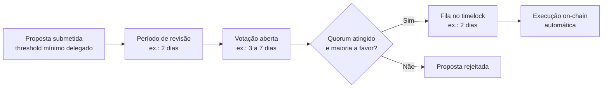
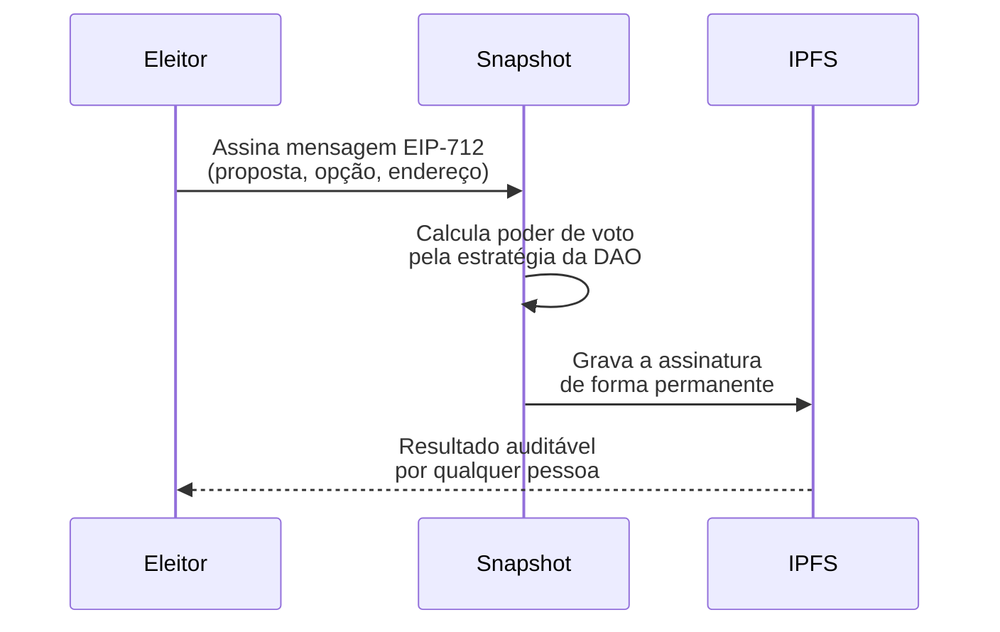
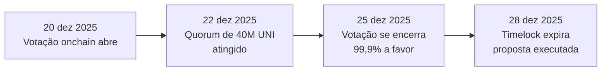

# Capítulo 19: Governança e DAOs, Como Funciona Votar On-Chain

**Uma promessa feita em dois capítulos diferentes.** Ao descrever o Optimism Collective, o Capítulo 7 mencionou de passagem que a estrutura de duas câmaras da rede, a Token House e a Citizens' House, seria retomada "quando este caderno tratar de DAOs e governança em capítulo futuro". O Capítulo 6, ao explicar a Arbitrum DAO, também deixou em aberto como funciona, na prática, o processo de votação que dá ao token ARB poder sobre o protocolo. Este capítulo cumpre as duas promessas: entra na mecânica real de como uma organização autônoma descentralizada, ou DAO, transforma a posse de um token em poder de decisão, e por que essa mecânica, apesar de parecer simples no papel, esconde uma tensão de fundo entre o ideal de descentralização e a forma como o poder de voto de fato se distribui na prática.

**O que uma DAO é, sem o jargão.** Uma DAO é uma organização cujas regras de decisão, em vez de estarem em um estatuto social arquivado num cartório e executadas por uma diretoria, estão escritas em contratos inteligentes que rodam na EVM. Isso não significa que humanos deixam de decidir, eles continuam escrevendo propostas, debatendo e votando, mas significa que a execução do que for aprovado, sobretudo movimentar a tesouraria ou alterar um parâmetro de protocolo, é automática e verificável por qualquer pessoa, sem depender da boa vontade de quem administra a organização. Praticamente todo protocolo já descrito neste caderno que tem um token de governança, a Uniswap e sua DAO no Capítulo 11, o Aave e o Compound no Capítulo 12, o próprio ARB no Capítulo 6, opera dessa forma, e o Capítulo 18 já explicou como esses tokens costumam nascer e se distribuir. O que faltava era entrar na mecânica do voto em si.

**A peça central: o contrato Governor.** A forma mais comum de votação on-chain hoje não foi desenhada do zero por cada projeto, ela deriva de um padrão aberto criado pela Compound e depois generalizado pela OpenZeppelin, biblioteca de referência para contratos inteligentes em Solidity. O contrato Governor, na versão da OpenZeppelin, define a espinha dorsal do processo, quem pode propor, por quanto tempo a votação fica aberta, como contar os votos, e deixa como peças modulares e substituíveis decisões como qual é o quorum mínimo ou se existe um timelock antes da execução. Essa modularidade é o motivo de o mesmo desenho básico aparecer, com pequenas variações, em DAOs completamente diferentes: em vez de cada equipe reinventar a roda e correndo o risco de introduzir uma falha de segurança nova, a maioria reaproveita um contrato já auditado e testado em produção por outros protocolos havia anos.

**O ciclo de vida de uma proposta, do rascunho à execução.** A versão da Compound desse desenho, batizada de Governor Bravo, ilustra bem o fluxo típico. Primeiro, uma proposta só pode ser submetida por quem tem delegado a si mesmo uma quantidade mínima de tokens, o chamado proposal threshold, que no contrato da Compound pode ser configurado entre 1.000 e 100.000 COMP e está hoje, segundo levantamentos do setor, em torno de 25.000 COMP. Depois de submetida, a proposta passa por um período de revisão de cerca de dois dias antes de a votação abrir de fato, e o poder de voto de cada endereço é fixado no bloco em que a votação começa, o que impede alguém de comprar tokens depois de ver o resultado parcial só para inflar sua influência de última hora. A votação em si dura cerca de três dias no desenho da Compound, e a proposta só avança se o número de votos a favor superar os votos contra e o total de votos ultrapassar o quorum mínimo, fixado em 400.000 COMP, perto de 4% do suprimento total do token. Se passar por esse crivo, a proposta entra numa fila de timelock, um atraso deliberado de mais alguns dias antes da execução, que existe para dar à comunidade uma última janela de reação caso algo tenha passado despercebido durante a votação.


*O diagrama mostra o ciclo padrão de uma proposta num contrato Governor: cada etapa existe para impedir que uma decisão importante seja tomada às pressas ou por uma fração pequena e desatenta de detentores do token.*

```latex
\text{Proposta aprovada} \iff
\text{Votos a favor} > \text{Votos contra}
\;\land\;
\text{Votos totais} \ge \text{Quorum}
```

**Delegação, ou como votar sem precisar acompanhar cada proposta.** A maioria de quem detém um token de governança nunca lê o texto de uma proposta inteira, e o desenho da maioria das DAOs prevê exatamente isso. Em vez de exigir que cada detentor vote pessoalmente, o contrato permite delegar o próprio poder de voto a outro endereço, tipicamente alguém que se candidatou publicamente como delegado, explicou sua visão sobre o protocolo e se compromete a acompanhar as propostas de perto. É o mesmo mecanismo, em espírito, de uma democracia representativa: quem não tem tempo ou interesse em analisar cada proposta ainda assim tem voz, por meio de alguém em quem confia. A delegação em si é uma transação on-chain, então tem um custo único de gas, mas depois disso o delegado pode votar em quantas propostas quiser sem que o detentor original precise fazer mais nada.

**O problema que o gas trouxe e a resposta que apareceu por fora do protocolo.** Exigir que cada voto seja uma transação assinada e paga em ETH funciona bem quando a rede está barata, mas em 2021, durante picos de congestionamento como os descritos no Capítulo 16, votar numa proposta da Compound podia custar de trinta a duzentos dólares em gas, um valor que dissuade facilmente qualquer detentor pequeno de participar. A resposta que se popularizou não veio de uma mudança no protocolo, veio de uma ferramenta por fora dele: a Snapshot, uma plataforma de votação totalmente fora da cadeia. Em vez de uma transação, o voto na Snapshot é uma mensagem assinada pela carteira do eleitor usando o padrão EIP-712, contendo o identificador da proposta, o endereço, a opção escolhida e um timestamp. Essa assinatura nunca precisa ser enviada à blockchain, ela é armazenada no IPFS, o sistema de arquivos distribuído por conteúdo, o que garante que qualquer pessoa possa depois auditar o resultado e verificar que cada assinatura é genuína, sem que ninguém tenha pago um centavo de gas para votar.


*O diagrama mostra por que a votação na Snapshot não custa gas: nada é enviado à blockchain, o voto é uma assinatura criptográfica arquivada no IPFS, e a verificação de quem tinha direito a votar e com que peso acontece fora da cadeia.*

**Sinalização, não execução, ainda que a linha esteja ficando mais tênue.** A Snapshot resolve o custo, mas cria um problema simétrico: um resultado que não está na blockchain também não pode disparar sozinho uma execução on-chain, então historicamente ela funcionou como uma camada de sinalização, o chamado temperature check, para medir o apetite da comunidade antes de uma proposta seguir para uma votação on-chain de fato, com peso jurídico e efeito automático. Mais recentemente esse limite começou a se dissolver: a própria Snapshot passou a integrar diretamente contratos Governor, permitindo que uma DAO conduza o ciclo inteiro, do temperature check à execução, sem trocar de plataforma, o que sugere que a distinção entre votar de graça e votar com efeito vinculante deve continuar diminuindo.

**Um caso real e recente de ponta a ponta: a UNIfication da Uniswap.** A Uniswap, cujo mecanismo de troca o Capítulo 11 já detalhou, usa hoje um processo formal de três fases: um pedido de comentários informal, um temperature check na Snapshot para medir apoio preliminar, e por fim uma votação on-chain vinculante, que exige que o proponente tenha ao menos 2,5 milhões de UNI delegados, 0,25% do suprimento total, e que o quorum de 40 milhões de UNI seja atingido dentro de um período de votação de sete dias, com um timelock mínimo de dois dias antes da execução. Em dezembro de 2025, esse processo levou a um dos votos mais decisivos da história da Uniswap: a proposta UNIfication, que ativa o chamado fee switch, redirecionando uma fatia das taxas de negociação da Uniswap v2, de 0,30% só para provedores de liquidez para 0,25% a eles mais 0,05% ao protocolo, e uma parcela equivalente em pools selecionadas da v3, com o valor arrecadado usado para queimar o token UNI, além de autorizar a queima imediata de 100 milhões de UNI já guardados na tesouraria da DAO. A votação abriu em 20 de dezembro de 2025, atingiu o quorum de 40 milhões de UNI em apenas dois dias, e se encerrou em 25 de dezembro com 125.342.017 UNI a favor contra apenas 742 UNI contra, uma aprovação de 99,9%, sendo executada pelo timelock em 28 de dezembro. É um exemplo raro de todas as peças deste capítulo, threshold, quorum, timelock, aparecendo juntas numa decisão real com consequência econômica direta sobre um protocolo bilionário.


*A linha do tempo mostra o intervalo entre abertura, quorum, encerramento e execução efetiva da UNIfication, o mesmo ciclo genérico do primeiro diagrama deste capítulo, só que com datas e números reais.*

**A tensão que nenhum desenho de contrato resolve por si só.** Nada nesse desenho impede, por construção, que um pequeno número de endereços concentre a maior parte do poder de voto, e é exatamente isso que estudos acadêmicos recentes sobre governança de DAOs vêm documentando: a participação típica fica na faixa de poucos dígitos percentuais a algumas dezenas de por cento dos tokens elegíveis em votações importantes, muito abaixo do comparecimento de uma eleição corporativa tradicional, e uma fração pequena de grandes detentores costuma concentrar boa parte do poder de voto que de fato aparece nas urnas. O resultado observado com frequência é o espelho da UNIfication: aprovação quase unânime, não porque haja consenso ativo entre milhares de pessoas, mas porque poucos participantes decidem e o resto simplesmente não vota, seja por falta de tempo, seja porque delegou seu poder e confia no delegado, seja porque a soma envolvida não justifica o esforço de acompanhar. Isso não invalida o modelo, a alternativa de um conselho fechado tradicional tem seus próprios problemas de concentração, mas expõe uma diferença entre a promessa de "um token, um voto, poder distribuído" e a forma como esse poder de fato se exerce na prática.

| Protocolo | Órgão de voto | Poder de voto | Quorum | Trava de emergência |
| --- | --- | --- | --- | --- |
| Compound | Governor Bravo, on-chain | 1 COMP = 1 voto | 400 mil COMP, ~4% do suprimento | Nenhuma formal além do timelock padrão |
| Uniswap | Governor + Snapshot para sinalização | 1 UNI = 1 voto | 40 milhões de UNI | Nenhuma formal, timelock de 2 dias |
| Optimism Collective | Token House + Citizens' House, bicameral | Token House: 1 OP = 1 voto. Citizens' House: 1 pessoa = 1 voto via NFT soulbound | Varia por câmara e tipo de proposta | Veto cruzado entre as duas câmaras (Capítulo 7) |
| Arbitrum DAO | Governor + Security Council | 1 ARB = 1 voto | Varia por tipo de proposta | Security Council, multisig 9 de 12 (Capítulo 6) |

**Por que algumas DAOs abandonaram o voto puro por token.** A linha de fundo da tabela acima mostra que nem todo desenho aposta tudo na régua "quem tem mais token decide mais". O Capítulo 7 já descreveu como o Optimism Collective separou formalmente o poder sobre mudanças de protocolo, que fica com a Token House e seu voto proporcional a OP, do poder sobre a distribuição retroativa de bens públicos, que fica com uma Citizens' House de cidadania não transferível, uma pessoa, um voto, numa tentativa deliberada de impedir que quem tem mais capital também decida sozinho quem é recompensado por contribuir com a rede. A Arbitrum DAO, por sua vez, manteve o voto por token como regra geral, mas colocou por cima um Security Council de doze pessoas, descrito no Capítulo 6, capaz de agir como freio de emergência via multisig quando o ritmo normal de governança, da ordem de duas semanas entre proposta e execução, seria perigosamente lento diante de um ataque em andamento. Nenhuma dessas duas soluções elimina a tensão entre poder concentrado e poder disperso, mas ambas são reconhecimento explícito, por parte de quem desenhou essas DAOs, de que o voto puro por token tem limites reais.

**O que ainda falta contar dessa história.** Este capítulo tratou da mecânica de como o voto acontece hoje, mas não do episódio que primeiro forçou a comunidade Ethereum a votar coletivamente sobre o destino da própria cadeia, o ataque de 2016 ao projeto batizado justamente de The DAO e o hard fork que se seguiu. Esse episódio é anterior a quase tudo o que este capítulo descreveu, os contratos Governor, a Snapshot, os padrões de vesting do Capítulo 18, e por isso merece um capítulo próprio deste caderno, tratando da governança do próprio protocolo Ethereum, e não da governança de uma aplicação construída sobre ele, uma distinção que vale reter: votar para mudar um parâmetro da Uniswap é diferente, em kind e em consequência, de votar para decidir se a própria história da cadeia deveria ser reescrita.

**Glossário do capítulo.**
- **DAO (organização autônoma descentralizada)**: organização cujas regras de decisão e execução de decisões estão codificadas em contratos inteligentes, em vez de dependerem de uma diretoria tradicional.
- **Token de governança**: token que confere poder de voto sobre decisões de um protocolo, tipicamente proporcional à quantidade detida ou delegada.
- **Delegação de voto**: transferência do poder de voto de um endereço a outro, sem transferir a posse dos tokens em si.
- **Quorum**: quantidade mínima de votos que precisa participar de uma proposta para que o resultado seja válido, independentemente do placar entre favoráveis e contrários.
- **Proposal threshold**: quantidade mínima de tokens delegados que um endereço precisa ter para poder submeter uma proposta de governança.
- **Timelock**: atraso deliberado entre a aprovação de uma proposta e sua execução efetiva, usado como última janela de reação da comunidade.
- **Governor (OpenZeppelin)**: contrato de referência, aberto e modular, usado como base por várias DAOs para implementar seu próprio processo de votação on-chain.
- **Snapshot**: plataforma de votação fora da cadeia, baseada em mensagens assinadas e armazenadas no IPFS, usada para sinalização gratuita antes ou em vez de uma votação on-chain.
- **Fee switch**: mecanismo que redireciona uma fatia das taxas de um protocolo, antes destinada só a provedores de liquidez ou usuários, para a própria tesouraria ou para queima do token.

**Fontes.**
- [GovernorBravoDelegate.sol — compound-finance/compound-protocol, GitHub](https://github.com/compound-finance/compound-protocol/blob/master/contracts/Governance/GovernorBravoDelegate.sol)
- [Governor.sol — OpenZeppelin/openzeppelin-contracts, GitHub](https://github.com/OpenZeppelin/openzeppelin-contracts/blob/master/contracts/governance/Governor.sol)
- [Compound Governor Bravo — Tally docs](https://docs.tally.xyz/set-up-and-technical-documentation/deploying-daos/smart-contract-compatibility/compound-governor-bravo)
- [What is Governor Bravo? — Delphi Digital](https://members.delphidigital.io/learn/governor-bravo)
- [Governance Process — Uniswap Developers](https://docs.uniswap.org/concepts/governance/process)
- [Uniswap governance approves UNIfication, clears path for 100M UNI burn and protocol fees — The Block](https://www.theblock.co/post/383742/uniswap-passes-unification-proposal)
- [Uniswap's token burn, protocol fee 'UNIfication' proposal backed overwhelmingly by voters — CoinDesk](https://www.coindesk.com/business/2025/12/26/uniswap-s-token-burn-protocol-fee-proposal-backed-overwhelmingly-by-voters)
- [Uniswap Governance Approves Fee Switch and 100M UNI Token Burn — CoinMarketCap Academy](https://coinmarketcap.com/academy/article/uniswap-governance-approves-fee-switch-and-100m-token-burn)
- [FAQ — Snapshot docs](https://docs.snapshot.box/faq)
- [Case study: Snapshot & IPFS — IPFS Docs](https://docs.ipfs.tech/case-studies/snapshot/)
- [Introducing the Citizens' House: 10m OP to Public Goods — Optimism](https://optimism.io/blog/introducing-the-citizens-house-10m-op-to-public-goods)
- [Auditing governance concentration beyond token allocation: a live-governance study of 52 token protocols — Frontiers in Blockchain](https://www.frontiersin.org/journals/blockchain/articles/10.3389/fbloc.2026.1853465/full)
- [DAO Governance: Voting Power, Participation, and Controversy — A Review and an Empirical Analysis — ACM Distributed Ledger Technologies](https://dl.acm.org/doi/10.1145/3777416)
