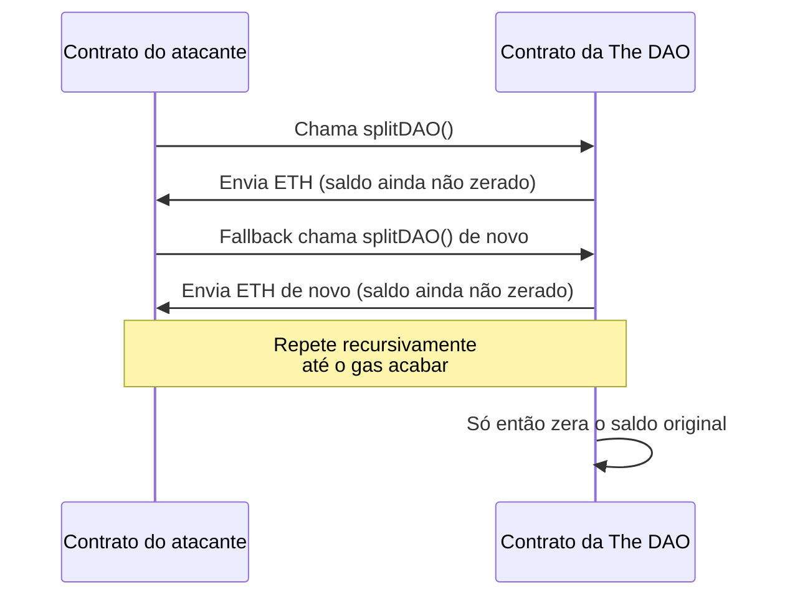
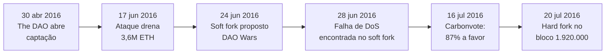

# Capítulo 20: A História da The DAO e o Hard Fork de 2016

**A promessa que o Capítulo 19 deixou em aberto.** Ao descrever como funciona hoje o voto on-chain numa DAO, o Capítulo 19 tratou da governança de aplicações construídas sobre o Ethereum, a Uniswap, a Compound, a Arbitrum, e terminou anotando que faltava contar "o episódio que primeiro forçou a comunidade Ethereum a votar coletivamente sobre o destino da própria cadeia". Este capítulo é esse episódio. Ele se passa menos de um ano depois do bloco Genesis que o Capítulo 1 descreveu, numa época em que o Ethereum ainda era uma rede jovem, sem EIP-1559, sem proof-of-stake, sem nenhum dos padrões de governança que o Capítulo 19 catalogou, e por isso mesmo é um capítulo fundacional: a primeira vez que a promessa de imutabilidade de uma blockchain foi testada por um incidente real, com dinheiro real, e a comunidade teve que decidir, sem manual de instruções, o que fazer a respeito.

**O que era a The DAO, além do nome genérico.** Em 2016, a startup alemã Slock.it, especializada em fechaduras inteligentes conectadas à blockchain, propôs um experimento ambicioso: um fundo de investimento coletivo, sem gestor central, em que qualquer pessoa poderia comprar tokens de participação e depois votar em quais projetos o fundo financiaria. O nome escolhido, The DAO, virou sinônimo do conceito inteiro por ironia da história, já que era apenas uma DAO entre as muitas que existiriam depois. A arrecadação abriu em 30 de abril de 2016 e durou 28 dias, e o resultado surpreendeu até os próprios criadores: mais de 11 mil investidores entregaram cerca de 12,7 milhões de ETH, perto de 150 milhões de dólares na cotação da época, tornando a The DAO o maior projeto de financiamento coletivo já visto até então, em qualquer setor. O detalhe que dá a real dimensão do risco que estava sendo concentrado num único contrato: essa quantia representava perto de 14% de todo o ETH em circulação naquele momento.

**A falha técnica: uma função que pagava antes de atualizar seu próprio registro.** O contrato da The DAO permitia que qualquer participante insatisfeito saísse do fundo via uma função chamada splitDAO, que devolvia a parcela de ETH correspondente e criava uma "child DAO" separada para abrigá-la. O problema estava na ordem das operações dentro dessa função: ela enviava o ETH de volta ao endereço que pedia a saída antes de atualizar o saldo interno daquele endereço para zero. Isso pode parecer um detalhe irrelevante, mas abre uma brecha conhecida hoje como ataque de reentrância: se o endereço que recebe o ETH for, na verdade, um contrato malicioso, o código desse contrato pode, no meio do próprio recebimento, chamar splitDAO de novo, e como o saldo antigo ainda não foi zerado, o contrato da The DAO paga de novo, e de novo, numa recursão que só para quando o gas se esgota ou o atacante decide parar. É o equivalente a um caixa eletrônico que entrega a nota antes de debitar da conta, e aceita processar um novo saque enquanto o primeiro ainda está em andamento.

*O diagrama mostra por que a ordem das operações importa: o contrato pagava a cada chamada recursiva antes de atualizar o próprio registro interno, permitindo múltiplos saques a partir de um único saldo.*

**O ataque em si, e a corrida contra o relógio que ele abriu.** Em 17 de junho de 2016, alguém explorou exatamente essa falha e drenou cerca de 3,6 milhões de ETH, perto de 30% de tudo que a The DAO guardava, para uma child DAO separada, batizada informalmente de Dark DAO. A boa notícia relativa, dentro do desastre, era estrutural: as mesmas regras do contrato que tornaram o ataque possível também impunham um período de carência de cerca de 27 dias antes que qualquer ETH movido para uma child DAO pudesse de fato ser sacado para fora do sistema, o chamado creation window. Isso não desfazia o ataque, mas comprava tempo, o suficiente para a comunidade tentar reagir antes que o autor do ataque conseguisse converter aqueles ETH em algo fora do alcance de qualquer solução na própria rede.

**A reação improvisada: um grupo de white hats usando a mesma falha para proteger o resto.** Enquanto a comunidade debatia o que fazer, um grupo autodenominado Robin Hood Group, formado por desenvolvedores do próprio ecossistema, decidiu usar a mesma vulnerabilidade de reentrância contra o relógio: se o atacante conseguia drenar fundos por essa brecha, eles também conseguiriam, só que com a intenção declarada de proteger o que restava até uma solução legítima aparecer. Com a cooperação de grandes detentores de tokens da The DAO, que cederam voluntariamente seu poder de voto para a operação, o grupo conseguiu mover cerca de 7,2 milhões de ETH, mais de metade do que ainda estava em risco, para uma child DAO sob seu controle, enquanto o atacante original tentava, sem sucesso completo, rastrear e replicar os movimentos do grupo numa disputa que a imprensa da época comparou a um jogo de gato e rato dentro da própria blockchain.

**A primeira ideia de correção, e por que foi abandonada às pressas.** A resposta inicial mais discutida não era reescrever a história da cadeia, era um soft fork, uma mudança de regras compatível com versões anteriores do software, que simplesmente impediria que qualquer ETH ligado ao contrato da The DAO fosse movido, congelando o problema no lugar sem alterar nenhum bloco já minerado. A Ethereum Foundation chegou a publicar, em 24 de junho de 2016, uma versão do cliente Geth preparada para esse soft fork. Quatro dias depois, em 28 de junho, um alerta de segurança revelou que o desenho do soft fork continha uma falha própria: ele abria uma brecha de negação de serviço, permitindo que um atacante inundasse a rede com transações computacionalmente caras que fariam os mineradores que adotassem o soft fork gastar recursos processando-as sem nunca coletar a taxa correspondente. Diante do risco de trocar um problema por outro, a ideia do soft fork foi abandonada, e restaram só duas opções sobre a mesa: não fazer nada, ou partir para um hard fork, uma mudança incompatível com o histórico anterior da cadeia.

**O debate de fundo: imutabilidade como princípio absoluto ou como regra negociável.** É aqui que a discussão deixou de ser puramente técnica. Um hard fork que reescrevesse transações já confirmadas contradizia, na visão de uma parte da comunidade, a própria razão de existir de uma blockchain: se o histórico pode ser mudado quando o resultado desagrada gente suficiente, a promessa de imutabilidade e resistência à censura vira uma promessa condicional. Esse lado do debate ficou conhecido pelo lema "code is law", código é lei, o contrato fez exatamente o que estava escrito, e o autor do ataque não fez nada além de seguir regras publicamente visíveis. O outro lado argumentava que 14% de todo o ETH em circulação concentrado num roubo, afetando milhares de investidores de um projeto ainda em fase de testes de mercado, era um evento excepcional o bastante para justificar uma correção excepcional, e que a rede sobreviveria melhor reconhecendo isso do que se apegando a um princípio abstrato num momento em que a própria confiança pública no Ethereum estava em jogo. Vitalik Buterin resumiu publicamente esse dilema num post de 15 de julho de 2016, "To Fork or Not to Fork", reconhecendo que nenhuma das duas saídas estava livre de custos.

**Uma votação improvisada, e o eco que ela deixaria dez anos depois.** Para tentar medir o apetite real da comunidade antes de decidir, surgiu a Carbonvote, uma ferramenta simples que deixava qualquer detentor de ETH assinar uma mensagem a favor ou contra o hard fork, com peso proporcional à quantidade de ETH na carteira usada para assinar, sem custo de gas e sem vínculo formal com o resultado final. Em 16 de julho de 2016, apenas 4.542.416 ETH participaram, cerca de 5,5% de todo o suprimento então existente, e desses, 87% (3.964.516 ETH) votaram a favor do hard fork contra 13% (577.899 ETH) contrários, com a ressalva de que um quarto de todo o voto favorável veio de um único endereço. É difícil não notar o paralelo com o que o Capítulo 19 documentou sobre governança de DAOs quase dez anos depois: participação baixa, resultado esmagador, e poder concentrado em poucas mãos decidindo por todo o resto. A diferença é que em 2016 não existia contrato Governor, não existia quorum mínimo formal, não existia timelock, a Carbonvote era só um termômetro sem peso jurídico algum, e ainda assim moldou a decisão que se seguiu.

*A linha do tempo mostra como pouco mais de um mês separou o ataque da decisão final, com o soft fork abandonado no meio do caminho por uma falha própria.*

**O hard fork em si, bloco por bloco.** Em 20 de julho de 2016, no bloco 1.920.000, a rede Ethereum executou aquilo que a comunidade batizou, com uma boa dose de eufemismo, de "irregular state change": uma alteração de estado que não seguia o fluxo normal de transações assinadas, movendo diretamente o ETH que estava preso na Dark DAO do atacante e na child DAO do próprio Robin Hood Group para um novo contrato chamado WithdrawDAO, de onde cada investidor original podia resgatar sua parcela proporcional em ETH comum. Cerca de 85% do poder de mineração da rede passou a construir blocos sobre essa nova versão da história, o suficiente para que ela se tornasse, na prática, a cadeia que o mercado, as exchanges e a maior parte do ecossistema passaram a reconhecer como "o" Ethereum.

**A minoria que discordou, e como ela virou uma rede própria.** Nem todo mundo migrou. Uma fração dos mineradores e usuários, fiel ao princípio de que a história da blockchain não deveria ser alterada em nenhuma circunstância, continuou minerando a versão original da cadeia, na qual o ataque de junho permanece registrado como uma transação válida entre tantas outras. Essa cadeia minoritária ganhou nome próprio, Ethereum Classic (ETC), e segue existindo até hoje como uma rede separada, com sua própria comunidade, seu próprio token e sua própria filosofia de imutabilidade sem exceções. É o único caso, entre todos os episódios de segurança que este caderno ainda vai cobrir, em que a resposta a um incidente não terminou apenas em código corrigido, terminou numa cisão permanente da própria rede.

| Aspecto | Ethereum (ETH) | Ethereum Classic (ETC) |
| --- | --- | --- |
| Postura sobre o hack | Reverteu o ataque via hard fork | Manteve o histórico original, ataque incluso |
| Princípio declarado | Imutabilidade é importante, mas não absoluta diante de um evento excepcional | "Code is law", imutabilidade sem exceção |
| Poder de mineração em jul/2016 | ~85% | ~15% |
| Caminho técnico posterior | Seguiu para proof-of-stake em 2022 (Capítulo 2) | Permaneceu em proof-of-work |
| Papel hoje no ecossistema | Rede principal deste caderno | Rede minoritária, mantida por uma comunidade própria |

**A consequência legal que só apareceu um ano depois.** O episódio não terminou no bloco 1.920.000. Em 25 de julho de 2017, a SEC, reguladora do mercado de capitais dos Estados Unidos, publicou um relatório de investigação concluindo que os tokens da The DAO eram, na prática, valores mobiliários, contratos de investimento sob a lei americana, porque quem comprava esperava lucro a partir do esforço gerencial de terceiros, os curadores do projeto. O relatório não abriu um processo formal contra ninguém, mas deixou um aviso explícito para todo o mercado de ofertas de tokens então em ascensão: a forma como um token é vendido e o que se promete a quem compra podem enquadrá-lo nas mesmas regras que já existem há décadas para ações e outros instrumentos financeiros, independentemente do nome que o projeto escolha para si.

**O legado técnico que sobrevive em toda auditoria de contrato até hoje.** Se o debate sobre imutabilidade ficou para a história, a lição de segurança técnica ficou para o presente. O erro de ordem de operações que tornou o ataque possível, pagar antes de atualizar o próprio estado interno, deu nome a um padrão de correção hoje ensinado a qualquer pessoa que escreve Solidity: checks-effects-interactions, a regra de primeiro validar as condições, depois atualizar todas as variáveis internas, e só então fazer qualquer chamada externa que possa devolver o controle a um contrato de terceiros. Ataques de reentrância continuam acontecendo quase dez anos depois, a categoria ainda ocupa posição de destaque em listas como o OWASP Smart Contract Top 10, mas hoje existem ferramentas de auditoria automatizada, padrões de biblioteca como guardas de reentrância prontos, e uma cultura de revisão de código que simplesmente não existia em 2016, quando a The DAO foi lançada com o contrato mais escrutinado do momento e ainda assim carregava essa falha.

**Por que este capítulo pertence à espinha dorsal do caderno, e não é só uma curiosidade histórica.** O Capítulo 19 descreveu como o voto em DAOs de aplicação amadureceu, com contratos Governor auditados, quorum formal e timelock. Esse amadurecimento não surgiu no vácuo, ele é, em boa parte, resposta direta ao que a The DAO expôs: que decisões urgentes tomadas sob pressão, sem processo formal e com participação baixa, são frágeis mesmo quando o resultado parece certo. O hard fork de 2016 resolveu o problema imediato, devolveu fundos a milhares de investidores e evitou que o pior ataque da curta história do Ethereum até então destruísse a confiança no projeto ainda em sua infância, mas fez isso ao custo de uma cisão permanente da rede e de um precedente sobre até onde a imutabilidade vai quando o suficiente está em jogo. Esse é o tipo de tensão que não se resolve de vez, ela só muda de forma, e reaparece, em escala menor, toda vez que uma comunidade precisa decidir se um contrato com bug merece ser corrigido pela força ou aceito como está.

**Glossário do capítulo.**
- **The DAO**: fundo de investimento coletivo lançado em 2016 sobre o Ethereum, cujo ataque e posterior hard fork deram nome ao episódio mais decisivo da governança do próprio protocolo.
- **Reentrância (reentrancy)**: falha em que um contrato faz uma chamada externa antes de atualizar seu próprio estado interno, permitindo que o destinatário da chamada invoque a mesma função de novo antes da primeira execução terminar.
- **Checks-effects-interactions**: padrão de segurança em Solidity que exige validar condições, depois atualizar o estado interno, e só então fazer chamadas externas, nessa ordem.
- **Child DAO**: contrato secundário criado pela função de saída da The DAO para onde a parcela de ETH de quem se retirava era temporariamente movida, sujeita a um período de carência.
- **Soft fork**: mudança de regras de consenso compatível com o histórico e o software anteriores da rede.
- **Hard fork**: mudança de regras de consenso incompatível com versões anteriores, capaz de dividir a rede em duas cadeias separadas se nem todos os participantes adotarem a mudança.
- **Irregular state change**: alteração de estado da blockchain fora do fluxo normal de transações assinadas, usada no bloco 1.920.000 para mover o ETH da The DAO ao contrato de resgate.
- **Code is law**: princípio segundo o qual o resultado de um contrato inteligente deve ser aceito como definitivo, mesmo quando decorre de uma falha, sem intervenção externa.
- **Carbonvote**: ferramenta informal de votação por assinatura usada em 2016 para medir o apoio da comunidade ao hard fork, sem peso jurídico ou vínculo formal com a decisão final.
- **Ethereum Classic (ETC)**: rede que manteve a versão original da cadeia, incluindo o ataque de 2016, após a minoria dos mineradores rejeitar o hard fork.

**Fontes.**
- [The DAO — Wikipedia (EN)](https://en.wikipedia.org/wiki/The_DAO)
- [CRITICAL UPDATE Re: DAO Vulnerability — Ethereum Foundation Blog](https://blog.ethereum.org/2016/06/17/critical-update-re-dao-vulnerability)
- [Security Alert - DoS Vulnerability in the Soft Fork — Ethereum Foundation Blog](https://blog.ethereum.org/2016/06/28/security-alert-dos-vulnerability-in-the-soft-fork)
- [To fork or not to fork — Ethereum Foundation Blog](https://blog.ethereum.org/2016/07/15/to-fork-or-not-to-fork)
- [Hard Fork Completed — Ethereum Foundation Blog](https://blog.ethereum.org/2016/07/20/hard-fork-completed)
- [DAO Hack Explained: How a Vulnerability Split Ethereum — Gemini Cryptopedia](https://www.gemini.com/cryptopedia/the-dao-hack-makerdao)
- [CoinDesk Turns 10: 2016 - How The DAO Hack Changed Ethereum and Crypto — CoinDesk](https://www.coindesk.com/consensus-magazine/2023/05/09/coindesk-turns-10-how-the-dao-hack-changed-ethereum-and-crypto)
- [The DAO Heist Undone: 97% of ETH Holders Vote for the Hard Fork — Futurism](https://futurism.com/the-dao-heist-undone-97-of-eth-holders-vote-for-the-hard-fork)
- [Ethereum Classic — Wikipedia (EN)](https://en.wikipedia.org/wiki/Ethereum_Classic)
- [How Coders Hacked Back to 'Rescue' $208 Million in Ethereum — Vice](https://www.vice.com/en/article/how-ethereum-coders-hacked-back-to-rescue-dollar208-million-in-ethereum/)
- [SEC Issues Investigative Report Concluding DAO Tokens, a Digital Asset, Were Securities — SEC.gov](https://www.sec.gov/newsroom/press-releases/2017-131)
- [OWASP Smart Contract Top 10 — SC01: Reentrancy Attacks](https://owasp.org/www-project-smart-contract-top-10/2023/en/src/SC01-reentrancy-attacks.html)
