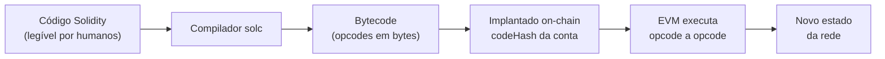
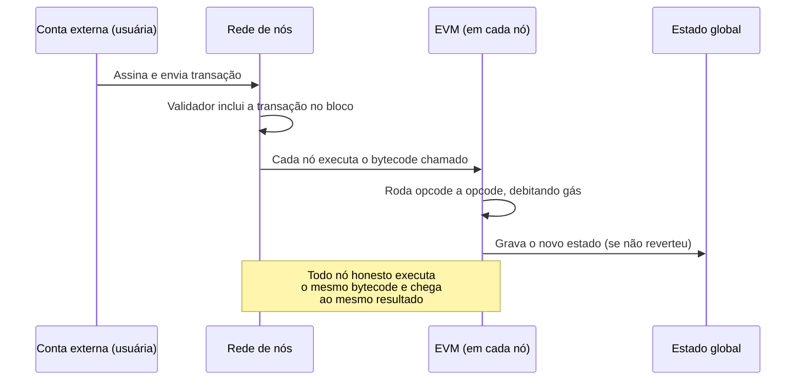

# Capítulo 21: Contratos Inteligentes e a EVM, Como o Código Roda de Fato

**Uma dívida deixada pelo Capítulo 20.** Ao contar a história da The DAO, o Capítulo 20 explicou em detalhe uma falha específica, a reentrância, e o padrão que nasceu dela, checks-effects-interactions. Mas todo aquele raciocínio pressupunha algo que ainda não tinha sido explicado: o que é, exatamente, a máquina que executa um contrato escrito em Solidity, e por que a ordem das instruções dentro dela importa tanto a ponto de decidir se milhões de dólares ficam presos ou não. Este capítulo fecha essa lacuna. Em vez de olhar para um incidente específico, ele abre o motor por dentro: a Ethereum Virtual Machine, ou EVM, o ambiente de execução que roda literalmente todo contrato inteligente já implantado no Ethereum e em toda rede compatível, de Layer 2 a sidechain.

**O Ethereum como computador, não como planilha.** O Capítulo 1 já descreveu a diferença fundamental entre Bitcoin e Ethereum como a diferença entre uma calculadora de um botão só e um computador de propósito geral. A EVM é onde essa metáfora vira mecanismo concreto. Ela é uma máquina de estados quase-Turing-completa, definida pela primeira vez de forma matematicamente precisa no Yellow Paper, o artigo técnico que Gavin Wood, um dos cofundadores citados no Capítulo 1 e criador da própria linguagem Solidity, publicou junto com o lançamento do Ethereum. "Quase" Turing-completa porque, ao contrário de um computador comum, a EVM nunca roda um programa indefinidamente: todo cálculo é limitado por um orçamento finito, o gás, que o Capítulo 16 já explicou em profundidade do ponto de vista econômico e que aqui aparece pelo lado técnico, como o medidor que impede qualquer contrato de travar a rede inteira num laço infinito.

**Do código-fonte ao que a rede realmente executa.** Ninguém escreve diretamente na linguagem que a EVM entende. Um contrato nasce como código Solidity, legível por humanos, e passa por um compilador, o solc, que o traduz em bytecode, uma sequência de instruções de baixo nível chamadas opcodes, cada uma representada por um único byte. Operações como somar dois números, ler uma posição de memória, escrever em armazenamento permanente ou chamar outro contrato correspondem, cada uma, a um opcode específico, com nome mnemônico (ADD, SLOAD, SSTORE, CALL) usado só para facilitar a leitura humana do bytecode, já que a EVM em si só enxerga os bytes brutos. É esse bytecode, não o código Solidity original, que fica registrado on-chain quando um contrato é implantado, e é sobre ele que cada nó da rede roda a mesma sequência de operações, chegando sempre ao mesmo resultado, o que é a própria definição de consenso determinístico.


*O diagrama mostra que o que fica gravado na blockchain e é executado pela EVM é o bytecode compilado, não o código-fonte em Solidity que serviu apenas de ponto de partida.*

**Os três espaços de dados que todo contrato usa, e por que confundi-los custa caro.** Dentro da EVM, um contrato em execução tem à disposição três lugares distintos para guardar informação, cada um com uma regra de persistência e um custo de gás muito diferente. A pilha (stack) é onde a maioria das operações acontece de fato, uma estrutura de até 1.024 posições, cada uma capaz de guardar um número de 256 bits, tamanho escolhido porque encaixa bem com o hash Keccak-256 e com a aritmética de curvas elípticas usada nas assinaturas. A memória é um espaço temporário, endereçável por byte, que existe só durante a execução da transação atual e desaparece depois, útil para cálculos intermediários. O armazenamento (storage) é o único dos três que persiste entre transações, um dicionário de chave para valor, ambos de 256 bits, associado a cada conta de contrato e gravado permanentemente no estado da rede, justamente por isso o mais caro de todos para escrever. Existe ainda o calldata, um espaço somente leitura onde ficam os dados enviados junto com a chamada à função, mais barato de acessar que a memória porque não pode ser alterado.

| Espaço | Persiste entre transações? | Custo relativo | Uso típico |
| --- | --- | --- | --- |
| Stack | Não, é limpa a cada execução | Muito baixo | Operações aritméticas e lógicas, argumentos de opcodes |
| Memory | Não, existe só durante a transação atual | Baixo, cresce com o tamanho usado | Buffers temporários, dados que uma função monta e descarta |
| Storage | Sim, gravado no estado da rede | Alto, especialmente na primeira escrita | Variáveis de estado do contrato, saldos, mapeamentos |
| Calldata | Não se aplica, é entrada somente leitura | Baixo | Parâmetros recebidos numa chamada externa |

**O gás não é um número abstrato, é a soma de cada opcode executado.** O Capítulo 16 tratou o gás como mecanismo de mercado, a base fee que sobe e desce, a parte que é queimada. Aqui, o gás aparece na sua origem mais concreta: cada opcode tem um custo fixo predefinido no Yellow Paper, e o total pago por uma transação é a soma de todos os opcodes que ela efetivamente disparou ao rodar, do início ao fim. A EIP-2929, ativada no hard fork Berlin de 2021, tornou esse cálculo ainda mais sensível ao contexto, introduzindo a distinção entre acesso frio e acesso quente: a primeira vez que uma transação lê ou escreve um determinado espaço de armazenamento, ou chama um determinado endereço, ela paga o preço cheio (acesso frio), mas qualquer acesso repetido ao mesmo espaço dentro da mesma transação sai bem mais barato (acesso quente), porque o nó já tem aquele dado carregado. Na prática, isso significa que a ordem e a repetição de operações dentro de um contrato têm impacto direto no custo, e é uma das razões pelas quais otimizar Solidity para gás é uma habilidade técnica reconhecida, não um detalhe cosmético.

```latex
\text{gás total da transação} = \text{gás intrínseco} + \sum_{i=1}^{n} \text{custo}(\text{opcode}_i)
```

**Duas espécies de conta, uma só árvore de estado.** O Ethereum tem apenas dois tipos de conta, e a diferença entre elas explica boa parte de como contratos interagem com pessoas. Uma conta de propriedade externa (EOA, externally owned account) é controlada por uma chave privada, não tem código associado, e é o único tipo de conta capaz de iniciar uma transação assinando-a, o assunto que um capítulo futuro deste caderno vai aprofundar quando tratar de carteiras. Uma conta de contrato, por outro lado, não tem chave privada nenhuma, é controlada inteiramente pelo bytecode implantado nela, e só age quando é chamada, seja por uma EOA, seja por outro contrato. Ambas compartilham a mesma estrutura de estado, um conjunto de quatro campos guardado numa estrutura de dados chamada árvore de Merkle Patricia: o nonce (contador de transações enviadas, no caso de uma EOA, ou de contratos criados, no caso de um contrato), o saldo em wei, o hash do código associado, vazio para EOAs, e a raiz da própria árvore de armazenamento daquela conta.

| Aspecto | Conta de propriedade externa (EOA) | Conta de contrato |
| --- | --- | --- |
| Controlada por | Chave privada | Bytecode implantado |
| Pode iniciar uma transação sozinha? | Sim | Não, só reage a uma chamada |
| Tem código associado? | Não (codeHash vazio) | Sim |
| Tem armazenamento próprio? | Não | Sim, sua própria storage trie |
| Exemplo | Carteira de um usuário | Um contrato de token, um AMM, um vault de empréstimo |

**Uma transação, do clique até o novo estado da rede.** Encadear tudo isso ajuda a visualizar o que acontece entre o momento em que alguém assina uma transação e o momento em que ela vira parte permanente da história do Ethereum. A transação sai de uma EOA, assinada com a chave privada correspondente, e se propaga pela rede de nós até ser incluída num bloco por um validador, o papel que o Capítulo 2 descreveu em detalhe. A partir daí, cada nó da rede, não só o validador que montou o bloco, roda de forma independente o mesmo bytecode na sua própria cópia da EVM, opcode a opcode, debitando gás a cada passo, até a execução terminar com sucesso ou reverter. Se todos os nós honestos chegam ao mesmo resultado final, exatamente o ponto que torna a EVM uma máquina determinística, o novo estado é aceito e a raiz da árvore de estado global se atualiza, refletindo o novo saldo, a nova posição de armazenamento, o novo o que quer que o contrato tenha alterado.


*O diagrama mostra por que a EVM precisa ser determinística: sem isso, nós diferentes chegariam a estados diferentes e a rede não teria como concordar sobre qual é a verdade.*

**Uma reforma que a própria comunidade ainda não conseguiu terminar.** A EVM não é uma peça de museu parada desde 2015, mas mudá-la é notoriamente difícil, porque qualquer alteração precisa ser replicada de forma idêntica em todo cliente de execução (o tema de um capítulo futuro deste caderno). O exemplo mais recente dessa dificuldade é o EVM Object Format, ou EOF, uma reformulação estrutural do bytecode que separaria código de dados dentro de um contrato, permitindo que os nós validem um contrato uma única vez, no momento da implantação, em vez de repetir parte dessa validação a cada execução, além de vedar alguns padrões de código considerados frágeis. O EOF chegou a ser planejado para a atualização Pectra, foi adiado dali por falta de tempo de maturação, chegou a ser cogitado outra vez para a atualização Fusaka, ativada em dezembro de 2025, e acabou removido também dessa janela, por causa de incertezas técnicas remanescentes e da prioridade dada ao PeerDAS, a tecnologia de escalabilidade de dados que o Capítulo 10 mencionou a caminho do Glamsterdam. O EOF continua na mesa para uma atualização futura, mas o histórico dele é um lembrete útil de que, mesmo depois de dez anos de operação ininterrupta, mudar as regras internas da máquina que roda todo contrato inteligente do Ethereum é um processo lento por design, não por acidente.

**Por que entender a EVM muda como se lê o resto do caderno.** Boa parte do que os capítulos anteriores descreveram como comportamento de protocolo ou de aplicação tem, na raiz, uma explicação na camada que este capítulo cobriu. A reentrância do Capítulo 20 só é possível porque uma chamada externa (opcode CALL) pode devolver o controle de execução a outro contrato antes que o primeiro atualize seu próprio storage. A oscilação da base fee do Capítulo 16 existe porque cada opcode tem um custo em gás que precisa ser pago em ETH, e o mercado desse gás é o que a EIP-1559 organiza. Até os pools de liquidez do Capítulo 11 e os mercados de empréstimo do Capítulo 12 são, debaixo do capô, sequências de opcodes de leitura e escrita em storage, disparadas por chamadas de contrato para contrato. Entender a EVM não substitui nenhum desses capítulos, mas dá o vocabulário técnico comum que conecta todos eles.

**Glossário do capítulo.**
- **EVM (Ethereum Virtual Machine)**: máquina de estados que executa o bytecode de todo contrato inteligente do Ethereum, de forma determinística e limitada por gás.
- **Opcode**: instrução individual de baixo nível, representada por um byte, que a EVM sabe executar (por exemplo ADD, SLOAD, CALL).
- **Bytecode**: sequência de opcodes gerada pela compilação de um contrato, é o que de fato fica gravado e é executado on-chain.
- **Stack**: pilha de até 1.024 posições de 256 bits onde a maior parte das operações da EVM acontece, limpa a cada execução.
- **Storage**: armazenamento permanente de uma conta de contrato, o único dos espaços de dados da EVM que persiste entre transações.
- **Calldata**: espaço somente leitura que carrega os dados enviados numa chamada de função.
- **Conta de propriedade externa (EOA)**: conta controlada por chave privada, sem código associado, o único tipo capaz de iniciar uma transação.
- **Conta de contrato**: conta controlada por bytecode implantado, sem chave privada, que só age em resposta a uma chamada.
- **Acesso frio e acesso quente (EIP-2929)**: distinção de custo de gás entre a primeira leitura ou escrita de um dado numa transação (frio, mais caro) e acessos repetidos ao mesmo dado (quente, mais barato).
- **EOF (EVM Object Format)**: proposta de reestruturação do formato do bytecode, adiada de Pectra e depois removida de Fusaka, ainda em discussão para uma atualização futura.

**Fontes.**
- [Ethereum Yellow Paper — GitHub (ethereum/yellowpaper)](https://github.com/ethereum/yellowpaper)
- [Understanding the Yellow Paper's EVM Specifications — ethereum.org](https://ethereum.org/developers/tutorials/yellow-paper-evm/)
- [EIP-2929: Gas cost increases for state access opcodes — Ethereum EIPs](https://eips.ethereum.org/EIPS/eip-2929)
- [Ethereum accounts — Alchemy Docs](https://www.alchemy.com/docs/ethereum-accounts)
- [Understanding Ethereum Accounts — Etherscan Information Center](https://info.etherscan.com/understanding-ethereum-accounts/)
- [Everything about the EVM Object Format (EOF) — HackMD (Ipsilon)](https://notes.ethereum.org/@ipsilon/evm-object-format-overview)
- [Ethereum's Fusaka Upgrade Drops EVM Object Format for Safety — Coincu](https://bitcoinethereumnews.com/ethereum/ethereums-fusaka-upgrade-drops-evm-object-format-for-safety-coincu/)
- [Ethereum's Pectra Upgrade Set for May 7, EOF Delayed — Icoholder](https://icoholder.com/en/news/ethereums-pectra-upgrade-set-for-may-7-eof-delayed)
- [Using the Compiler — Solidity documentation](https://docs.soliditylang.org/en/latest/using-the-compiler.html)
- [Ethereum in Depth, Part 2 — OpenZeppelin Blog](https://www.openzeppelin.com/news/ethereum-in-depth-part-2-6339cf6bddb9)
