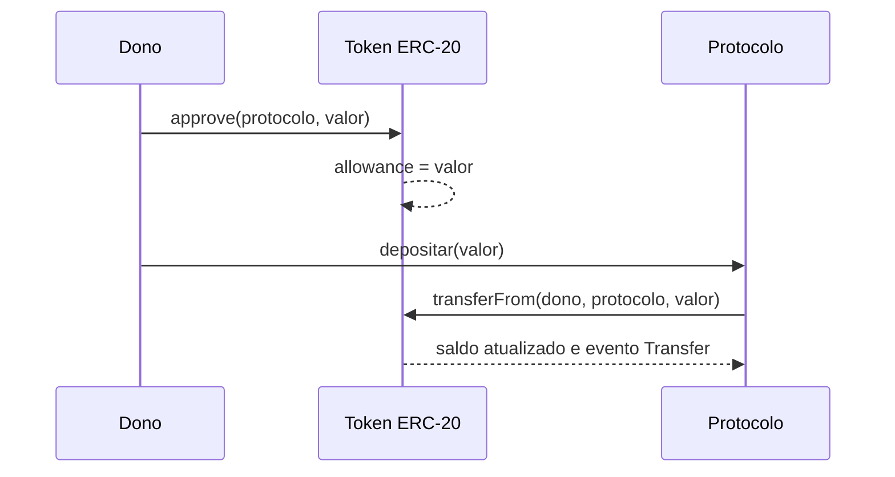
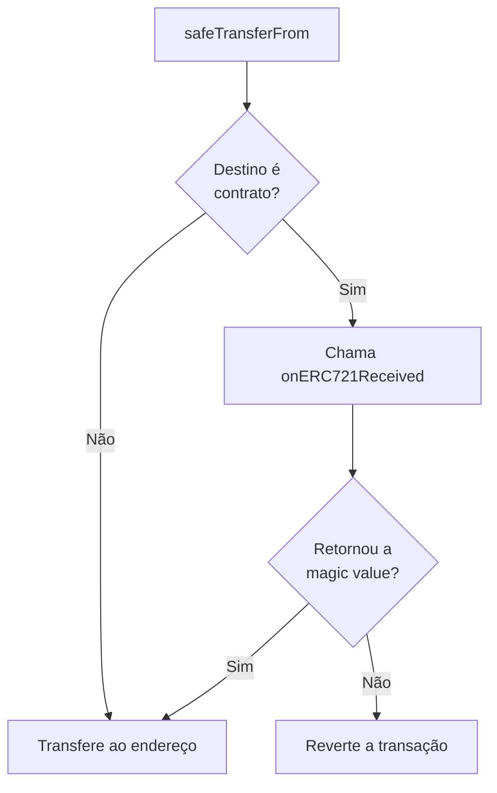

# Capítulo 22: Padrões de Token, ERC-20 e ERC-721 na Prática

**O que um padrão resolve.** O Capítulo 21 mostrou que um contrato inteligente é só bytecode rodando na EVM, com as funções que o autor quis expor. Isso deixa uma pergunta prática: como uma carteira, uma exchange descentralizada ou um protocolo de empréstimo consegue falar com milhares de contratos escritos por pessoas diferentes sem conhecer cada um deles? A resposta são os padrões de token. Um padrão é um acordo público sobre quais funções e quais eventos um contrato deve ter, com nomes e assinaturas idênticos. Quem segue o acordo é reconhecido automaticamente pelo resto do ecossistema. No Ethereum, esses acordos nascem como propostas (EIPs, e no caso dos padrões de aplicação, ERCs) discutidas abertamente. Este capítulo olha de perto os dois mais importantes, o ERC-20 e o ERC-721, e cita rapidamente os que vieram depois.

**ERC-20, o padrão dos tokens fungíveis.** A proposta foi aberta como uma issue no GitHub em 19 de novembro de 2015, tendo Vitalik Buterin como proponente inicial, e o texto final tem como autores Fabian Vogelsteller e Vitalik Buterin. A ideia central é que um token não é um objeto especial da rede, como o ETH: é apenas um contrato com uma tabela interna de saldos. Os "tokens" de uma pessoa são uma linha nessa tabela, e transferir é reescrever duas linhas. Tudo isso é um caso concreto do que o Capítulo 21 chamou de storage de uma conta de contrato. O padrão exige cinco funções essenciais, `totalSupply()`, `balanceOf()`, `transfer()`, `transferFrom()` e `approve()`, mais a consulta `allowance()`, e três funções opcionais de metadados, `name()`, `symbol()` e `decimals()`. Também exige dois eventos, `Transfer` e `Approval`, que são os registros que explorers e carteiras leem para montar o histórico.

**As casas decimais.** A EVM não trabalha com números fracionários, então todo saldo é um inteiro. O campo `decimals` diz quantas casas decimais o saldo inteiro carrega. A própria especificação dá o exemplo: com 8 decimais, divide-se o valor por 100.000.000 para obter a representação humana. A relação é simples:

```latex
valor_exibido = saldo_inteiro / 10^decimals
```
*A fórmula mostra que o contrato guarda apenas inteiros e que a interface da carteira é quem divide por 10 elevado a decimals para exibir o número que a pessoa reconhece.*

**Aprovar e depois gastar, o padrão de duas etapas.** A função `transfer()` só move tokens de quem chama. Mas um contrato como o de uma exchange descentralizada (Capítulo 11) ou de um protocolo de empréstimo (Capítulo 12) precisa puxar tokens da carteira de alguém dentro de uma única chamada sua. Para isso existe o par `approve()` e `transferFrom()`: primeiro o dono autoriza um gastador a mover até certa quantidade, registrada no `allowance`, e depois o gastador executa a movimentação. É por isso que quase toda interação inicial com um protocolo DeFi pede duas assinaturas, uma de aprovação e outra da ação em si.


*O diagrama mostra o fluxo de duas etapas: o dono autoriza o protocolo no contrato do token e, na chamada seguinte, o protocolo usa essa autorização para puxar os tokens.*

**Um risco embutido no desenho.** A especificação do ERC-20 avisa sobre uma condição de corrida no `approve()`: se alguém troca a autorização de um gastador de um valor para outro, o gastador pode tentar gastar o valor antigo e depois o novo. Por isso o texto recomenda que interfaces zerem o `allowance` antes de defini-lo com outro valor para o mesmo gastador. Há um risco relacionado, de natureza mais humana do que técnica: aprovações muito grandes ou ilimitadas permanecem valendo depois que o uso terminou, e um contrato de gastador comprometido pode esvaziar o saldo autorizado. Revisar e revogar aprovações antigas é parte da higiene de segurança, tema que o caderno retoma quando chegar a carteiras e golpes.

**Permit, aprovar sem transação.** O ERC-2612, de Martin Lundfall, propõe uma extensão em que o dono assina uma mensagem off-chain, no formato do EIP-712, com dono, gastador, valor e um prazo (`deadline`). Qualquer um pode enviar essa assinatura ao contrato pela função `permit`, que altera o `allowance` sem que o dono precise pagar gás por uma transação de aprovação. Um contador (`nonces`) impede que a mesma assinatura seja reaproveitada. O efeito prático é fundir aprovação e uso em uma etapa só.

**ERC-721, quando cada unidade é única.** Em 24 de janeiro de 2018 foi criado o ERC-721, por William Entriken, Dieter Shirley, Jacob Evans e Nastassia Sachs. Aqui o contrato não guarda um saldo por endereço, mas um dono por identificador. Cada ativo recebe um `uint256` permanente durante toda a vida do contrato, e o par (endereço do contrato, `tokenId`) o identifica de forma única no mundo. A especificação orienta tratar esses IDs como caixas-pretas, sem assumir que sejam sequenciais. As funções centrais são `balanceOf()` e `ownerOf()` para consulta, `transferFrom()` e `safeTransferFrom()` para transferência, e `approve()` e `setApprovalForAll()` para delegação, com os eventos `Transfer`, `Approval` e `ApprovalForAll`.

**A transferência segura.** Um dos problemas antigos dos tokens é enviá-los a um contrato que não sabe manipulá-los, o que os deixa presos para sempre. O ERC-721 responde com `safeTransferFrom()`: se o destino é um contrato, o token chama nele a função `onERC721Received()` e exige um valor de retorno específico, a "magic value". Sem essa resposta, a transferência é revertida.


*O desenho mostra que a transferência segura só se completa quando o destino é uma conta comum ou um contrato que declarou saber receber o token.*

**Metadados e o que o NFT realmente guarda.** A extensão opcional de metadados define `name()`, `symbol()` e `tokenURI()`, e a URI aponta para um JSON com nome, descrição e imagem. Isso tem uma consequência conceitual importante: o contrato costuma registrar apenas o dono e um ponteiro. O conteúdo em si, como a imagem, normalmente vive fora da cadeia, e a garantia de que ele continua disponível depende de onde o ponteiro aponta. O padrão também exige o ERC-165, a função `supportsInterface()`, que permite a aplicações perguntar a um contrato se ele implementa determinada interface antes de interagir.

**Outros padrões, em uma linha cada.** O ERC-1155 (criado em 17 de junho de 2018 por Witek Radomski e coautores) coloca vários tipos de token, fungíveis ou não, num único contrato, com transferência em lote (`safeBatchTransferFrom`) para reduzir o custo de gás. O ERC-4626 (criado em 22 de dezembro de 2021) padroniza cofres que emitem cotas de um token ERC-20 subjacente, com funções como `deposit`, `withdraw` e `convertToShares`, e facilita a integração entre protocolos de rendimento. Os tokens de recibo que o Capítulo 12 apresentou, como os aTokens, e a lógica de cotas do Capítulo 3 dialogam com essa ideia.

| Padrão | Natureza do token | Modelo de dados | Destaque |
| --- | --- | --- | --- |
| ERC-20 | Fungível | Saldo por endereço | `approve` e `transferFrom`, eventos `Transfer` e `Approval` |
| ERC-721 | Não fungível | Dono por `tokenId` | `safeTransferFrom` e `onERC721Received`, metadados via `tokenURI` |
| ERC-1155 | Fungível e não fungível | Saldo por par (endereço, id) | Transferência em lote, um contrato para vários tipos |
| ERC-4626 | Cotas de cofre | Cotas sobre um ERC-20 | `deposit`, `withdraw`, `convertToShares` |

**Por que isso importa para quem estuda o ecossistema.** Os padrões são a razão de a composabilidade existir. Uma stablecoin como a USDC (Capítulo 14) ou a DAI (Capítulo 15) pode ser aceita em qualquer pool ou protocolo justamente por falar ERC-20. Também é por eles que o tokenomics do Capítulo 18 pode ser implementado com contratos de vesting genéricos: todos manipulam a mesma interface. A contrapartida é que um padrão define o formato e não a honestidade do contrato: dois contratos ERC-20 são idênticos por fora e podem se comportar de forma muito diferente por dentro, inclusive com funções extras que criam novas unidades ou bloqueiam transferências. Ler o que o contrato realmente faz continua sendo tarefa de quem interage com ele.

**Glossário do capítulo.**
- **EIP e ERC**: propostas de melhoria do Ethereum; ERC designa as que tratam de padrões de aplicação, como os de token.
- **ERC-20**: padrão de token fungível, baseado em saldos por endereço.
- **ERC-721**: padrão de token não fungível, em que cada `tokenId` tem um dono.
- **ERC-1155**: padrão de múltiplos tipos de token num único contrato, com transferência em lote.
- **ERC-4626**: padrão de cofres tokenizados que emitem cotas de um ERC-20.
- **Allowance**: quantidade que um gastador está autorizado a mover em nome do dono de um token.
- **Decimals**: número de casas decimais usado para converter o saldo inteiro em valor legível.
- **Permit (ERC-2612)**: aprovação feita por assinatura off-chain, sem transação de approve.
- **safeTransferFrom**: transferência que verifica se o contrato de destino sabe receber o token.
- **ERC-165**: padrão de detecção de interface, via `supportsInterface()`.

**Fontes.**
- [ERC-20: Token Standard (texto da especificação) — repositório ethereum/ERCs](https://raw.githubusercontent.com/ethereum/ERCs/master/ERCS/erc-20.md)
- [ERC-721: Non-Fungible Token Standard — repositório ethereum/ERCs](https://raw.githubusercontent.com/ethereum/ERCs/master/ERCS/erc-721.md)
- [ERC-1155: Multi Token Standard — repositório ethereum/ERCs](https://raw.githubusercontent.com/ethereum/ERCs/master/ERCS/erc-1155.md)
- [ERC-2612: Permit Extension for EIP-20 Signed Approvals — repositório ethereum/ERCs](https://raw.githubusercontent.com/ethereum/ERCs/master/ERCS/erc-2612.md)
- [ERC-4626: Tokenized Vaults — repositório ethereum/ERCs](https://raw.githubusercontent.com/ethereum/ERCs/master/ERCS/erc-4626.md)
- [Issue original do ERC-20 (ethereum/EIPs #20)](https://github.com/ethereum/EIPs/issues/20)
