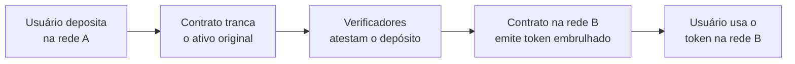
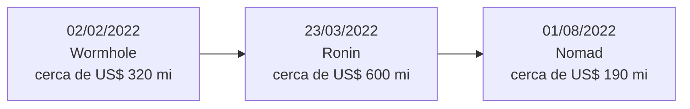

# Capítulo 23: Interoperabilidade, Pontes entre Chains e seus Riscos

**O problema de blockchains que não se enxergam.** Cada blockchain é um sistema fechado: o Ethereum sabe o saldo de cada endereço no Ethereum e nada mais. Uma rede não tem como verificar, por conta própria, o que aconteceu em outra. Só que o ecossistema se fragmentou em muitas redes, entre elas os rollups que o Capítulo 5 apresentou e as chains do Superchain que o Capítulo 7 descreveu. Quem tem ativos numa rede e quer usá-los em outra precisa de algum mecanismo que faça essa ponte. É aí que entram as pontes (bridges), programas e contratos que transmitem mensagens ou valor entre domínios que, sozinhos, não conversam. A documentação do ethereum.org trata o tema justamente por esse ângulo: pontes existem porque as redes são isoladas, e cada desenho de ponte escolhe em quem ou no quê confiar para vencer esse isolamento.

**Como uma ponte move valor de verdade.** Nada atravessa fisicamente. O desenho mais tradicional é o lock-and-mint: o ativo original fica trancado num contrato na rede de origem e, na rede de destino, um contrato emite uma versão "embrulhada" (wrapped) que serve de recibo. Na volta, o token embrulhado é destruído e o original é liberado. Uma variação é o burn-and-mint, em que o token é queimado na origem e um token nativo equivalente é emitido no destino, sem cofre trancado. Um terceiro modelo são as redes de liquidez: a ponte mantém estoques do mesmo ativo nas duas pontas e paga o usuário do lado de destino com o estoque local, reequilibrando as contas depois. Esses nomes descrevem só a contabilidade. A pergunta mais importante é outra: quem garante que o depósito na origem de fato aconteceu?

*O desenho mostra o lock-and-mint: o ativo fica preso na origem, um grupo de verificadores atesta o depósito e o destino emite um recibo em token. O elo mais delicado é o passo de atestação.*

**Confiança é o eixo que separa os desenhos.** O ethereum.org distingue pontes confiáveis (trusted) de pontes com confiança minimizada (trustless). As primeiras dependem de uma entidade ou de um grupo para custodiar fundos e atestar mensagens, e por isso somam novas suposições de confiança às das duas redes envolvidas. As segundas usam contratos e algoritmos para não exigir nada além do que já se confia nas próprias redes. Na prática existe um espectro de mecanismos de verificação. Num extremo estão os verificadores externos, um comitê que assina. Depois vêm os desenhos otimistas, em que uma afirmação vale a menos que alguém a conteste dentro de uma janela de disputa, lógica parecida com a dos rollups otimistas do Capítulo 9. No extremo mais forte estão os light clients, que verificam criptograficamente o estado da outra chain dentro do contrato de destino, o que se aproxima da ausência de confiança adicional, ao custo de maior complexidade técnica. As pontes oficiais (canônicas) dos rollups têm uma vantagem estrutural: herdam a segurança do próprio rollup e da L1, por isso o Capítulo 5 trata a saída de um rollup para o Ethereum como parte do desenho de segurança e não como serviço à parte.

| Modelo de ponte | Como verifica | Ponto de falha típico |
| --- | --- | --- |
| Comitê de validadores externos | Um número mínimo de assinaturas atesta o depósito | Chaves dos signatários comprometidas |
| Otimista | Aceita a afirmação, com janela para contestação | Ninguém vigiando durante a janela |
| Light client ou prova de validade | Verifica o estado da origem no contrato de destino | Bug de implementação, alta complexidade |
| Ponte canônica de rollup | Herda a segurança do rollup e da L1 | Riscos do próprio rollup (Capítulos 5 e 9) |
| Rede de liquidez | Estoque em cada lado, reequilibrado depois | Esgotamento do estoque, risco do operador |

**Por que as pontes viram alvos.** Uma ponte lock-and-mint concentra num único contrato tudo o que foi depositado de todos os usuários. É um cofre grande, com regras de abertura programáveis, e o código que decide "esta mensagem é legítima" costuma ser recente e complexo. O ethereum.org lista os riscos de forma direta: risco de contrato inteligente, risco de tecnologia, e, nas pontes confiáveis, risco de censura e risco de custódia, quando operadores podem se juntar para roubar os fundos. Acrescenta que ativos embrulhados criam risco sistêmico, porque se o cofre for esvaziado o token embrulhado que circula em outras aplicações passa a valer menos do que o original. O mesmo texto admite que as pontes estão em estágio inicial e que o desenho ótimo provavelmente ainda não foi descoberto. O padrão dos grandes incidentes de 2022, três casos que valem a leitura, confirma isso.

*A linha do tempo mostra três dos maiores ataques a pontes em um intervalo de seis meses, cada um com uma causa diferente: verificação falha, chaves roubadas e configuração errada.*

**Wormhole, a verificação que aceitou uma assinatura falsa.** Em 2 de fevereiro de 2022, um atacante enganou o contrato do lado Solana da ponte Wormhole e cunhou cerca de 120 mil wETH (ETH embrulhado), algo em torno de 320 milhões de dólares. Segundo as análises técnicas publicadas na época, o código usava uma função já obsoleta para conferir que a verificação de assinaturas tinha sido chamada antes, mas essa função não validava se a conta do sistema passada era a legítima. O atacante forneceu uma conta falsificada, o teste passou e as assinaturas foram tratadas como verificadas sem que ninguém tivesse assinado nada. Esse caso ilustra o risco de contrato: nenhuma chave foi roubada, o defeito estava na lógica de verificação. A perda foi coberta depois pela Jump Crypto, investidora do projeto, que repôs os 120 mil ETH.

**Ronin, o comitê pequeno demais.** A ponte da rede Ronin, ligada ao jogo Axie Infinity, funcionava com nove validadores e exigia cinco assinaturas para aprovar uma retirada. Em 23 de março de 2022, o atacante controlou cinco chaves, quatro de validadores da Sky Mavis, a empresa por trás do jogo, e uma do Axie DAO. O caminho começou com um ataque de spear phishing a um funcionário e chegou a um nó de RPC sem cobrança de gás, por onde foi possível obter a assinatura do validador do Axie DAO, cuja autorização vinha de uma permissão dada em novembro de 2021 para aliviar a carga de usuários e que nunca foi revogada. Foram retirados 173.600 ETH e 25,5 milhões de USDC, quase 600 milhões de dólares. O ataque só foi percebido seis dias depois, quando um usuário não conseguiu retirar 5.000 ETH, e o próprio relatório da equipe reconheceu falta de monitoramento de saídas grandes e de descentralização. Este é o risco de custódia na sua forma mais crua, um comitê de poucos com chaves guardadas em infraestrutura da mesma empresa. Depois do incidente o limiar de assinaturas foi elevado e o conjunto de validadores, ampliado com entidades externas. O USDC do caso é o mesmo ativo do Capítulo 14, o que mostra que um ativo bem lastreado pode ser levado junto quando o cofre da ponte cai.

**Nomad, o erro de configuração que qualquer um podia copiar.** Em 1º de agosto de 2022, a ponte Nomad perdeu cerca de 190 milhões de dólares em horas. A causa, segundo as análises, foi uma atualização rotineira de um contrato que inicializou o valor de uma raiz confiável como 0x00, exatamente o valor padrão de uma raiz não confiável, e assim toda mensagem passou a ser tratada como já provada. Bastava copiar a chamada de uma transação bem-sucedida, trocar o endereço de destino pelo próprio e enviar. Foram cerca de 960 transações e 1.175 retiradas individuais, e depois parte dos fundos, mais de 33 milhões até meados de agosto, foi devolvida por hackers éticos. Diferente dos outros casos, aqui o ataque foi coletivo e quase sem exigir conhecimento técnico, o que lembra a lição do Capítulo 20: em código imutável ou de atualização difícil, um erro de lógica é um erro de dinheiro. A conexão com o Capítulo 21 também é direta, já que um contrato é apenas bytecode que executa exatamente o que foi escrito, inclusive o descuido.

**Como a comparação ajuda a ler qualquer ponte.** Diante de uma ponte nova, quatro perguntas organizam a análise. Quem verifica os depósitos e quantos precisam concordar? Onde ficam as chaves e quem pode atualizar o contrato? Há mecanismo de monitoramento ou limite de retirada que reduza a perda quando algo falha? O ativo que se recebe é o nativo ou um token embrulhado dependente do cofre? Nenhuma resposta garante segurança, mas elas evitam a confusão comum entre "a ponte funciona" e "a ponte é segura". Como o Capítulo 17 mostrou no caso do MEV, a forma como uma rede resolve um problema de confiança quase sempre desloca o risco em vez de eliminá-lo, e as pontes são um exemplo claro disso. Este capítulo é educacional e não recomenda ponte nem ativo específico.

**Glossário do capítulo.**
- **Ponte (bridge)**: sistema que transmite mensagens ou valor entre blockchains que não se comunicam nativamente.
- **Lock-and-mint**: modelo em que o ativo original é trancado na origem e um token equivalente é emitido no destino.
- **Burn-and-mint**: modelo em que o token é queimado na origem e um token nativo equivalente é emitido no destino.
- **Token embrulhado (wrapped)**: token que representa outro ativo mantido em custódia em outra rede, cujo valor depende do cofre da ponte.
- **Ponte confiável (trusted)**: ponte que depende de uma entidade ou grupo para custodiar fundos e atestar mensagens.
- **Ponte com confiança minimizada (trustless)**: ponte que não adiciona suposições de confiança além das das redes envolvidas.
- **Light client**: cliente leve que verifica cabeçalhos e provas de outra chain dentro de um contrato.
- **Limiar de assinaturas**: número mínimo de assinaturas de validadores necessário para autorizar uma retirada, como cinco de nove no caso da Ronin.
- **Spear phishing**: ataque de engenharia social direcionado a uma pessoa específica para roubar acessos.
- **Raiz confiável (trusted root)**: valor criptográfico que representa o conjunto de mensagens aceitas como válidas por uma ponte.

**Fontes.**
- [Ethereum.org, Bridges (documentação para desenvolvedores)](https://ethereum.org/developers/docs/bridges.md)
- [Chainlink, Cross-chain bridges and associated risks](https://docs.chain.link/resources/bridge-risks.md)
- [Ronin, Community Alert: Ronin Validators Compromised](https://roninchain.com/blog/posts/community-alert-ronin-validators-6513cc78a5edc1001b03c366)
- [Ronin, Back to Building: Ronin Security Breach Postmortem](https://roninchain.com/blog/posts/back-to-building-ronin-security-breach-6513cc78a5edc1001b03c364)
- [Forklog, Ronin sidechain developers reveal further details of $625 million hack](https://forklog.com/en/ronin-sidechain-developers-reveal-further-details-of-625-million-hack/)
- [The Block, Ronin replaces compromised validators](https://www.theblock.co/post/140165/ronin-replaces-compromised-validators-and-plans-to-bolster-security-after-600-million-hack)
- [Immunefi, Hack Analysis: Nomad Bridge, August 2022](https://immunefi.com/blog/bug-fix-reviews/hack-analysis-nomad-bridge-august-2022/)
- [Halborn, Explained: The Nomad Hack (August 2022)](https://halborn.com/explained-the-nomad-hack-august-2022/)
- [CertiK, Wormhole Bridge Exploit Analysis](https://certik.medium.com/wormhole-bridge-exploit-analysis-5068d79cbb71)
- [Kudelski Security, Quick analysis of the Wormhole attack](https://research.kudelskisecurity.com/2022/02/03/quick-analysis-of-the-wormhole-attack/)
- [L2BEAT, L2Bridge Risk Framework](https://forum.l2beat.com/t/l2bridge-risk-framework/31)
