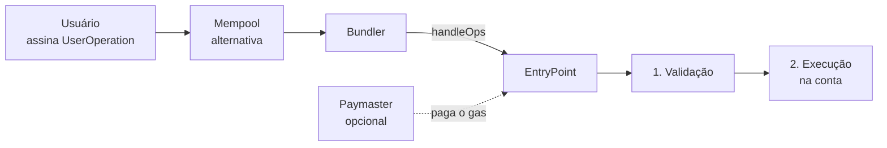

# Capítulo 24: Contas Abstratas e a ERC-4337

**Por que a conta comum é limitada.** No Ethereum existem dois tipos de conta, como visto no Capítulo 21: as contas de propriedade externa (EOA), controladas por uma chave privada, e as contas de contrato, controladas por código. Só a EOA pode iniciar uma transação, e o protocolo só sabe validá-la de um jeito: uma assinatura ECDSA correspondente ao endereço, mais saldo em ETH para pagar o gás. Isso traz consequências práticas. Quem perde a chave perde tudo, não há como trocar a chave sem trocar de endereço, não é possível aprovar uma série de operações em um único clique e é preciso ter ETH na conta até para mover um token qualquer. A ideia de **abstração de contas** é permitir que a lógica de validação de uma conta seja programável, para que regras como recuperação social, múltiplas assinaturas ou limites de gasto façam parte da própria conta.

**A ideia da ERC-4337.** A ERC-4337 foi criada em 29 de setembro de 2021 e tem hoje o status Final. Sua característica central, segundo o texto do padrão, é funcionar inteiramente na camada de aplicação: não cria um novo tipo de transação nem exige mudança no consenso do protocolo. Em vez disso, o usuário monta um pseudotransação chamada **UserOperation**, com remetente, nonce, dados da chamada, limites de gás, taxas e um campo de assinatura cuja verificação é definida pela própria conta, e não pelo protocolo. Essa operação vai para uma mempool alternativa, separada da mempool normal, onde agentes chamados **bundlers** as recolhem.

**Os atores do sistema.** O bundler agrupa várias UserOperations em uma única transação comum e a envia a um contrato singleton chamado **EntryPoint**, chamando a função `handleOps`. O EntryPoint valida cada operação e depois a executa, mantendo as duas fases separadas: primeiro se confirma que a operação pagará as taxas, sem executar a lógica final, e só depois ela é realizada. Essa separação protege os bundlers de operações que parecem válidas na simulação e falham depois, o que seria uma forma de ataque de negação de serviço. O bundler é remunerado com parte das taxas, e a transação que ele envia paga o gás como qualquer outra, o que liga o tema ao Capítulo 16 sobre a base fee e a priority fee. Um terceiro personagem é o **paymaster**, um contrato que pode patrocinar o gás de outra pessoa ou aceitar que a taxa seja paga em um token ERC-20, como os do Capítulo 22, no modelo de "cobrar antes e reembolsar depois".

*O desenho mostra o caminho de uma UserOperation: assinada pelo usuário, coletada por um bundler e executada pelo EntryPoint em duas fases, com um paymaster opcional pagando as taxas.*

**O que se ganha na prática.** Como a conta é um contrato, ela pode implementar recursos que a EOA não tem. Entre os mais citados estão a recuperação social, em que pessoas ou dispositivos de confiança ajudam a recuperar o acesso; as chaves de sessão, que dão a um aplicativo permissão limitada e temporária; o agrupamento de operações, como aprovar e trocar um token em uma só ação; e o patrocínio de gás, que permite a um aplicativo receber novos usuários sem exigir ETH inicial. As carteiras inteligentes que apareceram no Capítulo 8, ao tratar da Base, apoiam-se nessa família de ideias. Vale notar que o poder vem com risco: o código da conta é um contrato, sujeito a bugs como qualquer outro (Capítulos 20 e 23), e o EntryPoint é um ponto de confiança compartilhado por todo o ecossistema.

**O caminho paralelo da EIP-7702.** Contas novas exigem que o usuário migre para um endereço de contrato, o que é incômodo para quem já tem histórico e ativos em uma EOA. A EIP-7702, ativada com a atualização Pectra em 7 de maio de 2025, atende esse caso. Ela define um novo tipo de transação, o `0x04`, com uma lista de autorizações assinadas, cada uma no formato de tupla com identificador da chain, endereço, nonce e assinatura. Ao aceitar a autorização, o código da conta passa a ser o prefixo `0xef0100` seguido do endereço de um contrato, um indicador de delegação: as chamadas à conta executam o código apontado, enquanto o endereço e a chave original continuam os mesmos. Com isso, uma EOA existente ganha agrupamento de operações e patrocínio de gás sem trocar de endereço. As duas propostas são complementares e não concorrentes, já que uma carteira pode usar a 7702 e ainda aproveitar bundlers e paymasters da 4337.

| Aspecto | EOA tradicional | ERC-4337 | EIP-7702 |
| --- | --- | --- | --- |
| Quem valida | Protocolo, por ECDSA | Código da conta | Código delegado |
| Mudança no protocolo | Não se aplica | Nenhuma | Sim, novo tipo de transação |
| Endereço | Original | Novo contrato | Mantém o original |
| Patrocínio de gás | Não | Sim, via paymaster | Sim, via relayer |
| Recuperação social | Não | Sim | Depende do contrato delegado |

*A tabela compara três modelos de conta segundo quem valida a operação, o impacto no protocolo e os recursos que cada um permite.*

**Riscos e cuidados.** A própria especificação da EIP-7702 traz avisos: os contratos delegados precisam de proteção contra repetição de assinaturas e de validação dos parâmetros críticos, a inicialização deve ser assinada para evitar que um observador se adiante, e mudar de um contrato delegado para outro exige cuidado com a organização do armazenamento. Há ainda um efeito sutil: permitir que `tx.origin` defina código quebra certas proteções que assumiam que apenas contratos, e não EOAs, faziam chamadas em cadeia. Em termos de uso, a lição é a de sempre no caderno: assinar uma autorização de delegação para um contrato desconhecido equivale a entregar o controle da conta a ele. Este capítulo é educacional e não recomenda carteira nem provedor.

**Glossário do capítulo.**
- **EOA (conta de propriedade externa)**: conta controlada por uma chave privada, única capaz de iniciar transações no protocolo.
- **Abstração de contas**: ideia de tornar programável a lógica que valida e autoriza operações de uma conta.
- **UserOperation**: pseudo-transação da ERC-4337, enviada a uma mempool alternativa.
- **Bundler**: agente que agrupa UserOperations e as envia ao EntryPoint em uma transação comum.
- **EntryPoint**: contrato singleton que valida e executa as UserOperations.
- **Paymaster**: contrato que patrocina o gás ou aceita pagamento de taxas em tokens.
- **Mempool alternativa**: rede P2P com regras de validação próprias, separada da mempool canônica.
- **Recuperação social**: mecanismo em que contatos ou dispositivos de confiança ajudam a recuperar o acesso a uma conta.
- **Chave de sessão**: permissão limitada e temporária concedida a um aplicativo.
- **Indicador de delegação**: código `0xef0100` seguido de um endereço, que faz uma EOA executar o código de um contrato.

**Fontes.**
- [ERC-4337: Account Abstraction Using Alt Mempool (texto do padrão)](https://raw.githubusercontent.com/ethereum/ERCs/master/ERCS/erc-4337.md)
- [EIP-7702: Set Code for EOAs (texto do padrão)](https://raw.githubusercontent.com/ethereum/EIPs/master/EIPS/eip-7702.md)
- [Alchemy, O que é ERC-4337?](https://www.alchemy.com/pt-BR/overviews/what-is-account-abstraction)
