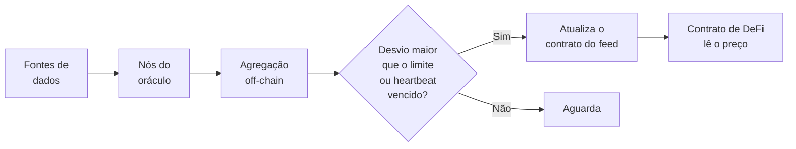

# Capítulo 25: Oráculos e o Chainlink, Como o Mundo de Fora Entra no Contrato

**O problema que os oráculos resolvem.** Um contrato inteligente, como visto no Capítulo 21, executa código de forma determinística: todos os nós que reprocessam uma transação precisam chegar exatamente ao mesmo resultado. Por isso a EVM não consegue, sozinha, consultar uma página da internet ou perguntar o preço do ETH em dólares a uma bolsa. Se pudesse, cada nó poderia receber uma resposta diferente e o consenso se quebraria. A solução é trazer a informação para dentro da chain como dado gravado em uma transação. Quem faz esse papel de ponte entre o mundo de fora e o contrato é o **oráculo**. O ponto delicado é que o contrato passa a confiar naquele dado tanto quanto confiaria em qualquer outra entrada, e um dado errado produz decisões erradas, como liquidações indevidas ou empréstimos sem lastro.

**Onde entra o Chainlink.** O Chainlink é a rede de oráculos mais conhecida do ecossistema. Seu produto mais usado são os **Data Feeds**, feeds de preço que, segundo a documentação, obtêm dados de agregadores reconhecidos e os entregam on-chain por meio de uma rede descentralizada formada por vários operadores de nó independentes. A descentralização acontece em duas camadas: na origem dos dados, que vêm de várias fontes, e na rede de nós, que precisa concordar sobre um valor agregado. A ideia é que nenhum nó isolado e nenhuma fonte isolada consigam ditar o preço sozinhos. Os protocolos de empréstimo do Capítulo 12 dependem exatamente desse tipo de dado para calcular o health factor e decidir quando uma posição pode ser liquidada.

**Quando o preço é atualizado.** Publicar um preço on-chain custa gás, então o feed não grava um valor novo a cada segundo. Duas regras decidem o momento da atualização, e vale a primeira que for atingida. A primeira é o **limite de desvio** (deviation threshold): quando o preço fora da chain se afasta do último preço gravado por mais que uma porcentagem definida, o feed atualiza. Para o par ETH/USD, a documentação e o painel público do Chainlink indicam 0,5% na Ethereum mainnet, e esse limite é configurável conforme a necessidade de cada feed. A segunda é o **heartbeat**, um temporizador de segurança: se o limite de desvio não for atingido durante certo intervalo, o feed atualiza mesmo assim, para que o dado não fique velho. Para o ETH/USD na mainnet, o intervalo divulgado é de 3600 segundos, ou seja, uma hora. Esses valores variam por par e por chain, e podem mudar, então o painel data.chain.link é a referência para conferir o estado atual de cada feed.

*O desenho mostra o caminho do preço: várias fontes alimentam nós independentes, o resultado agregado só é gravado on-chain quando o desvio ou o heartbeat pedem, e o contrato de DeFi apenas lê o valor gravado.*

**A alternativa embutida na DEX: o TWAP.** Existe outro caminho, que dispensa uma rede externa: usar o próprio preço de um AMM, como os do Capítulo 11. O problema é que o preço instantâneo de um pool pode ser empurrado por quem tiver capital suficiente. A resposta do Uniswap V3 foi guardar acumuladores que somam o tick do pool a cada segundo, o que permite calcular um **TWAP**, preço médio ponderado pelo tempo, por meio de uma média geométrica em vez de aritmética, mais resistente a valores extremos. Esse cálculo se apoia em um buffer circular de observações históricas. Uma análise de segurança publicada depois do Merge (ChainSecurity) concluiu que, com o Proof-of-Stake, manipular por dois blocos o TWAP de pares grandes ficou proibitivamente caro, embora manipulações em três ou mais blocos consecutivos sejam mais plausíveis, já que exigiriam um validador com fatia relevante do mercado. Ou seja, o TWAP é bom em pools líquidos e frágil em pools rasos.

| Característica | Feed do Chainlink | TWAP de um AMM |
| --- | --- | --- |
| Origem do dado | Agregadores de dados e nós independentes | Negociações no próprio pool |
| Confiança extra | Rede de operadores de nó | Nenhuma além do pool |
| Atualização | Por desvio ou heartbeat | Acumulada a cada segundo |
| Ponto fraco típico | Dado desatualizado ou falha na rede | Manipulação em pools de pouca liquidez |
| Custo de uso | Contrato lê o valor gravado | Contrato calcula a média sobre a janela |

*A tabela compara as duas abordagens mais comuns de fornecer preço a um contrato, segundo origem, confiança, atualização e fragilidade.*

**Um caso real: Mango Markets.** Em 11 de outubro de 2022, o protocolo Mango Markets, na Solana, perdeu cerca de 116 milhões de dólares em um ataque que virou o exemplo clássico de manipulação de oráculo. Segundo as análises publicadas na época, Avraham Eisenberg abriu uma posição enorme em contratos perpétuos e comprou cerca de 4 milhões de dólares do token MNGO em bolsas, elevando o preço reportado pelo oráculo em torno de 2.300%, de 0,03 para 0,91 dólar. O valor do MNGO que ele mantinha como garantia subiu a centenas de milhões de dólares no papel, e com esse colateral inflado ele tomou emprestados ativos como BTC, SOL e SRM até esvaziar o protocolo. O token tinha pouca liquidez, e o preço do oráculo refletia essa fragilidade. Depois, uma proposta de governança aprovada pelo fórum do Mango permitiu que ele ficasse com 47 milhões de dólares a título de bug bounty, devolvendo 67 milhões ao tesouro, uma decisão que dialoga com os dilemas de governança do Capítulo 19. Eisenberg alegou que agiu dentro das regras do protocolo, o que mostra que a linha entre exploit e estratégia legítima também é debatida. A lição técnica é que o oráculo é tão robusto quanto o mercado que o alimenta.

**Boas práticas ao consumir um oráculo.** Do lado de quem constrói, algumas verificações aparecem sempre nas discussões de segurança: conferir se o dado não está velho em relação ao heartbeat esperado, tratar preços extremos ou zerados, preferir fontes agregadas a um único pool raso, e definir o que o protocolo faz quando o oráculo falha. Do lado de quem usa, a lição prática é que o risco de um protocolo de DeFi inclui o risco dos seus oráculos, além do risco do código, algo já mencionado nas pontes do Capítulo 23. Este capítulo é educacional e não recomenda protocolo nem token.

**Glossário do capítulo.**
- **Oráculo**: mecanismo que leva dados de fora da chain para dentro de um contrato inteligente.
- **Data Feed**: feed de preço on-chain mantido por uma rede de oráculos, lido por contratos.
- **Rede descentralizada de oráculos**: conjunto de nós independentes que concordam sobre um valor agregado.
- **Limite de desvio (deviation threshold)**: variação percentual que, ao ser atingida, dispara a atualização do feed.
- **Heartbeat**: intervalo máximo entre atualizações, mesmo sem variação relevante.
- **TWAP**: preço médio ponderado pelo tempo, calculado a partir de acumuladores do pool.
- **Manipulação de oráculo**: ataque que distorce o preço reportado para tomar crédito ou lucro indevido.
- **Perpétuo**: contrato de derivativo sem data de vencimento, usado no ataque ao Mango.
- **Dado desatualizado (stale)**: preço gravado há mais tempo que o esperado e que já não reflete o mercado.

**Fontes.**
- [Chainlink, Data Feeds (documentação), via busca](https://docs.chain.link/data-feeds)
- [Chainlink, Price Feed Visualizations (blog), via busca](https://blog.chain.link/analyze-decentralized-oracles-in-real-time)
- [Chainlink, painel de feeds](https://data.chain.link/feeds)
- [Uniswap, Uniswap v3 TWAP Oracles in Proof of Stake](https://blog.uniswap.org/uniswap-v3-oracles)
- [ChainSecurity, Oracle Manipulation after Merge](https://chainsecurity.com/oracle-manipulation-after-merge/)
- [Cointelegraph, How low liquidity led to Mango Markets losing over 116 million](https://cointelegraph.com/magazine/how-low-liquidity-led-to-mango-markets-losing-over-116-million)
- [Ackee, 2022 Solana hacks explained: Mango Markets](https://ackee.xyz/blog/2022-solana-hacks-explained-mango-markets/)
- [BankInfoSecurity, Everything we know about the Mango Markets hack](https://www.bankinfosecurity.net/everything-we-know-about-mango-markets-hack-a-20250)
