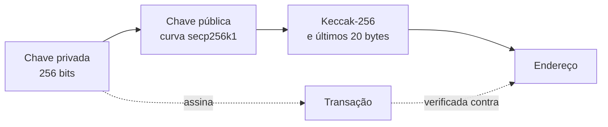

# Capítulo 26: Carteiras, Chaves, Seed Phrase e Custódia

**Uma carteira não guarda moedas.** O nome engana. Os tokens e o ETH de alguém vivem no estado da rede, associados a um endereço, como visto no Capítulo 21. O que uma carteira guarda é a capacidade de assinar mensagens em nome desse endereço. Quem controla a chave privada controla os fundos, e quem perde a chave perde o acesso, sem nenhum guichê de recuperação no protocolo. Esse é o sentido da frase que circula no meio: "not your keys, not your coins". Este capítulo percorre o caminho que vai do número secreto ao endereço, explica a seed phrase e discute as formas de custódia, sem recomendar produto algum.

**Da chave privada ao endereço.** Uma conta comum do Ethereum, a EOA do Capítulo 24, nasce de um número aleatório grande, a chave privada, com 256 bits. Por meio de uma operação matemática de curva elíptica (a curva secp256k1), esse número gera uma chave pública. O endereço é derivado da chave pública: aplica-se a função de hash Keccak-256 e ficam os últimos 20 bytes do resultado. A operação só anda em um sentido. Da chave privada se chega à pública e ao endereço com facilidade, mas o caminho inverso é considerado inviável. Para movimentar fundos, a carteira assina a transação com a chave privada, e a rede verifica a assinatura ECDSA contra o endereço, sem que a chave jamais seja transmitida.

*O desenho mostra que tudo deriva da chave privada em sentido único, e que a assinatura feita com ela é o que a rede confere contra o endereço.*

**O checksum do endereço.** Um endereço é uma sequência de 40 caracteres hexadecimais, e um erro de digitação poderia mandar fundos ao vazio. A EIP-55, criada em 14 de janeiro de 2016 e hoje com status Final, criou uma codificação retrocompatível: calcula-se o hash Keccak-256 do endereço em minúsculas e, para cada letra de a a f, usa-se maiúscula quando o dígito correspondente do hash for 8 ou mais. O resultado é um endereço com letras maiúsculas e minúsculas misturadas que funciona como verificação de erros, e as carteiras costumam alertar quando o padrão de caixa não bate.

**A seed phrase.** Gerenciar uma chave aleatória por conta seria incômodo, então o setor adotou um esquema em camadas. A BIP-39 define como transformar um número aleatório (entropia) em uma lista de palavras de um dicionário de 2.048 palavras. Cada palavra codifica 11 bits. A entropia varia de 128 a 256 bits e recebe um pequeno checksum tirado do hash SHA-256, o que dá de 12 a 24 palavras. Para virar chave, a frase passa por uma função de derivação (PBKDF2, com HMAC-SHA512 e 2.048 iterações) que produz uma semente de 512 bits. A frase aceita ainda uma senha opcional, a passphrase, que altera completamente a semente resultante. Quem tem a mesma frase e a mesma passphrase reconstrói exatamente as mesmas chaves em qualquer carteira compatível.

| Entropia | Bits de checksum | Palavras |
| --- | --- | --- |
| 128 bits | 4 | 12 |
| 160 bits | 5 | 15 |
| 192 bits | 6 | 18 |
| 224 bits | 7 | 21 |
| 256 bits | 8 | 24 |

**Muitas contas, uma só semente.** A BIP-32 define as carteiras hierárquicas determinísticas (HD). A semente alimenta um HMAC-SHA512 que gera uma chave mestra, e dela se derivam chaves filhas em árvore, identificadas por um caminho como `m/44'/60'/0'/0/0`. O apóstrofo indica derivação reforçada (hardened), que isola os níveis superiores: mesmo que uma chave filha vaze, ela não permite subir na árvore até a raiz nesses níveis. O número 60 é o tipo de moeda registrado para o Ether na lista SLIP-0044, e cada índice final produz uma conta nova. Por isso uma única frase de 12 ou 24 palavras dá acesso a uma família inteira de endereços. Isso também explica o risco central: quem obtém a frase, obtém tudo, e não há como trocar a frase sem migrar os fundos para uma nova.

**Formas de custódia.** As opções se distribuem em um espectro entre conveniência e responsabilidade.

| Modelo | Quem controla a chave | Vantagem | Risco principal |
| --- | --- | --- | --- |
| Custodial (corretora) | A empresa | Recuperação de conta, suporte, facilidade | Falência, bloqueio ou falha da empresa |
| Carteira de software (hot) | O próprio usuário, no dispositivo conectado | Praticidade no uso diário | Malware, phishing, dispositivo comprometido |
| Carteira de hardware (cold) | O próprio usuário, em dispositivo dedicado | Chave não sai do aparelho | Perda da frase, engano ao assinar |
| Multisig (como o Safe) | Vários signatários, exigindo M de N | Uma chave comprometida não move os fundos | Complexidade, gestão dos signatários |
| Conta abstrata | Regras programáveis na conta | Recuperação social, limites | Bugs no código da conta, dependência de infraestrutura |

No modelo multisig, o Safe é um exemplo conhecido de carteira de contrato inteligente em que um número mínimo de signatários precisa aprovar cada transação, e sua documentação destaca que nem a empresa consegue mover os fundos. Como uma conta de contrato não tem chave privada, ela não assina como uma EOA. A ERC-1271, com status Final, resolve isso definindo uma função `isValidSignature` que o contrato implementa, para que aplicativos possam verificar assinaturas em nome de multisigs, DAOs (Capítulo 19) e contas da ERC-4337 (Capítulo 24).

**O que realmente se ataca.** A criptografia da chave raramente é o elo fraco. Os ataques costumam mirar a pessoa: sites falsos que pedem a seed phrase, aprovações de token para contratos maliciosos (o approve visto no Capítulo 22), assinaturas de mensagens que o usuário não entendeu e extensões ou programas infectados. Uma regra de higiene vale sem exceção: nenhum serviço legítimo precisa da seed phrase, e ela nunca deve ser digitada em site, formulário ou conversa de suporte. Boas práticas comuns incluem anotar a frase em meio físico, em vez de fotografá-la ou guardá-la na nuvem, separar uma carteira de uso diário de outra de reserva e conferir com atenção o que se está assinando. Este capítulo é educacional e não recomenda carteira, corretora ou produto.

**Glossário do capítulo.**
- **Chave privada**: número secreto de 256 bits que permite assinar transações de uma conta.
- **Chave pública**: valor derivado da chave privada por curva elíptica, do qual se calcula o endereço.
- **Endereço**: identificador de 20 bytes obtido dos últimos bytes do hash Keccak-256 da chave pública.
- **EIP-55**: codificação com maiúsculas e minúsculas que funciona como checksum do endereço.
- **Seed phrase**: lista de 12 a 24 palavras (BIP-39) que representa a entropia da qual todas as chaves derivam.
- **Passphrase**: senha opcional somada à frase, que produz uma semente totalmente diferente.
- **Carteira HD**: carteira hierárquica determinística (BIP-32), que gera uma árvore de chaves a partir de uma semente.
- **Derivação reforçada**: derivação de chave filha a partir da chave privada do pai, que isola os níveis superiores da árvore.
- **Multisig**: conta que exige aprovação de M entre N signatários.
- **ERC-1271**: padrão que permite a contratos validarem assinaturas em nome próprio.

**Fontes.**
- [BIP-39: Mnemonic code for generating deterministic keys](https://raw.githubusercontent.com/bitcoin/bips/master/bip-0039.mediawiki)
- [BIP-32: Hierarchical Deterministic Wallets](https://raw.githubusercontent.com/bitcoin/bips/master/bip-0032.mediawiki)
- [SLIP-0044: Registered coin types](https://raw.githubusercontent.com/satoshilabs/slips/master/slip-0044.md)
- [ERC-55: Mixed-case checksum address encoding](https://raw.githubusercontent.com/ethereum/ERCs/master/ERCS/erc-55.md)
- [ERC-1271: Standard Signature Validation Method for Contracts](https://raw.githubusercontent.com/ethereum/ercs/master/ERCS/erc-1271.md)
- [Safe, perguntas frequentes](https://www.safe.global/faq)
- [Safe, segurança](https://www.safe.global/security)
- [Trail of Bits, Safer cold storage on Ethereum](https://blog.trailofbits.com/2025/09/05/safer-cold-storage-on-ethereum/)
