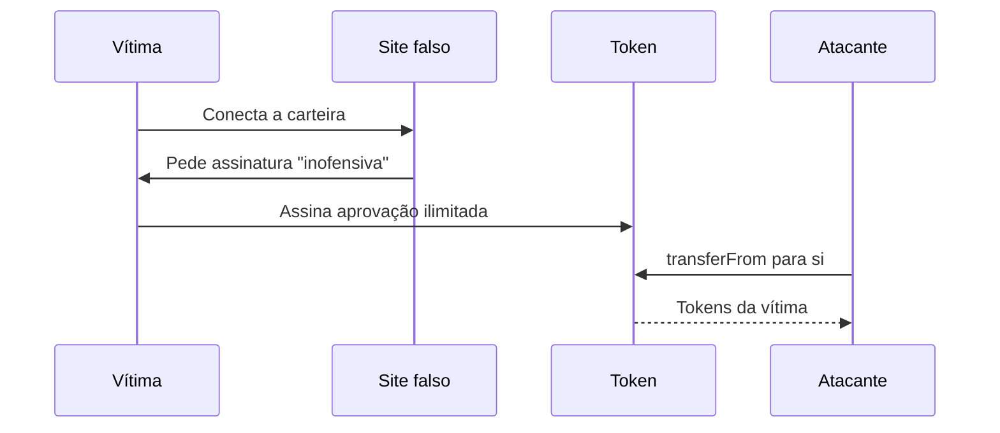

# Capítulo 27: Golpes Comuns e Como Reconhecer

**A rede não erra, a pessoa é que é enganada.** O Capítulo 26 terminou dizendo que a criptografia raramente é o elo fraco. Este capítulo segue esse fio e olha para o lado humano. Uma transação assinada e confirmada no Ethereum é irreversível, não existe estorno nem central de disputas, e por isso quase todo golpe tem o mesmo objetivo: fazer a própria vítima assinar ou enviar algo que ela não entendeu. Conhecer o formato dos golpes mais comuns vale mais que qualquer ferramenta. O texto é educacional e não recomenda produto algum.

**Uma ordem de grandeza.** A empresa de análise on-chain Chainalysis, em seu relatório de crimes de 2026, estimou a receita de golpes com cripto em 2025 na casa dos 17 bilhões de dólares. O mesmo material aponta que golpes de personificação (alguém se passando por outra pessoa ou instituição) cresceram cerca de 1.400% em relação ao ano anterior, com destaque para o uso de inteligência artificial em voz, vídeo e texto. Estimativas desse tipo são revisadas com o tempo, então convém tratá-las como ordem de grandeza e não como número exato. O ponto que importa é a direção: o golpe ficou mais barato de produzir e mais convincente.

**Golpes que pedem algo diretamente.** São os mais antigos e seguem funcionando.

- *Sorteios e multiplicação de fundos.* Um perfil falso de uma figura conhecida promete devolver o dobro do ETH enviado. A ethereum.org resume em uma frase: ninguém está dando ETH de graça, e ofertas assim são sempre golpe.
- *Falso suporte.* Alguém se apresenta como membro de uma equipe, moderador ou atendente, inventa um problema na conta e pede a seed phrase ou o acesso remoto ao computador. Vale a regra do capítulo anterior: nenhum serviço legítimo precisa da seed phrase.
- *Golpe de recuperação.* Depois de uma perda, a vítima é procurada por supostos especialistas que cobram adiantado para reaver os fundos. Nenhum serviço legítimo consegue reverter uma transação na blockchain.
- *Sites e aplicativos falsos.* Cópias de carteiras e corretoras, muitas vezes divulgadas em anúncios pagos, capturam credenciais ou pedem que a carteira seja conectada e uma assinatura seja aprovada.

**Golpes que exploram assinaturas e aprovações.** Aqui a vítima não entrega senha nenhuma. Ela apenas assina. No Capítulo 22 vimos que `approve` autoriza um contrato a movimentar tokens em nome do dono, muitas vezes sem limite. Um site malicioso pode induzir essa aprovação sob o disfarce de um "resgate de airdrop" ou de uma "verificação de carteira". Depois disso, o atacante gasta os tokens quando quiser. O `permit` (ERC-2612) e o Permit2 da Uniswap trouxeram conveniência, pois a autorização vira uma assinatura fora da cadeia, sem gás, e isso também abriu espaço para golpes: uma única assinatura de Permit2 pode expor vários tokens de uma vez, e por isso ferramentas de revogação passaram a dar suporte a ele. É a família dos chamados *drainers*, que esvaziam a carteira depois de uma aprovação enganosa.

*O desenho mostra que o dano vem de uma aprovação assinada pela própria vítima, e o atacante só precisa executar o transferFrom depois.*

**Envenenamento de endereço.** É um golpe silencioso. O atacante observa para quem uma carteira costuma enviar fundos, gera por força bruta um endereço que começa e termina com os mesmos caracteres e envia uma transferência minúscula, às vezes de valor zero, a partir dele. Como as carteiras encurtam endereços na tela (algo como `0xd9A1...53a91`), o endereço falso passa a aparecer no histórico. Quando a vítima quer pagar de novo e copia o endereço do histórico, envia para o atacante. Um estudo da Universidade Carnegie Mellon, citado em análises do setor, contou cerca de 270 milhões de tentativas no Ethereum e na BNB Chain entre julho de 2022 e junho de 2024, mirando 17 milhões de endereços, com perdas confirmadas acima de 83 milhões de dólares. A defesa é simples e um pouco chata: conferir o endereço inteiro, nunca copiá-lo do histórico, e usar uma agenda de endereços confiáveis quando a carteira oferecer.

**Golpes de relacionamento e investimento falso.** Uma categoria à parte é a do relacionamento longo, conhecida como *pig butchering*. A pessoa é abordada por mensagem, constrói-se confiança durante semanas e ela é conduzida a uma plataforma de investimento falsa, que mostra lucros fictícios até o momento de tentar sacar. O sinal de alerta é constante: retorno alto e garantido, pressa, plataforma que só existe por indicação de alguém que a vítima nunca encontrou pessoalmente e cobranças de "taxas" para liberar um saque.

**Quando o alvo é uma instituição.** Nem só pessoas comuns caem. Em 21 de fevereiro de 2025, a corretora Bybit perdeu cerca de 1,5 bilhão de dólares em ETH, o maior roubo da história das criptomoedas. As investigações atribuíram o ataque ao grupo Lazarus, da Coreia do Norte. O ponto técnico é instrutivo. O cofre da Bybit era um multisig do Safe, do modelo visto no Capítulo 26. Os atacantes comprometeram a infraestrutura da interface web do Safe e alteraram o que os signatários enxergavam: na tela, uma transferência rotineira, mas o que estava sendo assinado trocava o contrato de implementação da carteira. Os signatários aprovaram porque confiaram na tela. O multisig funcionou como projetado, e mesmo assim foi contornado, o que mostra que assinar sem verificar o conteúdo real (a chamada *blind signing*) é um risco que existe até para quem tem muito dinheiro e processos rígidos. Compare com as pontes do Capítulo 23 e com o caso do Mango no Capítulo 25: quase sempre o dano vem de confiança mal colocada, não de quebra da matemática.

| Golpe | O que a vítima faz | Sinal de alerta | Defesa principal |
| --- | --- | --- | --- |
| Sorteio ou multiplicação | Envia ETH esperando receber mais | Promessa de retorno certo | Ignorar, ninguém dá ETH de graça |
| Falso suporte | Passa seed phrase ou acesso | Contato não solicitado | Nunca compartilhar a frase |
| Aprovação enganosa | Assina approve, permit ou Permit2 | Pedido de assinatura sem motivo claro | Ler o pedido, revogar aprovações |
| Envenenamento de endereço | Copia endereço do histórico | Transferência de valor zero recebida | Conferir o endereço inteiro |
| Investimento falso | Deposita em plataforma desconhecida | Lucro alto, taxa para sacar | Desconfiar de pressa e promessa |
| Falsa recuperação | Paga adiantado | Oferta após uma perda | Nenhum serviço reverte transações |

**Hábitos que reduzem o risco.** As orientações se repetem entre as fontes. Guardar nos favoritos os sites oficiais em vez de clicar em anúncios ou links de mensagens. Ler o que a carteira mostra ao pedir uma assinatura, e desconfiar de pedidos que não fazem sentido para a ação em curso. Separar uma carteira de uso diário, com pouco saldo, de uma carteira de reserva. Revogar aprovações antigas com ferramentas como Revoke.cash ou o verificador de aprovações de exploradores de blocos. Usar carteiras de contrato com limites e regras, como as contas abstratas do Capítulo 24, quando fizer sentido. Depois de um incidente, mover o que restou para uma carteira nova, revogar aprovações e denunciar em canais como Chainabuse e nas autoridades locais. Nada disso elimina o risco, mas a maioria dos golpes descritos aqui depende de pressa e de distração, e cada verificação a mais quebra o roteiro do atacante.

**Glossário do capítulo.**
- **Phishing**: tentativa de enganar alguém, por site, mensagem ou anúncio falso, para obter credenciais, assinaturas ou fundos.
- **Drainer**: kit malicioso que esvazia uma carteira após a vítima aprovar ou assinar algo enganoso.
- **Aprovação de token**: autorização dada a um contrato para movimentar tokens do usuário, via `approve` (ERC-20).
- **Permit2**: contrato da Uniswap que centraliza autorizações de token por assinatura, o que amplia o estrago de uma assinatura maliciosa.
- **Envenenamento de endereço**: golpe que planta um endereço de aparência parecida no histórico da vítima para induzir um envio errado.
- **Blind signing**: assinar uma transação sem conseguir verificar o que ela realmente faz.
- **Pig butchering**: golpe de relacionamento longo que leva a vítima a depositar em plataforma de investimento falsa.
- **Personificação**: golpe em que o criminoso se passa por pessoa, marca ou suporte legítimo.
- **Revogação de aprovação**: ação que zera a autorização dada a um contrato, encerrando o risco de novos saques por ele.

**Fontes.**
- [ethereum.org, Evite golpes (conteúdo-fonte em Markdown)](https://raw.githubusercontent.com/ethereum/ethereum-org-website/dev/public/content/community/support/scams/index.md)
- [Cointelegraph, golpes de cripto em 2025 e personificação com IA (dados da Chainalysis)](https://cointelegraph.com/news/crypto-scams-2025-ai-impersonation-fraud-chainalysis)
- [Revoke.cash, aprendizado sobre aprovações e Permit2](https://revoke.cash/learn)
- [Hashlock, envenenamento de endereço (cita estudo da Carnegie Mellon)](https://hashlock.com/blog/understanding-and-preventing-address-poisoning-scams-in-crypto)
- [The Block, Lazarus e o ataque de 1,5 bilhão de dólares à Bybit](https://www.theblock.co/post/343530/lazarus-appears-to-compromise-safe-developer-machine-in-lead-up-to-1-5-billion-bybit-hack-report)
- [4pillars, análise do hack da Bybit e do Safe](https://4pillars.io/en/issues/safe-bybit-hack)
