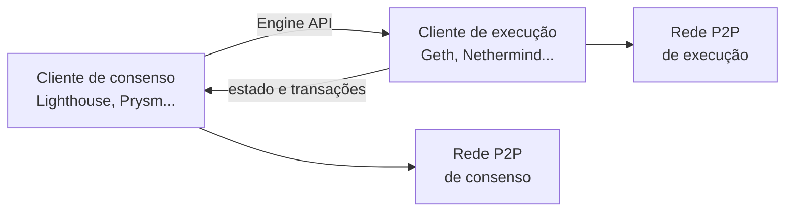
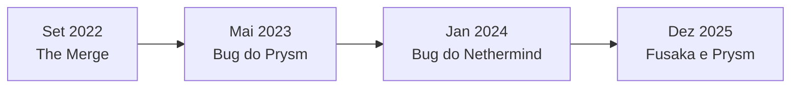

# Capítulo 28: Clientes de Execução e Consenso, o Valor da Diversidade

**Ethereum é um protocolo, não um programa.** Quando se diz "o Ethereum", fala-se de uma especificação pública que várias equipes independentes implementam em software. Cada implementação é chamada de cliente. Quem roda um nó escolhe qual usar, e essa escolha, somada à de milhares de operadores, decide se a rede é robusta ou frágil diante de um erro de programação. Este capítulo mostra como os clientes se dividem, por que a concentração num só deles é um risco real e o que os incidentes de 2023, 2024 e 2025 ensinaram. O texto é educacional e não recomenda cliente algum.

**Dois clientes por nó.** Desde The Merge (Capítulo 1), um nó completo roda dois programas que conversam entre si. O cliente de execução mantém o estado da rede, processa as transações e executa a EVM (Capítulo 21). O cliente de consenso cuida da prova de participação: propõe e atesta blocos e acompanha o fork choice e a finalidade (Capítulo 2). Um validador precisa dos dois.


*O desenho mostra que os dois clientes formam um par: o de consenso decide qual cadeia seguir e o de execução valida o conteúdo dos blocos, comunicando-se pela Engine API.*

| Camada | Exemplos de clientes |
| --- | --- |
| Execução | Geth, Nethermind, Besu, Erigon, Reth |
| Consenso | Lighthouse, Prysm, Teku, Nimbus, Lodestar, Grandine |

**Por que a diversidade importa.** Todo software tem bugs, e o que interessa é o que acontece quando um deles aparece num cliente muito usado. A regra prática, repetida pela ethereum.org e pelo projeto clientdiversity.org, depende de dois limiares da prova de participação:

- Se um cliente tiver mais de um terço dos validadores e falhar de forma que o faça parar, a rede perde a finalidade, porque a finalização exige dois terços de participação (Capítulo 2). Os blocos continuam, mas deixam de ser finalizados, e ativa-se o vazamento por inatividade, que penaliza quem não atesta.
- Se um cliente tiver mais de dois terços e produzir uma resposta errada, ele mesmo pode finalizar uma cadeia inválida. Como a finalização é o ponto sem volta do protocolo, desfazer isso exigiria coordenação social e penalidades pesadas para a maioria dos validadores.

```latex
\text{risco de parada} \; \text{se} \; p_{\text{cliente}} > \tfrac{1}{3}
\qquad
\text{risco de finalização inválida} \; \text{se} \; p_{\text{cliente}} > \tfrac{2}{3}
```

*A fórmula resume os dois limiares, com p sendo a fração dos validadores que roda um mesmo cliente.*

**Onde as coisas estavam.** Na camada de consenso a distribuição sempre foi mais equilibrada, com Lighthouse e Prysm liderando e Teku, Nimbus e Lodestar completando. Na camada de execução, o Geth, cliente histórico da Ethereum Foundation, chegou a responder por algo perto de 85% dos nós no começo de 2024, muito acima dos dois terços. De lá para cá a fatia caiu, e reportagens de fins de 2025 falam em algo próximo da metade, com Nethermind, Besu, Erigon e Reth ganhando espaço. Os números variam bastante de uma fonte para outra, porque medir é difícil: os clientes não se anunciam de forma obrigatória, e uma pesquisa de nós na rede P2P dá um resultado diferente do que se obtém contando validadores por meio de marcas nos blocos ou de pesquisas com operadores. Por isso, este capítulo trata os percentuais como ordem de grandeza e recomenda consultar os painéis atualizados.

**Três incidentes que viraram lição.**


*A linha do tempo mostra que o problema não é teórico: em poucos anos, três falhas em clientes diferentes apareceram na rede principal.*

- *Maio de 2023, Prysm.* Cerca de um mês depois da atualização Shanghai, a rede ficou dois dias seguidos com atraso na finalização, cerca de 25 minutos no primeiro dia e mais de uma hora no seguinte, segundo os relatos da comunidade. A causa foi esgotamento de recursos em nós Prysm que processavam atestados de nós fora de sincronia e refaziam transições de estado caras. A versão 4.0.4 corrigiu o problema, e a cadeia se recuperou sozinha. A participação do Prysm na época era relevante, mas menor que um terço, o que ajudou a rede a se manter de pé.
- *Janeiro de 2024, Nethermind.* Um bug de consenso afetou as versões 1.23 a 1.25 desse cliente de execução, e a correção saiu na 1.25.2. Foi um cliente minoritário que falhou, então o efeito na rede foi pequeno. O episódio serviu para lembrar a pergunta incômoda: e se fosse o Geth? Operadores relataram uma migração de cerca de 6% dos nós para outros clientes na semana seguinte.
- *Dezembro de 2025, Prysm depois do Fusaka.* A atualização Fusaka foi ativada em 3 de dezembro de 2025, no epoch 411392. Logo depois, a versão 7.0.0 do Prysm passou a gerar estados antigos ao processar atestados defasados, o que sobrecarregou os nós. Segundo a imprensa, a participação nos votos caiu para cerca de 75%, ficando a menos de 9 pontos percentuais do limite de dois terços, e a rede deixou de incluir dezenas de epochs, perdendo uma pequena quantia em recompensas. Uma opção de linha de comando serviu de paliativo e as versões 7.0.1 e 7.1.0 trouxeram a correção. A finalidade não se perdeu, mas por pouco.

O contraste entre os casos mostra o argumento. O Prysm falhou duas vezes com uma fatia grande, porém abaixo de um terço, e a rede aguentou. Uma falha do mesmo tamanho em um cliente acima do limiar teria sido muito diferente.

**O que cada participante pode fazer.** A responsabilidade é distribuída. Quem opera um validador pode escolher clientes minoritários nas duas camadas, o que diminui o risco de correlação de penalidades: se todos os validadores de um operador rodam o mesmo cliente e ele erra, todos falham ao mesmo tempo. Grandes provedores de staking, como os vistos no Capítulo 3, têm incentivo para diversificar por dentro, com vários clientes entre os seus operadores. Os desenvolvedores mantêm várias implementações e testam as atualizações em redes de teste e com ferramentas de fuzzing. Por fim, as próprias mudanças de protocolo, como as do Capítulo 10, só avançam quando pelo menos as principais equipes de clientes conseguem entregá-las. A diversidade tem custo: cada mudança precisa ser implementada várias vezes, e isso torna o processo de evolução do Ethereum mais lento do que seria com um único software. É uma escolha deliberada, que troca velocidade por resiliência.

**Glossário do capítulo.**
- **Cliente**: implementação de software que segue a especificação do protocolo e permite operar um nó.
- **Cliente de execução**: processa transações, mantém o estado e executa a EVM (por exemplo, Geth, Nethermind, Besu, Erigon, Reth).
- **Cliente de consenso**: implementa a prova de participação, com propostas, atestados, fork choice e finalidade (por exemplo, Lighthouse, Prysm, Teku, Nimbus, Lodestar, Grandine).
- **Engine API**: interface pela qual o cliente de consenso instrui o de execução.
- **Diversidade de clientes**: distribuição dos validadores entre implementações diferentes, para que um bug não derrube a maioria.
- **Cliente supermajoritário**: cliente usado por mais de dois terços dos validadores, cuja falha poderia finalizar uma cadeia inválida.
- **Finalidade**: ponto a partir do qual um bloco não pode ser revertido sem punir uma grande fração do stake.
- **Vazamento por inatividade**: mecanismo que reduz gradualmente o saldo de validadores que não atestam quando a rede não finaliza.
- **Bug de consenso**: erro que faz um cliente discordar dos demais sobre a validade de um bloco.

**Fontes.** (Consultadas por meio de buscas; algumas páginas originais ficaram inacessíveis na coleta, e por isso os percentuais foram tratados como ordem de grandeza.)
- [ethereum.org, Diversidade de clientes](https://ethereum.org/developers/docs/nodes-and-clients/client-diversity/)
- [clientdiversity.org, painel e explicação dos limiares](https://clientdiversity.org/)
- [Quicknode, clientes do Ethereum explicados](https://www.quicknode.com/guides/ethereum-development/getting-started/ethereum-clients-explained)
- [Prysm, postmortems da rede principal](https://prysm.offchainlabs.com/docs/misc/mainnet-postmortems/)
- [EthStaker, incidente de finalidade de maio de 2023](https://ethstaker.notion.site/Finality-issue-11-May-2023-3cb4d74e67c04d1f9ed31659e48c314b)
- [Cointelegraph, queda de 25% na validação após o Fusaka e bug do Prysm](https://cointelegraph.com/news/ethereum-prysm-bug-fusaka-client-diversity-risk)
- [Crypto.news, o que quebrou no Fusaka](https://crypto.news/what-broke-ethereums-fusaka-upgrade/)
- [Forklog, Nethermind corrige bug crítico](https://forklog.com/en/nethermind-resolves-critical-bug-in-ethereum-client/)
- [Blockworks, grandes operadores diversificam clientes após o bug do Nethermind](https://blockworks.co/news/ethereum-geth-client-diversity)
- [CryptoSlate, estimativas incompatíveis de diversidade de clientes](https://cryptoslate.com/ethereums-client-diversity-picture-fractures-under-incompatible-estimates/)
