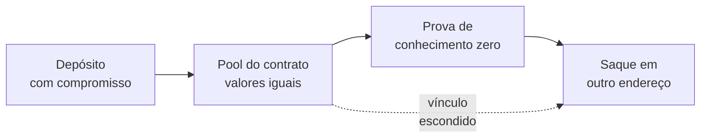
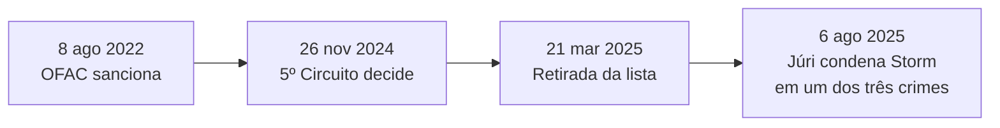

# Capítulo 29: Privacidade no Ethereum, Entre a Transparência e o Sigilo

**Pseudônimo não é anonimato.** O Ethereum é transparente por projeto: todo saldo, toda transação e toda chamada a um contrato ficam num registro público que qualquer pessoa pode consultar. O que existe é pseudonimato, já que o endereço (Capítulo 26) não carrega um nome. Só que o histórico inteiro de um endereço fica exposto, e basta um único ponto de contato com o mundo real, como um depósito numa corretora, um pagamento de salário ou um nome de domínio ENS, para ligar esse histórico a uma pessoa. Este capítulo explica o que a rede revela, como funcionam as principais ferramentas de privacidade, o que a história de Tornado Cash ensinou no campo jurídico e que caminhos o ecossistema estuda hoje. O texto é educacional: não recomenda ferramenta alguma e não discute como burlar a lei.

**O que fica exposto.** Como a rede usa o modelo de contas (Capítulo 21), cada endereço acumula um extrato público e permanente. Empresas de análise de blockchain agrupam endereços que, com boa confiança, pertencem ao mesmo dono, usando heurísticas como o padrão de quem paga o gás de quem, horários de atividade e fundos que sobem a partir de uma mesma origem. Isso tem um lado bom, pois facilita auditoria e o rastreio de golpes e invasões (Capítulo 27), e um lado ruim: salário, doações, patrimônio e hábitos de gasto de qualquer pessoa ficam legíveis para o vizinho, o concorrente ou um criminoso que procura alvos.

| Dado | É público? | Observação |
| --- | --- | --- |
| Saldo e histórico de um endereço | Sim | Qualquer explorador de blocos mostra |
| Valores e destinatários das transações | Sim | Em transferências comuns, tudo em claro |
| Identidade real do dono | Não diretamente | Costuma ser inferida por cruzamento de dados |
| Conteúdo do calldata de um contrato | Sim | Mesmo que o contrato seja complexo |
| Chave privada | Não | Nunca deve sair da carteira |

**Como os mixers funcionam, a ideia do Tornado Cash.** A dificuldade é romper o vínculo entre quem deposita e quem saca. O Tornado Cash resolvia isso com um contrato em que os usuários depositam uma quantia fixa, e cada depósito grava no contrato apenas um compromisso criptográfico, uma espécie de cofre lacrado que esconde um segredo do depositante. Mais tarde, de outro endereço, o usuário saca provando, por meio de uma prova de conhecimento zero (a mesma família de técnicas vista no Capítulo 9), que conhece o segredo de algum dos depósitos do conjunto, sem revelar qual. Um valor de anulação, registrado no saque, impede que o mesmo depósito seja sacado duas vezes. Quanto mais depositantes no conjunto, maior a chamada janela de anonimato.

*O desenho mostra que o contrato guarda depósitos indistinguíveis e que a prova permite sacar sem apontar qual depósito foi o de origem.*

**Linha do tempo jurídica de Tornado Cash.** O caso virou o principal teste de como o direito trata um software de código aberto que ninguém controla.

*A linha do tempo mostra que a sanção ao software foi derrubada nos tribunais, enquanto o processo criminal contra um dos desenvolvedores seguiu por outro caminho.*

- *Agosto de 2022.* O Tesouro dos Estados Unidos, por meio do OFAC, incluiu o Tornado Cash na lista de sancionados, alegando que o protocolo facilitou lavagem de dinheiro, inclusive de fundos ligados ao grupo Lazarus, da Coreia do Norte. A designação foi reforçada em novembro de 2022.
- *Novembro de 2024.* No caso Van Loon contra o Departamento do Tesouro, o Quinto Circuito entendeu que contratos inteligentes imutáveis não são "propriedade" de um estrangeiro ou de uma entidade e que, por isso, o OFAC havia extrapolado a autoridade dada pelo Congresso.
- *Março de 2025.* O Tesouro retirou o Tornado Cash da lista de sancionados, citando a análise de questões jurídicas e de política novas surgidas com o uso de sanções em atividades que ocorrem em ambientes tecnológicos em evolução.
- *Agosto de 2025.* Em Nova York, um júri condenou o cofundador Roman Storm por conspiração para operar um negócio de transmissão de dinheiro sem licença, crime com pena máxima de cinco anos, e não chegou a um veredito unânime sobre as acusações de lavagem de dinheiro e de violação de sanções. A defesa pediu absolvição ou novo julgamento, e os relatos consultados não traziam uma decisão final sobre esses pedidos.

A lição para o leitor do caderno é que a pergunta jurídica continua em aberto em vários pontos, e que ferramentas de privacidade convivem com riscos regulatórios que variam por país. Em continuidade com o Capítulo 20, em que o código foi explorado e a comunidade discutiu até onde "o código é a lei", aqui o dilema é outro: até onde o autor de um software responde pelo uso que terceiros fazem dele.

**Privacy Pools, privacidade com prova de inocência.** Uma linha de pesquisa publicada em 2023 com coautoria de Vitalik Buterin propõe um meio-termo. Em vez de esconder o depositante num conjunto qualquer, o usuário prova, em conhecimento zero, que o seu depósito pertence a um conjunto de associação escolhido por um provedor, que exclui endereços conhecidamente ilícitos. Assim, é possível provar "meus fundos não vêm de origem ilícita" sem mostrar qual depósito é o seu. A empresa 0xbow lançou uma implementação chamada Privacy Pools na rede principal, com valores iniciais bem pequenos. É um desenho que tenta conciliar sigilo e conformidade, e seu sucesso depende de quem escolhe os conjuntos de associação, o que reabre a pergunta de confiança vista no Capítulo 23.

**Endereços furtivos, ERC-5564 e ERC-6538.** Outra técnica ataca o problema do destinatário. Numa doação ou num pagamento, reutilizar o mesmo endereço expõe todo o histórico. Com endereços furtivos, o destinatário publica um metaendereço, e cada remetente calcula a partir dele, de forma não interativa, um endereço novo e único, que só o destinatário consegue identificar e controlar. O ERC-5564 padroniza esse processo, inclusive o anúncio que permite ao destinatário encontrar seus pagamentos, e o ERC-6538 define um registro onde os metaendereços podem ser publicados. Os usos citados nos próprios padrões incluem doações, folha de pagamento e investimentos privados. A conta abstrata (Capítulo 24) ajuda, porque um endereço novo pode pagar o próprio gás por meio de um paymaster, sem precisar de fundos anteriores que o liguem a outro endereço.

| Técnica | O que protege | Limite principal |
| --- | --- | --- |
| Mixers e pools de privacidade | Vínculo entre depósito e saque | Risco regulatório, conjunto pequeno enfraquece o sigilo |
| Endereços furtivos | Vínculo entre pagamentos e o destinatário | Depende de boa gestão das chaves e de ferramentas de carteira |
| Provas de conhecimento zero em aplicações | Dados sensíveis dentro de uma prova | Exige desenho cuidadoso de cada aplicação |
| Privacidade na rede (mempool, RPC) | Quem enviou a transação e de onde | Depende de provedores e de mudanças no protocolo |

**Onde a privacidade falha na prática.** Mesmo com boas ferramentas, o vazamento costuma vir do comportamento. Sacar de um mixer no mesmo valor e minutos depois do depósito, reutilizar endereços, enviar os fundos limpos diretamente a uma corretora identificada ou usar o mesmo nome ENS em tudo são pistas que a análise de blockchain explora. Há ainda a camada de rede: um provedor de RPC vê o endereço IP de quem envia cada transação, e os dados do mempool podem associar transações a origens. Privacidade, portanto, é uma cadeia de decisões, e o elo mais fraco define o resultado.

**O que a comunidade do Ethereum faz hoje.** Segundo a imprensa especializada, a antiga equipe de Privacy and Scaling Explorations da Ethereum Foundation foi reorganizada como Privacy Stewards of Ethereum, um grupo dedicado a tornar a privacidade uma propriedade de primeira classe da rede, e que reúne dezenas de pesquisadores e engenheiros. Dentro desse esforço está o Kohaku, um roadmap e uma caixa de ferramentas (SDK) para carteiras mais privadas e seguras, desenvolvido com equipes do ecossistema como Ambire, Railgun e Helios. O plano descrito prevê fases: primeiro componentes prontos para produção, depois recursos de segurança como recuperação com conhecimento zero e assinaturas resistentes a computação quântica, e mais adiante problemas estruturais de privacidade. Por serem planos em andamento, os prazos podem mudar, e vale conferir as fontes oficiais antes de tratá-los como certos.

**Uma comparação útil.** Moedas desenhadas para privacidade desde a origem, como o Zcash e o Monero, tratam o sigilo como padrão da própria camada base. O Ethereum seguiu o caminho oposto, com uma camada base transparente e a privacidade construída por cima, como opção, por contratos, provas e carteiras. A escolha preserva a composabilidade com DeFi (Capítulo 11 e Capítulo 12), mas faz a privacidade depender de adoção e de cuidado de quem usa.

**Glossário do capítulo.**
- **Pseudonimato**: uso de um identificador, como o endereço, que não traz o nome real, mas cujo histórico é público e pode ser ligado a uma pessoa.
- **Análise de blockchain**: conjunto de técnicas para agrupar endereços e rastrear fluxos de fundos a partir de dados públicos.
- **Mixer**: contrato que mistura depósitos de vários usuários para quebrar o vínculo entre quem deposita e quem saca.
- **Prova de conhecimento zero**: prova criptográfica de que uma afirmação é verdadeira sem revelar os dados que a sustentam.
- **Compromisso (commitment)**: valor criptográfico que "lacra" um segredo sem expô-lo, podendo ser aberto depois.
- **Valor de anulação (nullifier)**: marca registrada no saque que impede o mesmo depósito de ser usado duas vezes.
- **Conjunto de associação**: grupo de depósitos entre os quais o usuário prova pertencer, usado nos Privacy Pools.
- **Endereço furtivo**: endereço único gerado para cada pagamento, que só o destinatário consegue reconhecer e gastar.
- **Metaendereço**: informação pública do destinatário a partir da qual os remetentes derivam endereços furtivos.
- **OFAC**: escritório do Tesouro dos Estados Unidos que administra as sanções financeiras.

**Fontes.** (Consultadas por meio de resultados de busca, pois o acesso direto às páginas ficou bloqueado durante a coleta.)
- [ethereum.org, Privacidade](https://ethereum.org/privacy/)
- [ERC-5564, Endereços furtivos](https://ercs.ethereum.org/ERCS/erc-5564)
- [QuickNode, como usar endereços furtivos com o ERC-5564](https://www.quicknode.com/guides/ethereum-development/wallets/how-to-use-stealth-addresses-on-ethereum-eip-5564)
- [Steptoe, Tesouro retira o Tornado Cash da lista](https://www.steptoe.com/en/news-publications/international-compliance-blog/treasury-department-delists-tornado-cash-following-the-fifth-circuits-decision.html)
- [Venable, Tesouro levanta as sanções ao Tornado Cash](https://www.venable.com/insights/publications/2025/04/a-legal-whirlwind-settles-treasury-lifts-sanctions)
- [Willkie, condenação do cofundador do Tornado Cash](https://complianceconcourse.willkie.com/articles/tornado-cash-cofounder-convicted-for-conspiring-to-operate-an-unlicensed-money-transmitting-business/)
- [The Defiant, veredito dividido no caso Roman Storm](https://thedefiant.io/news/regulation/tornado-cashs-roman-storm-guilty-unlicensed-money-transfer-jury-splits-002735c5)
- [The Block, 0xbow lança os Privacy Pools](https://www.theblock.co/post/348959/privacy-pools-vitalik-buterin)
- [Cointelegraph, roadmap de carteiras privadas Kohaku](https://cointelegraph.com/news/ethereum-devs-unveil-kohaku-wallet-privacy-roadmap)
- [QuickNode, mergulho no Kohaku](https://www.quicknode.com/blog/ethereum-kohaku-wallet-privacy-roadmap)
- [Trezor Learn, cripto é anônima?](https://trezor.io/learn/basics/is-crypto-anonymous-understanding-privacy-on-the-blockchain)
