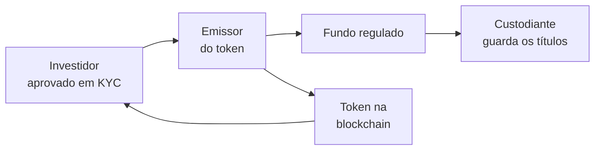
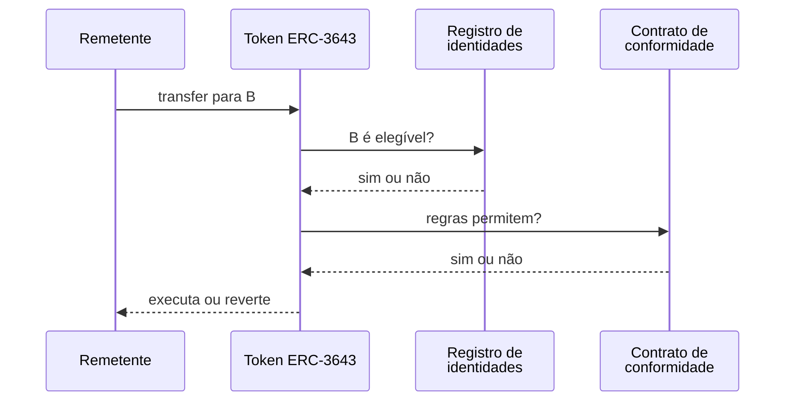

# Capítulo 30: Tokenização de Ativos do Mundo Real, Quando o Título Vira Token

**O que significa tokenizar.** Tokenizar um ativo do mundo real, ou RWA (do inglês real-world asset), é registrar num token, em uma blockchain, a posse ou o direito sobre algo que existe fora dela: um título do Tesouro americano, cotas de um fundo, um imóvel, uma commodity. O token não é o ativo, é uma representação dele. Quem manda de verdade é o contrato jurídico e o custodiante por trás do token, e a blockchain entra como o livro de registros e como o trilho de transferência. Este capítulo parte dos padrões de token vistos no Capítulo 22, usa o caso do fundo BUIDL e do padrão ERC-3643 para mostrar como a conformidade entra no contrato, e termina com os riscos. O texto é educacional e não recomenda produto algum.

**Por que isso interessa ao Ethereum.** Até aqui, o caderno tratou de ativos nativos da rede, como o ETH, e de dólares digitais, como as stablecoins (Capítulo 14 e Capítulo 15). Os RWAs são a ponte entre a finança tradicional e o mesmo conjunto de contratos que sustenta o DeFi (Capítulo 11 e Capítulo 12). A promessa descrita pelos emissores é liquidar de forma rápida, funcionar 24 horas por dia, pagar rendimento diretamente na carteira e permitir que o token seja usado como colateral. Em 2026, os levantamentos de mercado consultados colocam o total de RWAs tokenizados em redes públicas na casa de US$ 30 bilhões, com títulos do Tesouro como a maior categoria e o Ethereum, somando suas L2s, como a rede que mais concentra valor, algo perto de 60% segundo essas fontes. Os números variam de um painel para outro, porque cada um decide o que conta como RWA, então vale lê-los como ordem de grandeza.

**Um caso concreto, o fundo BUIDL.** Em março de 2024, a BlackRock lançou o BUIDL (BlackRock USD Institutional Digital Liquidity Fund), seu primeiro fundo tokenizado em uma blockchain pública, no Ethereum, com a Securitize como parceira de tokenização. O fundo investe em títulos do Tesouro americano, operações compromissadas e caixa, busca manter o valor de US$ 1 por token e paga os dividendos acumulados todos os dias na carteira do investidor, na forma de novos tokens. O acesso é restrito a investidores qualificados. Com o tempo, o fundo passou a ser emitido em outras redes e a ser aceito como colateral em plataformas de negociação. Um antecessor relevante é o BENJI, da Franklin Templeton, lançado em 2021 na rede Stellar e descrito pela gestora como o primeiro fundo monetário registrado nos Estados Unidos a usar uma blockchain pública como sistema de registro. Os dois casos mostram o mesmo padrão: um fundo regulado de sempre, com um token como forma de cota.


*O desenho mostra que o investidor passa pelo cadastro, que o fundo e o custodiante continuam fora da cadeia e que o token na blockchain é apenas a cota digital devolvida ao investidor.*

**Como a conformidade entra no código, o ERC-3643.** Um ERC-20 comum (Capítulo 22) circula livremente entre quaisquer endereços, o que não serve para um título que só pode pertencer a quem foi aprovado. O ERC-3643, nascido como o protocolo T-REX (Token for Regulated EXchanges) da Tokeny, estende o ERC-20 com verificação no momento da transferência. Segundo as descrições técnicas consultadas, o conjunto inclui um registro de identidades, que liga cada carteira a uma identidade on-chain (ONCHAINID) e a um país, um registro de emissores confiáveis, que lista quem pode atestar o KYC, um registro dos tipos de atestado exigidos e um contrato de conformidade modular, com regras como limite por país, número máximo de detentores e período mínimo de posse. Antes de cada transferência, o token consulta esses contratos: se o destinatário não for elegível ou se uma das carteiras estiver congelada, a transação falha. O padrão também prevê funções administrativas, como congelar saldos e recuperar tokens de um investidor que perdeu o acesso à chave (Capítulo 26).


*O diagrama mostra que a transferência só se conclui se o registro de identidades e o contrato de conformidade aprovarem o destinatário.*

**Permissionado não é a mesma coisa que aberto.** Aqui está a diferença cultural mais importante em relação ao resto do caderno. Um token de RWA costuma ter um administrador capaz de congelar, pausar e forçar transferências, algo que seria visto como censura em um ativo como o ETH. Para um título regulado, isso é uma exigência legal e não um defeito. Quem usa precisa saber qual modelo está diante de si.

| Aspecto | ERC-20 comum | Token de RWA permissionado (ex.: ERC-3643) |
| --- | --- | --- |
| Quem pode receber | Qualquer endereço | Apenas carteiras verificadas |
| Congelamento e recuperação | Normalmente inexistentes | Previstos, com papel de administrador |
| Base jurídica | Em geral nenhuma | Contrato, fundo ou veículo legal por trás |
| Liquidez secundária | Aberta, em DEXs | Restrita ao grupo elegível |
| Ponto de confiança | O código | Código, emissor e custodiante |

**Rendimento: de onde vem e como chega.** O que o token paga é o rendimento do ativo subjacente, e não algo criado pela rede. No caso de um fundo de Tesouro, os juros dos títulos e das compromissadas sustentam o dividendo. Os emissores adotam mecanismos distintos para entregar esse rendimento: tokens adicionais mensais, saldo que cresce por rebase (a mesma ideia do stETH vista no Capítulo 3) ou preço da cota que sobe com o tempo. Em termos simples, o valor de uma cota segue a relação abaixo.

```latex
\text{valor da cota} = \frac{\text{patrimônio líquido do fundo}}{\text{número de cotas emitidas}}
```

**Onde isso encontra o DeFi.** Tokens de fundos de Tesouro passaram a ser aceitos como colateral em plataformas de negociação e em protocolos, e stablecoins com lastro em ativos do tipo chegaram a ter parte das reservas em fundos tokenizados. Isso ecoa o que o Capítulo 15 mostrou sobre colateral do mundo real no DAI. Por outro lado, a regra de elegibilidade complica a composabilidade: um token restrito não pode simplesmente entrar em qualquer pool de liquidez, e por isso muitos arranjos usam camadas de empacotamento que só aceitam carteiras aprovadas.

**Riscos e limites.** A tokenização remove alguns intermediários, como certos agentes de transferência e sistemas de liquidação, mas adiciona outros, como a plataforma de tokenização, os auditores de contrato e o custodiante on-chain.

- *Risco jurídico.* O token representa uma reivindicação contratual sobre um ativo mantido fora da cadeia. Se ela é executável depende da documentação daquela emissão e não do registro na blockchain.
- *Risco de emissor e de custódia.* O token é tão confiável quanto o emissor, a guarda dos ativos e o mecanismo de resgate.
- *Liquidez.* Como muitos tokens são valores mobiliários restritos a investidores qualificados, o grupo de compradores é pequeno e o mercado secundário é fragmentado. Sem confiança no lastro, um token pode negociar abaixo do valor patrimonial.
- *Risco de contrato e de administração.* Há bugs possíveis (Capítulo 21), e os poderes de congelar e forçar transferências concentram confiança em quem administra.
- *Contagem de mercado.* Os painéis diferem sobre o que entra no total. Uma distinção útil separa ativos distribuídos, em que o próprio token circula e é a cota, de ativos apenas representados na cadeia, em que o registro é um espelho de algo mantido em outro sistema.

**Uma leitura de síntese.** A tokenização de RWAs não é uma tecnologia nova, e sim uma nova embalagem para produtos financeiros antigos. Seu valor está em horários estendidos, liquidação rápida e programabilidade, e seu custo está em manter a confiança em instituições. O Ethereum aparece como a rede com maior volume nesse segmento, mas essa posição depende de a regulamentação e da adoção institucional (Capítulo 13) seguirem avançando, e nada garante o ritmo. Ao encontrar um produto desse tipo, as perguntas do Capítulo 23 se aplicam com adaptações: quem custodia, quem pode resgatar, em que prazo, sob qual lei e quem pode congelar o token.

**Glossário do capítulo.**
- **RWA (real-world asset)**: ativo do mundo real, como título público, fundo, imóvel ou commodity, representado por um token numa blockchain.
- **Tokenização**: registro de um direito sobre um ativo em um token, que passa a ser transferido pela blockchain.
- **BUIDL**: fundo tokenizado da BlackRock, lançado em março de 2024 no Ethereum, que investe em Tesouro americano, compromissadas e caixa.
- **BENJI**: token do fundo monetário da Franklin Templeton, lançado em 2021 na rede Stellar.
- **ERC-3643 (T-REX)**: padrão de token permissionado que estende o ERC-20 com verificação de identidade e regras de conformidade a cada transferência.
- **ONCHAINID**: identidade on-chain que reúne atestados, como o de KYC, ligados a uma carteira.
- **Registro de identidades**: contrato que associa cada carteira elegível a uma identidade e a um país.
- **KYC (Know Your Customer)**: processo de verificação da identidade do cliente exigido por reguladores.
- **Custodiante**: instituição que guarda o ativo subjacente fora da cadeia.
- **Valor patrimonial (NAV)**: patrimônio líquido do fundo dividido pelo número de cotas.

**Fontes.**
- [BlackRock Launches Its First Tokenized Fund, BUIDL, on the Ethereum Network (Fintech Futures)](https://www.fintechfutures.com/press-releases/blackrock-launches-its-first-tokenized-fund-buidl-on-the-ethereum-network)
- [BlackRock Launches Its First Tokenized Fund, BUIDL, on the Ethereum Network (Nasdaq)](https://www.nasdaq.com/press-release/blackrock-launches-its-first-tokenized-fund-buidl-on-the-ethereum-network-2024-03-20)
- [BlackRock's BUIDL, Tokenized by Securitize, Now Accepted as Collateral on Binance](https://www.aap.com.au/aapreleases/cision20251114ae21339)
- [Franklin Templeton and Stellar Development Foundation mark five years of BENJI](https://stellar.org/press/franklin-templeton-stellar-development-foundation-mark-five-years-of-benji-the-first-u-s-registered-tokenized-money-market-fund)
- [EIP-3643: T-REX, Token for Regulated EXchanges](https://eips.ethereum.org/EIPS/eip-3643)
- [ERC3643 Whitepaper T-REX v4 (Tokeny)](https://tokeny.com/wp-content/uploads/2023/05/ERC3643-Whitepaper-T-REX-v4.pdf)
- [ERC-3643 Token (QuickNode Guides)](https://www.quicknode.com/guides/real-world-assets/erc-3643)
- [Tokenized Real-World Assets: Reading the 2026 Numbers (Finextra)](https://www.finextra.com/blogposting/31625/tokenized-real-world-assets-reading-the-2026-numbers-behind-the-headline-growth)
- [Tokenized real world assets triple to $34 billion as Treasuries and Ethereum lead (crypto.news)](https://crypto.news/tokenized-real-world-assets-triple-to-34-billion-as-treasuries-and-ethereum-lead/)
- [What Are Real World Assets (RWAs)? (Allium)](https://allium.so/blog/what-are-real-world-assets-rwas-a-clear-guide/)
