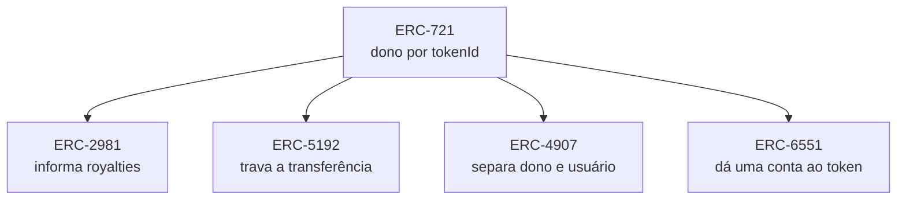

# Capítulo 31: NFTs além da Especulação, Identidade, Aluguel e Contas

**O que sobra quando o barulho passa.** O Capítulo 22 mostrou o mecanismo do ERC-721: um contrato que registra um dono por identificador e, em geral, um ponteiro para metadados. Isso é só encanamento. Em volta dele, o debate público ficou preso por anos a coleções de imagens e a preços. Este capítulo deixa o preço de lado e pergunta outra coisa: que problemas de registro, permissão e identidade um token único consegue resolver, e onde ele não resolve nada. O texto é educacional e não recomenda a compra de nenhum ativo.

**A ideia central, um token como registro de direito.** Um NFT é uma linha numa tabela pública com três informações: qual contrato, qual `tokenId` e quem é o dono. Tudo o que se constrói depois é uma regra sobre essa linha: quem pode mexer nela, por quanto tempo, com que condições, e o que ela pode possuir. Os padrões a seguir são extensões dessa tabela, e cada um troca uma peça.

*O desenho mostra que quatro padrões distintos partem do mesmo ERC-721 e cada um acrescenta uma capacidade: informar royalties, impedir a venda, alugar o uso ou permitir que o token tenha carteira própria.*

**Nomes como NFTs, o caso do ENS.** O exemplo mais cotidiano está no ENS (Ethereum Name Service), que troca endereços longos e ilegíveis por nomes como `alguem.eth`. Segundo a documentação do ENS, ao registrar um nome `.eth` o registrador emite um NFT ERC-721 para o dono, o que permite transferir, vender ou guardar o nome como qualquer outro token. Há ainda o Name Wrapper, contrato que embrulha um nome num token ERC-1155 e acrescenta os chamados fuses, permissões que podem ser queimadas de forma irreversível, de modo a viabilizar, por exemplo, subdomínios emitidos sem depender da confiança no dono do nome. O caso é útil porque o valor do token não está numa imagem, e sim numa função: o nome resolve para endereços e outros dados, e quem é dono controla essa resolução. O fato de o ENS ter sido proposto como padrão aberto desde o início (o EIP-137) mostra o fio condutor do caderno: um registro público e neutro, aberto a qualquer aplicação.

**Royalties, o padrão que não obriga.** O ERC-2981 define uma única função, `royaltyInfo(tokenId, salePrice)`, que devolve o endereço a receber e o valor do royalty. A própria especificação diz que o pagamento precisa ser voluntário, pois funções como `transferFrom()` também movem NFTs entre carteiras sem que isso signifique uma venda. Ou seja, o contrato apenas informa a intenção do criador, e cabe ao mercado respeitá-la. A história que se seguiu ilustra o limite: segundo a imprensa especializada, em novembro de 2022 a OpenSea lançou o Operator Filter, que restringia vendas a mercados que cobrassem os royalties, mas, sem adesão de todo o ecossistema e com a concorrência de mercados que tornaram a taxa opcional, a empresa anunciou em 17 de agosto de 2023 a passagem para taxas de criador opcionais e desativou o filtro em 31 de agosto. A lição técnica é a de sempre: o que não é imposto pelo código da transferência depende de convenção.

**Tokens que não se vendem, o ERC-5192.** Uma credencial como um diploma, um certificado de curso ou um ingresso nominal não deve circular. O ERC-5192, criado em 1º de julho de 2022 e com status Final, define uma interface mínima para NFTs "soulbound": a função `locked(tokenId)` informa se o token está preso, e os eventos `Locked` e `Unlocked` avisam a mudança. Quando o token está travado, todas as funções do ERC-721 que o transfeririam devem reverter. O padrão serve para que carteiras e aplicações reconheçam o token como intransferível. Ele não resolve, porém, o problema de fundo da identidade: nada garante que a pessoa que recebeu é a pessoa certa, nem que o emissor é confiável, e a perda de acesso à chave (Capítulo 26) deixa a credencial presa a um endereço morto, a menos que o emissor ofereça um caminho de recuperação.

**Aluguel, separar dono e usuário.** O ERC-4907, com status Final, estende o ERC-721 com dois papéis: o dono, que mantém o poder de transferir, e o usuário, que só tem direito de uso. A função `setUser()` define quem usa e até quando, `userOf()` informa o usuário atual, devolvendo o endereço zero se o prazo venceu, e `userExpires()` consulta o vencimento. O ganho prático é a expiração automática: não é preciso uma segunda transação para retomar o direito ao fim do aluguel. Isso permite, por exemplo, alugar um item de jogo ou uma assinatura sem entregar a propriedade.

**Token com carteira própria, o ERC-6551.** O ERC-6551 propõe que cada NFT tenha uma conta de contrato associada (conceito do Capítulo 24), de modo que o token possa receber ETH, outros tokens e até interagir com aplicações. Segundo a especificação, as contas são criadas por um registro singleton, sem permissão, com o opcode `create2`, o que torna o endereço previsível antes mesmo da implantação, e o controle pertence a quem for o dono atual do NFT. Assim, vender o NFT transfere de uma vez tudo o que está na conta dele. Ao escrever este capítulo, a proposta constava com status Review e não Final, e por isso deve ser lida como um padrão ainda em avaliação.

| Padrão | O que acrescenta ao ERC-721 | Quem faz valer a regra | Limite principal |
| --- | --- | --- | --- |
| ERC-2981 | Informa o royalty de uma venda | O mercado, voluntariamente | Não há obrigação técnica |
| ERC-5192 | Marca o token como intransferível | O contrato do token | Não prova quem é o dono real |
| ERC-4907 | Papéis de dono e usuário com prazo | O contrato do token | Depende de a aplicação ler `userOf()` |
| ERC-6551 | Conta de contrato por token | O registro e o dono do NFT | Ainda em status Review |

**Quando a regra é decidida fora da cadeia.** Em todos esses casos, o contrato é só a metade da história. Os metadados costumam viver fora da cadeia (Capítulo 22), as credenciais dependem de um emissor e a aceitação de um royalty depende de quem opera o mercado. Daí uma pergunta útil para avaliar qualquer uso de NFT: o que, exatamente, o contrato garante, e o que depende de alguém cumprir a palavra? Quanto menor a parte que o código garante, mais o token se parece com um registro administrado por uma empresa, e menos com um ativo neutro.

**Riscos e cuidados.** Além dos riscos de contrato (Capítulo 21), há o das aprovações: `setApprovalForAll()` dá a um operador poder sobre toda a coleção, e golpes de aprovação enganosa estão entre os mais comuns (Capítulo 27). Há também o risco de ponteiro, em que a imagem some se o servidor que a hospedava sair do ar, e o risco de liquidez, pois muitos tokens únicos simplesmente não têm comprador. Nada disso invalida os casos de uso acima, mas ajuda a separar função de promessa.

**Glossário do capítulo.**
- **NFT**: token não fungível, em que cada unidade tem identificador próprio e um dono registrado.
- **ENS**: serviço de nomes do Ethereum, que associa nomes legíveis a endereços e outros dados.
- **Name Wrapper**: contrato do ENS que embrulha um nome num token ERC-1155 e permite queimar permissões.
- **Fuse**: permissão que pode ser queimada de forma irreversível num nome embrulhado do ENS.
- **Royalty**: parcela de uma venda destinada ao criador do ativo.
- **Soulbound**: token preso a uma conta, que não pode ser transferido.
- **Token-bound account**: conta de contrato associada a um NFT e controlada por seu dono atual.
- **create2**: opcode que permite calcular o endereço de um contrato antes de implantá-lo.
- **Operator Filter**: mecanismo da OpenSea que restringia vendas a mercados que respeitassem royalties.

**Fontes.** (As especificações dos ERCs foram abertas diretamente no repositório oficial. Os fatos sobre OpenSea e ENS vêm de resultados de busca, pois os sites originais estavam bloqueados durante a coleta.)
- [ERC-2981, padrão de royalties de NFT](https://raw.githubusercontent.com/ethereum/ercs/master/ERCS/erc-2981.md)
- [ERC-5192, NFTs soulbound mínimos](https://raw.githubusercontent.com/ethereum/ercs/master/ERCS/erc-5192.md)
- [ERC-6551, contas vinculadas a tokens não fungíveis](https://raw.githubusercontent.com/ethereum/ercs/master/ERCS/erc-6551.md)
- [ERC-4907, aluguel de NFTs](https://raw.githubusercontent.com/ethereum/ercs/master/ERCS/erc-4907.md)
- [EIP-137, ENS (redirecionamento ao repositório de ERCs)](https://raw.githubusercontent.com/ethereum/EIPs/master/EIPS/eip-137.md)
- [ENS, documentação do Name Wrapper](https://docs.ens.domains/wrapper/contracts)
- [ENS, visão geral do Name Wrapper](https://support.ens.domains/en/articles/7902532-name-wrapper-overview)
- [The Block, OpenSea desativa a ferramenta de royalties](https://www.theblock.co/post/246095/ncrooks@theblock.co)
- [NFT Now, OpenSea muda a política de royalties](https://nftnow.com/news/opensea-changes-royalty-policy-to-optional-rarible-responds/)
- [DappRadar, OpenSea e os direitos dos criadores](https://dappradar.com/blog/openseas-move-to-cancel-royalty-enforcement-prompts-reflection-on-creator-rights)
