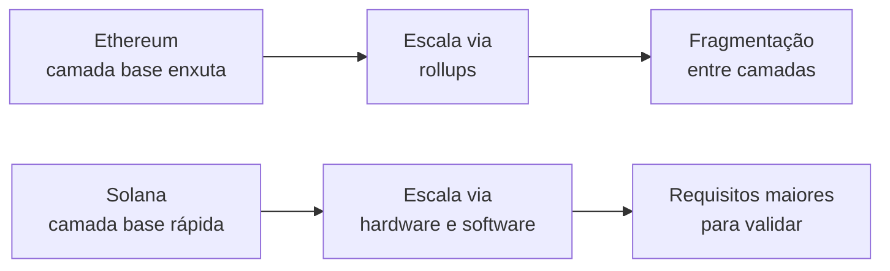

# Capítulo 32: Ethereum e Solana, uma Comparação Estrutural

**Duas respostas para o mesmo problema.** Toda blockchain pública precisa resolver as mesmas perguntas: quem escreve o próximo bloco, como a rede concorda sobre a ordem das transações, onde fica o estado e quanto custa usar o sistema. Ethereum e Solana respondem de formas bem diferentes, e entender essas diferenças vale mais do que decorar placares de velocidade. Este capítulo compara as estruturas, usa o Ethereum dos capítulos anteriores como régua e trata a Solana como contexto comparativo. O texto é educacional e não recomenda a compra de nenhum ativo.

**Duas filosofias de projeto.** Em linhas gerais, o Ethereum prioriza uma camada base enxuta, que qualquer pessoa consiga verificar, e empurra a escala para os rollups (Capítulo 5). A Solana prioriza uma camada base rápida e unificada, o que exige hardware mais exigente dos validadores. Nenhuma das duas escolhas é gratuita: o que se ganha em vazão se paga em requisitos de operação, e o que se ganha em simplicidade de verificação se paga em fragmentação entre camadas. Os pontos abaixo mostram onde essa troca aparece.


*O desenho mostra os dois caminhos de escala: no Ethereum, a vazão cresce por camadas acima da base, com o custo da fragmentação; na Solana, cresce na própria base, com o custo de operar nós mais exigentes.*

**O relógio e o consenso.** O Capítulo 2 mostrou o ritmo do Ethereum: slots de 12 segundos, epochs de 32 slots e finalidade em cerca de duas epochs, graças ao Casper FFG. A Solana nasceu com outra ideia, o Proof of History, um registro criptográfico de passagem de tempo que ajuda os validadores a concordarem sobre a ordem dos eventos, combinado com um protocolo de votação chamado TowerBFT. Segundo a proposta SIMD-0326, esse conjunto leva a uma finalidade de consenso de 12,8 segundos, e a própria proposta observa que o protocolo carece de provas formais de segurança. Em ambos os casos o princípio de segurança é o mesmo da prova de participação (Capítulo 2): votos ponderados pelo valor em stake.

**Alpenglow, a troca do motor.** A mudança mais relevante em curso na Solana é o Alpenglow, descrito na SIMD-0326, que substitui o Proof of History e o TowerBFT por um novo protocolo, do qual a proposta cobre a parte chamada Votor. O Votor usa duas rodadas de votos: numa, validadores votam para notarizar um bloco ou pular o slot; na outra, votam para finalizar. Há dois caminhos. Pelo caminho rápido, basta uma rodada com 80% do stake. Pelo caminho lento, bastam duas rodadas com 60% do stake. O Rotor, protocolo de disseminação de dados, ficou fora dessa proposta e terá propostas próprias. A SIMD também prevê limitar os validadores ativos a 2.000, por meio de um "bilhete de admissão" que custaria cerca de 0,8 SOL por dia. A proposta nasceu em julho de 2025 e, segundo a imprensa especializada, foi aprovada pela governança dos validadores em setembro de 2025, com mais de 98% dos votos a favor. Notícias de 2026 falam de um cluster comunitário de testes, com finalidade na casa de 100 a 150 milissegundos e meta de chegada à mainnet na segunda metade de 2026, mas estes números e prazos vêm de fontes secundárias, e convém consultar o estado atual antes de tratá-los como definitivos.

```latex
Ethereum (Casper FFG): finalidade ~ 2 epochs = 2 x 32 x 12 s = 768 s (~ 13 min)
Solana (TowerBFT, segundo a SIMD-0326): finalidade = 12,8 s
Solana (Alpenglow, caminho rapido): 1 rodada com 80% do stake
Solana (Alpenglow, caminho lento): 2 rodadas com 60% do stake
```

**Contas e programas, dois modelos de estado.** No Ethereum, um contrato guarda o próprio código e o próprio armazenamento (Capítulo 21). Na Solana, programas são código sem estado próprio, e os dados vivem em contas separadas. Cada conta tem saldo em lamports (um bilionésimo de SOL), campo de dados, dono e um indicador de executável. Somente o programa dono da conta pode alterar seus dados ou debitar seus lamports, e outros programas só podem lê-la. Uma consequência prática é que cada transação na Solana declara de antemão quais contas vai ler e escrever, o que permite ao sistema executar em paralelo transações que não se tocam. No Ethereum, a EVM processa as transações de um bloco em sequência. Esse paralelismo é uma das raízes da vazão maior da Solana, e também um motivo pelo qual portar um contrato de uma rede para outra exige reescrever o desenho, e não só recompilar.

**Aluguel de estado.** Guardar dados custa espaço em todos os validadores. A Solana trata isso com a exigência de um saldo mínimo para manter uma conta, a chamada isenção de aluguel, calculada pelo tamanho dos dados. A SIMD-0194 reorganiza essa conta com aritmética inteira, dobrando o parâmetro lamports por byte de 3.480 para 6.960 e reduzindo o limiar de isenção de 2,0 para 1,0, de modo que o valor absoluto exigido não muda. Já o Ethereum não cobra aluguel contínuo: o armazenamento é pago uma vez, via gás (Capítulo 16), e o crescimento do estado é tratado como problema de engenharia de longo prazo.

**Taxas, mercados diferentes.** O Ethereum tem um mercado global de taxa-base mais gorjeta (Capítulo 16): a base é queimada e a gorjeta vai ao proponente. A Solana tem uma taxa-base por assinatura e uma taxa de prioridade opcional, e, segundo a SIMD-0096, hoje 100% da taxa de prioridade vai ao validador, enquanto antes metade era queimada. A consequência é uma economia de fluxo de ordens diferente da do MEV descrito no Capítulo 17, em que a competição se dá por disputas sobre contas específicas, e não por um leilão global de gás.

**Diversidade de clientes.** O Capítulo 28 explicou por que depender de um único cliente é um risco. A Solana viveu isso por muitos anos com praticamente um só cliente de validação. Segundo relatos da imprensa especializada, o Firedancer, desenvolvido pela Jump Crypto, passou a produzir blocos na mainnet, e em 2026 uma parcela relevante do stake já rodava código do projeto, entre versões completas e a versão híbrida chamada Frankendancer. As porcentagens variam entre as fontes e mudam a cada semana, por isso não são fixadas aqui. O ponto que importa é estrutural: um segundo cliente independente reduz o risco de que um único erro derrube toda a rede.

| Dimensão | Ethereum | Solana |
| --- | --- | --- |
| Ritmo de blocos | Slots de 12 s | Slots bem mais curtos |
| Finalidade | Cerca de 13 min (Casper FFG) | 12,8 s hoje, alvo menor com o Alpenglow |
| Modelo de estado | Contratos com código e armazenamento | Programas sem estado e contas de dados |
| Execução | Sequencial na EVM | Paralela, com contas declaradas |
| Custo de estado | Gás pago uma vez | Saldo mínimo de isenção de aluguel |
| Taxa de prioridade | Gorjeta ao proponente, base queimada | 100% da prioridade ao validador |
| Escala | Rollups sobre a camada base | Vazão na própria camada base |

**Como ler uma comparação.** Números de vazão, de latência e de custo dependem de metodologia, de momento e de carga, e por isso mudam de uma fonte para outra. Uma comparação útil começa por perguntas estruturais: quem pode verificar a rede com hardware comum, o que acontece quando um cliente falha, como o estado cresce, e quem captura o valor das taxas. Esses critérios resistem melhor ao tempo do que qualquer tabela de desempenho.

**Glossário do capítulo.**
- **Proof of History**: registro criptográfico de passagem de tempo usado pela Solana para ordenar eventos.
- **TowerBFT**: protocolo de votação da Solana, baseado em votos com bloqueio crescente, que o Alpenglow pretende substituir.
- **Alpenglow**: novo protocolo de consenso da Solana, descrito na SIMD-0326.
- **Votor**: parte do Alpenglow que cuida de votação e finalização, com caminho rápido e caminho lento.
- **Rotor**: protocolo de disseminação de dados do Alpenglow, fora do escopo da SIMD-0326.
- **SIMD**: Solana Improvement Document, proposta de melhoria do protocolo, análoga aos EIPs.
- **Lamport**: menor unidade do SOL, um bilionésimo de SOL.
- **Isenção de aluguel**: saldo mínimo que uma conta da Solana precisa manter, proporcional ao tamanho de seus dados.
- **Firedancer**: cliente de validação da Solana desenvolvido pela Jump Crypto, independente do cliente original.
- **Taxa de prioridade**: valor opcional pago para elevar a chance de uma transação ser incluída mais cedo.

**Fontes.** (Os sites solana.com, anza.xyz e ethereum.org estavam bloqueados durante a coleta. Os fatos de protocolo vêm das propostas oficiais abertas no repositório de SIMDs. Aprovação do Alpenglow, status do cluster de testes, Firedancer e modelo de contas vêm de resultados de busca, sem abertura da página original.)
- [SIMD-0326, Alpenglow](https://raw.githubusercontent.com/solana-foundation/solana-improvement-documents/main/proposals/0326-alpenglow.md)
- [SIMD-0096, recompensa integral da taxa de prioridade ao validador](https://raw.githubusercontent.com/solana-foundation/solana-improvement-documents/main/proposals/0096-reward-collected-priority-fee-in-entirety.md)
- [SIMD-0194, depreciação do limiar de isenção de aluguel](https://raw.githubusercontent.com/solana-foundation/solana-improvement-documents/main/proposals/0194-deprecate-rent-exemption-threshold.md)
- [Blockworks, governança da Solana aprova o Alpenglow](https://blockworks.com/news/solana-governance-passes-alpenglow)
- [Solana Compass, o que muda com o Alpenglow](https://solanacompass.com/news/what-solanas-alpenglow-upgrade-changes-validator-costs-finality-and-96-fast-path-finalization-from-the-test-cluster)
- [Blockdaemon, status do Firedancer](https://www.blockdaemon.com/blog/what-is-firedancers-status-and-what-does-it-mean-for-solana)
- [Raydium, modelo de contas da Solana](https://docs.raydium.io/solana-fundamentals/account-model.md)
