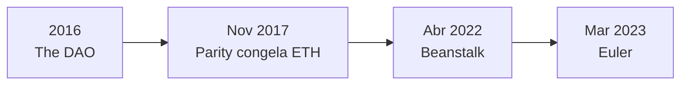
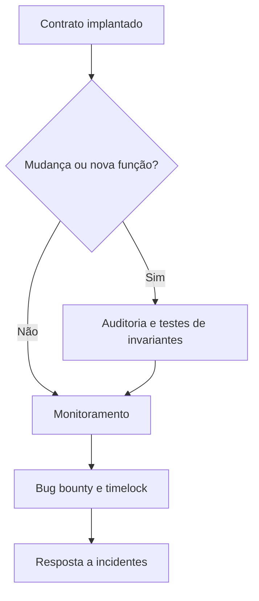

# Capítulo 33: Incidentes de Segurança Marcantes, Parity, Beanstalk e Euler

**Por que revisitar os desastres.** O Capítulo 20 contou a história da The DAO e o Capítulo 23 olhou para as pontes. Este capítulo reúne três outros episódios que ensinaram lições diferentes: a carteira multisig da Parity (2017), a governança da Beanstalk (2022) e o protocolo de empréstimos Euler (2023). Em todos, o consenso do Ethereum funcionou como deveria e a rede executou exatamente o que o código mandou. O problema estava no código, e em contratos que movimentam dinheiro de verdade um erro pequeno se paga caro. O texto é educacional, e os valores em dólar variam conforme a cotação do dia e a fonte, então valem como ordem de grandeza.

*A linha do tempo mostra os marcos: cada um expôs uma camada diferente do risco, a da biblioteca compartilhada, a da governança e a da lógica do protocolo.*

**Parity, a biblioteca que alguém apagou.** Em 6 de novembro de 2017, um usuário abriu uma issue no repositório do cliente Parity com o título "anyone can kill your contract" (qualquer um pode matar o seu contrato) e o texto "I accidentally killed it" (acabei de matá-lo sem querer), apontando para um endereço no Etherscan. A issue recebeu os rótulos de segurança e de prioridade máxima. Segundo a imprensa da época, o efeito foi travar 587 carteiras multisig com um total de 513.774,16 ETH, além de tokens, na época estimados em algo como 280 milhões de dólares. A causa é instrutiva. As carteiras multisig da Parity eram contratos pequenos que delegavam a lógica a um contrato de biblioteca único e compartilhado, usando a instrução `delegatecall` vista no Capítulo 21, que executa o código de outro contrato no contexto de quem chamou. A biblioteca em si havia ficado sem dono: foi possível chamar sua função de inicialização, tornar-se proprietário dela e então executar a autodestruição (`selfdestruct`). Sem a biblioteca, todas as carteiras que dependiam dela passaram a chamar um código que não existia mais, e os fundos ficaram inacessíveis. As carteiras afetadas eram as criadas depois de 20 de julho de 2017, quando a Parity havia publicado a correção de uma falha anterior. A lição é de arquitetura: um componente compartilhado é um ponto único de falha, e um contrato implantado sem proteção na inicialização é uma peça de código que qualquer pessoa pode operar. Esse tipo de risco motivou, anos depois, discussões sobre limitar o `selfdestruct`, o que levou à mudança de comportamento da instrução na rede.

**Beanstalk, a votação comprada por um bloco.** A Beanstalk era um protocolo de stablecoin algorítmica. Em 17 de abril de 2022, um atacante usou empréstimos relâmpago (*flash loans*, Capítulo 12), na casa de 1 bilhão de dólares tomados no Aave em stablecoins, para adquirir de forma temporária poder de voto suficiente para passar de uma maioria qualificada de cerca de dois terços. Com esse poder, o atacante aprovou uma proposta maliciosa (a BIP-18) e a executou imediatamente por meio de uma função de emergência (`emergencyCommit`), que dispensava a espera habitual de um dia. A proposta transferiu os ativos do protocolo para o atacante. O dano reportado foi de cerca de 182 milhões de dólares, dos quais o atacante teria embolsado algo como 76 milhões, já descontado o que precisou pagar para o empréstimo e a troca dos ativos. A conexão com o Capítulo 19 é direta: ali vimos que o poder de voto costuma ser medido pelos tokens que a pessoa detém, e que mecanismos como o *timelock* existem justamente para dar tempo de reação. Na Beanstalk, a rota de emergência anulou essa proteção, e o poder de voto podia ser alugado por uma única transação. Qualquer desenho de governança precisa se perguntar se o voto pode ser tomado emprestado e se há um intervalo entre aprovar e executar.

**Euler, a correção que criou uma brecha.** O Euler Finance era um protocolo de empréstimos no estilo do Capítulo 12, com recibos de depósito (eTokens) e de dívida (dTokens). Em 13 de março de 2023, um atacante explorou uma função chamada `donateToReserves`, que permitia doar eTokens às reservas do protocolo. Segundo as análises publicadas na época, essa função havia entrado numa atualização, e ela não fazia a verificação de liquidez que as transferências normais fazem. Isso permitiu criar uma posição com dívida maior que o colateral sem que o protocolo a considerasse insolvente, e depois liquidá-la em benefício do próprio atacante, o que foi repetido em cinco pools com ajuda de empréstimos relâmpago. O prejuízo ficou na faixa de 200 milhões de dólares (análises falam em cerca de 197 milhões). O desfecho foi incomum: após negociações, a Euler Labs informou que todos os fundos recuperáveis tinham sido devolvidos pelo atacante, e a última parcela, de cerca de 31 milhões de dólares, foi noticiada como o fim do processo. É um final feliz raro, e não deve ser tomado como regra: na maioria dos incidentes o dinheiro não volta. A lição técnica é que uma função nova, mesmo pequena e com boa intenção, pode quebrar uma invariante do sistema, como a de que nenhuma conta pode ficar com dívida maior que o colateral.

| Incidente | Ano | O que falhou | Camada afetada | Lição principal |
| --- | --- | --- | --- | --- |
| Parity (multisig) | 2017 | Biblioteca compartilhada sem proteção na inicialização | Arquitetura do contrato | Evitar ponto único de falha e proteger a inicialização |
| Beanstalk | 2022 | Voto tomado emprestado e rota de emergência sem espera | Governança | Separar votar de executar e vetar votos alugados |
| Euler | 2023 | Função nova sem checagem de liquidez | Lógica do protocolo | Testar invariantes e auditar cada mudança |

**O que os três têm em comum.** Nenhum envolveu quebra de criptografia, e nenhum envolveu a rede aceitando algo inválido. Foram falhas de projeto e de verificação que o código permitia. Por isso as práticas do setor se repetem: auditorias independentes antes e depois de cada atualização, testes que verifiquem invariantes (como "a dívida nunca supera o colateral"), recompensas por bugs (*bug bounties*) para estimular a divulgação responsável, limites e *timelocks* em operações sensíveis, e um desenho em que a falha de uma peça não derrube todas as outras. Uma auditoria reduz o risco mas não o elimina, e o Euler tinha sido auditado por empresas reconhecidas. Quem usa um protocolo deve tratar o contrato como uma peça de software em permanente evolução, sujeita a erro, e não como um cofre garantido.

*O desenho resume o ciclo de defesa: cada alteração passa por revisão e testes, e o protocolo continua monitorado e com canais para receber relatos de falhas.*

**Glossário do capítulo.**
- **Multisig**: carteira que exige a assinatura de mais de uma chave para aprovar uma transação.
- **delegatecall**: instrução da EVM que executa o código de outro contrato usando o armazenamento de quem chamou.
- **selfdestruct**: instrução que remove um contrato da rede, que no caso da Parity apagou a biblioteca de que as carteiras dependiam.
- **Flash loan**: empréstimo sem garantia que precisa ser quitado dentro da mesma transação.
- **Maioria qualificada**: proporção mínima de votos, aqui cerca de dois terços, necessária para aprovar uma proposta.
- **emergencyCommit**: função de execução imediata de propostas da Beanstalk, que dispensava a espera habitual.
- **Invariante**: propriedade que deve ser sempre verdadeira em um protocolo, como a de que a dívida não excede o colateral.
- **Bug bounty**: recompensa paga a quem reporta uma vulnerabilidade de forma responsável.
- **Pós-mortem**: relatório público que explica a causa e o desenrolar de um incidente.

**Fontes.**
- [GitHub, issue 6995 do Parity, "anyone can kill your contract" (aberta durante a pesquisa)](https://github.com/openethereum/parity-ethereum/issues/6995)
- [TechCrunch, congelamento de ETH na Parity em novembro de 2017 (consultada por resultado de busca)](https://techcrunch.com/2017/11/07/a-major-vulnerability-has-frozen-hundreds-of-millions-of-dollars-of-ethereum)
- [Cointelegraph, perda de 182 milhões de dólares na Beanstalk (consultada por resultado de busca)](https://cointelegraph.com/news/beanstalk-farms-loses-182m-in-defi-governance-exploit)
- [Security Affairs, ataque à Beanstalk (consultada por resultado de busca)](https://securityaffairs.com/130334/cyber-crime/beanstalk-defi-182m-losses.html)
- [CertiK, análise do incidente do Euler Finance (consultada por resultado de busca)](https://www.certik.com/blog/4iSrYY6HoaYxk1aKyjFb5v-euler-finance-incident-analysis)
- [Decrypt, devolução dos fundos recuperáveis do Euler (consultada por resultado de busca)](https://decrypt.co/125373/euler-finance-exploiter-returns-recoverable-funds-200m-hack)
