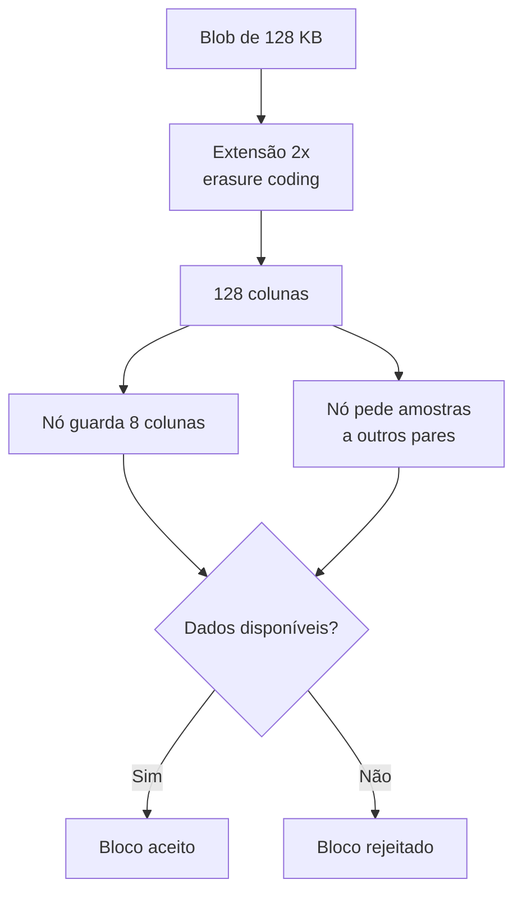
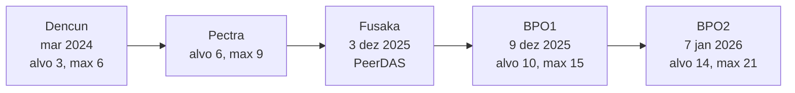

# Capítulo 34: Disponibilidade de Dados, Blobs e PeerDAS

O Capítulo 5 apresentou os rollups e explicou que o EIP-4844 criou os blobs, um espaço barato para os rollups publicarem seus dados no Ethereum. Faltou responder uma pergunta que decide o futuro da escala da rede: como garantir que milhares de nós confirmem que esses dados foram mesmo publicados, sem que cada um precise baixar tudo? Este capítulo trata desse problema, chamado de disponibilidade de dados, e da solução que entrou em produção com a atualização Fusaka: o PeerDAS.

**Por que a disponibilidade importa.** Um rollup (Capítulo 5) só é verificável se qualquer pessoa puder reconstruir seu estado a partir dos dados publicados na camada base. Se um sequenciador publicasse apenas o compromisso e escondesse os dados, ninguém conseguiria provar fraude nem retirar fundos com segurança. Por isso o Ethereum não precisa guardar os dados para sempre, mas precisa ter certeza de que eles ficaram acessíveis a todos durante uma janela de tempo. Essa certeza é a disponibilidade de dados.

**O ponto de partida: o EIP-4844.** Segundo o texto do EIP, cada blob tem 4.096 elementos de campo de 32 bytes, ou seja, 131.072 bytes (128 KB). O blob é representado por um compromisso KZG, e o dado em si fica na camada de consenso, não na execução. Os nós de consenso precisam guardá-lo por um período mínimo de cerca de 18 dias, depois do qual pode ser descartado. Os blobs têm mercado de taxas próprio, com preço que se ajusta de forma exponencial, no mesmo espírito do EIP-1559 visto no Capítulo 16. Na versão original, o alvo era de 3 blobs por bloco e o máximo de 6.

```latex
\text{preço do blob} = \text{fake\_exponential}\left(\text{piso},\ \text{excesso de blob gas},\ \text{fração de atualização}\right)
```
*A fórmula resume a regra de preço: quanto mais os blocos ficam acima do alvo, maior o excesso acumulado e mais caro fica o blob, e o contrário vale quando há folga.*

**O gargalo.** No desenho original, todo nó baixa todos os blobs de todos os blocos. Isso é simples e seguro, mas faz a banda de cada nó crescer na mesma proporção que o número de blobs. Aumentar a capacidade sem exigir máquinas e conexões cada vez maiores pede outro método.

**A ideia central: amostragem.** Em vez de baixar tudo, cada nó baixa uma fração pequena e escolhida ao acaso, e confia na estatística. Para isso funcionar, o dado precisa ser protegido por um código de correção de erros (*erasure coding*). Cada blob é estendido para o dobro do tamanho, de modo que qualquer metade dos pedaços basta para reconstruir o original. Quem quisesse esconder um blob teria de reter mais da metade dos pedaços, e isso seria notado por amostras aleatórias com altíssima probabilidade.

**Como o PeerDAS organiza isso.** Descrito no EIP-7594, o PeerDAS aplica a extensão a cada blob e divide o resultado em células. Uma coluna é o conjunto das células de mesmo índice em todos os blobs do bloco. Segundo a documentação do protocolo, são 128 colunas, e qualquer 64 delas bastam para reconstruir os dados. Cada nó fica responsável (custódia) por algumas colunas definidas de forma determinística pelo seu identificador, e as recebe pelas sub-redes correspondentes. Um nó comum guarda 8 das 128 colunas, o que, como os dados foram duplicados, equivale a baixar cerca de 1/8 do volume original. A cada slot ele também pede a pares algumas outras colunas como amostra. Quem junta ao menos metade das colunas consegue reconstruir o conjunto completo e redistribuir o que falta. As provas KZG por célula são calculadas por quem envia a transação, o que poupa o produtor do bloco de refazer esse trabalho. A própria EIP traz uma análise em que a chance de um ataque bem-sucedido contra uma fração pequena da rede fica desprezível.


*O desenho mostra o caminho de um blob: ele é estendido, repartido em colunas, e cada nó verifica a disponibilidade com uma parte pequena dos dados.*

**BPO, ajustar a capacidade sem um hard fork inteiro.** Com a amostragem, aumentar o número de blobs passa a ser seguro em degraus. O EIP-7892 criou os *Blob Parameter Only forks* (BPO): bifurcações que mudam apenas parâmetros de blobs (alvo, máximo e a fração de atualização do preço), por configuração, sem alterar o código dos clientes. A motivação declarada é evitar grandes mudanças raras e permitir ajustes depois de observar a rede. O cronograma divulgado após a Fusaka, ativada em 3 de dezembro de 2025, previa o primeiro BPO em 9 de dezembro de 2025 (alvo de 6 para 10 e máximo de 9 para 15) e o segundo em 7 de janeiro de 2026 (alvo de 10 para 14 e máximo de 15 para 21).


*A linha do tempo mostra os degraus de capacidade de blobs, do EIP-4844 original até os dois ajustes que se seguiram à Fusaka.*

| Aspecto | Antes do PeerDAS | Com o PeerDAS |
| --- | --- | --- |
| Quem baixa os blobs | Todos os nós, completos | Cada nó, uma fração (cerca de 1/8) |
| Verificação | Download integral | Amostragem aleatória de colunas |
| Reconstrução | Desnecessária | Possível com 64 de 128 colunas |
| Aumento de capacidade | Limitado pela banda de cada nó | Escala com o número de nós |
| Mudança de parâmetros | Hard fork completo | Forks BPO, só configuração |

**O que isso muda na prática.** Mais capacidade de blobs tende a baixar o custo de publicação dos rollups, o que se reflete nas taxas dos usuários das L2 (Capítulos 6 a 8). Também reforça uma escolha de desenho do Ethereum: o roteiro centrado em rollups depende de a camada base oferecer dados baratos e verificáveis, e o PeerDAS é a peça que permite ampliar essa oferta sem transformar a operação de um nó em algo restrito a grandes data centers, preocupação já vista na discussão sobre limite de gas no Capítulo 10. Vale lembrar que capacidade não é demanda: o preço do blob continua a depender de quanto os rollups realmente usam. Nenhuma parte deste capítulo é recomendação de investimento.

**Glossário do capítulo.**
- **Disponibilidade de dados**: garantia de que os dados de um bloco foram publicados e podem ser baixados por qualquer participante.
- **Blob**: pacote de 128 KB de dados anexado a transações do tipo blob, usado sobretudo por rollups.
- **Compromisso KZG**: compromisso criptográfico curto que permite provar propriedades de um blob sem revelá-lo por inteiro.
- **Erasure coding**: técnica que estende os dados com redundância, de modo que uma parte deles basta para reconstruir o original.
- **Coluna**: conjunto das células de mesmo índice em todos os blobs de um bloco, unidade de custódia e amostragem no PeerDAS.
- **Custódia**: dever de um nó de guardar e servir determinadas colunas.
- **PeerDAS**: mecanismo da Fusaka (EIP-7594) em que os nós verificam a disponibilidade amostrando colunas em vez de baixar tudo.
- **BPO (Blob Parameter Only)**: fork que altera apenas parâmetros de blobs por configuração (EIP-7892).
- **Blob gas**: unidade de medida e cobrança do uso de blobs, com mercado separado do gás comum.

**Fontes.**
- [EIP-7594, PeerDAS (aberta durante a pesquisa)](https://raw.githubusercontent.com/ethereum/EIPs/master/EIPS/eip-7594.md)
- [EIP-7892, Blob Parameter Only forks (aberta durante a pesquisa)](https://raw.githubusercontent.com/ethereum/EIPs/master/EIPS/eip-7892.md)
- [EIP-4844, Shard Blob Transactions (aberta durante a pesquisa)](https://raw.githubusercontent.com/ethereum/EIPs/master/EIPS/eip-4844.md)
- [Documentação do Teku sobre PeerDAS, parâmetros de colunas e custódia (consultada por resultado de busca)](https://docs.teku.consensys.io/concepts/peer-das)
- [ethereum.org, PeerDAS (consultada por resultado de busca)](https://ethereum.org/roadmap/fusaka/peerdas.md)
- [Quicknode, Fusaka e cronograma dos BPO (consultada por resultado de busca)](https://blog.quicknode.com/ethereum-fusaka-upgrade-what-you-need-to-know)
