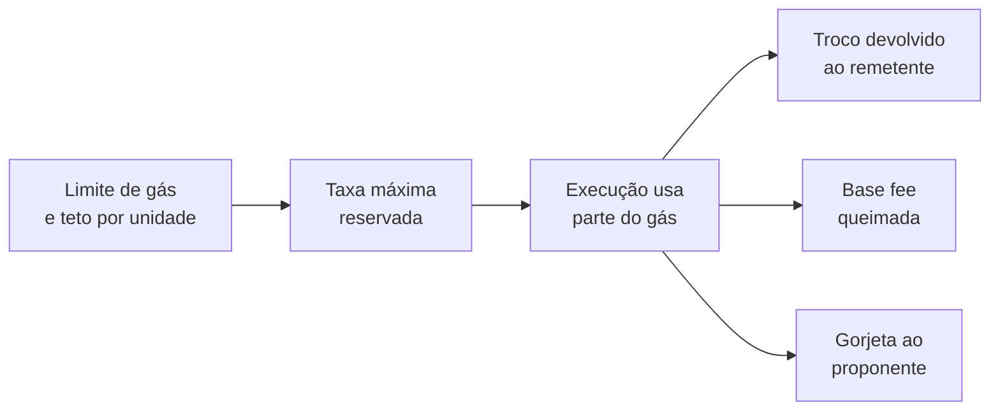
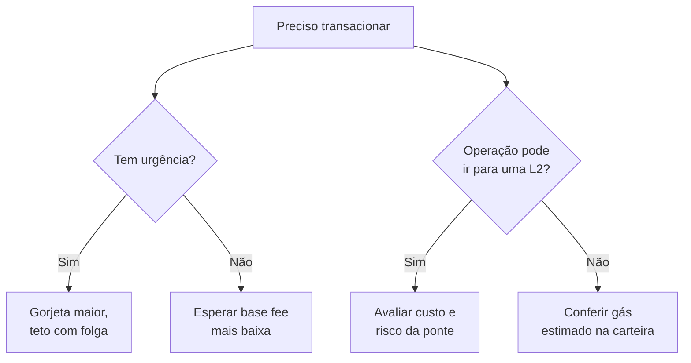

# Capítulo 35: Taxas de Gas na Prática, Como Ler e Como Economizar

O Capítulo 16 explicou o desenho do mercado de taxas depois da EIP-1559, com base fee, priority fee e queima. Faltou o lado de quem está diante da carteira: por que a mesma ação custa valores tão diferentes, de onde vêm os números que aparecem na tela de confirmação e o que realmente reduz a conta. Este capítulo é um guia de leitura e de bom senso, ancorado nas regras do protocolo e não em dicas de ocasião.

**Duas perguntas separadas: quanto gás e a que preço.** Toda taxa é um produto de duas coisas independentes. A primeira é a quantidade de gás, que mede o trabalho que a transação provoca na rede e depende do que ela faz. A segunda é o preço de cada unidade de gás, dado em gwei (um bilionésimo de ETH), que depende da disputa por espaço naquele momento. Quem confunde as duas costuma achar que "o gás está caro" quando, na verdade, a operação é pesada, ou o contrário.

```latex
\text{taxa paga} = \text{gás usado} \times \left(\text{base fee} + \text{priority fee efetiva}\right)
```
*A fórmula separa o que depende da operação (gás usado) do que depende do mercado (base fee mais gorjeta).*

Um exemplo ilustrativo, com preços inventados só para a conta: uma transferência simples de ETH usa 21.000 de gás. Com base fee de 2 gwei e gorjeta de 0,1 gwei, o preço efetivo é 2,1 gwei, e a taxa é 21.000 × 2,1 = 44.100 gwei, ou 0,0000441 ETH. Se a base fee fosse dez vezes maior, a conta seria dez vezes maior, mas a quantidade de gás continuaria a mesma.

**O que cada campo da carteira significa.** Pela especificação da EIP-1559, o remetente informa um limite de gás (gas limit), um teto por unidade (max fee per gas) e uma gorjeta máxima (max priority fee per gas). O preço efetivo é a base fee do bloco mais o menor valor entre a gorjeta máxima e a diferença entre o teto e a base fee. A carteira bloqueia no início o limite de gás multiplicado pelo preço efetivo e devolve o que não foi usado. Por isso o gás usado quase nunca é igual ao limite, e a diferença volta ao saldo. Já a base fee é sempre queimada, e só a gorjeta vai para quem propõe o bloco.


*O desenho mostra que a carteira reserva o pior caso, mas só cobra o gás efetivamente usado, e que a parcela cobrada se divide entre queima e gorjeta.*

Na prática, o teto por unidade serve de seguro contra picos entre o envio e a inclusão. Defini-lo com folga não encarece a transação, porque a cobrança segue o preço efetivo. Já um limite de gás baixo demais faz a transação falhar no meio, e o gás consumido até ali é perdido. Por isso as carteiras estimam o limite por simulação e costumam somar uma margem.

**Por que operações diferentes custam tão diferente.** O protocolo atribui um custo a cada instrução da EVM, tema do Capítulo 21. Alguns números ajudam a ter noção de ordem de grandeza. A transferência simples de ETH tem custo intrínseco fixo de 21.000. A EIP-2929 definiu o custo de ler um slot de armazenamento pela primeira vez na transação em 2.100 de gás e o de tocar uma conta ainda não acessada em 2.600, contra 100 para um acesso repetido ao mesmo item. A lógica é cobrar mais pelo que obriga o nó a buscar dados no disco. Já os dados enviados à transação (calldata) custam 16 de gás por byte não zero desde a EIP-2028, que baixou o valor anterior, de 68. Em resumo, trocar um token numa corretora descentralizada toca várias contas e vários slots, e por isso consome muito mais que enviar ETH, mesmo com o preço por unidade idêntico.

| Ação | O que pesa no gás | Efeito prático |
| --- | --- | --- |
| Enviar ETH | Custo intrínseco de 21.000 | Previsível e barato |
| Enviar um token ERC-20 | Leitura e escrita de saldos no contrato | Mais caro que ETH |
| Aprovar um token (approve) | Escrita de um valor de permissão | Custo moderado, pago uma vez por contrato |
| Trocar em AMM ou usar empréstimo | Muitas contas e slots tocados | Várias vezes o custo de uma transferência |
| Publicar muitos dados em calldata | Custo por byte e piso de calldata | Encarecido pelo piso da EIP-7623 |

*A tabela compara ações comuns pelo que domina o seu consumo de gás. As magnitudes relativas, não os valores absolutos, são o que importa para a escolha.*

**O piso de calldata e os reembolsos.** Duas regras mais recentes mexem na conta. A EIP-7623, da Pectra, criou um piso para transações dominadas por dados: o gás usado passa a ser o maior entre o custo normal (4 de gás por "token" de calldata mais a execução) e 10 de gás por token. Segundo o texto da EIP, o uso comum, como enviar ativos, DeFi ou bridging, fica praticamente intacto, pois a execução é que domina. O alvo são transações que usam calldata como canal de dados. Do outro lado, a EIP-3529, da London, reduziu os reembolsos de gás, limitando-os a 20% do gás usado (antes 50%) e baixando o reembolso de limpar um slot de 15.000 para 4.800, além de eliminar o reembolso do SELFDESTRUCT. A motivação declarada foi acabar com os chamados gas tokens, que armazenavam gás barato para gastar quando estivesse caro.

**Como ler uma transação já feita.** Em um explorador de blocos, cinco campos contam a história. O gas limit mostra o que o remetente reservou, o gas used mostra o consumido, e a razão entre eles indica a folga. A base fee do bloco e a gorjeta mostram quanto do preço foi mercado e quanto foi prioridade. O valor queimado é a base fee multiplicada pelo gás usado. E a taxa total confere com a fórmula deste capítulo. Se a taxa parece alta, a pergunta certa é qual dos dois fatores explica: gás usado alto aponta para operação complexa, preço alto aponta para congestionamento.

**Como reduzir a conta com critério.**
- **Escolher o momento.** Como a base fee acompanha a demanda, operações que não têm pressa podem esperar fases de menor atividade. A previsibilidade de um bloco para o seguinte, tratada no Capítulo 16, ajuda a carteira a estimar bem.
- **Não pagar gorjeta além do necessário.** Em períodos calmos, uma gorjeta mínima costuma bastar para inclusão. Pagar mais só ajuda quando há disputa real e urgência, como em lançamentos concorridos ou na tentativa de se antecipar a outros usuários, assunto do Capítulo 17.
- **Usar camadas 2 para o dia a dia.** Os rollups dos Capítulos 5 a 9 publicam dados em blobs, com mercado próprio, e por isso as taxas costumam ser bem menores. O Capítulo 34 mostra como o PeerDAS amplia essa capacidade. O custo é lidar com pontes e com as hipóteses de segurança de cada rede, riscos discutidos no Capítulo 23.
- **Agrupar e simplificar.** Contas abstratas (Capítulo 24) permitem agrupar etapas em uma só transação, e menos transações significam menos custo intrínseco repetido.
- **Cuidar das aprovações.** Aprovar valores exatos em vez de ilimitados não muda muito o gás, mas reduz o risco, ponto central do Capítulo 27. Economizar gás nunca deve vir às custas de segurança.

**Armadilhas frequentes.** Transações presas por teto baixo demais ficam pendentes e podem ser substituídas reenviando com o mesmo nonce e taxas maiores. Transações que falham ainda cobram o gás consumido até o ponto da falha, porque a rede já fez o trabalho. E aceleradores ou "reduza o gás" prometidos por sites desconhecidos são um golpe clássico, como visto no Capítulo 27.


*O fluxo resume as decisões que de fato mexem na taxa: urgência, momento e escolha da camada, sempre com atenção ao risco.*

**O que vem pela frente.** O Capítulo 10 tratou da trilha de aumento do limite de gás por bloco, e mais espaço por bloco tende a reduzir a pressão que leva a picos de preço. Há também discussões sobre recalibrar custos de gás para refletir melhor o trabalho real. A EIP-2780, por exemplo, propõe decompor o custo fixo de 21.000 em parcelas ligadas a recursos como recuperação de assinatura, acesso a contas e criação de estado, mantendo 21.000 para uma transferência simples a uma conta existente. No texto consultado, a proposta está em estágio de revisão e sem fork definido, então vale tratá-la como possibilidade, não como mudança certa. Este capítulo é educacional e não recomenda operações nem momentos de compra ou venda.

**Glossário do capítulo.**
- **Gás**: unidade que mede o trabalho computacional e de armazenamento exigido por uma transação.
- **Gwei**: unidade de preço do gás, igual a um bilionésimo de ETH.
- **Gas limit**: quantidade máxima de gás que o remetente autoriza a transação a consumir.
- **Base fee**: preço mínimo por unidade de gás definido pelo protocolo para o bloco, queimado em sua totalidade.
- **Priority fee**: gorjeta por unidade de gás paga a quem propõe o bloco.
- **Max fee per gas**: teto por unidade que o remetente aceita pagar, somando base fee e gorjeta.
- **Calldata**: área de dados enviada junto com uma transação, cobrada por byte.
- **Piso de calldata**: regra da EIP-7623 que impõe custo mínimo a transações dominadas por dados.
- **Reembolso de gás**: devolução parcial de gás por certas operações, limitada pela EIP-3529.
- **Nonce**: contador de transações de uma conta, usado para ordenar e para substituir transações pendentes.

**Fontes.**
- [EIP-1559, Fee market change (aberta durante a pesquisa)](https://raw.githubusercontent.com/ethereum/EIPs/master/EIPS/eip-1559.md)
- [EIP-7623, Increase calldata cost (aberta durante a pesquisa)](https://raw.githubusercontent.com/ethereum/EIPs/master/EIPS/eip-7623.md)
- [EIP-2929, Gas cost increases for state access opcodes (aberta durante a pesquisa)](https://raw.githubusercontent.com/ethereum/EIPs/master/EIPS/eip-2929.md)
- [EIP-2028, Transaction data gas cost reduction (aberta durante a pesquisa)](https://raw.githubusercontent.com/ethereum/EIPs/master/EIPS/eip-2028.md)
- [EIP-3529, Reduction in refunds (aberta durante a pesquisa)](https://raw.githubusercontent.com/ethereum/EIPs/master/EIPS/eip-3529.md)
- [EIP-2780, Reduce intrinsic transaction gas (aberta durante a pesquisa)](https://raw.githubusercontent.com/ethereum/EIPs/master/EIPS/eip-2780.md)
