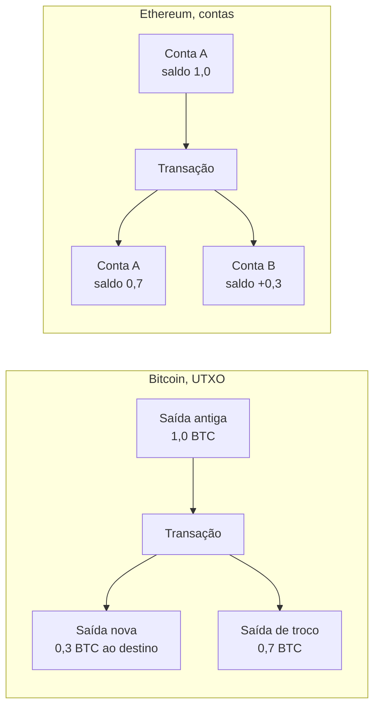

# Capítulo 36: Bitcoin e Ethereum, uma Comparação Estrutural

O Capítulo 32 colocou o Ethereum ao lado da Solana. Faltava a comparação mais básica de todas, com a rede que veio antes. O Bitcoin é o ponto de partida do setor e o Ethereum nasceu, em boa medida, como uma resposta a ele. Este capítulo não escolhe vencedor nem recomenda nada. O objetivo é entender, camada por camada, o que cada projeto decidiu e por quê, porque as duas redes otimizam coisas diferentes.

**Duas perguntas de partida.** O Bitcoin foi desenhado para ser, antes de tudo, um registro de propriedade de uma moeda digital, com regras monetárias previsíveis e o mínimo possível de funcionalidade. O Ethereum, como mostrou o Capítulo 1, foi desenhado como um computador compartilhado, em que a moeda (o ETH) é o combustível de programas arbitrários. Quase todas as diferenças abaixo derivam dessas duas ambições.

**Modelo de estado: moedas avulsas contra contas.** O Bitcoin usa o modelo UTXO (unspent transaction output, saída de transação não gasta). Não existe "saldo" gravado em lugar nenhum do protocolo. Existem saídas de transações anteriores que ainda não foram gastas, e o saldo de uma carteira é a soma das que ela consegue destravar. Uma transação consome saídas inteiras como entradas e cria novas saídas, em geral uma para o destinatário e outra de troco para o próprio remetente, como acontece ao pagar com uma nota grande e receber o troco. O Ethereum, como visto no Capítulo 21, usa contas: cada endereço tem um nonce, um saldo, um código e uma raiz de armazenamento, e uma transação simplesmente subtrai de um saldo e soma em outro. Contas facilitam programas que guardam estado ao longo do tempo. UTXOs facilitam verificar cada transação de forma isolada, o que ajuda na paralelização e na privacidade de quem gera endereços novos a cada pagamento.


*O lado esquerdo mostra uma saída inteira sendo consumida e dividida em duas novas, o direito mostra apenas saldos de contas sendo atualizados (taxas omitidas).*

**Programabilidade: Script e EVM.** O Bitcoin tem uma linguagem de scripts própria, baseada em pilha, usada para definir as condições de gasto de cada saída. A linguagem é deliberadamente limitada, sem laços, justamente para que a validação seja previsível. O caso mais comum é "só quem apresentar uma assinatura válida para esta chave pública pode gastar". Atualizações como a Taproot (BIP-341) ampliaram o que é possível sem abandonar essa filosofia: combinam assinaturas Schnorr, que permitem agregar chaves, com uma árvore de Merkle de condições alternativas, de modo que apenas o caminho de gasto efetivamente usado precisa ser revelado, e, se todas as partes cooperam, o gasto parece uma assinatura comum. No Ethereum, a EVM (Capítulo 21) executa bytecode arbitrário, com o gás impedindo laços infinitos. Isso permite DeFi, tokens, DAOs e tudo o que ocupou os capítulos 11 a 25, ao custo de uma superfície de ataque muito maior, como o Capítulo 33 mostrou.

**Consenso: trabalho contra capital.** O Bitcoin usa proof-of-work: mineradores competem para achar um cabeçalho de bloco cujo hash fique abaixo de um alvo. O parâmetro de desenho é um bloco a cada 10 minutos em média, e a dificuldade é recalculada a cada 14 dias (2.016 blocos) para manter esse ritmo, segundo os parâmetros do código de referência do Bitcoin Core. O Ethereum também foi minerado até 15 de setembro de 2022. A EIP-3675 formalizou a troca por proof-of-stake e removeu o cálculo de dificuldade e as recompensas de mineração; a transição foi disparada por uma dificuldade total acumulada, não por uma altura de bloco, para evitar que uma minoria de poder de hash criasse uma bifurcação maliciosa. Hoje, no Ethereum, a segurança vem de ETH travado e de penalidades como o slashing (Capítulo 2), enquanto no Bitcoin vem de energia e hardware gastos fora do protocolo. São custos de ataque de naturezas diferentes, e cada comunidade defende o seu como mais robusto.

**Política monetária: calendário fixo contra equilíbrio dinâmico.** No Bitcoin, a regra está escrita em poucas linhas de código: o subsídio inicial por bloco é de 50 BTC e é dividido por dois a cada 210.000 blocos, o que leva a um total em torno de 21 milhões de unidades. O quarto halving ocorreu em abril de 2024, no bloco 840.000, e reduziu o subsídio de 6,25 para 3,125 BTC. Isso significa que, com o tempo, a segurança dependerá cada vez mais das taxas de transação. O ETH não tem teto fixo. Como o Capítulo 1 e o Capítulo 16 detalharam, a emissão a validadores é parcialmente compensada pela queima da base fee, e o suprimento líquido sobe ou desce conforme o uso da rede.

```latex
\text{subsídio}(h) = \frac{50\ \text{BTC}}{2^{\lfloor h / 210000 \rfloor}}
```
*A fórmula dá o subsídio do bloco de altura h no Bitcoin, com divisão inteira por 210.000 e zero após 64 halvings, como implementado no código de referência.*

**Capacidade e taxas.** No Bitcoin, a SegWit (BIP-141) trocou o limite de tamanho por um limite de peso de 4.000.000 unidades por bloco, em que a parte de assinaturas (a testemunha) pesa menos que o resto, além de eliminar a maleabilidade de transações, o que viabilizou protocolos de segunda camada como a Lightning Network. A camada base do Bitcoin é deliberadamente conservadora, e a escala é buscada em camadas sobre ela. O Ethereum seguiu um caminho parecido por motivos próprios, o roteiro centrado em rollups (Capítulos 5 e 34), mas com uma camada base programável e um limite de gás ajustável por sinalização dos validadores (Capítulo 10).

**Resumo lado a lado.**

| Aspecto | Bitcoin | Ethereum |
| --- | --- | --- |
| Propósito central | Reserva e transferência de valor | Plataforma de contratos inteligentes |
| Modelo de estado | UTXO | Contas |
| Programabilidade | Script limitado, com Taproot | EVM com bytecode arbitrário |
| Consenso | Proof-of-work | Proof-of-stake desde 2022 |
| Ritmo de blocos | Cerca de 10 minutos (alvo) | Slots de 12 segundos |
| Oferta do ativo | Calendário fixo, cerca de 21 milhões | Sem teto, emissão menos queima |
| Escala | Camadas sobre a base, como a Lightning | Rollups sobre a base |
| Mudança de regras | Muito conservadora | Hard forks regulares e planejados |

**Cultura de mudança.** A tabela esconde uma diferença social. O Bitcoin trata alterações de protocolo como raras e perigosas, e o que se quer preservar é a previsibilidade. O Ethereum atualiza o protocolo a cada poucos meses ou anos, com um processo aberto de EIPs, e aceitou até um hard fork de resgate em 2016 (Capítulo 20), algo que no Bitcoin seria impensável para a maior parte da comunidade. Nenhuma das posturas é neutra: a primeira protege a regra monetária, a segunda protege a capacidade de evoluir.

**Como ler a comparação.** São redes com metas distintas, e por isso a pergunta "qual é melhor" costuma estar mal formulada. Uma pergunta mais útil é qual propriedade importa para cada uso: resistência a mudanças de regra, programabilidade, custo de segurança ou facilidade de verificação. Este caderno não faz recomendação de compra ou venda de nenhum ativo.

**Glossário do capítulo.**
- **UTXO**: saída de transação ainda não gasta, a unidade de valor do modelo do Bitcoin.
- **Troco**: saída criada para devolver ao próprio remetente a parte de uma entrada que excede o pagamento.
- **Script**: linguagem de pilha do Bitcoin que define as condições para gastar uma saída.
- **Taproot (BIP-341)**: atualização do Bitcoin que combina assinaturas Schnorr e árvores de Merkle de condições de gasto.
- **Assinatura Schnorr**: esquema de assinatura que permite agregar várias chaves em uma só.
- **Proof-of-work**: consenso baseado em encontrar um hash abaixo de um alvo, o que exige gasto de energia.
- **Ajuste de dificuldade**: recálculo periódico do alvo para manter o ritmo médio de blocos.
- **Halving**: redução à metade do subsídio de bloco do Bitcoin, a cada 210.000 blocos.
- **SegWit (BIP-141)**: mudança que separa as assinaturas (testemunha) do resto da transação e introduz o limite de peso por bloco.
- **Dificuldade total terminal**: dificuldade acumulada que disparou a transição do Ethereum para proof-of-stake.

**Fontes.** (Os sites ethereum.org, bitcoin.org e developer.bitcoin.org estavam bloqueados durante a coleta. Os fatos de protocolo vêm de especificações e do código de referência abertos no GitHub. A data e o bloco do quarto halving vêm de resultados de busca.)
- [Bitcoin Core, parâmetros da rede principal (chainparams.cpp)](https://raw.githubusercontent.com/bitcoin/bitcoin/master/src/kernel/chainparams.cpp)
- [Bitcoin Core, GetBlockSubsidy (validation.cpp)](https://raw.githubusercontent.com/bitcoin/bitcoin/master/src/validation.cpp)
- [Bitcoin Core, constantes de consenso (consensus.h)](https://raw.githubusercontent.com/bitcoin/bitcoin/master/src/consensus/consensus.h)
- [BIP-141, Segregated Witness](https://raw.githubusercontent.com/bitcoin/bips/master/bip-0141.mediawiki)
- [BIP-341, Taproot](https://raw.githubusercontent.com/bitcoin/bips/master/bip-0341.mediawiki)
- [EIP-3675, transição para Proof-of-Stake](https://raw.githubusercontent.com/ethereum/EIPs/master/EIPS/eip-3675.md)
- [Forklog, Bitcoin passa pelo quarto halving](https://forklog.com/en/bitcoin-undergoes-fourth-halving/)
