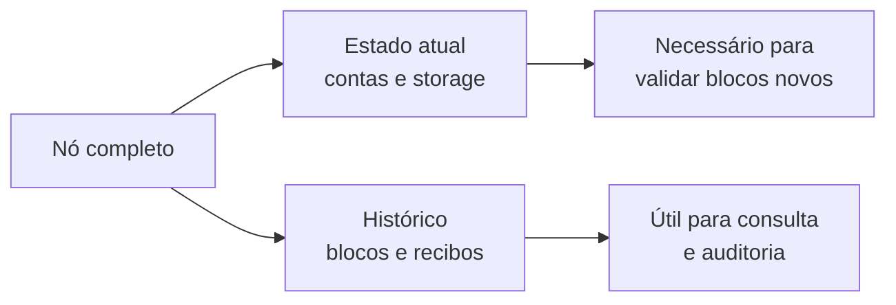
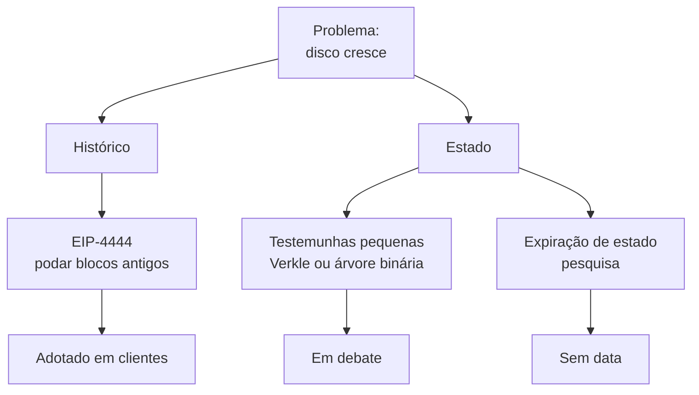

# Capítulo 37: Estado, Statelessness e Expiração de Histórico

Os capítulos anteriores trataram de como o Ethereum processa mais transações (rollups, blobs, gás). Este capítulo olha para o outro lado da moeda: o que cada nó precisa guardar no disco para participar da rede. Rodar um nó é o que mantém a rede verificável por qualquer pessoa, e esse custo cresce com o tempo. Entender por que ele cresce, e quais propostas tentam contê-lo, ajuda a ler boa parte do roteiro de longo prazo do protocolo.

**Estado e histórico são coisas diferentes.** O estado é a fotografia atual da rede: saldos, nonces, código dos contratos e o conteúdo do armazenamento de cada conta (Capítulo 21). O histórico é o registro de todos os blocos, transações e recibos desde o bloco gênese. Para validar um bloco novo, um nó precisa do estado atual, mas não precisa reler blocos antigos. Essa distinção organiza duas famílias de soluções com problemas e riscos bem distintos.


*O nó guarda dois conjuntos de dados, mas só o estado é indispensável para validar o próximo bloco.*

**Por que o estado pesa.** O estado do Ethereum é organizado em uma árvore de Merkle Patricia, estrutura em que cada nó é resumido por um hash, e a raiz resume tudo e vai no cabeçalho do bloco. Isso permite provar que um dado pertence ao estado com uma prova de Merkle (uma "testemunha", ou witness). O problema é o tamanho: segundo a EIP-6800, uma testemunha de uma conta na árvore atual fica em média em torno de 3 KB e pode chegar a cerca de 9 KB. No pior caso de acessos por bloco, isso poderia gerar da ordem de 18 MB de testemunhas, volume grande demais para propagar na rede dentro de um slot de 12 segundos. Por isso hoje todo nó precisa manter o estado inteiro localmente.

**Statelessness, a ideia.** Um cliente sem estado (stateless) validaria blocos sem guardar o estado: o bloco viria acompanhado das testemunhas dos dados que ele toca. O custo de entrada para rodar um nó cairia bastante. Para que isso funcione, as testemunhas precisam ser pequenas, e é aqui que entra a troca de estrutura de árvore.

**Verkle e árvore binária.** A EIP-6800 propôs uma árvore Verkle, que usa compromissos criptográficos em vez de hashes simples e reduz a testemunha para algo na ordem de 200 bytes por conta no caso médio. A proposta previa uma migração em fases, com a árvore Verkle ao lado da Patricia, que ficaria somente leitura. Mais recentemente, a EIP-7864 propõe uma alternativa: uma árvore binária unificada, que junta contas, código e armazenamento em uma única estrutura, elimina a codificação RLP e foi pensada para ser eficiente em provas de conhecimento zero (Capítulo 9). Pelas especificações consultadas, a EIP-6800 aparece com status "Stagnant" e a EIP-7864 como "Draft", e a função de hash ainda está em aberto (a implementação de referência usa BLAKE3, com Keccak e Poseidon2 entre os candidatos). Ou seja, a direção técnica ainda está em debate e nenhuma das duas está agendada para uma bifurcação.

| Aspecto | Árvore atual (Patricia) | Verkle (EIP-6800) | Binária (EIP-7864) |
| --- | --- | --- | --- |
| Estrutura | Hexária, árvore de árvores | Compromissos em árvore larga | Binária, árvore única |
| Testemunha por conta | Cerca de 3 KB em média | Cerca de 200 bytes em média | Menor que a hexária, depende do hash |
| Código do contrato | Fora da árvore de estado | Dentro da árvore | Dentro da árvore, em pedaços de 31 bytes |
| Status | Em uso | Stagnant | Draft |

```latex
\text{tamanho da testemunha por bloco} \approx n_{\text{contas tocadas}} \times t_{\text{testemunha por conta}}
```
*A fórmula mostra por que reduzir a testemunha por conta é decisivo: o custo escala com quantas contas o bloco acessa.*

**Expiração de estado.** Uma segunda ideia é fazer o estado antigo e pouco usado "expirar", retirando-o do conjunto que todos precisam guardar e exigindo uma prova para reativá-lo. A EIP-7736, por exemplo, adiciona um contador de época às árvores Verkle para que dados frios possam ser apagados e depois ressuscitados por uma transação com prova. A própria proposta admite o custo: reativar dados fica mais caro, e ela está com status "Stagnant". Expiração de estado segue como área de pesquisa, sem data.

**Expiração de histórico, a parte que avançou.** O histórico é mais simples de tratar, porque não afeta a validação de blocos novos. A EIP-4444 propõe que os clientes parem de servir cabeçalhos, corpos e recibos mais antigos que uma janela fixa de épocas pela rede peer-to-peer, o que permite apagá-los localmente. A motivação declarada é que blocos e recibos históricos ocupam mais de 400 GB, o que empurra operadores para discos de 1 TB. A proposta reconhece as consequências: sincronizar do gênese pela rede deixa de ser possível e o histórico precisa ficar disponível por outros canais, como a Portal Network, torrents ou IPFS. O risco discutido é a dependência de provedores centralizados para consultas antigas. Segundo a imprensa especializada e anúncios de clientes, os principais clientes de execução (Geth, Nethermind, Besu, Erigon) passaram a oferecer poda de histórico anterior ao Merge, de forma opcional ou padrão conforme o cliente; confira a versão exata na documentação do cliente que usar.


*Dois problemas de armazenamento, três famílias de solução, em estágios de maturidade muito diferentes.*

**Elo com a Glamsterdam.** A EIP-7928, as Block-Level Access Lists vistas no Capítulo 10, não troca a árvore, mas é um passo vizinho: o bloco passa a listar as contas e posições de armazenamento acessadas, o que permite ler disco e executar transações em paralelo e reconstruir estado sem reexecutar transações. É uma melhoria de desempenho que também prepara o terreno para pensar em validação com menos estado local.

**O que está em jogo.** A diversidade de clientes (Capítulo 28) e o ideal de que qualquer pessoa possa verificar a rede dependem de nós baratos de rodar. Podar histórico reduz o custo hoje, e testemunhas pequenas poderiam reduzi-lo muito mais no futuro, mas cada solução transfere uma responsabilidade: quem guarda o passado? O caderno não faz previsões de calendário, apenas registra que a discussão técnica continua aberta.

**Glossário do capítulo.**
- **Estado**: conjunto atual de saldos, nonces, códigos e armazenamento de todas as contas.
- **Histórico**: registro de blocos, transações e recibos desde o gênese.
- **Testemunha (witness)**: prova que acompanha um bloco e demonstra que dados do estado pertencem à raiz comprometida.
- **Merkle Patricia Trie**: árvore hexária de hashes que hoje organiza o estado do Ethereum.
- **Árvore Verkle**: árvore com compromissos criptográficos que gera testemunhas bem menores.
- **Árvore binária unificada**: proposta (EIP-7864) de uma única árvore binária para contas, código e armazenamento.
- **Cliente stateless**: cliente que valida blocos sem guardar o estado, usando testemunhas.
- **Expiração de estado**: ideia de retirar dados antigos do conjunto obrigatório e reativá-los com prova.
- **Expiração de histórico (EIP-4444)**: parar de servir e poder apagar blocos e recibos antigos.
- **Portal Network**: rede peer-to-peer pensada para distribuir dados históricos sem exigir nós completos.

**Fontes.** (ethereum.org, blog.ethereum.org e theblock.co estavam bloqueados durante a coleta; o panorama de adoção em clientes vem de resultados de busca, sem confirmação em página aberta.)
- [EIP-7864, Ethereum State Using a Unified Binary Tree](https://raw.githubusercontent.com/ethereum/EIPs/master/EIPS/eip-7864.md)
- [EIP-6800, Ethereum state using a unified Verkle tree](https://raw.githubusercontent.com/ethereum/EIPs/master/EIPS/eip-6800.md)
- [EIP-4444, Bound Historical Data in Execution Clients](https://raw.githubusercontent.com/ethereum/EIPs/master/EIPS/eip-4444.md)
- [EIP-7736, Leaf-level state expiry in verkle trees](https://raw.githubusercontent.com/ethereum/EIPs/master/EIPS/eip-7736.md)
- [EIP-7928, Block-Level Access Lists](https://raw.githubusercontent.com/ethereum/EIPs/master/EIPS/eip-7928.md)
