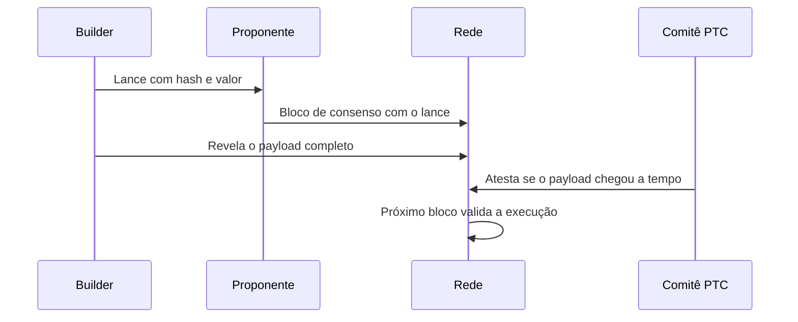

# Capítulo 38: ePBS por Dentro, Lance do Builder e Comitê de Payload

O Capítulo 17 mostrou por que a separação entre quem propõe e quem constrói blocos surgiu fora do protocolo, com o MEV-Boost, e o Capítulo 10 apresentou o ePBS (EIP-7732) como uma das duas mudanças principais da Glamsterdam. Este capítulo abre a caixa: quais objetos novos o protocolo ganha, como o slot passa a se dividir e que garantias o desenho tenta oferecer. O assunto é atual, porque, segundo a imprensa especializada consultada em buscas (as páginas não puderam ser abertas), a Glamsterdam estava marcada para ativar na testnet Sepolia em 6 de outubro de 2026, sem data definida para a mainnet, apenas a expectativa de ficar no quarto trimestre de 2026. Como o calendário já escorregou outras vezes, vale tratá-lo como provisório.

**O problema que o ePBS resolve.** Hoje, a maioria dos proponentes terceiriza a montagem do bloco. O proponente pede ao builder apenas o hash do conteúdo prometido e entrega um bloco "cego" a um intermediário de confiança, o relay, que revela o conteúdo completo. A própria EIP descreve o ganho do ePBS como uma troca justa sem confiança: um proponente honesto recebe o pagamento qualquer que seja a ação do builder, e o payload de um builder honesto vira o bloco canônico qualquer que seja a ação do proponente.

**O bloco se divide em duas partes.** A mudança central é remover o `ExecutionPayload` do corpo do bloco da camada de consenso. No lugar entra um compromisso assinado do builder, o `SignedExecutionPayloadBid`, que informa o hash do bloco de execução prometido e o valor a pagar ao proponente. O conteúdo em si viaja depois, num objeto separado, o `SignedExecutionPayloadEnvelope`. A EIP também afirma que não há mudanças na camada de execução nem na Engine API (Capítulo 28), então o ajuste é todo no consenso.


*O proponente fecha o negócio com um lance assinado, o builder revela o conteúdo depois, e um comitê atesta se a revelação foi pontual.*

**Builders passam a ter stake.** Builders viram uma entidade nova no estado da camada de consenso, com registro próprio e prefixo de credencial de saque `0x03`. Eles têm saldo na beacon chain, não validam a rede, não passam pelas filas usuais de entrada e saída e podem entrar com apenas 1 ETH, segundo a EIP. É esse saldo que garante o pagamento: quando o bloco com o lance é processado, o valor prometido é abatido do saldo do builder e um saque é enfileirado para um endereço escolhido pelo proponente. A EIP admite ainda promessas de pagamento a cumprir fora do protocolo, como opção de confiança. Pagar na camada de consenso, e não na de execução, evita alterar regras de execução, ao custo de o builder precisar repor o saldo por depósitos periódicos, como a própria justificativa do texto discute.

**O Comitê de Pontualidade do Payload.** Um subconjunto de validadores de cada slot forma o PTC (Payload Timeliness Committee), com 512 membros pela constante `PTC_SIZE`. Cada membro transmite uma `PayloadAttestationMessage` dizendo se o builder revelou o payload com o hash certo a tempo e se os dados de blobs estavam disponíveis. O texto da especificação de fork choice define limiares de 256 votos (metade do comitê) para considerar o payload e a disponibilidade de dados como pontuais. Os membros não precisam executar o payload antes de atestar, só conferir assinatura e hash, e o corpo do bloco seguinte carrega até quatro agregados dessas atestações.

**Validação adiada, e por que isso importa.** Hoje, entre receber o bloco completo e o prazo de atestação (4 segundos na mainnet, segundo a EIP), o validador faz a transição de consenso, a de execução e a checagem de disponibilidade de dados. Com o ePBS, só a parte de consenso fica no caminho crítico. A execução é validada depois: segundo a EIP, o próximo proponente ganha 6 segundos e os demais validadores, 9 segundos, e o bloco de consenso fica menor por não carregar o payload. Essa folga de tempo é um dos motivos pelos quais o ePBS é visto como pré-requisito para aumentar o limite de gás (Capítulo 10).

```latex
\text{pagamento ao proponente} = \text{valor do lance}, \quad \text{saldo do builder} \mathrel{-}= \text{valor do lance}
```
*A fórmula resume o ponto de segurança: o abatimento do saldo é registrado quando o bloco com o lance é processado, não depende de o payload ser revelado.*

**Três estados possíveis de um slot.** A EIP distingue o slot cheio (bloco e payload incluídos), o ignorado (nenhum bloco) e o vazio (bloco incluído, payload prometido não). No caso vazio, o proponente ainda recebe o pagamento. Daí o fork choice precisar de regras novas, já que nós da árvore podem ter payloads diferentes, e a EIP lista as garantias buscadas: pagamento incondicional ao proponente, segurança de revelação (um builder honesto e pontual vê seu payload incluído) e segurança contra retenção (se o builder retém o payload, a cadeia não o conta como incluído).

| Garantia | Quem protege | Em palavras simples |
| --- | --- | --- |
| Pagamento incondicional | Proponente | Recebe o lance mesmo se o payload não aparecer |
| Segurança de revelação | Builder honesto | Se revelou a tempo, seu payload entra na cadeia |
| Segurança contra retenção | Rede | Payload retido não é tratado como incluído |

**O que muda para MEV e censura.** O ePBS tira o relay do papel de árbitro da troca, o que ataca a dependência de poucos operadores descrita no Capítulo 17. Isso não elimina o MEV nem a concentração entre builders, e não impede, por si só, que um builder deixe transações de fora. Por isso o ePBS aparece como uma peça de um conjunto maior, ao lado de propostas como o FOCIL, e a EIP-7732 consta com status "Review" nas especificações consultadas, o que mostra que o desenho ainda pode mudar até a versão final.

**Leitura de conjunto.** O ePBS troca confiança em intermediários por regras verificáveis e por um saldo em garantia, e redistribui o tempo do slot para dar mais espaço à execução. O custo é complexidade: novos objetos, novas mensagens na rede, fork choice mais elaborado e mais um tipo de participante com stake para monitorar.

**Glossário do capítulo.**
- **ePBS**: separação entre proponente e builder embutida nas regras de consenso, em vez de feita por relays externos.
- **Builder**: entidade com stake na beacon chain que monta o payload de execução e paga ao proponente.
- **Lance (bid)**: compromisso assinado do builder com o hash do bloco de execução e o valor a pagar ao proponente.
- **Envelope de payload**: objeto que carrega o conteúdo completo de execução, revelado depois do lance.
- **PTC (Payload Timeliness Committee)**: comitê de 512 validadores que atesta se o payload foi revelado a tempo.
- **Slot cheio, vazio e ignorado**: slot com bloco e payload, só com bloco, ou sem nenhum dos dois.
- **Relay**: intermediário de confiança do MEV-Boost que hoje faz a ponte entre builder e proponente.
- **Fork choice**: regra que escolhe qual ramo da cadeia é considerado o principal.

**Fontes.** (Sites de notícias de cripto estavam bloqueados durante a coleta; a informação sobre a data da Sepolia vem de resultados de busca, sem confirmação em página aberta.)
- [EIP-7732, Enshrined Proposer-Builder Separation](https://raw.githubusercontent.com/ethereum/EIPs/master/EIPS/eip-7732.md)
- [Consensus specs, Gloas fork choice](https://raw.githubusercontent.com/ethereum/consensus-specs/master/specs/gloas/fork-choice.md)
