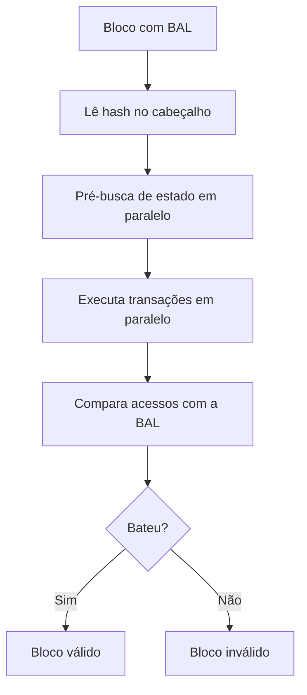

# Capítulo 39: Block-Level Access Lists, o Mapa que Permite Executar em Paralelo

O Capítulo 10 apresentou as Block-Level Access Lists (BALs, EIP-7928) como uma das duas mudanças principais da Glamsterdam, e o Capítulo 38 abriu o ePBS, a outra. Este capítulo faz o mesmo com as BALs: o que exatamente o bloco passa a carregar, como isso permite ler o disco e executar transações em paralelo, e que limites o desenho impõe para não virar uma nova porta de abuso. Vale lembrar o aviso do capítulo anterior: o calendário da Glamsterdam já escorregou outras vezes, e a EIP-7928 consta com status "Review" no texto consultado, então detalhes ainda podem mudar.

**O problema: execução às cegas.** Como visto no Capítulo 21, cada nó roda as transações de um bloco uma depois da outra, na ordem. A razão é prática: só se descobre quais contas e posições de armazenamento uma transação toca depois de executá-la, e uma transação pode depender do resultado da anterior. Sem saber de antemão o que cada uma acessa, o cliente não tem como separar com segurança o que pode andar em paralelo. A EIP-2930, citada no Capítulo 10, criou listas de acesso por transação, mas opcionais e sem obrigatoriedade de estarem corretas, o que não serve de base para otimizar.

**A ideia: o bloco traz o seu próprio mapa.** A EIP-7928 propõe que cada bloco registre todas as contas e posições de armazenamento acessadas durante a execução, junto dos valores pós-execução. O cabeçalho do bloco ganha o campo `block_access_list_hash`, o hash Keccak-256 da lista codificada em RLP. Quem monta o bloco produz a lista, e quem o recebe confere se a lista bate com o que a execução realmente acessou. Se não bater, o bloco é inválido. É essa obrigatoriedade que transforma a lista de dica em garantia.

**O que é registrado, conta por conta.** Para cada endereço tocado, a lista guarda quatro tipos de informação, segundo a EIP: mudanças de armazenamento (inclusive zerar um valor) e leituras de armazenamento; saldos finais, para remetentes, destinatários de valor, o COINBASE, beneficiários de SELFDESTRUCT e destinatários de saques; nonces finais, para contas externas, contratos que criam outros contratos e autoridades da EIP-7702 (Capítulo 24); e o código final de contratos implantados ou alterados, além dos indicadores de delegação da EIP-7702. Cada mudança vem etiquetada com um índice (`BlockAccessIndex`): 0 para as chamadas de sistema antes da execução, de 1 a n para as transações na ordem do bloco, e n+1 para as chamadas de sistema depois delas.


*O cliente usa a lista para carregar o estado e executar antes de ter certeza, e no fim confere se o que aconteceu coincide com o que foi declarado.*

**Três ganhos práticos.** A EIP resume a motivação como reduzir o tempo de execução a "IO paralelo + EVM paralela". Primeiro, leituras de disco em paralelo: com a lista de endereços e posições em mãos, o cliente pode buscar todo o estado necessário de uma vez, em vez de esperar cada acesso aparecer durante a execução. Segundo, execução paralela: transações que tocam posições disjuntas podem rodar ao mesmo tempo. A EIP cita que de 60% a 80% das transações de blocos reais são independentes nesse sentido, e as demais ainda se beneficiam das diferenças de estado pós-transação. Terceiro, atualizações de estado sem execução: como a lista traz os valores finais, um nó que está sincronizando pode reconstruir o estado sem reexecutar cada transação nem exigir provas de Merkle individuais, ponto que conversa com a discussão de estado e histórico do Capítulo 37.

| Aspecto | Execução sequencial atual | Execução com BAL |
| --- | --- | --- |
| Conhecimento dos acessos | Só durante a execução | Declarado antes, no bloco |
| Leitura do disco | Sob demanda, uma por vez | Em lote, em paralelo |
| Transações independentes | Rodam em fila | Podem rodar juntas |
| Sincronização | Reexecuta transações | Pode aplicar os valores finais |
| Custo extra | Nenhum | Lista no bloco e conferência |

**O custo: um bloco um pouco maior.** A lista viaja com o bloco e precisa ser guardada. Na análise histórica da EIP, a BAL média tem cerca de 92,1 KiB comprimida, composta principalmente por escritas de armazenamento (39,2%), leituras (28,0%) e diferenças de saldo (10,0%). A seção de segurança fala em cerca de 70 KiB de sobrecarga de propagação, considerada aceitável diante do ganho. Os clientes também devem reter as listas por pelo menos o período de subjetividade fraca (3.533 épocas, no texto) para permitir sincronização offline. Na Engine API (Capítulo 28), o payload ganha o campo `blockAccessList` e o método de validação passa a checar se a lista calculada é igual à fornecida.

**Impedir abuso: o limite atrelado ao gás.** Um proponente malicioso poderia declarar leituras que nunca aconteceram, obrigando os outros a buscar dados à toa. Para limitar isso, a EIP não fixa um número máximo de itens, e sim amarra o tamanho da lista ao limite de gás do bloco:

```latex
\text{itens da BAL} = \text{chaves de armazenamento} + \text{endereços} \;\le\; \left\lfloor \frac{\text{limite de gás do bloco}}{2000} \right\rfloor
```
*Cada item da lista precisa "caber" no gás do bloco, então o tamanho da BAL cresce junto com a capacidade, sem permitir listas arbitrariamente grandes.*

Há ainda uma folga de aproximadamente limite de gás dividido por 42.000 itens extras, porque chamadas de sistema acessam estado sem consumir o gás do bloco. A EIP também ordena a validação de opcodes que acessam estado em duas fases: primeiro os custos que dá para calcular sem tocar no estado (expansão de memória, custo base, acesso frio ou quente), e só depois o acesso em si. Se a primeira fase falha, o estado não é tocado e o endereço não entra na lista, o que evita que uma chamada sem gás suficiente "polua" a BAL. A regra de ouro, segundo a seção de segurança, é que esse mecanismo nunca pode rejeitar um bloco válido.

**Por que isso importa para o resto do caderno.** Ao tornar a execução paralelizável, as BALs atacam um dos gargalos para aumentar o limite de gás da camada 1, trilha descrita no Capítulo 10, e a conta de taxas do Capítulo 35 depende justamente dessa capacidade. Combinadas ao ePBS, que libera tempo do slot para a execução (Capítulo 38), formam a dupla de preparação para blocos maiores. O que a lista não faz é garantir que blocos maiores sejam seguros por si só: o limite de gás continua sendo decidido pelos validadores, e a conferência da BAL é mais um trabalho que todo nó precisa fazer. Este capítulo é educacional e não recomenda operações nem momentos de compra ou venda.

**Glossário do capítulo.**
- **Block-Level Access List (BAL)**: lista obrigatória, anexada ao bloco, com as contas e posições de armazenamento acessadas e seus valores pós-execução.
- **EIP-2930**: proposta anterior que criou listas de acesso opcionais por transação.
- **block_access_list_hash**: campo do cabeçalho com o hash Keccak-256 da BAL codificada em RLP.
- **BlockAccessIndex**: número que etiqueta cada mudança com a transação que a causou, de 0 (antes) a n+1 (depois).
- **RLP**: formato de serialização usado pelo Ethereum para codificar listas e estruturas de dados.
- **Execução paralela**: rodar ao mesmo tempo transações que não tocam as mesmas posições de estado.
- **Atualização de estado sem execução**: reconstruir o estado a partir dos valores finais da BAL, sem reexecutar transações.
- **Engine API**: interface entre os clientes de consenso e de execução.
- **Período de subjetividade fraca**: janela durante a qual um nó que volta à rede ainda consegue confiar em dados recentes; a EIP o usa como prazo de retenção das BALs.

**Fontes.**
- [EIP-7928, Block-Level Access Lists](https://raw.githubusercontent.com/ethereum/EIPs/master/EIPS/eip-7928.md)
- Contexto de calendário: capítulos 10 e 38 deste caderno (a data de Sepolia aparece em resultados de busca de imprensa especializada, sem página aberta para confirmação).
