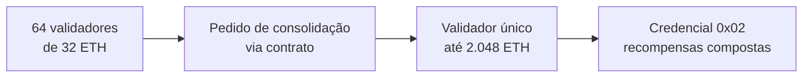

# Capítulo 40: Pectra e o Staking, MaxEB, Consolidação e Saídas pela Camada de Execução

O Capítulo 2 mencionou de passagem que, desde a Pectra, um validador pode ter saldo efetivo de 32 a 2.048 ETH. O Capítulo 3 mostrou como o staking líquido concentra milhões de ETH em poucos operadores. Este capítulo volta a esse ponto com calma e olha para três mudanças da Pectra que, juntas, redesenharam a vida de quem opera validadores: a EIP-7251 (saldo máximo maior e consolidação), a EIP-7002 (saídas disparadas pela camada de execução) e a EIP-6110 (depósitos entregues dentro do bloco). A atualização foi ativada na mainnet na época 364.032, em 7 de maio de 2025, segundo a imprensa especializada consultada na busca.

**O ponto de partida: um validador, 32 ETH, sem exceção.** No desenho original, cada validador tinha saldo efetivo máximo de 32 ETH. Quem queria colocar 3.200 ETH em stake precisava de 100 validadores, cada um com suas chaves, seu tráfego de rede e suas atestações. Para a rede, isso significa muitas mensagens. A própria EIP-7251 registra que, em 3 de outubro de 2023, havia mais de 830.000 validadores na camada de consenso, muitos deles controlados pela mesma entidade. Era um custo coletivo pago para dar a um operador grande exatamente o mesmo peso que ele teria com poucos validadores maiores.

**A mudança central: piso de 32, teto de 2.048.** A EIP-7251 mantém o mínimo de ativação em 32 ETH (`MIN_ACTIVATION_BALANCE`) e eleva o teto do saldo efetivo para 2.048 ETH (`MAX_EFFECTIVE_BALANCE_ELECTRA`). Na prática, 2.048 é 64 vezes 32, o que permite fundir até 64 validadores cheios em um só. Uma ressalva: o aumento do teto não obriga ninguém a mudar, e validadores de 32 ETH continuam existindo normalmente.

**Credenciais compostas (0x02): juros sobre juros.** Para usar o teto maior, o validador precisa de um novo tipo de credencial de saque, o prefixo `0x02`, chamado de credencial composta. Com ela, as recompensas acumuladas passam a ser somadas ao saldo efetivo em vez de serem varridas automaticamente para o endereço de saque, até chegar ao teto. Isso é o que os textos da comunidade chamam de autocomposição (*auto-compounding*). Antes, o saldo efetivo parava em 32 ETH e tudo que excedia era devolvido, de modo que quem tinha um único validador não via suas recompensas renderem novas recompensas sem abrir outro validador. Como visto no Capítulo 2, o saldo efetivo é o valor que conta para recompensas e votos, então quanto maior ele for, maior a participação proporcional do validador.

**Consolidar sem entrar na fila.** A EIP-7251 cria uma operação de consolidação: o saldo de um validador de origem é transferido para um validador de destino sem passar pelas filas de saída e de ativação. Como as filas são limitadas (assunto do Capítulo 13, quando a fila de validadores atrasou o staking de ETFs), a alternativa seria sair e entrar de novo, com dias ou semanas de espera e sem recompensas no meio. O pedido é feito por um contrato na camada de execução, no endereço `0x0000BBdDc7CE488642fb579F8B00f3a590007251`, e a EIP limita o fluxo a no máximo 2 pedidos por bloco, com alvo de 1, e uma taxa mínima de 1 wei que sobe conforme a demanda.

**Limites por peso, não por contagem.** Antes, a velocidade com que validadores entravam e saíam era medida em número de validadores. Se um validador pode valer 32 ou 2.048 ETH, contar cabeças deixa de fazer sentido: um único pedido de saída poderia mover 64 vezes mais ETH. Por isso a EIP altera `get_validator_churn_limit` para depender do peso (o saldo efetivo) e não da contagem, e limita o uso da fila de saída a 256 ETH por época, o equivalente a 8 validadores de 32 ETH. A segurança que o Capítulo 2 descreve em termos de fração do ETH em stake (um terço, dois terços) continua sendo a mesma régua.

**Penalidades suavizadas.** Um validador de 2.048 ETH que fosse slashed levaria uma penalidade inicial proporcional ao saldo, e isso desestimularia a consolidação. A EIP aborda isso reduzindo a penalidade inicial de slashing ao ponto de torná-la, nas palavras do texto, desprezível, sem desligar o mecanismo de punição correlacionada. Os parâmetros exatos ficam na especificação da camada de consenso, que não foi aberta nesta pesquisa.

*Vários validadores pequenos se fundem em um maior sem passar pela fila de saída, e o resultado passa a compor recompensas.*

**Sair pela camada de execução: a EIP-7002.** Até a Pectra, só a chave ativa do validador, aquela que fica em um servidor ligado o tempo todo, podia iniciar uma saída. Quem controlava as credenciais de saque, o verdadeiro dono dos fundos, dependia do operador. A EIP-7002 resolve isso: quem possui credenciais `0x01` (ou `0x02`) pode disparar saídas e saques parciais a partir da camada de execução, chamando um contrato em `0x00000961Ef480Eb55e80D19ad83579A64c007002` com a chave pública do validador (48 bytes) e o valor. Para evitar spam, a taxa funciona como a do Capítulo 16: dinâmica, estilo EIP-1559, com alvo de 2 pedidos por bloco e crescimento exponencial quando a demanda passa disso. Para pools de staking (Capítulo 3), isso significa que um contrato pode ter a palavra final sobre a saída, sem depender de que o operador coopere ou de saídas pré-assinadas guardadas em algum lugar. Se a chave ativa for comprometida ou perdida, as credenciais de saque ainda controlam os fundos.

**Depósitos dentro do bloco: a EIP-6110.** No desenho anterior, a camada de consenso descobria depósitos por votação: os proponentes votavam sobre o estado do contrato de depósito na camada de execução (o chamado `eth1data`), e só depois de uma janela de espera o depósito era reconhecido. A EIP-6110 move isso para dentro do protocolo: os eventos do contrato de depósito são lidos dos recibos do bloco e entregues à camada de consenso como pedidos. A EIP estima cerca de 12 horas no mecanismo antigo contra cerca de 13 minutos no novo, além de eliminar a dependência de consultas via JSON-RPC e de manter *snapshots* do contrato. Segundo o texto, um nó honesto e conectado não pode ser convencido a processar depósitos falsos mesmo com mais de dois terços do stake sob controle de adversários.

**O encanamento comum: a EIP-7685.** Depósitos, saídas e consolidações viajam como "pedidos" da camada de execução para a de consenso. A EIP-7685 define esse formato geral, e por isso a lista da Pectra traz as quatro propostas juntas. Os clientes (Capítulo 28) precisam implementar a conversa entre as duas camadas via Engine API, o que explica por que mudanças de staking costumam exigir coordenação entre equipes de execução e de consenso.

| Antes da Pectra | Depois da Pectra | EIP |
| --- | --- | --- |
| Teto de 32 ETH por validador | Piso de 32 e teto de 2.048 ETH | 7251 |
| Recompensas acima de 32 ETH eram varridas | Credencial `0x02` compõe recompensas | 7251 |
| Consolidar exigia sair e entrar de novo | Consolidação em protocolo, sem filas | 7251 |
| Só a chave ativa iniciava a saída | Credencial de saque dispara a saída via contrato | 7002 |
| Depósito reconhecido por votação, cerca de 12 horas | Depósito entregue no bloco, cerca de 13 minutos | 6110 |
| Limite de entrada e saída por contagem | Limite por peso, saída de 256 ETH por época | 7251 |

**O que isso muda para a rede, sem exagerar.** A promessa é de uma rede com menos mensagens por época e, a longo prazo, mais espaço para melhorias como as de finalidade e de latência discutidas no Capítulo 10, que se beneficiam de um conjunto de validadores menor. Também há um efeito de distribuição: consolidar é ótimo para a eficiência do operador, mas não altera quem controla o ETH em stake, ponto central do Capítulo 3. Um operador que consolida 64 validadores em um continua sendo o mesmo operador, e a EIP afirma que a probabilidade de tomada adversarial dos comitês permanece baixa mesmo com consolidação total, porque a seleção de agregadores e do comitê de sincronização já é ponderada pelo saldo. O próprio validador maior, por outro lado, concentra o risco: um slashing atinge mais ETH de uma vez. Este capítulo é educacional e não recomenda operar validadores, nem comprar ou vender ETH.

**Glossário do capítulo.**
- **Saldo efetivo máximo (MaxEB)**: teto do saldo que conta para recompensas e votos de um validador; passou de 32 para 2.048 ETH com a EIP-7251.
- **Credencial de saque 0x02**: tipo de credencial que permite autocomposição de recompensas e saldos acima de 32 ETH.
- **Consolidação**: operação que transfere o saldo de um validador para outro sem passar pelas filas de saída e entrada.
- **Autocomposição (auto-compounding)**: reinvestimento automático das recompensas no próprio saldo efetivo do validador.
- **Limite de churn**: ritmo máximo com que o protocolo aceita entradas e saídas de validadores, agora medido em peso (ETH).
- **Saída disparada pela camada de execução**: pedido de saída ou saque parcial feito por contrato, com base nas credenciais de saque (EIP-7002).
- **Contrato de depósito**: contrato na camada de execução que recebe os 32 ETH ou mais de cada novo validador.
- **eth1data**: mecanismo antigo de votação pelo qual a camada de consenso reconhecia depósitos.
- **EIP-7685**: formato geral de pedidos da camada de execução para a de consenso.
- **Slashing**: penalidade aplicada a validadores que cometem violações graves, como visto no Capítulo 2.

**Fontes.**
- [EIP-7251, Increase the MAX_EFFECTIVE_BALANCE](https://raw.githubusercontent.com/ethereum/EIPs/master/EIPS/eip-7251.md)
- [EIP-7002, Execution Layer Triggerable Withdrawals](https://raw.githubusercontent.com/ethereum/EIPs/master/EIPS/eip-7002.md)
- [EIP-6110, Supply Validator Deposits On Chain](https://raw.githubusercontent.com/ethereum/EIPs/master/EIPS/eip-6110.md)
- [EIP-7600, Hardfork Meta: Prague/Electra](https://raw.githubusercontent.com/ethereum/EIPs/master/EIPS/eip-7600.md)
- Data de ativação da Pectra (7 de maio de 2025, época 364.032): resultado de busca em imprensa especializada, sem página aberta para confirmação.
