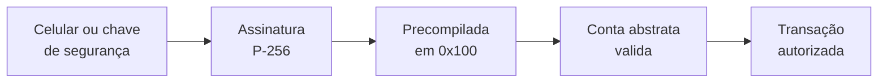
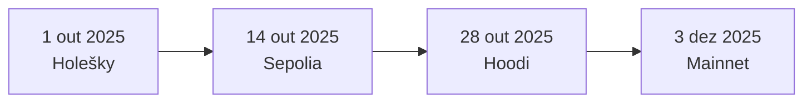

# Capítulo 41: Fusaka por Dentro, o Pacote que Foi Além do PeerDAS

O Capítulo 34 explicou o PeerDAS, a peça mais famosa da Fusaka, e o Capítulo 10 olhou para a frente, rumo à Glamsterdam. Falta olhar para o pacote inteiro. A Fusaka (a junção de Osaka, na camada de execução, com Fulu, na de consenso) foi ativada na mainnet em 3 de dezembro de 2025, depois de passar pelas testnets Holešky (1º de outubro), Sepolia (14 de outubro) e Hoodi (28 de outubro), segundo a EIP-7607, que reúne a lista oficial de mudanças. Ao lado do PeerDAS, a lista traz um conjunto de ajustes menores que revelam bem a filosofia do Ethereum atual: tornar a rede mais segura contra abusos antes de aumentar o limite de gás, e abrir espaço para novas formas de autenticação.

**A lista completa, em uma tabela.** A EIP-7607 separa as propostas centrais das complementares. Cada linha abaixo recebe um comentário nos parágrafos seguintes.

| EIP | Nome | Camada | Em uma frase |
| --- | --- | --- | --- |
| 7594 | PeerDAS | Consenso | Amostragem de dados dos blobs (Capítulo 34) |
| 7892 | Blob Parameter Only Hardforks | Ambas | Ajustar parâmetros de blobs sem um hard fork completo |
| 7918 | Taxa base do blob limitada pelo custo de execução | Execução | Piso de preço para blobs |
| 7825 | Limite de gás por transação | Execução | Teto de 16.777.216 por transação |
| 7934 | Limite de tamanho de bloco em RLP | Execução | Blocos de no máximo 8 MiB |
| 7883 e 7823 | Preço e limites do MODEXP | Execução | Operação mais cara e com entradas limitadas |
| 7939 | Opcode CLZ | Execução | Conta zeros à esquerda |
| 7951 | Precompilada secp256r1 | Execução | Verificar assinaturas de dispositivos |
| 7917 | Proponentes previsíveis | Consenso | Agenda de proponentes conhecida com antecedência |

**Um teto para cada transação (EIP-7825).** Até a Fusaka, uma única transação podia gastar quase todo o gás de um bloco. A EIP-7825 aponta três riscos nisso: negação de serviço por carga mal distribuída, crescimento de estado mais acentuado e validação mais lenta, o que prejudica a descentralização. A solução é um teto fixo de 16.777.216 de gás (2 elevado a 24) por transação. Transações que peçam mais são rejeitadas tanto na fila de transações quanto na validação do bloco, com o erro `MAX_GAS_LIMIT_EXCEEDED`, e quem precisa de mais trabalho tem de dividir a operação em várias transações. A EIP justifica a potência de dois pela simplicidade de implementação e lembra que o valor equivale a cerca de metade de um bloco típico de 30 a 40 milhões de gás. Como visto no Capítulo 35, o gás medido na transação é o que a carteira mostra como limite, então esse teto vira um novo número que ferramentas e contratos de implantação grandes precisam respeitar.

**Um teto para o tamanho do bloco (EIP-7934).** Blocos enormes demoram a se propagar e aumentam o risco de forks temporários e reorgs, além de abrir espaço para ataques de negação de serviço. A EIP fixa um limite de 10 MiB para o bloco com uma margem de segurança de 2 MiB, o que resulta em um limite efetivo de 8 MiB para o bloco da camada de execução codificado em RLP. A margem existe porque a camada de consenso já rejeita na rede de fofoca blocos acima de 10 MiB, e o bloco de consenso carrega, além do bloco de execução, outros dados. A EIP classifica a mudança como incompatível com versões anteriores, ou seja, os clientes (Capítulo 28) precisam rejeitar blocos maiores que o limite.

**Corrigir preços antes de subir o limite (EIP-7883).** A EIP-7883 trata o MODEXP, uma precompilada de exponenciação modular (a categoria de contrato embutido descrita no Capítulo 21). Segundo o texto, ela estava subprecificada em certos cenários em relação ao recurso que consome. O custo mínimo sobe de 200 para 500 de gás, a divisão por 3 da fórmula é removida (na prática, triplicando o custo geral) e o multiplicador para expoentes maiores que 32 bytes passa de 8 para 16. A análise da EIP estima que cerca de 99,69% das chamadas históricas teriam aumento de 150% ou 200%, com casos extremos chegando a 9.105%. A motivação declarada é permitir aumentos futuros do limite de gás, e o pacote é acompanhado pela EIP-7823, que define limites superiores para as entradas dessa operação, conforme a lista da EIP-7607.

**Piso de preço para blobs (EIP-7918).** O Capítulo 16 mostrou o mecanismo de preço do EIP-1559, e o blob tem um mecanismo análogo, com sua própria taxa base. A EIP-7918 descreve um defeito: quando o custo de execução domina o custo total, a taxa base do blob perde força como sinal de preço. Ela pode cair repetidamente a 1 wei, e então uma variação de 10% muda o custo total em uma fração desprezível. Voltar ao equilíbrio exigiria mais de uma hora de blocos quase cheios. Além disso, os nós precisam verificar provas KZG, que têm custo computacional real. A solução é uma tarifa de reserva ligada à taxa base de execução.

```latex
\text{reserva}_{blob} = \frac{\text{BLOB\_BASE\_COST} \times \text{base\_fee\_per\_gas}}{\text{GAS\_PER\_BLOB}}
\qquad \text{com} \quad \frac{8192}{131072} = \frac{1}{16}
```

Lendo a fórmula: a taxa base do blob não pode ficar abaixo de um dezesseis avos do preço do gás de execução, na mesma unidade, o que mantém um sinal de preço mesmo quando blobs estão abundantes. Quando o custo de execução ultrapassa esse patamar, o cálculo do excesso de gás de blob deixa de subtrair o alvo e passa a acumular excesso na taxa máxima, empurrando o preço para cima.

**Um opcode novo e uma precompilada para dispositivos.** A EIP-7939 adiciona o opcode `CLZ` (`0x1e`), que conta os zeros à esquerda de uma palavra de 256 bits e devolve 256 se a entrada for zero, ao custo de 5 de gás, igual ao de uma multiplicação. A motivação é eficiência em operações matemáticas (raiz quadrada, potências), em estruturas de dados com bitmaps, em compressão, na redução do tamanho do bytecode e no custo de provas de conhecimento zero. Já a EIP-7951 cria uma precompilada no endereço `0x100` que verifica assinaturas ECDSA na curva secp256r1 (P-256) por 6.900 de gás. Essa é a curva usada por Apple Secure Enclave, Android Keystore e padrões FIDO2/WebAuthn, e a EIP cita como aplicação os *passkeys*. O elo com o Capítulo 24 é direto: uma conta abstrata pode aceitar a assinatura do próprio celular como forma de autorização, sem exigir que a pessoa guarde uma chave Ethereum separada. A EIP-7951 substitui a proposta anterior RIP-7212 com a mesma interface, corrigindo dois problemas: a falta de validação do ponto no infinito e uma comparação modular incorreta, que só afetam casos de borda.


*Uma assinatura feita por hardware comum de consumo passa a ser verificada pela própria rede por um custo fixo, base técnica para carteiras sem seed phrase.*

**Saber quem propõe o próximo bloco (EIP-7917).** No Capítulo 2, os proponentes de bloco são sorteados. A EIP-7917 observa que a agenda da época seguinte nem sempre era totalmente previsível, porque o saldo efetivo pode mudar dentro de uma época por penalidades, recompensas e consolidações, estas últimas ampliadas pela EIP-7251 (Capítulo 40). A solução guarda no estado de consenso, em um campo `proposer_lookahead`, os proponentes das épocas seguintes e o atualiza a cada virada de época. O texto cita duas consequências: protocolos de pré-confirmação e rollups baseados (*based rollups*) precisam saber o proponente com antecedência, e a análise de segurança fica mais simples, porque validadores não conseguem ajustar o saldo depois de ver o resultado do RANDAO.

**Mudar sem hard fork: a EIP-7892.** Depois do PeerDAS, a capacidade de blobs poderia ser aumentada aos poucos. A EIP-7892 cria os forks apenas de parâmetros de blob, um tipo de atualização leve que muda só números como alvo e máximo de blobs, o que o Capítulo 34 mostrou na prática com os forks BPO. A lista da EIP-7607 inclui ainda a eth/69 (EIP-7642), que descarta campos anteriores à Merge, o método JSON-RPC `eth_config` (EIP-7910) e a EIP-7935, que define o limite de gás padrão em 60 milhões.


*As datas de ativação da Fusaka seguiram a ordem das redes de teste até chegar à mainnet em 3 de dezembro de 2025.*

**O padrão que se repete.** O conjunto tem uma lógica comum. Os tetos de gás por transação e de tamanho de bloco, o reajuste do MODEXP e o piso do blob são, todos, medidas de contenção: limitam o pior caso antes de ampliar a capacidade média. É o raciocínio que o Capítulo 10 anunciou para a Glamsterdam, quando o limite de gás poderá subir bastante apenas se o pior caso for conhecido e controlável. Ao mesmo tempo, as mudanças voltadas ao usuário (secp256r1) e ao desenvolvedor (CLZ) mostram que a evolução do protocolo não é só escala. Este capítulo é educacional e não constitui recomendação de compra ou venda de ativos.

**Glossário do capítulo.**
- **Osaka e Fulu**: nomes da atualização na camada de execução e na de consenso, juntos chamados de Fusaka.
- **Limite de gás por transação**: teto de 16.777.216 de gás que uma única transação pode pedir, definido pela EIP-7825.
- **RLP**: formato de codificação usado para serializar blocos e transações na camada de execução.
- **MODEXP**: precompilada que calcula exponenciação modular, base de várias operações criptográficas.
- **Taxa base do blob**: preço por unidade de gás de blob, ajustado algoritmicamente de forma análoga ao EIP-1559.
- **CLZ**: opcode que conta os zeros à esquerda de um valor de 256 bits.
- **secp256r1 (P-256)**: curva elíptica usada por dispositivos de consumo e pelo padrão WebAuthn, diferente da secp256k1 usada nas contas do Ethereum.
- **Passkey**: credencial de login baseada em chave guardada no hardware do dispositivo.
- **Proposer lookahead**: lista armazenada no estado de consenso com os proponentes das próximas épocas.
- **Fork apenas de parâmetros de blob (BPO)**: atualização leve que muda só os parâmetros de blobs, definida pela EIP-7892.

**Fontes.**
- [EIP-7607, Hardfork Meta: Fusaka](https://raw.githubusercontent.com/ethereum/EIPs/master/EIPS/eip-7607.md)
- [EIP-7825, Transaction Gas Limit Cap](https://raw.githubusercontent.com/ethereum/EIPs/master/EIPS/eip-7825.md)
- [EIP-7918, Blob Base Fee Bounded by Execution Cost](https://raw.githubusercontent.com/ethereum/EIPs/master/EIPS/eip-7918.md)
- [EIP-7951, Precompile for secp256r1 Curve Support](https://raw.githubusercontent.com/ethereum/EIPs/master/EIPS/eip-7951.md)
- [EIP-7934, RLP Execution Block Size Limit](https://raw.githubusercontent.com/ethereum/EIPs/master/EIPS/eip-7934.md)
- [EIP-7939, Count Leading Zeros (CLZ) Opcode](https://raw.githubusercontent.com/ethereum/EIPs/master/EIPS/eip-7939.md)
- [EIP-7917, Deterministic Proposer Lookahead](https://raw.githubusercontent.com/ethereum/EIPs/master/EIPS/eip-7917.md)
- [EIP-7883, ModExp Gas Cost Increase](https://raw.githubusercontent.com/ethereum/EIPs/master/EIPS/eip-7883.md)
