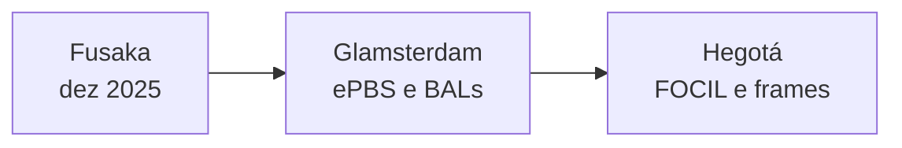
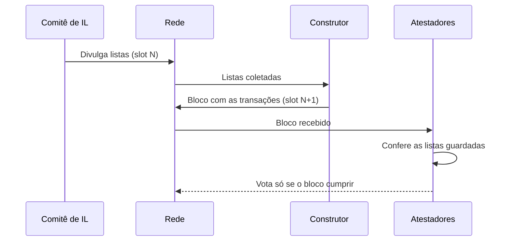

# Capítulo 42: FOCIL e a Hegotá, Listas de Inclusão contra a Censura

O Capítulo 17 mostrou como o MEV-Boost concentrou a montagem de blocos em poucos construtores e relays, e como isso abriu espaço para censura de fato, depois das sanções ao Tornado Cash (Capítulo 29). O Capítulo 38 explicou o ePBS, que tira o relay do papel de árbitro, mas que não obriga ninguém a incluir uma transação incômoda. Falta a peça que ataca esse segundo problema: a FOCIL (*fork-choice enforced inclusion lists*, EIP-7805), escolhida como atração principal da atualização que virá depois da Glamsterdam, a Hegotá. Este capítulo descreve como a FOCIL funciona, segundo o texto da própria EIP, e em que pé está a Hegotá.

**Onde a Hegotá se encaixa.** A página da Hegotá no ethereum.org a descreve como a atualização esperada depois da Glamsterdam, nomeada pela junção de Bogotá (camada de execução) com Heze (camada de consenso). Ela está em planejamento inicial, sem datas definidas. A EIP-8081, que lista o escopo, traz duas propostas como "agendadas para inclusão": a FOCIL (EIP-7805) e as transações de frame (EIP-8141), esta última voltada a permitir que cada conta defina a própria regra de validação, retomando o tema do Capítulo 24. Dezenas de outras propostas aparecem como consideradas ou apenas propostas, e nada disso está fechado. Como a Glamsterdam (Capítulos 10, 38 e 39) ainda não chegou à mainnet, tudo o que se diz sobre a Hegotá é provisório.

*A FOCIL ficou fora da Glamsterdam e passou a ser a atração principal da atualização seguinte, a Hegotá.*

**O problema, em uma frase.** Quem monta o bloco decide quais transações entram. Se poucos construtores montam a maioria dos blocos, quem consegue pressioná-los consegue atrasar uma transação, e o usuário não tem como forçar a inclusão além de esperar. A motivação da EIP fala exatamente nisso: o direito de construir blocos foi leiloado a entidades especializadas, e a dominância de poucas delas degrada a resistência à censura.

**A ideia central.** Em vez de dar a um único ator o poder de decidir, a FOCIL espalha a decisão. Em cada slot, um pequeno comitê de validadores é sorteado para montar listas de inclusão. Cada membro olha para a sua visão do mempool, escolhe transações pendentes e divulga uma lista pela rede. O proponente do slot seguinte, ou o construtor que o atende, é obrigado a incluir no bloco as transações dessas listas, e os atestadores só votam no bloco que cumprir a regra. Como o voto é parte da regra de escolha de fork, um bloco que ignora as listas não se torna canônico.

*As listas nascem no slot N, o bloco do slot N+1 precisa cumpri-las, e os atestadores só votam nele se isso acontecer.*

**Os números do desenho atual.** O texto da EIP, ainda em rascunho, fixa um comitê de 16 membros por slot (`IL_COMMITTEE_SIZE`) e um tamanho máximo de 8 KiB por lista (`MAX_BYTES_PER_INCLUSION_LIST`), contando as transações codificadas em RLP. Como o limite é pequeno e o comitê também, o consumo de banda fica bem delimitado, e a EIP lembra que a única verificação não trivial na propagação é a da assinatura. Esses valores são parâmetros de um rascunho e podem mudar até a especificação final.

**Um relógio dentro do slot.** A EIP detalha uma agenda aproximada, cujos tempos exatos ela própria diz que serão definidos depois de testes e medições.

| Momento | Quem | O que acontece |
| --- | --- | --- |
| Slot N, de 0 a 8 s | Membros do comitê | Montam e divulgam as listas, depois de confirmar o bloco do slot N como cabeça da cadeia |
| Slot N, 9 s | Validadores | "Congelam" a visão das listas recebidas; listas tardias não são mais guardadas |
| Slot N, 11 s | Construtor | Congela a visão e pede à camada de execução para completar o payload com as transações das listas |
| Slot N+1, 0 s | Proponente | Divulga o bloco que cumpre as listas |
| Slot N+1, 4 s | Atestadores | Conferem o bloco contra as listas congeladas e votam |

Lendo a tabela: a FOCIL roda em paralelo à construção do bloco seguinte, de modo que transações enviadas durante o slot N já podem ser protegidas no bloco do slot N+1. A EIP chama isso de propriedade "no mesmo slot" e a contrasta com a EIP-7547, uma proposta anterior em que o efeito chegava com um slot de atraso.

**Inclusão condicional, para não punir o inocente.** A regra não exige que toda transação listada esteja no bloco. Uma transação pode faltar se o bloco estiver cheio ou se ela for inválida quando acrescentada ao final do payload, por nonce errado ou saldo insuficiente. Por isso, depois de executar o bloco, a camada de execução testa cada transação das listas ainda ausente: se alguma ainda pudesse ser incluída validamente, devolve o status `INCLUSION_LIST_UNSATISFIED` e a camada de consenso não atesta. O bloco continua válido, mas não recebe votos. A EIP também não exige uma posição específica para essas transações dentro do bloco, o que reduz o incentivo a mercados paralelos de bastidor.

**Por que um comitê e não um único proponente.** O argumento da EIP é a superfície de ataque. Se uma só pessoa produzisse a lista, bastaria subornar ou ameaçar essa pessoa. Com um comitê, a EIP afirma que basta um membro honesto entre os participantes (a suposição "1 de N") para que a transação chegue a uma lista. A FOCIL também não prevê recompensa para os membros do comitê, apostando em comportamento altruísta, e justifica a escolha pela complexidade que um sistema de taxas adicionaria.

**Duas listas e a equivocação.** Um membro malicioso poderia mandar listas diferentes a partes diferentes da rede, o que se chama equivocação. A regra de rede permite encaminhar até duas listas por membro, e quem vê duas listas distintas do mesmo membro ignora tudo o que veio dele. No pior caso, a banda do canal de listas no máximo dobra.

**Custos e pontos de atenção.** A própria EIP lista riscos. O construtor precisa estar bem conectado ao comitê e ter tempo entre o congelamento da visão e a hora de divulgar o bloco, o que toca a vivacidade do consenso. Garantir que todas as transações válidas das listas entraram pode custar muitas verificações na abordagem ingênua, e a EIP sugere que o construtor acompanhe o nonce e o saldo das contas envolvidas durante a montagem. Do lado político, a imprensa especializada registrou críticas de que o mecanismo poderia expor validadores a riscos regulatórios, por exemplo quanto a endereços sancionados, e a decisão de incluir a FOCIL na Hegotá foi controversa. Há ainda uma interação com a Glamsterdam, e a cobertura recente aponta que a FOCIL foi adiada daquela atualização para evitar complexidade excessiva de uma só vez.

**Como isso se conecta com o resto.** A FOCIL complementa o ePBS (Capítulo 38): o ePBS regula a troca entre proponente e construtor, e a FOCIL garante um piso de inclusão que nenhum construtor consegue ignorar. Ela também depende da divisão de papéis entre clientes de execução e consenso (Capítulo 28), já que muda a Engine API com chamadas novas para obter e validar listas. E conversa com as transações de frame, que apontam para contas com regras próprias de validação (Capítulo 24). Este capítulo é educacional e não constitui recomendação de compra ou venda de ativos.

**Glossário do capítulo.**
- **FOCIL**: mecanismo (EIP-7805) em que um comitê de validadores monta listas de transações que o bloco seguinte é obrigado a respeitar para receber votos.
- **Lista de inclusão (IL)**: conjunto de transações pendentes escolhido por um membro do comitê, de até 8 KiB no desenho atual.
- **Resistência à censura**: propriedade de a rede incluir transações válidas mesmo que alguns atores prefiram deixá-las de fora.
- **Equivocação**: enviar duas mensagens conflitantes como se fossem uma só; aqui, duas listas diferentes do mesmo membro.
- **Visão congelada**: conjunto de listas que cada validador guarda até um prazo dentro do slot, usado depois para conferir o bloco.
- **Inclusão condicional**: regra que aceita um bloco sem uma transação da lista quando ela não cabe ou é inválida ao final do payload.
- **Hegotá**: atualização esperada depois da Glamsterdam, com FOCIL e transações de frame agendadas.
- **Transação de frame (EIP-8141)**: tipo de transação em que a própria conta define como a validação é feita.
- **Engine API**: interface entre cliente de consenso e de execução, que a FOCIL estende com chamadas para listas.

**Fontes.**
- [EIP-7805: Fork-choice enforced Inclusion Lists (FOCIL)](https://raw.githubusercontent.com/ethereum/EIPs/master/EIPS/eip-7805.md)
- [EIP-8081: Hardfork Meta, Hegotá](https://raw.githubusercontent.com/ethereum/EIPs/master/EIPS/eip-8081.md)
- [Hegotá, ethereum.org (repositório do site)](https://raw.githubusercontent.com/ethereum/ethereum-org-website/dev/public/content/roadmap/hegota/index.md)
- [Ethereum researchers propose FOCIL as censorship-resistance headliner for Hegota upgrade, The Block](https://www.theblock.co/amp/post/387368/ethereum-researchers-propose-focil-as-censorship-resistance-headliner-for-hegota-upgrade)
- [Ethereum going hard, Vitalik Buterin backs censorship resistance upgrade, Decrypt](https://decrypt.co/358792/ethereum-going-hard-vitalik-buterin-backs-censorship-resistance-upgrade)
