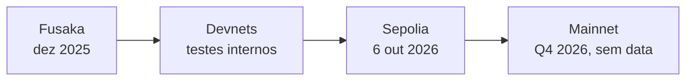
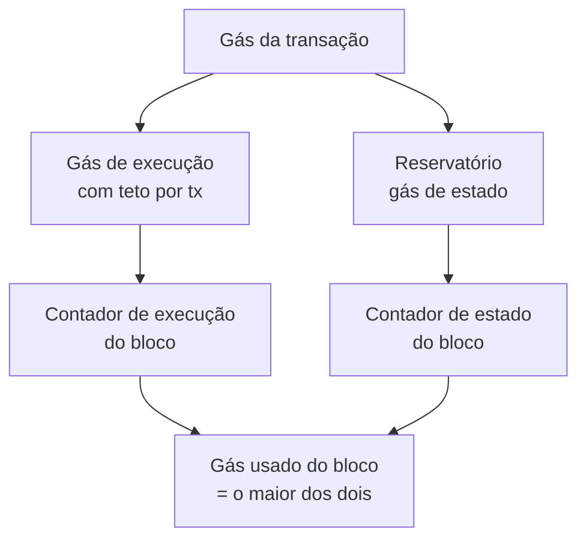

# Capítulo 43: Glamsterdam além das Manchetes, Quanto Custa Criar e Ler Estado

O Capítulo 10 apresentou a Glamsterdam pelas suas duas atrações principais, o ePBS e as Block-Level Access Lists, e os Capítulos 38 e 39 abriram cada uma delas. Só que a atualização é bem maior do que dois itens. A página da Glamsterdam no ethereum.org e a EIP meta que lista o escopo (EIP-7773) mostram um pacote com dezenas de mudanças, e uma parte decisiva dele trata de uma pergunta menos glamorosa: quanto o gás deveria custar para criar e para ler estado. Isso importa porque o plano de elevar o limite de gás do bloco só faz sentido se a rede aguentar o crescimento do estado (Capítulo 37). Este capítulo olha para esse bloco de mudanças. Como as EIPs ainda são rascunhos e o escopo pode mudar antes da mainnet, os números abaixo são os do texto atual de cada proposta.

**Onde a atualização está.** Segundo as notícias do início de outubro de 2026, a ativação na testnet Sepolia está marcada para 6 de outubro de 2026, às 13h53 UTC, e a Fundação Ethereum fala apenas em quarto trimestre para a mainnet. O histórico mostra que cronogramas já escorregaram, de modo que a data da mainnet só deve ser anunciada depois que os testes terminarem bem.


*Os marcos da Glamsterdam: a data da Sepolia está marcada, a da mainnet ainda não.*

**O pacote em quatro gavetas.** A EIP-7773 traz 18 EIPs agendadas para inclusão, além de EIPs de rede e informativas. Agrupadas por objetivo, formam quatro frentes.

| Frente | Exemplos | Ideia |
| --- | --- | --- |
| Arquitetura | EIP-7732 (ePBS), EIP-7928 (BALs) | Trocar o bloco de forma nativa e permitir execução em paralelo |
| Precificação do gás | EIP-8037, EIP-8038, EIP-7778, EIP-2780, EIP-7976, EIP-7981 | Alinhar o preço de cada operação ao seu custo real |
| Conforto de uso | EIP-7708, EIP-7997, EIP-8024, EIP-7954 | Logs de transferência de ETH, fábrica determinística, contratos maiores |
| Staking e consenso | EIP-8045, EIP-8061 | Impedir que validadores punidos proponham e acelerar saídas |

*A tabela agrupa parte das EIPs agendadas pelo tema, e não pela ordem de importância.*

**O problema por trás da precificação.** O texto da EIP-8037 descreve o ponto de partida. Hoje o preço de criar estado é desarmônico: um byte de código de contrato custa cerca de 200 gás, enquanto um byte de um slot de armazenamento custa cerca de 313 gás. Além disso, depois que o limite de gás subiu de 30 milhões para 60 milhões no fim de 2025, a criação diária de estado teria triplicado, de cerca de 105 MiB para cerca de 326 MiB, segundo a própria proposta. Projetando um limite de 200 milhões, a EIP estima cerca de 387 GiB de crescimento por ano, contra um estado atual de cerca de 390 GiB e um limiar de degradação de desempenho que ela situa em 650 GiB.

**A ideia do custo por byte de estado.** A EIP-8037 propõe uma unidade única, a `CPSB` (*cost per state byte*, custo por byte de estado), fixada em 1.530 gás por byte. O valor sai de um cálculo explícito: o objetivo é limitar o crescimento a cerca de 120 GiB por ano, usando como referência um limite de 150 milhões de gás e uma utilização média de 50% desse orçamento para estado.

```latex
CPSB = (150.000.000 / 2) x 2.628.000 / (120 GiB em bytes) ≈ 1.530 gás por byte
```
*Orçamento anual de gás de estado (metade do limite de referência vezes os 2.628.000 slots do ano) dividido pelos bytes que se aceita criar por ano.*

Com essa unidade, o custo de cada operação passa a ser "bytes criados vezes CPSB". Criar uma conta passa a ser 120 bytes, ou 183.600 de gás de estado, contra 25.000 hoje. Criar um slot de armazenamento passa a ser 64 bytes, ou 97.920, contra 20.000. Depositar código custa 1.530 por byte, contra 200. Para dar uma ordem de grandeza, a própria EIP calcula que implantar um contrato de 24 kB subiria de cerca de 4,95 milhões para cerca de 37,8 milhões de gás.

**Gás em duas dimensões.** Um aumento desses faria grandes implantações esbarrarem no teto de gás por transação (Capítulo 41). Por isso a EIP-8037 separa o gás em duas contas. O gás de execução continua limitado pelo teto por transação, em torno de 16,7 milhões menos o gás intrínseco. Já o gás de estado vem de um "reservatório" (`state_gas_reservoir`), formado pelo que sobra do gás da transação além desse teto. As cobranças de estado consomem primeiro o reservatório e depois o gás de execução. No bloco, os dois contadores são acompanhados separadamente, e o gás usado final do bloco é o maior entre eles, de modo que uma dimensão não rouba a capacidade da outra.


*A transação reparte o gás em duas contas, o bloco as conta em separado e vale o maior total.*

**Ler também custa.** A EIP-8038 trata do outro lado, o acesso ao estado. Desde a EIP-2929, de 2021, os preços de leitura não foram revistos, e o estado cresceu e ficou mais lento de consultar. A proposta calibra os custos por medições em blocos sintéticos com estado do tamanho da mainnet, tendo como meta uma taxa de 100 milhões de gás por segundo, e escolhe o pior caso entre os clientes. Entre as mudanças da tabela da EIP, o acesso a conta fria sobe de 2.600 para 3.000 de gás, o acesso a slot frio permanece em 2.100, e o custo de escrita em slot passa a ser de 10.000, contra cerca de 2.800 na referência da proposta. `EXTCODESIZE` e `EXTCODECOPY` ainda pagam um acesso morno extra, porque fazem duas leituras de banco de dados.

| Item | Hoje | Proposto |
| --- | --- | --- |
| Criar conta (estado) | 25.000 | 183.600 |
| Criar slot de armazenamento (estado) | 20.000 | 97.920 |
| Depositar código, por byte | 200 | 1.530 |
| Acesso a conta fria | 2.600 | 3.000 |
| Acesso a slot frio | 2.100 | 2.100 |

*Comparação entre os valores atuais e os propostos nas EIPs 8037 e 8038, ambas ainda em rascunho.*

**Reembolsos fora da conta do bloco.** A EIP-7778 corrige uma brecha de contabilidade. Hoje, reembolsos de operações como limpar um slot reduzem tanto o custo pago pelo usuário quanto o gás contado para o bloco, o que permite que o uso bruto de gás passe do limite. A proposta cita o bloco 20878522, em que 4,01 MGas de reembolsos permitiram isso. Com ela, o usuário continua recebendo o reembolso, e só a verificação do limite do bloco passa a contar o gás bruto. A lógica é a mesma do Capítulo 35, em que os reembolsos já tinham sido limitados pela EIP-3529, e conversa com a conta de gás do Capítulo 16.

**Transferências mais baratas e sinalizadas.** A EIP-2780, citada no Capítulo 35, reduz o gás intrínseco de uma transferência simples, em até 71% segundo a página da Glamsterdam. A EIP-7708 faz transferências de ETH emitirem um log, o que simplifica o acompanhamento de depósitos por quem integra o ETH a sistemas externos. A EIP-7997 prevê uma fábrica determinística de contratos, que permite o mesmo endereço em várias chains compatíveis com a EVM.

**Saídas mais rápidas no staking.** A EIP-8061 dá sequência ao que o Capítulo 40 mostrou sobre a fila de saída. Ela justifica a mudança observando que a fila de saída passou de 40 dias em saídas em massa recentes. Propõe remover o teto das saídas, tornando-as proporcionais ao total em stake (dividido por 2^15), e criar um limite próprio e ajustável para consolidações (dividido por 2^16). Para 36 milhões de ETH em stake, a EIP calcula que o limite de saída iria de 256 para cerca de 1.098 ETH por época, e o de consolidação de cerca de 293 para cerca de 549. A EIP-8045 complementa, impedindo que validadores já punidos proponham blocos (Capítulo 2).

**Por que isso importa para o resto do caderno.** O ePBS e as BALs (Capítulos 38 e 39) criam espaço para blocos maiores, e a precificação de estado é o freio que mantém esse espaço sustentável para quem opera um nó. Para os desenvolvedores de contratos, a consequência prática é que implantar e inicializar estado ficará bem mais caro em termos de gás, enquanto ler e transferir ficam mais próximos do custo real. Para a diversidade de clientes (Capítulo 28), um pacote tão amplo é também um teste de coordenação. Este capítulo é educacional e não constitui recomendação de compra ou venda de ativos.

**Glossário do capítulo.**
- **EIP meta (EIP-7773)**: proposta que lista quais EIPs entram em um hard fork e em que estágio estão.
- **CPSB**: custo por byte de estado, unidade de gás da EIP-8037, de 1.530 gás por byte no texto atual.
- **Gás de estado**: parcela do gás cobrada pela criação de estado, separada do gás de execução.
- **Reservatório de gás de estado**: parte do gás da transação, além do teto por transação, reservada às cobranças de estado.
- **Acesso frio e morno**: primeira leitura de uma conta ou slot na transação (frio, mais caro) e leituras seguintes (mornas, mais baratas).
- **Reembolso de gás**: devolução parcial ao usuário por operações como limpar um slot de armazenamento.
- **Churn**: número de ETH em stake que pode entrar, sair ou ser consolidado por época.
- **Gás intrínseco**: custo fixo mínimo de uma transação, cobrado antes de qualquer execução.
- **Testnet Sepolia**: rede de testes pública em que a Glamsterdam deve ser ativada antes da mainnet.

**Fontes.**
- [EIP-7773: Hardfork Meta, Glamsterdam](https://raw.githubusercontent.com/ethereum/EIPs/master/EIPS/eip-7773.md)
- [Glamsterdam, ethereum.org (repositório do site)](https://raw.githubusercontent.com/ethereum/ethereum-org-website/dev/public/content/roadmap/glamsterdam/index.md)
- [EIP-8037: State Creation Gas Cost Increase](https://raw.githubusercontent.com/ethereum/EIPs/master/EIPS/eip-8037.md)
- [EIP-8038: State-Access Gas Cost Update](https://raw.githubusercontent.com/ethereum/EIPs/master/EIPS/eip-8038.md)
- [EIP-7778: Block Gas Accounting without Refunds](https://raw.githubusercontent.com/ethereum/EIPs/master/EIPS/eip-7778.md)
- [EIP-8061: Increase Exit and Consolidation Churn](https://raw.githubusercontent.com/ethereum/EIPs/master/EIPS/eip-8061.md)
- [Ethereum Targets October 6 for Glamsterdam Sepolia Fork, CryptoPotato](https://cryptopotato.com/ethereum-targets-october-6-for-glamsterdam-sepolia-fork/)
