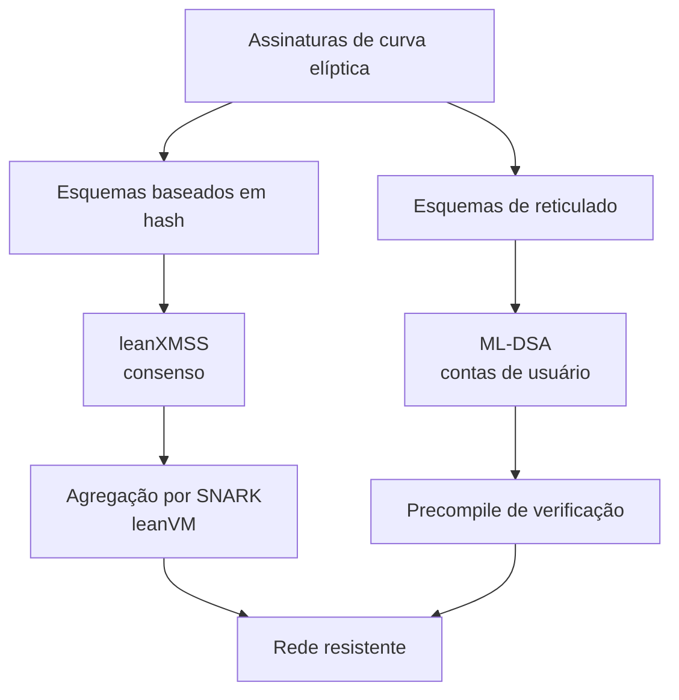
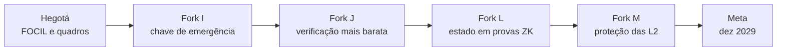

# Capítulo 44: Computação Quântica e o Futuro Pós-Quântico do Ethereum

Toda a segurança de uma carteira, como visto no Capítulo 26, descansa em uma assimetria matemática: é fácil derivar uma chave pública a partir da privada, e na prática impossível fazer o caminho de volta. Um computador quântico suficientemente grande quebraria exatamente essa assimetria para as curvas elípticas usadas hoje. Ele ainda não existe em escala útil, mas o tempo que uma migração de rede inteira leva é longo, e por isso o tema saiu dos artigos acadêmicos e entrou na pauta dos desenvolvedores. Este capítulo explica o que está em risco, o que não está, e o que o Ethereum já planeja fazer. Como o plano é recente e ainda sofre ajustes, o texto separa o que está em especificação (as EIPs) do que são relatos da imprensa sobre o cronograma.

**O que um computador quântico muda.** Duas famílias de algoritmos importam. O algoritmo de Shor resolve o problema do logaritmo discreto em curvas elípticas em tempo viável para uma máquina quântica grande, o que permitiria calcular uma chave privada a partir da pública. Já o algoritmo de Grover acelera buscas por força bruta, mas apenas de forma quadrática, o que na prática se compensa dobrando o tamanho dos hashes. Por isso a ameaça não é simétrica: as assinaturas são o elo fraco, e as funções de hash como a Keccak-256 sofrem bem menos.

```latex
Shor:    tempo polinomial para o logaritmo discreto em curvas elipticas
Grover:  busca em N possibilidades em cerca de raiz(N) passos
         (hash de 256 bits passa a oferecer ~128 bits de seguranca contra busca quantica)
```
*Shor ameaça de forma direta as assinaturas atuais, e Grover só reduz pela metade, em bits, a margem dos hashes.*

**Onde o Ethereum é vulnerável.** Segundo a análise de ameaças publicada pela comunidade de pesquisa do Ethereum, os pontos expostos são as assinaturas ECDSA das contas comuns (EOAs, Capítulo 24), as assinaturas BLS dos validadores (Capítulo 2) e os compromissos KZG usados nos blobs (Capítulo 34), que dependem de curvas elípticas. Os endereços e as provas de Merkle, baseados em hash, estão em situação mais confortável.

| Componente | Primitiva atual | Exposição quântica | Observação |
| --- | --- | --- | --- |
| Contas comuns (EOAs) | ECDSA (secp256k1) | Alta, depois que a chave pública aparece | A chave pública é revelada ao enviar a primeira transação |
| Validadores | Assinaturas BLS | Alta | Base do consenso e das atestações |
| Blobs | Compromissos KZG | Alta | Dependem de curvas elípticas e de um setup confiável |
| Endereços e Merkle | Keccak-256 | Baixa | Grover dá só ganho quadrático |
| Provas STARK | Hashes | Baixa | Já são consideradas seguras no cenário pós-quântico |

*A tabela mostra que o risco se concentra nas assinaturas e nos compromissos de curva elíptica, e não em todo o protocolo.*

Um detalhe prático explica por que nem toda carteira está igualmente exposta. Um endereço é apenas um hash da chave pública. Enquanto uma conta nunca enviou uma transação, a chave pública não foi revelada, e um atacante quântico teria só o hash para trabalhar. Depois da primeira transação, a chave pública fica registrada para sempre na cadeia. Reutilizar endereços, portanto, amplia a janela de exposição.

**Quando a ameaça seria real.** Não há data confiável. Um dos resumos consultados cita estimativas de especialistas de cinco a quinze anos para o surgimento de computadores quânticos criptograficamente relevantes, uma faixa larga que reflete a incerteza. A lógica de quem planeja é outra: como mudar o protocolo, as carteiras e os contratos leva anos, começar cedo custa pouco e começar tarde pode custar muito. É a mesma lógica das migrações de criptografia em outros setores, que não esperam a ameaça se concretizar.

**Como a rede pretende reagir.** Dois fios se combinam. O primeiro é a troca das assinaturas por esquemas pós-quânticos, em duas famílias: baseadas em hash, como o XMSS, e baseadas em reticulados, como o ML-DSA, padronizado pelo NIST como FIPS 204. O segundo é tornar a conta flexível, para que trocar o esquema de assinatura não exija trocar de endereço, o que conecta o tema ao Capítulo 24.


*Duas rotas de substituição das assinaturas: hash para o consenso, com agregação por prova, e reticulado para as contas, com verificação barata no EVM.*

**A frente do consenso.** Assinaturas baseadas em hash são seguras, mas não agregam tão bem quanto as BLS, que permitem juntar milhares de atestações em uma só. A pesquisa da Fundação Ethereum aposta no leanXMSS, um esquema de assinatura de hash, combinado com uma máquina virtual mínima de conhecimento zero, a leanVM, para agregar as assinaturas por meio de provas SNARK (a comparação entre SNARK e STARK está no Capítulo 9). Segundo a imprensa, mais de dez equipes de clientes já rodam devnets semanais de interoperabilidade pós-quântica, e a Fundação abriu um portal dedicado, o pq.ethereum.org, em março de 2026. Em janeiro de 2026 a Fundação também anunciou uma equipe dedicada ao tema e dois prêmios de pesquisa de 1 milhão de dólares cada, segundo a imprensa especializada, um sobre a função de hash Poseidon e outro sobre proximidade em códigos, ambos ligados à segurança de provas de conhecimento zero.

**A frente das contas.** Aqui as EIPs já são texto concreto. A EIP-8141 (transação de quadros) está agendada para a Hegotá, segundo a EIP meta do fork (Capítulo 42). Ela decompõe uma transação em quadros, que são chamadas a contratos em três modos: DEFAULT, VERIFY e SENDER. A validação deixa de ser um ECDSA fixo e passa a ser código escolhido pela conta. O próprio texto da EIP cita como motivação uma "saída nativa" do sistema criptográfico de curvas elípticas para sistemas pós-quânticos. Ela ainda separa gás de execução de gás de estado, na linha do Capítulo 43. Já a EIP-8355, apenas proposta, criaria três precompiles para verificar assinaturas ML-DSA nos níveis II, III e V do NIST, nos endereços 0x12, 0x13 e 0x14, com custo base de 6.500, 9.000 e 13.500 de gás, mais 6 por palavra de 32 bytes da mensagem. Como são propostas em rascunho, nada disso está garantido para a mainnet.

**O cronograma divulgado.** Segundo a imprensa, a Fundação publicou um plano com quatro hard forks, identificados pelas letras I, J, L e M, e a meta de concluir as mudanças de camada 1 até dezembro de 2029. Pelos relatos, o primeiro daria aos validadores uma chave pública de emergência, ativável caso um computador quântico surja de repente, o segundo reduziria o custo de verificar assinaturas seguras, o terceiro comprimiria em provas de conhecimento zero a forma de expressar o estado da cadeia, e o quarto protegeria as camadas 2. Vale tratar esses detalhes como o plano atual, não como compromisso, pois as notícias indicam que só os dois primeiros estariam em consideração para a Hegotá.


*Sequência relatada pela imprensa: cada fork cuida de uma peça, e a meta final de 2029 é um alvo, não uma garantia.*

**E se o computador chegar antes?** Em 2024, Vitalik Buterin descreveu no fórum ethresear.ch um plano de emergência: ao detectar um ataque quântico, a rede faria um hard fork de recuperação. O plano inclui voltar a cadeia ao ponto anterior ao ataque, desativar transações de contas comuns e permitir que os donos provem a propriedade por meio de provas STARK ligadas à frase-semente (Capítulo 26), migrando para um novo tipo de conta. O ponto é que a funcionalidade da seed phrase de derivação hierárquica, usada por muitas carteiras, oferece essa porta de recuperação sem depender da chave elíptica exposta. É um plano de último recurso, que a comunidade prefere nunca precisar acionar, mas ele mostra que um colapso instantâneo de fundos não é a única saída.

**Comparação com o Bitcoin.** O Capítulo 36 mostrou as diferenças estruturais entre as duas redes. No contexto quântico, o Ethereum aposta na flexibilidade de conta como um trunfo, já que abstrair a validação permite trocar de esquema sem trocar de endereço. O Bitcoin tem discussões próprias, mas sem uma camada de contas programáveis equivalente, e não cabe aqui afirmar qual rede está mais preparada, pois isso depende de decisões ainda em aberto nas duas comunidades.

**O que fazer hoje, sem alarmismo.** Para quem guarda cripto, a ameaça concreta de curto prazo é outra, e é a dos golpes do Capítulo 27. Ainda assim, bons hábitos reduzem a exposição futura: não reutilizar endereços sem necessidade, acompanhar o suporte das carteiras a contas programáveis e preferir carteiras que evoluam junto com os padrões. O futuro quântico é uma questão de engenharia de longo prazo, não de pânico. Este capítulo é educacional e não constitui recomendação de compra ou venda de ativos.

**Glossário do capítulo.**
- **Computador quântico criptograficamente relevante**: máquina quântica grande e estável o bastante para executar o algoritmo de Shor contra chaves reais.
- **Algoritmo de Shor**: algoritmo quântico que resolve o logaritmo discreto e a fatoração em tempo polinomial, ameaçando ECDSA e BLS.
- **Algoritmo de Grover**: algoritmo quântico de busca com ganho quadrático, que reduz pela metade os bits efetivos de um hash.
- **ML-DSA**: assinatura baseada em reticulados, padronizada pelo NIST no FIPS 204, candidata a proteger contas de usuário.
- **leanXMSS**: esquema de assinatura baseado em hash estudado para o consenso do Ethereum.
- **leanVM**: máquina virtual mínima de conhecimento zero usada para agregar assinaturas pós-quânticas.
- **Transação de quadros (EIP-8141)**: tipo de transação que decompõe validação, execução e pagamento de gás em chamadas a contratos.
- **Precompile**: contrato embutido no protocolo, com endereço fixo, que executa uma operação cara de forma nativa.
- **Hard fork de recuperação**: plano de emergência para migrar contas caso um ataque quântico se materialize.

**Fontes.**
- [EIP-8081: Hardfork Meta, Hegotá](https://raw.githubusercontent.com/ethereum/EIPs/master/EIPS/eip-8081.md)
- [EIP-8141: Frame Transaction](https://raw.githubusercontent.com/ethereum/EIPs/master/EIPS/eip-8141.md)
- [EIP-8355: ML-DSA Verification Precompiles](https://raw.githubusercontent.com/ethereum/EIPs/master/EIPS/eip-8355.md)
- [Ethereum Foundation to Implement Quantum Security by 2029, Forklog](https://forklog.com/en/ethereum-foundation-to-implement-quantum-security-by-2029/)
- [Ethereum aims for quantum-safe L1 by 2029 as Hegotá upgrade takes form, The Block](https://www.theblock.co/news/ecosystems/2026-09-08-ethereum-foundation-quantum-resistance-2029-413716)
- [Ethereum Foundation forms post-quantum security team, adds $1 million research prize, The Block](https://www.theblock.co/post/386938/ethereum-foundation-forms-post-quantum-security-team-adds-1-million-research-prize)
- [How to hard-fork to save most users' funds in a quantum emergency, ethresear.ch](https://ethresear.ch/t/how-to-hard-fork-to-save-most-users-funds-in-a-quantum-emergency/18901)
- [PQ Threat Landscape, iptf.ethereum.org](https://iptf.ethereum.org/domains/post-quantum/)
