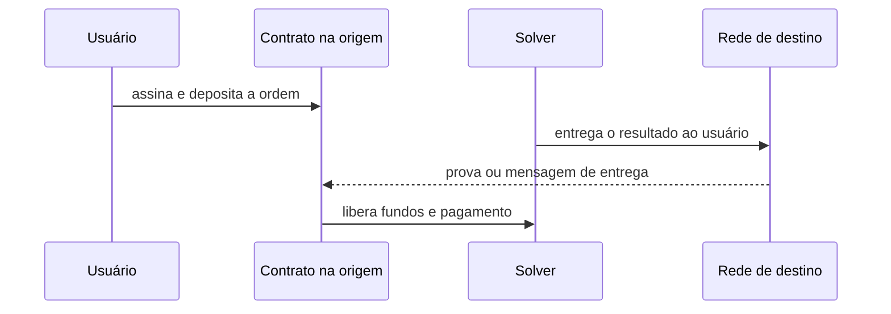
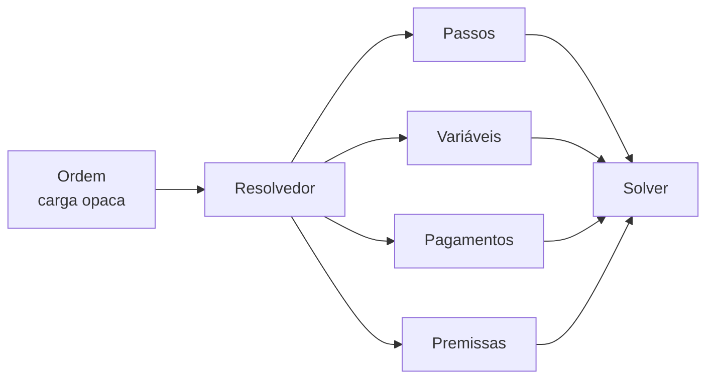
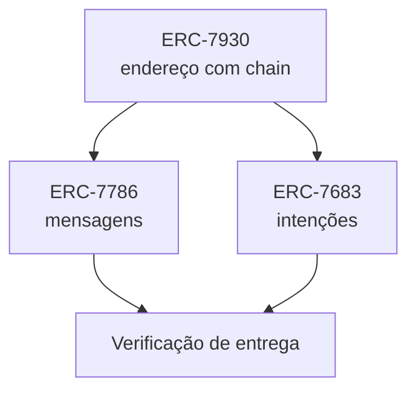

# Capítulo 45: Intenções entre Chains, ERC-7683 e a Corrida pela Interoperabilidade Padronizada

O Capítulo 23 mostrou como as pontes entre chains funcionam e por que concentraram alguns dos maiores roubos da história cripto. Com dezenas de redes e de Layer 2 (Capítulos 5 a 9), mover valor ou dados de uma para outra virou tarefa diária, e a experiência de quem faz isso ainda é cheia de atritos: escolher uma ponte, aprovar tokens, esperar, torcer para o endereço de destino estar certo. Nos últimos anos surgiu uma resposta que muda o ponto de vista. Em vez de o usuário descrever o caminho, ele descreve o resultado que quer, e agentes especializados competem para entregá-lo. Este capítulo explica essa ideia, chamada de intenções (intents), e os padrões do Ethereum que tentam organizá-la: o ERC-7683, o ERC-7786 e o ERC-7930. Os três são propostas em estágios distintos de maturidade, e isso importa para a leitura do texto.

**Do caminho ao resultado.** Numa ponte clássica, o usuário envia fundos a um contrato na origem, e um mecanismo de verificação libera ou cunha ativos no destino. A experiência é a de operar a infraestrutura. Num modelo de intenções, o usuário assina uma ordem dizendo, em essência, "quero receber tal quantidade de tal token naquela rede". Um solver (também chamado de filler ou relayer, conforme o protocolo) adianta o próprio capital no destino, entrega o resultado e depois é reembolsado, com um pagamento pelo serviço. O usuário enxerga rapidez, e o risco de esperar a verificação da origem passa para quem tem capital e estrutura para suportá-lo.


*O solver adianta o capital no destino, e só depois a origem confirma a entrega e o reembolsa.*

Essa lógica tem parentesco com o que o Capítulo 17 descreveu para o MEV: agentes competitivos, motivados por lucro, executam uma tarefa complexa em nome do usuário. A diferença é que aqui a competição é desenhada para melhorar o preço e a velocidade da entrega.

**Onde o risco foi parar.** Intenções não eliminam a necessidade de confiança, apenas a reposicionam. O usuário deixa de depender da lentidão de uma verificação, mas o reembolso do solver ainda depende de um mecanismo que prove que a entrega ocorreu, seja um oráculo, uma mensagem entre chains ou uma janela de contestação otimista. A tabela compara as duas abordagens.

| Aspecto | Ponte clássica | Modelo de intenções |
| --- | --- | --- |
| O que o usuário faz | Escolhe a rota e opera cada passo | Declara o resultado desejado |
| Quem adianta o capital | Contrato da ponte ou provedores de liquidez | Solver, com capital próprio |
| Onde mora o risco principal | Verificação e custódia da ponte | Reembolso do solver e correção do contrato de liquidação |
| Velocidade percebida | Depende da verificação | Rápida, pois o solver adianta o valor |
| Concorrência | Em geral pela ponte | Entre solvers, por ordem |

*O risco não some no modelo de intenções, ele se desloca para o solver e para o contrato que liquida a ordem.*

**O problema da fragmentação de liquidez dos solvers.** Cada protocolo de intenções define seu formato de ordem, sua forma de autorizar fundos e sua verificação de liquidação. Segundo a motivação do ERC-7683, sem padronização a liquidez dos solvers fica fragmentada em integrações específicas de cada protocolo: um solver precisa suportar o formato de cada um separadamente, o que cria barreiras de entrada e reduz a competição na execução. O padrão quer atacar exatamente isso.

**O ERC-7683, o padrão das intenções.** O ERC-7683 (Cross Chain Intents) tem o status de rascunho (Draft), criado em abril de 2024 por um grupo de sete autores. Segundo o texto atual, ele define uma interface padronizada entre protocolos de intenções e sistemas de solvers. Os protocolos codificam as ordens como cargas opacas e fornecem contratos resolvedores (resolvers) que traduzem essas cargas para uma representação comum. O solver consulta o resolvedor por `eth_call` e obtém instruções executáveis sem precisar conhecer a lógica interna de cada protocolo.

Na especificação atual, uma ordem tem três elementos. Os passos (steps) são as ações a executar, principalmente chamadas a contratos, com atributos como limite de gás, janelas de tempo, tokens ERC-20 gastos e política de reversão. As variáveis são valores que o solver decide na execução, como quem recebe o pagamento e em qual rede. Os pagamentos são as transferências de ERC-20 que remuneram o solver. Os resolvedores também devolvem premissas (assumptions), isto é, condições que não conseguem verificar sozinhos e que o solver deve checar antes de agir.


*O resolvedor traduz uma ordem específica de cada protocolo em um conjunto comum de instruções que qualquer solver consegue ler.*

Dois detalhes de design merecem atenção. O primeiro é que o padrão deliberadamente não padroniza a liquidação. Segundo o texto, os protocolos mantêm liberdade sobre estruturas de custódia (depositar antes ou entregar antes), sobre feeds de ordens on-chain ou off-chain e sobre esquemas de autorização de fundos. O foco fica só na interface voltada ao solver. O segundo é que versões anteriores tentavam padronizar todo o ciclo de vida da ordem, e a especificação registra que isso gerava parametrizações específicas e reduzia a interoperabilidade real. A fronteira do padrão foi movida para a resolução. O leitor que encontrar descrições mais antigas do ERC-7683, com estruturas de ordem fixas, deve lembrar que o texto foi reescrito e que, por ser um rascunho, ainda pode mudar.

**Confiança no resolvedor.** A especificação afirma que o resolvedor é o ponto de confiança: operadores de solvers podem manter listas de resolvedores já examinados, em vez de confiar em cada protocolo individualmente. O texto também deixa claro o limite do padrão, que descreve formatos e não garante segurança. A segurança de seguir as instruções depende da implementação do resolvedor, dos contratos de liquidação, dos ativos envolvidos e de qualquer sistema off-chain ou entre chains. Para o solver, o risco se concentra na janela entre comprometer capital e o pagamento se tornar final e utilizável, e a análise de segurança deve cobrir essa janela inteira, incluindo mudanças adversas em estado de contratos, comportamento de tokens e valores de oráculos (Capítulo 25).

**Endereços que sabem em que chain estão.** Uma peça menos vistosa mas essencial é o ERC-7930, de endereços interoperáveis, em estágio de revisão (Review). Hoje um endereço Ethereum é só 20 bytes, sem dizer a qual rede pertence, e cada protocolo inventou seu jeito de combinar endereço e chain. O padrão define um formato binário único, com versão, tipo de chain, referência da chain e o endereço, cada parte com seu tamanho, e funciona junto ao CAIP-350 para outros tipos de rede além da EVM. O ERC-7683 usa esse formato como dependência. Quem leu o Capítulo 27 reconhece o valor prático: enviar fundos para o endereço certo na rede errada é uma fonte clássica de perdas.

```latex
Endereco interoperavel = versao (2 bytes)
                       + tipo de chain (2 bytes)
                       + tamanho da referencia (1 byte) + referencia da chain
                       + tamanho do endereco (1 byte) + endereco
```
*O endereço interoperável embute a identificação da rede, de modo que um único valor diz onde e quem.*

**Mensagens entre chains com interface comum.** O terceiro padrão, o ERC-7786, tem status final (Final) e cuida de outro pedaço do problema: a passagem de dados arbitrários entre chains. Segundo o texto, as pontes e protocolos de mensagem têm hoje interfaces incompatíveis, o que dificulta trocar de um por outro. O ERC define um gateway de origem, com a função `sendMessage`, e um destinatário que implementa `receiveMessage`, além de atributos opcionais em pares chave e valor para recursos específicos de cada protocolo. Remetente e destinatário usam o formato do ERC-7930. Um cuidado de segurança do próprio texto: codificações fora do padrão podem causar falhas silenciosas de entrega, e os gateways devem rejeitá-las. Como o destinatário só é chamado por uma função dedicada, ativos mantidos no gateway ficam protegidos de chamadas diretas não autorizadas.

| Padrão | Para que serve | Status segundo o texto consultado |
| --- | --- | --- |
| ERC-7683 | Interface entre protocolos de intenções e solvers | Rascunho |
| ERC-7786 | Mensagens arbitrárias entre chains via gateways | Final |
| ERC-7930 | Formato binário de endereço com a chain embutida | Em revisão |

*Os três padrões se encaixam, mas estão em estágios diferentes, e apenas um deles é considerado final.*


*O formato de endereço é a base comum, e tanto as mensagens quanto as intenções dependem de algum tipo de verificação de entrega.*

**Como ler esse movimento.** A tendência de padronizar a interoperabilidade na camada de aplicação dialoga com um tema mais amplo da evolução do Ethereum: em vez de uma única ponte oficial entre tudo, aposta-se em interfaces comuns sobre mecanismos concorrentes. O custo é que a comparação entre soluções fica sutil. Uma entrega rápida para o usuário não diz nada sobre quão bem o solver está protegido, e um padrão sem garantia de liquidação não substitui a análise de cada protocolo. As perguntas do Capítulo 23 continuam valendo, com um acréscimo: quem adianta o capital, quem verifica a entrega e o que acontece se a verificação falhar. Para um usuário, cabe também lembrar que aprovações de tokens dadas a contratos de liquidação seguem as mesmas armadilhas do Capítulo 27.

**O que ainda não está resolvido.** Padrões em rascunho mudam, e o ecossistema real de solvers pode se concentrar em poucos agentes grandes, o que reintroduziria o tipo de centralização discutido nos capítulos sobre MEV e sequenciadores. Detalhes de adoção por protocolos específicos variam e não foram verificados em fonte primária para este capítulo, por isso ficam fora do texto. Este capítulo é educacional e não constitui recomendação de compra ou venda de ativos, nem de uso de qualquer protocolo.

**Glossário do capítulo.**
- **Intenção (intent)**: ordem assinada que descreve o resultado desejado, deixando o caminho de execução a cargo de terceiros.
- **Solver**: agente que executa uma intenção, adiantando capital e sendo reembolsado e remunerado depois. Também chamado de filler ou relayer.
- **Resolvedor (resolver)**: contrato que traduz a carga opaca de uma ordem em instruções comuns que qualquer solver entende.
- **Passo (step)**: ação executável de uma ordem, em geral uma chamada a um contrato, com atributos de limite e política de reversão.
- **Premissa (assumption)**: condição que o resolvedor não consegue verificar e que o solver deve checar antes de executar.
- **Endereço interoperável**: formato binário do ERC-7930 que une versão, tipo de chain, referência da chain e endereço.
- **Gateway de mensagens**: contrato do ERC-7786 que envia ou recebe mensagens arbitrárias entre chains por uma interface comum.
- **Fragmentação de liquidez**: situação em que o capital dos solvers fica dividido por formatos incompatíveis de protocolos.
- **Janela de liquidação**: intervalo entre o solver comprometer capital e o pagamento se tornar final e utilizável.

**Fontes.**
- [ERC-7683: Cross Chain Intents](https://raw.githubusercontent.com/ethereum/ERCs/master/ERCS/erc-7683.md)
- [ERC-7786: Cross-Chain Messaging Gateway](https://raw.githubusercontent.com/ethereum/ERCs/master/ERCS/erc-7786.md)
- [ERC-7930: Interoperable Addresses](https://raw.githubusercontent.com/ethereum/ERCs/master/ERCS/erc-7930.md)
