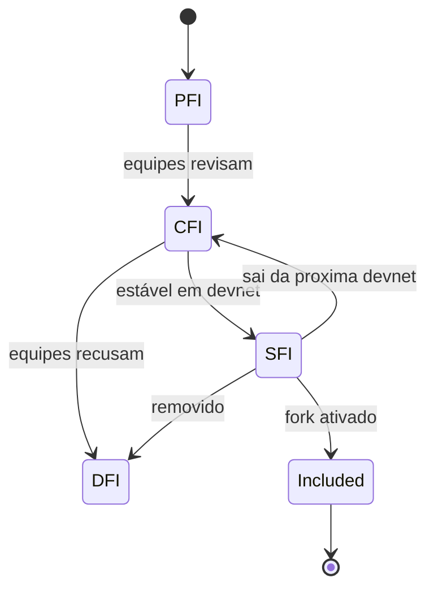
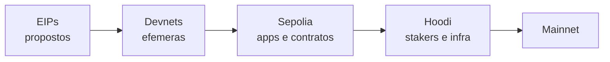
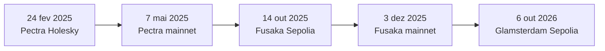

# Capítulo 46: Como um Hard Fork Chega à Mainnet, Devnets, Testnets e o Caso Glamsterdam

Os Capítulos 10, 38, 39 e 43 explicaram o que o Glamsterdam muda no Ethereum: ePBS, listas de acesso por bloco, nova precificação de estado. Faltava contar como uma mudança dessas sai do papel e chega à rede principal sem que ninguém precise desligar nada. Isso vale ser contado agora porque, em 6 de outubro de 2026, data deste capítulo, o Glamsterdam está programado para ativar na Sepolia, uma das redes de teste públicas, às 13:53:36 UTC. É a primeira vez que o pacote roda numa rede de teste de longa duração. Este capítulo descreve o caminho, usando como régua os dois hard forks anteriores, Pectra (Capítulo 40) e Fusaka (Capítulo 41).

**Um hard fork é um acordo coordenado.** Como visto no Capítulo 28, o Ethereum não tem um único programa, e sim vários clientes de execução e de consenso escritos por equipes diferentes. Um hard fork só funciona se todos ativarem a mesma regra nova no mesmo instante. Por isso o processo é, em boa parte, de comunicação e de teste, e a ativação é marcada por época (epoch) ou por carimbo de tempo, nunca por decisão de uma pessoa. O Capítulo 20 mostrou o outro lado da moeda: em 2016 o fork foi uma resposta de emergência a um roubo. Hoje a regra é o contrário, ciclos longos, previsíveis e muito ensaiados.

**Os estágios de uma proposta.** O EIP-7723, um documento de processo, define as etapas pelas quais uma proposta passa dentro de um fork específico. A tabela resume.

| Estágio | Significado resumido |
| --- | --- |
| Proposed for Inclusion (PFI) | Alguém abre um pedido para incluir o EIP, e as equipes de cliente passam a analisá-lo |
| Considered for Inclusion (CFI) | Os desenvolvedores pretendem tentar incluí-lo nas devnets, é algo como um "concept ACK" |
| Scheduled for Inclusion (SFI) | Há forte intenção de incluir, e a especificação e a implementação estão maduras |
| Declined for Inclusion (DFI) | As equipes não querem o EIP neste fork, mas ele pode ser proposto de novo no seguinte |
| Included | O EIP foi de fato ativado com o fork |

*O estágio vale para um único fork: uma proposta recusada ou adiada precisa ser proposta de novo no ciclo seguinte.*


*Um EIP avança por estágios de maturidade e pode voltar um degrau ou ser recusado a qualquer momento antes da ativação.*

O mesmo EIP-7723 traz critérios para promover um EIP a SFI: ter entrado numa devnet que mostrou estabilidade (por exemplo, alta participação e nenhum bug crítico por pelo menos uma semana), ter especificação perto do final, ter interações testadas com os outros EIPs candidatos e ter cobertura de testes adequada, sem divergência conhecida entre clientes. O texto também exige uma implementação em Python nas especificações de execução (execution-specs) acompanhada de testes, e esses testes são obrigatórios para o estágio SFI. Vale notar que o próprio EIP-7723 está com o status de Last Call, e o texto diz que o processo deve ser usado por pelo menos um ciclo completo antes dessa etapa e por dois ciclos antes de virar Final, o que revela um processo ainda em amadurecimento.

**Devnets, os ensaios efêmeros.** Antes de qualquer rede de teste de longa duração, os clientes implementam os EIPs numa rede de teste efêmera chamada devnet, para verificar a interoperabilidade entre clientes. A convenção de nome é `nomeDoFork-devnet-versão`, como `pectra-devnet-0`. A regra do EIP-7723 é que a devnet mais recente deve conter todos os EIPs agendados para o fork. É na devnet que se descobrem as divergências entre clientes, justamente o tipo de problema que o Capítulo 28 apontou como o risco de uma mudança mal sincronizada.

**Duas redes de teste, dois públicos.** Depois das devnets vêm as redes de teste públicas e duradouras. Segundo os repositórios oficiais das redes, a Sepolia (2021) é o lugar indicado para testar aplicações, contratos inteligentes e funcionalidades da EVM, e a Hoodi (2025) é uma rede de teste permissionless, já nascida com o Merge ativo, que assumiu de sua antecessora Holešky o papel de rede para staking, infraestrutura e desenvolvedores de protocolo. Na prática, a Sepolia serve a quem constrói em cima do Ethereum e a Hoodi a quem opera validadores e nós. O repositório da Sepolia descreve uma configuração de prova de autoridade, com conjunto de validadores controlado, o que a torna estável para desenvolvedores de aplicações. A Hoodi, aberta a qualquer staker, se parece mais com a rede real, com o conjunto de validadores, as saídas e os relays de MEV (Capítulo 17) que a mainnet tem.


*A mudança sobe de ambientes descartáveis até a rede real, e cada degrau expõe um tipo diferente de falha.*

**O que os dois forks anteriores mostram.** Os EIPs de metadados de cada fork (EIP-7600 para o Pectra, EIP-7607 para o Fusaka) registram os carimbos de ativação, e o repositório de cada rede confirma as datas. Convertendo os carimbos, o Pectra ativou na Holešky em 24 de fevereiro de 2025, na Sepolia em 5 de março, na Hoodi em 26 de março e na mainnet em 7 de maio de 2025. O Fusaka ativou na Holešky em 1º de outubro de 2025, na Sepolia em 14 de outubro, na Hoodi em 28 de outubro e na mainnet em 3 de dezembro de 2025. Calculando as diferenças, entre a Hoodi e a mainnet passaram cerca de 42 dias no Pectra e cerca de 36 dias no Fusaka. Entre a Sepolia e a mainnet, o Fusaka levou cerca de 51 dias.

| Fork | Sepolia | Hoodi | Mainnet |
| --- | --- | --- | --- |
| Pectra | 5 mar 2025 | 26 mar 2025 | 7 mai 2025 |
| Fusaka | 14 out 2025 | 28 out 2025 | 3 dez 2025 |
| Glamsterdam | 6 out 2026 | a definir | a definir |

*Nos dois forks passados, as redes de teste vieram em sequência, com algumas semanas de intervalo entre cada degrau; para o Glamsterdam, só a Sepolia tem data.*


*A linha do tempo mostra o ritmo recente: cada fork passou por testnets antes de chegar à mainnet, e o Glamsterdam está agora no primeiro degrau público.*

Esses intervalos são descrição do passado, não promessa. Nada garante que o Glamsterdam repetirá o mesmo ritmo, e os próprios metadados avisam que as linhas da Hoodi e da mainnet "serão preenchidas conforme as equipes de cliente decidirem" os horários.

**O caso Glamsterdam hoje.** O EIP-7773, o meta EIP do Glamsterdam (ainda com status Review), lista 18 EIPs agendados. Entre eles estão os que o caderno já estudou: o ePBS (EIP-7732, Capítulo 38), as listas de acesso por bloco (EIP-7928, Capítulo 39), a precificação de estado (EIP-8037 e EIP-8038, Capítulo 43), o custo intrínseco por recurso na transação (EIP-2780, Capítulo 35), a contabilidade de gás sem reembolsos (EIP-7778) e o aumento do churn de saída e consolidação (EIP-8061). Há também itens menores, como o opcode SLOTNUM (EIP-7843), a emissão de log em transferências de ETH (EIP-7708) e o aumento do tamanho máximo de contrato (EIP-7954). O documento ainda separa EIPs de rede e informativos, como o EIP-8261, que trata de um cronograma de limite de gás, e dá ao fork um mascote, o urso-polar. A tabela de ativação traz, para a Sepolia, a época 353024 e o carimbo 1791294816, que corresponde a 6 de outubro de 2026 às 13:53:36 UTC. Hoodi e mainnet estão em branco.

A conversão entre época e carimbo é aritmética simples: uma época tem 32 slots e cada slot dura 12 segundos (Capítulo 2).

```latex
carimbo = genesis_da_rede + epoca * 32 * 12

353024 * 32 = 11.296.768   (slot de ativação na Sepolia)
```
*Dividir o carimbo pela duração do slot e pelo número de slots por época dá a época de ativação, e o slot inicial é a época multiplicada por 32.*

Conferindo a conta, o slot 11.296.768 vezes 12 segundos, somado ao instante de gênese da camada de consenso da Sepolia, reproduz exatamente o carimbo publicado.

**O que uma rede de teste prova e o que não prova.** Uma ativação bem-sucedida na Sepolia mostra que os clientes concordam sobre as novas regras num ambiente com poucos participantes e dinheiro sem valor. Não prova, por si só, que a mainnet suportará a carga real, os incentivos reais e a diversidade de configurações de operadores. Por isso existe a Hoodi, mais próxima da realidade de quem faz staking, e por isso o Capítulo 28 insiste que a diversidade de clientes é um seguro: um bug que só aparece num cliente e não nos outros é contido, desde que nenhum domine a rede. Se algo falhar, o caminho previsto é voltar às devnets, corrigir e agendar de novo, o que explica por que datas de mainnet só são fixadas quando as redes de teste anteriores se comportam bem.

**Como ler notícias sobre um fork.** Algumas regras de bolso ajudam. Primeiro, distinguir a rede: "ativou na Sepolia" não é "ativou no Ethereum". Segundo, desconfiar de datas de mainnet anunciadas antes de existirem datas de Hoodi. Terceiro, lembrar que a lista de EIPs pode mudar até quase o fim, já que um EIP agendado pode voltar a ser considerado ou ser recusado. Quarto, separar fatos de efeitos esperados: números de ganho de capacidade ou de redução de taxas são metas dos desenvolvedores, não resultados medidos.

**Glossário do capítulo.**

- **Hard fork**: mudança de regras do protocolo que exige que todos os nós adotem a nova versão no mesmo ponto de ativação.
- **Meta EIP**: documento que lista os EIPs de um fork e, ao final, registra as datas de ativação por rede.
- **PFI, CFI, SFI, DFI**: siglas dos estágios Proposed, Considered, Scheduled e Declined for Inclusion do EIP-7723.
- **Devnet**: rede de teste efêmera usada para verificar a interoperabilidade entre clientes antes das testnets duradouras.
- **Sepolia**: rede de teste pública voltada a aplicações, contratos e funcionalidades da EVM.
- **Hoodi**: rede de teste pública permissionless voltada a stakers, infraestrutura e desenvolvedores de protocolo.
- **Época (epoch)**: bloco de 32 slots da camada de consenso, usado para marcar a ativação de forks.
- **Carimbo de tempo (timestamp)**: horário em formato Unix usado pela camada de execução para marcar a ativação.
- **Rough consensus**: modelo informal de decisão em que a governança se apoia em acordo amplo entre os desenvolvedores, sem votação formal.

**Fontes.**

- EIP-7773, Hardfork Meta Glamsterdam: https://raw.githubusercontent.com/ethereum/EIPs/master/EIPS/eip-7773.md
- EIP-7723, Network Upgrade Inclusion Stages: https://raw.githubusercontent.com/ethereum/EIPs/master/EIPS/eip-7723.md
- EIP-7607, Hardfork Meta Fusaka: https://raw.githubusercontent.com/ethereum/EIPs/master/EIPS/eip-7607.md
- EIP-7600, Hardfork Meta Pectra: https://raw.githubusercontent.com/ethereum/EIPs/master/EIPS/eip-7600.md
- Repositório da rede Hoodi: https://raw.githubusercontent.com/eth-clients/hoodi/main/README.md
- Repositório da rede Sepolia: https://raw.githubusercontent.com/eth-clients/sepolia/main/README.md
- Repositório da rede Holešky: https://raw.githubusercontent.com/eth-clients/holesky/main/README.md
