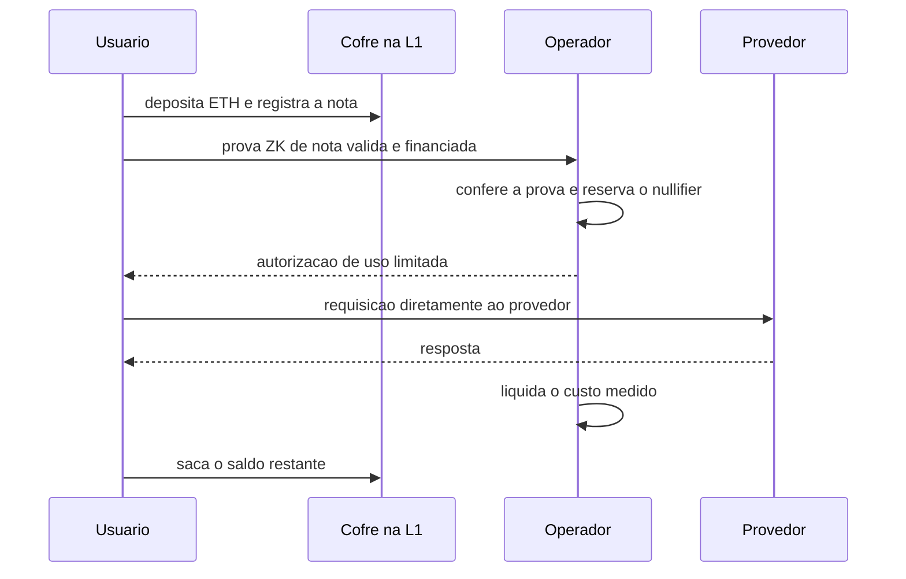
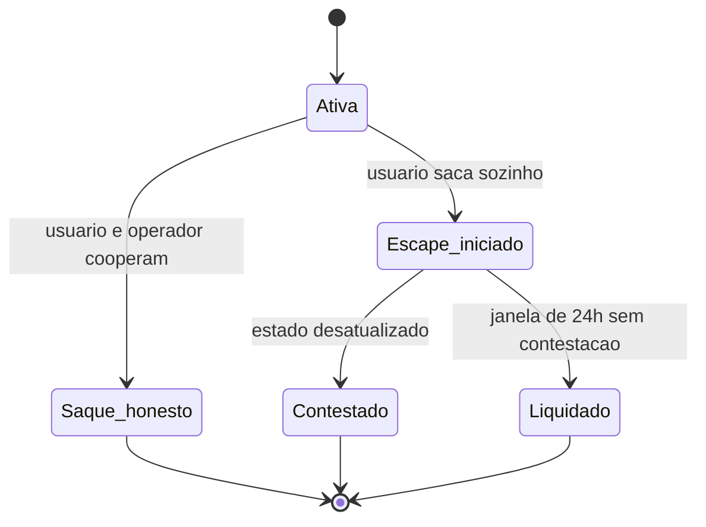

# Capítulo 47: zkAPI, Pagar por Uso sem Revelar Quem Paga

Em 1º de outubro de 2026, a Open Anonymity, em colaboração com a Ethereum Foundation, colocou na rede principal o zkAPI, um sistema para pagar serviços medidos por uso, como modelos de inteligência artificial, sem que cada requisição possa ser ligada ao depósito de quem pagou. É um caso útil para o caderno porque junta, num único produto real e recente, várias peças já estudadas: provas de conhecimento zero e privacidade (Capítulo 29), oráculos de preço (Capítulo 25), carteiras e custódia (Capítulo 26), contratos de cofre na EVM (Capítulo 21) e a fragilidade das criptografias atuais diante de computadores quânticos (Capítulo 44). O projeto se descreve como experimental, e este capítulo respeita esse aviso: explica o desenho e seus compromissos, sem tratá-lo como solução pronta.

**O problema: pagar e ser reconhecido são coisas diferentes.** Quem usa uma API paga normalmente cria uma conta, informa um meio de pagamento e passa a ter todas as requisições amarradas a essa identidade. O pagamento funciona como uma etiqueta que acompanha cada pergunta feita ao serviço. Num blockchain público o problema se agrava, porque pagar com ETH direto de uma carteira deixaria o endereço e o histórico visíveis ao provedor. O zkAPI tenta separar as duas coisas: o serviço precisa ter certeza de que a requisição está paga, mas não precisa saber qual depósito a pagou.

**A ideia central: um saldo privado, provado a cada uso.** Segundo o repositório do projeto, o usuário deposita ETH num cofre (vault) na camada base, usa o saldo conforme consome o serviço e saca o que sobrar, tudo na própria rede. A cada requisição, o software do usuário gera uma prova de conhecimento zero afirmando algo como "existe uma nota financiada, ainda não gasta, que cobre este uso", sem apontar qual é a nota. A tabela resume o que cada parte enxerga.

| Parte | O que vê | O que não consegue ver |
| --- | --- | --- |
| Rede pública | Depósitos e saques no cofre, com endereços | Quais requisições foram pagas com qual depósito |
| Operador do serviço | Que a requisição vem de uma nota válida e financiada | De qual depósito ou carteira a nota veio |
| Provedor do modelo | O conteúdo da requisição e dados de rede, no modo em que o prompt chega a ele | A carteira ou o depósito que financia o uso |

*A privacidade do zkAPI é parcial e por camadas: cada parte enxerga o que precisa e fica cega ao resto, mas o conteúdo do prompt e os metadados de rede continuam sendo um ponto de atenção.*


*O depósito acontece uma vez na rede, as requisições são autorizadas por prova sem revelar a nota, e o saldo que sobra volta por um saque on-chain.*

O desenho do repositório também prevê um modo em que o provedor é o OpenRouter. Nele, o servidor do zkAPI emite uma chave de curta duração e com limite de gasto, e o servidor nunca recebe os prompts nem as respostas; o navegador conversa direto com o provedor, e o servidor só cuida de autorização e liquidação.

**Nota, nullifier e compromisso.** Três conceitos sustentam a privacidade.

A nota é o registro privado de um depósito. O cofre guarda as notas ativas numa árvore de Merkle de 32 níveis, o que comporta até 2^32 folhas, ou seja, 4.294.967.296 posições. Provar que a nota está na árvore sem dizer qual é sua folha é o que esconde a origem do pagamento, a mesma lógica dos pools de privacidade do Capítulo 29.

O nullifier é um identificador derivado da nota que, uma vez gasto, o cofre registra como usado, impedindo que a mesma nota pague duas vezes. O cofre expõe uma consulta, `usedNullifiers`, e o servidor a lê antes de entregar uma chave nova, de modo que um saque feito no meio do processo não deixe passar um uso já consumido. Como o nullifier não permite refazer o caminho até a nota, gastar não revela de onde o dinheiro veio.

O compromisso esconde o saldo. Em vez de manter o saldo em claro, o protocolo usa um compromisso de Pedersen sobre uma curva própria para provas, a Baby-JubJub. A documentação do projeto escreve o vínculo entre saldo e nota assim:

```latex
L = Poseidon(dominio, id_da_nota, registro(segredo), deposito, validade)
C = saldo * G + cegamento * H + L * J
```
*O compromisso C embute o saldo e uma impressão L da nota, de modo que o saldo assinado fica preso à nota de origem sem revelar a folha.*

A cada cobrança, o servidor atualiza o compromisso de forma anônima, subtraindo a cobrança multiplicada por G e somando um novo termo de cegamento. O saldo cai sem que o servidor aprenda o valor total, e o cegamento aleatório impede que compromissos sucessivos sejam ligados entre si. A documentação ainda registra o motivo da amarração à nota: sem ela, seria possível tentar trocar a nota mantendo uma assinatura válida, e o terceiro gerador J, derivado de forma independente, existe para fechar essa porta.

**Gwei inteiro e preço em dólar.** O cofre do zkAPI guarda ETH nativo, e o razão interno conta em gwei inteiros, onde 1 gwei vale 1.000.000.000 de wei. O depósito exige exatamente `quantidade * 1 gwei` em `msg.value`, e valores errados revertem a transação inteira. Já o custo do serviço é cobrado em dólar, o que obriga o sistema a converter. Para isso entra o oráculo do Capítulo 25: a documentação cita o feed ETH/USD da Chainlink, com 8 casas decimais e heartbeat de 3.600 segundos, lido no bloco `finalized`. O servidor aceita um preço com no máximo 4.500 segundos de idade, que é o heartbeat mais 900 segundos de margem para a finalização, e recusa cotações futuras, incompletas ou expiradas. O orçamento em micro-dólares de um saldo de U unidades de gwei sai da fórmula:

```latex
orcamento_microUSD = floor( U * P * 1.000.000 / (1.000.000.000 * 10^D) )

U = unidades de gwei    P = resposta do oráculo    D = casas decimais do feed
```
*A divisão por 10^9 converte gwei em ETH, a multiplicação por P converte ETH em dólar e o fator 1.000.000 expressa o resultado em micro-dólares.*

Há um detalhe de segurança econômica. A cotação usada numa requisição fica amarrada à prova e ao pedido, e o servidor exige que a rodada informada seja a mais recente do feed. Assim, o usuário não pode escolher uma rodada histórica mais favorável. Uma vez aceita, a cotação não é atualizada nem por reinício do servidor nem por queda do oráculo, o que evita que um contrato de uso já em andamento seja reprecificado no meio do caminho.

**E se o operador sumir? O saque de escape.** Um sistema desses depende de um operador que assina atualizações de saldo. O desenho precisa responder a duas perguntas incômodas: o que acontece se o operador parar de cooperar, e o que acontece se o usuário tentar sacar mais do que lhe cabe. A resposta do projeto é o saque de escape, com janela de contestação. O usuário pode iniciar um saque direto no cofre, sem o operador, e o operador mantém um serviço, o `zkapi-challenged`, que monitora o evento `EscapeWithdrawalInitiated` e, se o saque se basear num estado desatualizado, submete uma contestação on-chain. A janela configurada na implantação é de 24 horas.


*O caminho normal é o saque cooperativo; o saque de escape protege contra operador ausente e abre uma janela em que um estado velho pode ser contestado.*

Quem lê o Capítulo 23 reconhece o padrão: assim como nas pontes, a segurança passa a depender de alguém observar e agir dentro de uma janela. A documentação é explícita ao dizer que as verificações adicionais não substituem a janela de contestação, uma visão confiável da cadeia e tempo operacional suficiente para observar e contestar um escape desatualizado. Em outras palavras, o contrato impõe a regra, mas a vigilância continua sendo trabalho humano e de infraestrutura.

**Onde estão os compromissos.** Nada disso é privacidade grátis. A documentação do próprio projeto lista os pontos que merecem leitura crítica.

| Ponto | O que o projeto declara | Por que importa |
| --- | --- | --- |
| Maturidade | Protocolo marcado como experimental, com revisão de segurança de componentes centrais pendente | Não é um produto para guardar valores relevantes |
| Setup | Usa Groth16 sobre BN254 com cerimônia de parte única (single-party setup) | Provas Groth16 exigem um setup; se o segredo dele não foi destruído, a confiança recai sobre quem o gerou |
| Quântica | Groth16/BN254 e Baby-JubJub não são pós-quânticos | Mesma família de risco discutida no Capítulo 44 |
| Contestação | Depende de o desafiante operar durante a janela | Falha operacional pode deixar passar um saque desatualizado |
| Metadados | O provedor ainda vê o conteúdo do prompt e dados de rede, como o endereço IP | Privacidade do pagamento não é privacidade da conversa |
| Preço | Depende de feed de oráculo e de RPC com bloco finalizado | Se o oráculo ou o RPC falham, o sistema recusa em vez de adivinhar |

*A tabela separa o que o protocolo protege (o vínculo entre pagamento e requisição) do que continua exposto ou depende de confiança.*

O último ponto da tabela merece destaque. O zkAPI não torna a pessoa anônima diante do provedor; ele impede que o pagamento sirva de identidade. Um provedor que vê o IP e o texto do prompt ainda pode inferir muita coisa por outros caminhos, e o projeto mesmo avisa que o modo em que prompts não passam pelo servidor é uma escolha de arquitetura, não uma garantia universal.

**Por que isso importa para o ecossistema.** O caso mostra uma tendência: usar o Ethereum menos como lugar para negociar ativos e mais como camada de liquidação e coordenação para serviços fora da cadeia, com a privacidade (Capítulo 29) como requisito de projeto e não como acessório. Também ilustra uma lição que atravessa o caderno: cada propriedade desejada, aqui "pagar sem ser rastreado", é comprada com complexidade, suposições de confiança e vigilância operacional. Entender onde está a conta é a melhor defesa contra a propaganda. Nada neste capítulo é recomendação de uso ou de investimento, apenas um estudo de desenho.

**Glossário do capítulo.**

- **zkAPI**: sistema de créditos de uso privados para APIs, em que um depósito em ETH financia requisições que não podem ser ligadas à carteira de origem.
- **Nota**: registro privado de um depósito, guardado como folha numa árvore de Merkle e gasto aos poucos a cada uso.
- **Nullifier**: identificador derivado da nota que, ao ser registrado como usado, impede o gasto duplo sem revelar a nota.
- **Compromisso de Pedersen**: forma de se comprometer com um valor, como um saldo, sem revelá-lo e podendo prová-lo depois.
- **Groth16**: sistema de provas de conhecimento zero sucintas, com provas pequenas e verificação barata, que exige um setup prévio.
- **Setup de parte única**: geração das chaves de prova por uma só parte, o que exige confiar que o segredo gerado foi destruído.
- **Saque de escape**: saque feito diretamente no contrato, sem cooperação do operador, sujeito a uma janela em que pode ser contestado.
- **Janela de contestação**: período, de 24 horas na implantação descrita, em que um saque suspeito pode ser desafiado on-chain.
- **Heartbeat (oráculo)**: intervalo máximo entre atualizações de um feed de preço, de 3.600 segundos no feed ETH/USD citado.
- **Gwei**: unidade igual a 1.000.000.000 de wei, usada aqui como unidade inteira do razão interno.

**Fontes.**

- Repositório do zkAPI (OpenAnonymity/zkapi): https://github.com/OpenAnonymity/zkapi
- README do repositório: https://raw.githubusercontent.com/OpenAnonymity/zkapi/main/README.md
- Note-bound commitments: https://raw.githubusercontent.com/OpenAnonymity/zkapi/main/docs/note-bound-commitments.md
- Native ETH browser billing: https://raw.githubusercontent.com/OpenAnonymity/zkapi/main/docs/native-eth-billing.md
- Operating the v2 escape challenge service: https://raw.githubusercontent.com/OpenAnonymity/zkapi/main/docs/challenge-service.md
