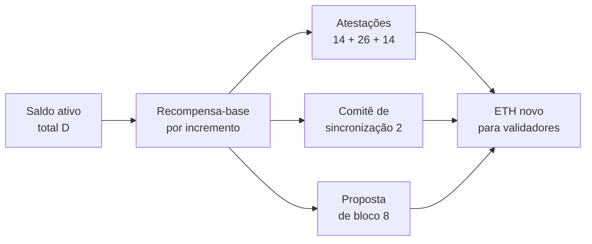
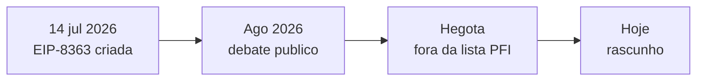

# Capítulo 48: De Onde Vem o Rendimento do Staking, e o Debate da EIP-8363

Quem faz staking de ETH recebe uma recompensa, e o percentual anual dessa recompensa costuma aparecer em painéis como se fosse uma taxa de juros definida por alguém. Não é. O rendimento sai de uma fórmula escrita na especificação da camada de consenso, e a fórmula tem uma propriedade curiosa: quanto mais ETH está em stake, menos cada ETH rende, mas a emissão total ainda cresce. Em 2026, essa propriedade virou assunto de disputa aberta, com a proposta de um burn gradual das recompensas, a EIP-8363. Este capítulo explica a fórmula (que complementa o Capítulo 2, sobre validadores, e o Capítulo 1, sobre o suprimento do ETH), mostra o que a proposta muda e deixa claro que, até aqui, ela é um rascunho em discussão e não uma regra da rede. Nada do que segue é conselho de compra, venda ou de participação em staking.

**A recompensa-base: uma raiz quadrada no denominador.** A especificação da camada de consenso define quanto vale uma unidade de saldo efetivo por época. O cálculo cabe em duas linhas: a recompensa-base por incremento é o incremento de saldo efetivo (`EFFECTIVE_BALANCE_INCREMENT`, equivalente a 1 ETH em Gwei) multiplicado por um fator constante, `BASE_REWARD_FACTOR`, de valor 64, dividido pela raiz quadrada inteira do saldo ativo total da rede. A recompensa-base de um validador é essa quantidade vezes o número de incrementos do saldo efetivo dele. Como o saldo efetivo é o valor que conta para recompensas (Capítulo 2), um validador com o dobro de saldo recebe o dobro, e o que muda o rendimento por ETH é só o denominador, a raiz do total em stake.

```latex
recompensa_base_por_incremento = INCREMENTO * FATOR / raiz(D)

INCREMENTO = 10^9 Gwei    FATOR = 64    D = saldo ativo total da rede
```
*Quando D cresce, a raiz cresce mais devagar, então o rendimento por ETH cai, mas cai menos do que o total em stake sobe.*

**Como a recompensa é repartida.** A recompensa-base não é paga inteira por existir. Ela é dividida em pesos, que somam um denominador de 64. Atestar a origem (source) no prazo vale peso 14, atestar o alvo (target) vale 26, atestar a cabeça da cadeia (head) vale 14, participar do comitê de sincronização vale 2 e propor blocos vale 8. A soma 14 + 26 + 14 + 2 + 8 dá 64, de modo que, em média, um validador perfeito recebe por época algo da ordem de uma recompensa-base. Quem perde prazos perde a fatia correspondente, e é isso que cria o incentivo para manter o validador no ar e bem conectado, ideia retomada no Capítulo 28 sobre a diversidade de clientes.


*O saldo total define a recompensa-base, que se divide em atestações, sincronização e proposta, e essas três fatias formam a emissão do ETH.*

**Da fórmula ao percentual anual.** Uma época dura 32 slots de 12 segundos, ou 384 segundos, e um ano tem cerca de 82.181 épocas. Multiplicando a recompensa-base por esse número e dividindo pelo valor em stake, obtém-se uma estimativa do rendimento anual de um validador sempre ativo:

```latex
rendimento_anual ≈ 64 * 82.181 * 10^9 / raiz(D_gwei) / 10^9 ≈ 166 / raiz(D_ETH)

emissao_anual ≈ D_ETH * rendimento_anual ≈ 166 * raiz(D_ETH)   (em ETH)
```
*Rendimento e emissão aparecem em função do total em stake: o primeiro cai com a raiz, a segunda sobe com a raiz.*

Aplicando a fórmula a alguns totais hipotéticos, em ordem de grandeza e ignorando penalidades, taxas e gorjetas de execução (que ficam por conta do Capítulo 16 e do Capítulo 17):

| ETH em stake (hipotético) | Rendimento anual estimado | Emissão anual estimada |
| --- | --- | --- |
| 10 milhões | cerca de 5,3% | cerca de 526 mil ETH |
| 30 milhões | cerca de 3,0% | cerca de 911 mil ETH |
| 60 milhões | cerca de 2,2% | cerca de 1,29 milhão de ETH |
| 100 milhões | cerca de 1,7% | cerca de 1,66 milhão de ETH |

*Dobrar o stake não dobra a emissão: ela cresce com a raiz, e o rendimento por ETH cai na mesma proporção inversa.*

Os valores são consequência direta da fórmula acima e servem para mostrar a forma da curva, não para prever o rendimento do dia, que depende do total em stake naquele momento e dos ganhos pagos na camada de execução. Para o suprimento líquido, vale lembrar do Capítulo 1: essa emissão disputa com a queima do EIP-1559.

**Por que uma curva assim.** O desenho tem uma lógica de segurança e uma de mercado. Com a raiz, a rede paga prêmios altos quando pouca gente faz staking, atraindo validadores, e paga menos por ETH quando a participação já é grande, sem que a emissão total exploda. O efeito colateral, apontado pelos críticos, é que a recompensa continua sendo paga mesmo quando a participação já é muito alta, e isso empurra mais ETH para dentro do staking, em particular para operadores grandes e para o staking líquido, tema do Capítulo 3.

**O que a EIP-8363 propõe.** A EIP-8363, intitulada Tapered Issuance Burn, foi criada em 14 de julho de 2026 e está com status de rascunho. Entre os autores constam pintail, Jérôme de Tychey, dapplion, pa7x1, Ladislaus von Daniels e Justin Drake. A ideia é destruir uma fração das recompensas dos validadores, e essa fração aumenta com a taxa de participação até chegar a 100% num ponto de saturação, escolhido perto de metade do suprimento de ETH. A fração queimada é dada por:

```latex
b = min( 1 , (D / D_sat)^(3/2) )

D_sat = 60,25 milhões de ETH (parâmetro SATURATION_BALANCE)
```
*A queima cresce mais que proporcionalmente com o total em stake e atinge 100% das recompensas em D igual a D_sat, o que elimina o incentivo de emissão acima desse ponto.*

Pelo texto da proposta, a dedução é aplicada sobre as três fontes de recompensa (atestações, propostas e comitê de sincronização), é calculada sobre a recompensa ideal, e não sobre o que o validador de fato ganhou, e depende apenas do saldo efetivo e do saldo ativo total. Por ser determinística e igual para todos, nenhum validador consegue empurrar uma parcela maior da queima para outro. A proposta também prevê uma transição de 123.300 épocas, algo como 18 meses, em 65 degraus, e um fator-base de transição de 128, o dobro do atual, e determina que a parte das atestações seja suspensa durante um vazamento por inatividade (o mecanismo de emergência visto no Capítulo 2).


*A proposta nasceu em julho de 2026, ganhou debate público e, segundo a imprensa especializada, saiu da lista de inclusão da Hegotá, ficando sem rota para um hard fork próximo.*

**O argumento dos autores.** O texto sustenta que, a partir de certo nível, mais ETH em stake não traz mais segurança e passa a trazer concentração: mais capital nas mãos de custodiantes e de provedores de staking líquido, e mais risco de captura. Por isso a proposta aceita, deliberadamente, um equilíbrio com menos ETH em stake, deixando o mercado definir o rendimento onde ele cobre o prêmio de risco que os stakers exigem, em vez de ser sustentado pela emissão. A escolha de 50% como ponto de saturação é justificada como o último número com significado além de preferência: é o limiar de maioria.

**O que os críticos apontam.** A própria EIP reconhece custos. Como as penalidades continuam iguais e os ganhos caem, o tempo para se recuperar de uma falha de disponibilidade cresce, algo em torno de 3,8 vezes com a participação atual de cerca de 33%, medido em dias de ganho líquido. A imprensa especializada relata, ainda, objeções de desenvolvedores, stakers e fundadores de DeFi: o corte poderia expulsar validadores caseiros antes de afetar os grandes operadores e prejudicar a demanda institucional (assunto do Capítulo 13), além de mexer em mercados DeFi construídos sobre o rendimento do staking. Há um ponto de método importante aqui, já visto no Capítulo 46: uma EIP em rascunho não é decisão, e a política monetária do ETH só muda se houver consenso amplo entre desenvolvedores, o chamado *rough consensus* (Capítulo 19, no contexto de governança).

**Como ler esse debate.** Algumas regras ajudam a não confundir fatos com opinião. Primeiro, a fórmula da recompensa-base é regra vigente, e a EIP-8363 é só uma proposta. Segundo, "rendimento do staking" mistura emissão, gorjetas e MEV; só a primeira parte vem da fórmula deste capítulo. Terceiro, argumentos sobre segurança, concentração e justiça entre stakers pequenos e grandes são juízos de valor sobre um mesmo mecanismo, e a escolha entre eles é a essência da política monetária do ETH.

**Glossário do capítulo.**

- **Recompensa-base**: unidade de recompensa por época calculada a partir do saldo efetivo do validador e do saldo ativo total da rede.
- **Saldo ativo total (D)**: soma dos saldos efetivos dos validadores ativos em determinada época.
- **Saldo efetivo**: valor do saldo de um validador que conta para recompensas e votos.
- **BASE_REWARD_FACTOR**: constante de valor 64 que escala a recompensa-base na especificação.
- **Peso de recompensa**: fração do denominador 64 atribuída a cada tarefa, como atestar a origem, o alvo ou a cabeça da cadeia, sincronizar ou propor.
- **Comitê de sincronização**: grupo de 512 validadores que assina cabeçalhos para clientes leves e recebe recompensa por isso.
- **Vazamento por inatividade (inactivity leak)**: mecanismo que penaliza quem não atesta quando a cadeia não finaliza por muito tempo.
- **Tapered Issuance Burn**: mecanismo proposto pela EIP-8363 que queima fração crescente das recompensas conforme o stake aumenta.
- **Saldo de saturação**: ponto em que a queima proposta atinge 100% das recompensas, fixado em 60,25 milhões de ETH.

**Fontes.**

- Consensus specs, Altair, beacon chain: https://raw.githubusercontent.com/ethereum/consensus-specs/master/specs/altair/beacon-chain.md
- Consensus specs, Phase 0, beacon chain: https://raw.githubusercontent.com/ethereum/consensus-specs/master/specs/phase0/beacon-chain.md
- EIP-8363, Tapered Issuance Burn: https://raw.githubusercontent.com/ethereum/EIPs/master/EIPS/eip-8363.md
