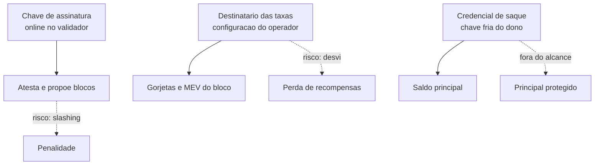
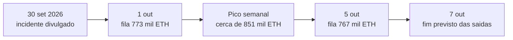

# Capítulo 49: Quando um Operador de Staking é Comprometido, o Caso MetaMask e a Fila de Saída

Em 30 de setembro de 2026, a MetaMask comunicou um incidente de segurança na infraestrutura que opera validadores de staking e, por precaução, iniciou a saída dos validadores afetados. Nos dias seguintes, a fila de saída da rede chegou perto de 850 mil ETH, o maior nível em meses. O episódio é um bom estudo de caso porque mostra, na prática, várias peças vistas ao longo do caderno: quem controla o quê num validador (Capítulo 2), por que a chave de saque fica separada (Capítulo 26), como o staking de terceiros funciona (Capítulo 3) e por que a rede limita quantos validadores saem por época (Capítulo 40). Este capítulo separa o que está confirmado do que ainda é estimativa, porque, no momento da escrita, a MetaMask não publicou uma explicação técnica completa.

**O que se sabe e o que não se sabe.** Segundo a imprensa especializada, a MetaMask disse não ter identificado ameaça imediata às carteiras e afirmou estar tratando o problema com parceiros externos e consultores de segurança. Não detalhou como o acesso ocorreu nem se chaves de assinatura dos validadores foram expostas. A Lido, cujos validadores a MetaMask opera, informou que os últimos validadores afetados deveriam sair do conjunto ativo até o fim de 7 de outubro, o que não é o mesmo que ter o saque concluído, e que quem tem stETH não precisa fazer nada. Um pesquisador independente apontou que 19 validadores da MetaMask propuseram blocos e que 18 dessas recompensas de execução foram para um endereço financiado via Tornado Cash, algo em torno de 0,36 ETH. As estimativas de escala também vêm de análises on-chain, e não da empresa: cerca de 17 mil validadores, com algo entre 523 mil e 560 mil ETH, conforme a fonte. Tudo isso deve ser lido como relato em andamento.

**Quem controla o quê num validador.** Para entender por que o dano parece limitado, é preciso separar três coisas. A chave de assinatura fica online no cliente validador e assina atestações e propostas. A credencial de saque define para onde vai o saldo quando o validador sai, e a especificação diz que a chave de saque pode ficar em armazenamento frio, pois não é necessária para validar. Já o destinatário das taxas (fee recipient) é uma configuração do operador: a especificação do consenso trata o valor como uma sugestão passada ao construtor do bloco, e é ele que recebe as gorjetas e o MEV daquele bloco (Capítulo 16 e Capítulo 17). Quem altera essa configuração pode desviar a parcela de execução, mas não toca no principal, que só sai para o endereço de saque. A MetaMask e a Lido afirmaram que o arranjo é não custodial e que a MetaMask não detém as chaves de saque.


*Comprometer a infraestrutura do operador expõe a assinatura e o destinatário das taxas, mas a credencial de saque, guardada à parte, protege o principal.*

**Os riscos reais para quem estava no pool.** Ainda que o principal estivesse protegido, havia dois riscos. O primeiro é o desvio das recompensas de execução, que no caso reportado foi pequeno. O segundo é o slashing: quem controla uma chave de assinatura poderia, em tese, fazer um validador assinar mensagens conflitantes, o que acarreta penalidade e saída forçada (Capítulo 2). Nenhuma fonte consultada relata que isso tenha acontecido. A saída preventiva existe justamente para reduzir essa janela. Ela tem custo: segundo a Lido, o movimento implica recompensas não recebidas e possível penalidade por inatividade se máquinas ficarem fora do ar, e o ciclo completo de sair, sacar e voltar ao staking pode levar até 45 dias por causa da fila de entrada.

**Por que existe uma fila de saída.** A rede limita quanto saldo pode entrar ou sair por época, para que o conjunto de validadores mude de forma gradual, como explicado no Capítulo 40. Pela especificação da Electra, o limite de rotatividade para ativações e saídas é o maior entre um mínimo de 128 ETH e o saldo ativo total dividido por um quociente, com teto de 256 ETH por época. Com a participação atual, o teto vale, e o cálculo é direto:

```latex
saidas por dia = 256 ETH x 225 epocas = 57.600 ETH

espera = ETH na fila / 57.600 ETH por dia

773.447 / 57.600 = 13,43 dias (cerca de 13 dias e 10 horas)
```
*Com o teto de 256 ETH por época e 225 épocas por dia, cada dia comporta cerca de 57,6 mil ETH em saídas, e a espera é a fila dividida por esse ritmo.*

O resultado bate com o que as estimativas de imprensa reportaram em 1º de outubro: uma fila de cerca de 773 mil ETH e espera de 13 dias e 10 horas. Em 5 de outubro, segundo agregadores, a fila marcava 767 mil ETH com 13 dias de espera, depois de um pico de cerca de 851 mil ETH na semana. Esses números variam de fonte para fonte e mudam a cada época, então servem de ordem de grandeza.


*Linha do tempo reportada: do anúncio ao fim previsto das saídas pelo conjunto ativo, com a fila ainda drenando por semanas.*

**Duas filas, dois efeitos.** Sair do conjunto ativo e sacar são etapas diferentes. A saída tem a fila acima; depois vem um período mínimo e o varrimento (sweep) que paga o saldo ao endereço de saque. Do outro lado, quem quiser voltar ao staking entra na fila de ativação, que também é limitada. Para um validador que sai por precaução, isso significa semanas sem rendimento. Para quem usa staking líquido, como o stETH do Capítulo 3, o token continua negociável enquanto a Lido reorganiza os validadores por trás, e o risco de preço fica separado do risco operacional.

| Aspecto | Risco do operador | Risco do protocolo |
| --- | --- | --- |
| Desvio de recompensas de execução | Sim, via destinatário das taxas | Não |
| Slashing por chave de assinatura exposta | Sim, em tese | Limitado pelos pesos da penalidade |
| Perda do principal | Só se a chave de saque fosse comprometida | Não afeta |
| Atraso na saída | Pela fila de rotatividade | Projetado para evitar mudanças bruscas |
| Rendimento enquanto espera | Reduzido ou zero | Segue a fórmula do Capítulo 48 |

*O desenho separa o que um operador comprometido pode tocar (assinatura e taxas) do que ele não alcança (saldo principal).*

**Lições de desenho.** O caso reforça algumas práticas já discutidas. Separar a chave de saque da infraestrutura limita o pior cenário, e a Electra deu mais um caminho para sair: o Capítulo 40 mostrou que o saque pode ser disparado a partir da camada de execução com a credencial adequada, sem depender da chave de assinatura. A diversidade de operadores e de clientes (Capítulo 28) reduz o impacto de um único ponto de falha, e o tamanho do episódio, com algo como meio milhão de ETH saindo em poucos dias, lembra a concentração discutida no Capítulo 3. Também vale a cautela do Capítulo 33 sobre incidentes: nas primeiras semanas, números e causas costumam ser revistos.

**Como ler o noticiário nesses episódios.** Primeiro, verificar quem está falando: a empresa, o protocolo parceiro ou um pesquisador independente. Segundo, separar perda de fundos, perda de rendimento e custo de oportunidade, que são coisas diferentes. Terceiro, lembrar que fila grande de saída não indica, por si só, fuga de confiança no Ethereum: aqui ela decorre de uma decisão operacional de um único operador, e a própria regra de rotatividade foi desenhada para absorver episódios assim sem abalar a segurança da rede.

**Glossário do capítulo.**

- **Chave de assinatura**: chave do validador, mantida online, usada para atestar e propor blocos.
- **Credencial de saque**: campo que define o destino do saldo quando o validador sai; a chave correspondente pode ficar em armazenamento frio.
- **Destinatário das taxas (fee recipient)**: endereço que recebe gorjetas e MEV dos blocos propostos pelo validador, configurado pelo operador.
- **Slashing**: penalidade aplicada a validadores que assinam mensagens conflitantes, com saída forçada.
- **Fila de saída**: limite por época de saldo que pode deixar o conjunto de validadores, o que cria espera quando muitos saem de uma vez.
- **Limite de rotatividade (churn limit)**: máximo de saldo que pode ser ativado ou sair por época; na Electra, teto de 256 ETH.
- **Sweep**: varredura que paga aos endereços de saque o saldo de validadores que saíram ou excedentes.
- **Não custodial**: arranjo em que o operador não controla a chave que libera o principal.
- **Fila de ativação**: espera para entrar no conjunto de validadores, também limitada pela rotatividade.

**Fontes.**

Abertas diretamente:

- Consensus specs, Electra, beacon chain: https://raw.githubusercontent.com/ethereum/consensus-specs/master/specs/electra/beacon-chain.md
- Consensus specs, Phase 0, validator: https://raw.githubusercontent.com/ethereum/consensus-specs/master/specs/phase0/validator.md
- Consensus specs, Bellatrix, validator: https://raw.githubusercontent.com/ethereum/consensus-specs/master/specs/bellatrix/validator.md

Consultadas por resultados de busca (os sites não puderam ser abertos diretamente no ambiente de pesquisa, então valem como relato de imprensa):

- CoinDesk, 1º de outubro de 2026: https://www.coindesk.com/tech/2026/10/01/metamask-security-incident-forces-ethereum-staking-exits-with-lido-warning-of-lost-rewards
- Decrypt: https://decrypt.co/379800/metamask-exits-lido-validators-amid-infrastructure-security-incident
- Cointelegraph: https://cointelegraph.com/news/metamask-exits-lido-validators-as-it-investigates-security-incident
- Crowdfund Insider, outubro de 2026: https://www.crowdfundinsider.com/2026/10/314982-metamask-exits-ethereum-eth-validators-after-infrastructure-incident-says-wallets-and-funds-were-not-at-risk/
