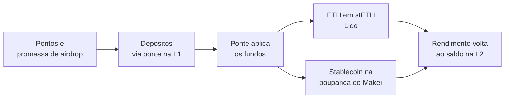
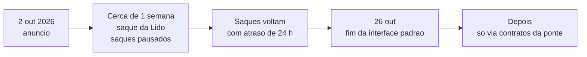

# Capítulo 50: Quando um Layer 2 Fecha as Portas, o Caso Blast

Em 2 de outubro de 2026, a equipe da Blast, uma rede de camada 2 do Ethereum, anunciou que vai encerrar as operações. A justificativa foi econômica: o custo de manter a rede passou a superar a receita que ela gera, e a equipe disse não enxergar um caminho crível para a sustentabilidade. A Blast chegou a reunir bilhões de dólares em depósitos no lançamento, em 2024, e termina com um prazo de saque para os usuários que ainda têm fundos nela. O episódio é um bom estudo de caso, porque tira o tema dos rollups (Capítulo 5) do terreno da tecnologia e o leva para o da economia: o que acontece com o dinheiro quando uma L2 simplesmente acaba? Este capítulo separa o que foi confirmado por mais de uma fonte do que aparece com números conflitantes, porque, no momento da escrita, os relatos ainda divergem em alguns pontos.

**O que a Blast prometia.** A Blast foi lançada no início de 2024 pela equipe ligada ao Blur, o marketplace de NFTs, e se apresentava como uma L2 com rendimento nativo. O mecanismo era simples de descrever. O ETH enviado à rede passava pelo contrato da ponte na L1, que o depositava no staking líquido da Lido e guardava o stETH resultante (Capítulo 3), de modo que o saldo do usuário na L2 crescia por rebase. Já as stablecoins eram aplicadas na taxa de poupança do Maker, hoje ligado ao ecossistema Sky (Capítulo 15), e voltavam à L2 como USDB, uma stablecoin própria que também rendia. Os números de rendimento divulgados na época variam bastante de uma fonte para outra, então aqui basta guardar a ideia: o dinheiro depositado trabalhava em protocolos da L1 enquanto o usuário o usava na L2.

**A engrenagem dos pontos.** O que atraiu o capital não foi só o rendimento. Seguindo a receita que o fundador já havia usado no Blur, a Blast distribuiu pontos a quem depositava e a quem trazia outros depositantes, com a promessa de um airdrop futuro. Os relatos apontam depósitos acima de 1 bilhão de dólares antes mesmo do lançamento da mainnet e um pico em torno de 2,3 bilhões de dólares na noite em que ela abriu. O token BLAST foi distribuído em meados de 2024, e uma das fontes consultadas registra que parte relevante da oferta foi destinada aos primeiros usuários. O ponto didático está no incentivo: depósito atraído por recompensa temporária tende a sair quando a recompensa acaba, o que o Capítulo 18 já mostrou ao tratar de emissão e vesting.

*O desenho original da Blast: fundos depositados na L1 rendiam em Lido e Maker, e os pontos funcionavam como isca para atrair os depósitos.*

**Por que a conta não fechou.** Uma L2 ganha dinheiro principalmente com as taxas que cobra dos usuários e paga custos como a publicação de dados na L1 (Capítulo 34), o sequenciador e a infraestrutura. Segundo os relatos, a receita mensal da Blast em setembro de 2026 foi de apenas 1.793 dólares, contra um máximo próximo de 3,5 milhões de dólares num único mês no passado. Esses valores vêm de imprensa especializada e não foram confirmados em painel de dados aberto durante a pesquisa, então servem como ordem de grandeza. Sobre o dinheiro ainda depositado, as fontes também discordam: uma fala em cerca de 24 milhões de dólares em 6 de outubro, outra em algo entre 63 e 65 milhões. Quem precisar do número deve consultar um painel como o DefiLlama no dia. O token BLAST, segundo uma das fontes, caiu cerca de 47% após o anúncio e ficava perto de 99% abaixo do pico.

| Aspecto | Na largada (2024) | No anúncio (2026) |
| --- | --- | --- |
| Depósitos | Acima de US$ 1 bi antes da mainnet, pico perto de US$ 2,3 bi | Entre US$ 24 mi e US$ 65 mi, conforme a fonte |
| Motor de atração | Pontos, airdrop e rendimento nativo | Sem incentivo relevante |
| Receita mensal | Máximo perto de US$ 3,5 mi | US$ 1.793 em setembro de 2026 |
| Token | Recém-distribuído | Cerca de 99% abaixo do pico |

*Os números mostram uma rede que cresceu por incentivo e não construiu uso orgânico capaz de pagar a própria operação; valores são os relatados pela imprensa e variam entre fontes.*

**Como será o encerramento.** O desenho anunciado tem três fases, e a primeira tem a ver com o rendimento nativo. Como os ETH dos usuários estavam em stETH, a equipe precisa primeiro sacar os ativos que mantém na Lido, processo que ela estima em cerca de uma semana. Durante esse período, os saques dos usuários ficam indisponíveis. Em seguida, os saques voltam com um atraso de 24 horas. Por fim, os usuários têm até 26 de outubro para sacar pela interface padrão da Blast. Passada a data, os fundos continuam existindo e podem ser sacados interagindo diretamente com os contratos da ponte na L1, e a equipe prometeu publicar as instruções desse caminho antes do prazo. Ou seja, 26 de outubro encerra a rota fácil, não necessariamente o direito ao saque, embora seja prudente não esperar o último dia. O Capítulo 5 explicou que saques de rollups otimistas costumam esperar uma janela de contestação; o atraso de 24 horas anunciado é um parâmetro dessa mesma família, embora as fontes não detalhem seu funcionamento interno.

*Linha do tempo do encerramento: pausa para desmontar a posição na Lido, retomada dos saques, fim da interface em 26 de outubro e, depois, apenas a rota direta pelos contratos.*

**O que o caso ensina sobre risco de L2.** Duas lições merecem destaque. A primeira é que a segurança técnica e a viabilidade econômica são riscos diferentes. O framework Stages do Capítulo 5 mede quanto controle a equipe ainda tem sobre a rede, mas não diz se a rede vai pagar suas contas. Uma L2 pode ter saque garantido pelos contratos da L1 e, mesmo assim, deixar de existir como produto. A segunda é que o controle por trás do botão de saque conta. Neste caso, foi a própria equipe quem anunciou a retirada ordenada dos fundos da Lido e fixou o calendário, o que mostra o peso que o operador ainda tem sobre o processo. Num desenho mais maduro, com saída forçada sem cooperação do operador, o usuário depende menos do cronograma de quem encerra.

A lição de mercado também vale: rendimento nativo e pontos criam depósitos, não necessariamente usuários. Quando a Blast fecha, as camadas 2 que sobrevivem tendem a ser as que têm um motivo próprio para existir, como o produto de uma empresa (Capítulo 8) ou uma comunidade e uma governança estabelecidas (Capítulos 6 e 7). A reavaliação do papel dos rollups, vista no Capítulo 5, ganha aqui um exemplo concreto: a camada 1 do Ethereum escala mais depressa, e uma L2 sem diferencial perde a razão de ser.

**Perguntas práticas para quem usa uma L2.** Há um roteiro curto que serve para qualquer rede desse tipo, sem implicar recomendação de compra ou venda. Existe um mecanismo de saída que funcione mesmo sem o operador? Quem controla as chaves de atualização da ponte? De onde vem a receita da rede, e ela cobre os custos? Quanto do uso é recompensa temporária e quanto é demanda real? Que aviso a equipe se comprometeu a dar caso decida encerrar? Se os fundos estiverem em uma rede com sinais de enfraquecimento, vale acompanhar os comunicados oficiais e sacar com folga, longe do último dia, lembrando que cada saque tem custo de gás (Capítulo 35) e que golpes costumam surgir em torno de prazos como este, com falsas instruções de saque (Capítulo 27). Sempre confirmar os links pelos canais oficiais da equipe.

**Glossário do capítulo.**

- **Rendimento nativo**: modelo em que os ativos depositados na ponte são aplicados na L1 e o ganho é repassado ao saldo do usuário na L2.
- **stETH**: token de staking líquido da Lido, cujo saldo cresce por rebase.
- **USDB**: stablecoin da Blast, lastreada em ativos aplicados na poupança do Maker.
- **Airdrop**: distribuição de tokens a usuários, muitas vezes ligada a pontos acumulados antes do lançamento.
- **Pontos**: contagem off-chain de atividade que serve de critério para um airdrop futuro, sem valor garantido.
- **Ponte (bridge)**: conjunto de contratos que travam ativos na L1 e representam esses ativos na L2.
- **Atraso de saque**: tempo de espera entre pedir e concluir um saque da L2 para a L1.
- **Encerramento ordenado (wind down)**: processo planejado de desligar uma rede, com prazo e instruções para retirada de fundos.
- **Sequenciador**: componente que ordena e publica as transações da L2.

**Fontes.**

Consultadas por resultados de busca (os sites não puderam ser abertos diretamente no ambiente de pesquisa, então valem como relato de imprensa e devem ser confirmadas nos canais oficiais da Blast):

- [Blast Announces Shutdown With October 26 Withdrawal Deadline, CryptoRank](https://cryptorank.io/news/feed/3f556-blast-announces-shutdown-with-october-26-withdrawal-deadline)
- [Blast shuts down $20M layer-2 network, forcing Oct. 26 exit deadline, CryptoSlate](https://cryptoslate.com/blast-shuts-down-20m-layer-2-network-forcing-oct-26-exit-deadline/)
- [Ethereum Layer 2 Blast Is Shutting Down: What Happens to Your Coins?, Yahoo Finance](https://finance.yahoo.com/markets/crypto/articles/ethereum-layer-2-blast-shutting-133036226.html)
- [Ethereum layer 2 Blast shutting down, Decrypt](https://decrypt.co/379972/ethereum-layer-2-blast-shutting-down)
- [Ethereum L2 Blast shuts down as BLAST token crashes 99% from peak, TMGM](https://www.tmgm.com/de/analysis/market-news/article/ethereum-l2-blast-shuts-down-as-blast-token-crashes-99-from-peak-202610030619)
- [Blast L2: The Full Guide, Zerion](https://zerion.io/blog/blast-l2-the-full-guide-airdrop-strategy/)
- [Blast Layer 2 Unveils Tokenomics Ahead of Airdrop, The Defiant](https://thedefiant.io/news/blockchains/blast-layer-2-unveils-tokenomics-ahead-of-airdrop)
- [What Is Blast? An Optimistic Rollup That Offers Native Yield, CoinGecko](https://www.coingecko.com/learn/what-is-blast-crypto-l2-optimistic-rollup)
